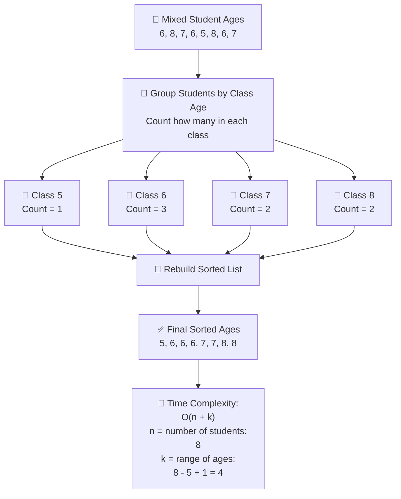

### 📚 **Counting Sort Mermaid Diagram for Lecture**

---

### 🧠 **Explanation:**

- `n` is the total **number of students** you're sorting (the input size).
- `k` is the **range of unique ages** (from minimum to maximum), which is the number of **"bins" or classes** needed.

This shows how **Counting Sort is fast when `k` is small compared to `n`**.
