# 📘 Introduction to TypeScript

> **Educational content by Bashar Alwarad**:  
> A comprehensive introduction to TypeScript for modern web development.

## Connect with Me [](https://www.linkedin.com/in/bashar-alwarad-2a960b1b6/)

---

## 📚 Table of Contents

- [What is TypeScript?](#-what-is-typescript)
- [Why TypeScript Matters](#-why-typescript-matters)
- [TypeScript vs JavaScript](#-typescript-vs-javascript)
- [History of TypeScript](#-history-of-typescript)
- [How TypeScript Works](#-how-typescript-works)
- [Basic Type System](#-basic-type-system)
- [Getting Started](#-getting-started)
- [Key Takeaways](#-key-takeaways)
- [Further Reading](#-further-reading)

---

## 🎯 What is TypeScript?

**TypeScript** is a **syntactic superset** of JavaScript that adds **static typing** to the language. This means TypeScript extends JavaScript by adding optional type annotations and compile-time type checking.

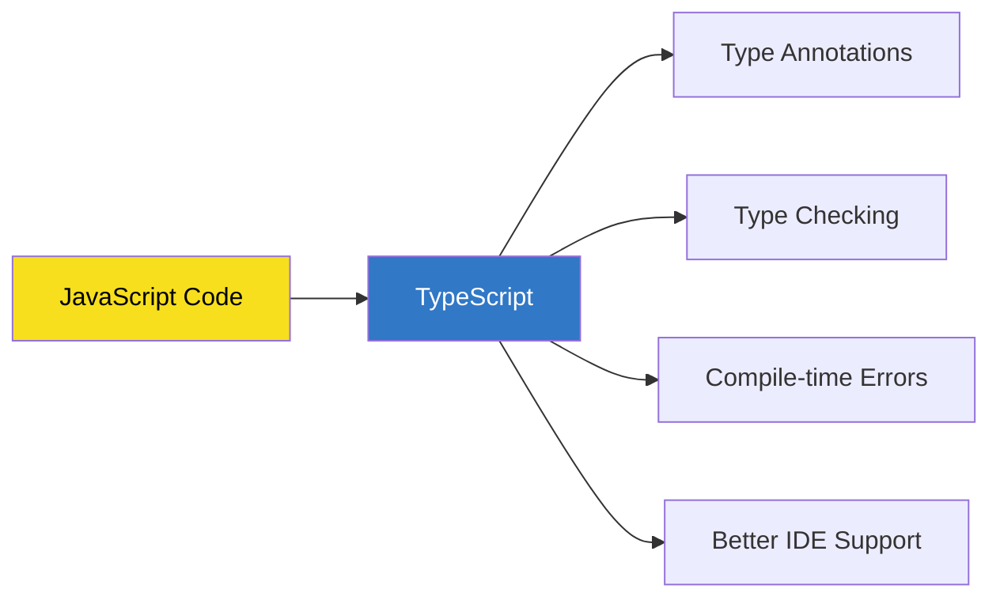

### Key Characteristics

- **Superset of JavaScript**: All valid JavaScript code is valid TypeScript code
- **Static Typing**: Add types to variables, functions, and objects
- **Compile-time Checking**: Catch errors before running the code
- **Transpilation**: TypeScript code is compiled (transpiled) to JavaScript

### Simple Example

```typescript
// JavaScript - No type information
function greet(name) {
  return 'Hello, ' + name;
}

// TypeScript - With type annotations
function greet(name: string): string {
  return 'Hello, ' + name;
}

greet('Alice'); // ✅ Works
greet(123); // ❌ Error: Argument of type 'number' is not assignable to parameter of type 'string'
```

---

## 💡 Why TypeScript Matters

### The Problem with JavaScript

JavaScript is a **loosely typed** (dynamically typed) language. While this provides flexibility, it can lead to runtime errors that are difficult to debug.

```javascript
// JavaScript example
function calculateDiscount(price, discount) {
  return price - price * discount;
}

calculateDiscount(100, 0.2); // ✅ Returns 80
calculateDiscount('100', '0.2'); // ⚠️  Returns NaN (runtime error!)
calculateDiscount(100); // ⚠️  Returns NaN (undefined discount)
```

### TypeScript Solution

TypeScript catches these errors **at compile time**, not runtime:

```typescript
// TypeScript example
function calculateDiscount(price: number, discount: number): number {
  return price - price * discount;
}

calculateDiscount(100, 0.2); // ✅ Returns 80
calculateDiscount('100', '0.2'); // ❌ Compile error!
calculateDiscount(100); // ❌ Compile error!
```

### Benefits of TypeScript

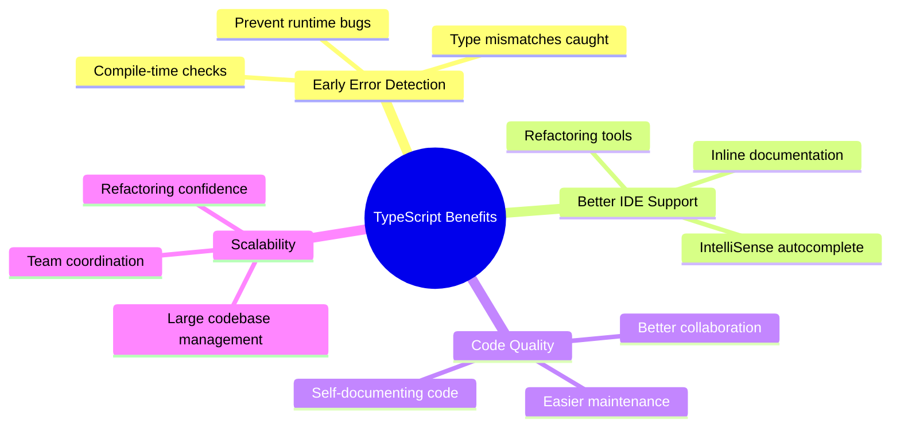

#### 1. **Early Error Detection**

- Catch bugs during development, not in production
- Type mismatches are identified immediately
- Reduces debugging time significantly

#### 2. **Enhanced IDE Support**

- **IntelliSense**: Auto-completion with type information
- **Refactoring**: Rename, extract, and modify code safely
- **Documentation**: Hover over variables to see their types

#### 3. **Better Code Readability**

Types serve as inline documentation:

```typescript
// Without TypeScript - What does this function accept?
function processUser(user) {
  return user.name.toUpperCase();
}

// With TypeScript - Clear expectations
interface User {
  id: number;
  name: string;
  email: string;
}

function processUser(user: User): string {
  return user.name.toUpperCase();
}
```

#### 4. **Improved Maintainability**

- Large codebases are easier to navigate
- Refactoring is safer and more reliable
- Team members understand code contracts

#### 5. **Catches Common Mistakes**

```typescript
// Typos caught immediately
const user = { name: 'Alice', age: 30 };
console.log(user.nmae); // ❌ Error: Property 'nmae' does not exist on type '{ name: string; age: number; }'

// Null/undefined protection
function greet(name: string) {
  return `Hello, ${name.toUpperCase()}`;
}

greet(null); // ❌ Error: Argument of type 'null' is not assignable to parameter of type 'string'
```

---

## ⚖️ TypeScript vs JavaScript

### Comparison Overview

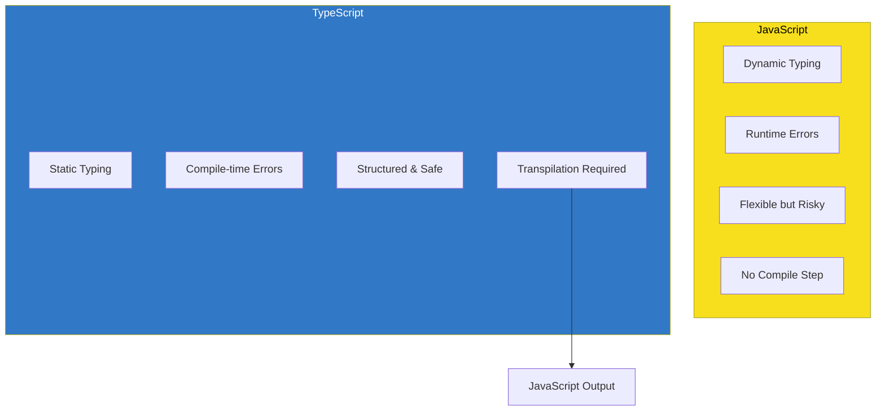

### Side-by-Side Comparison

| Feature                    | JavaScript                        | TypeScript                           |
| -------------------------- | --------------------------------- | ------------------------------------ |
| **Type System**            | Dynamic (runtime)                 | Static (compile-time)                |
| **Error Detection**        | At runtime                        | Before running code                  |
| **IDE Support**            | Basic                             | Advanced (IntelliSense, refactoring) |
| **Learning Curve**         | Lower                             | Higher (but worth it)                |
| **File Extension**         | `.js`                             | `.ts`                                |
| **Compilation**            | Not required                      | Required (transpiles to JS)          |
| **Browser Support**        | Native                            | After compilation to JS              |
| **Type Annotations**       | ❌                                | ✅                                   |
| **Interface/Type Aliases** | ❌                                | ✅                                   |
| **Best for**               | Small projects, rapid prototyping | Large applications, team projects    |

### Code Example Comparison

#### JavaScript Version

```javascript
function addNumbers(a, b) {
  return a + b;
}

console.log(addNumbers(5, 10)); // 15
console.log(addNumbers('5', '10')); // "510" - String concatenation!
console.log(addNumbers(5)); // NaN - undefined + 5
```

#### TypeScript Version

```typescript
function addNumbers(a: number, b: number): number {
  return a + b;
}

console.log(addNumbers(5, 10)); // ✅ 15
console.log(addNumbers('5', '10')); // ❌ Compile error
console.log(addNumbers(5)); // ❌ Compile error
```

### Syntax Relationship

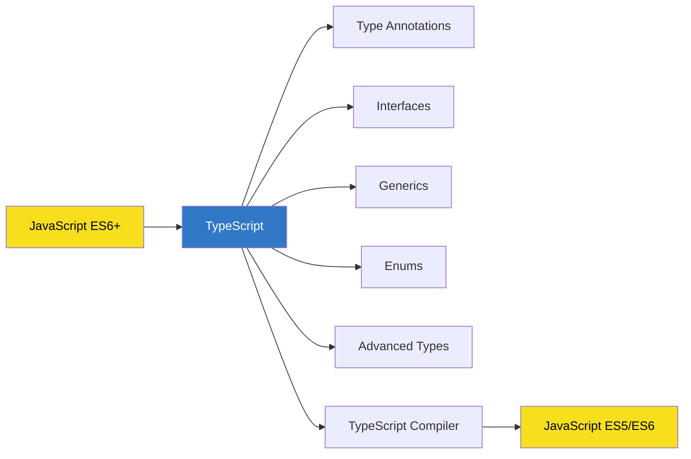

### Key Insight

> TypeScript = JavaScript + Type Safety + Modern Features

TypeScript doesn't replace JavaScript—it enhances it. All TypeScript code eventually becomes JavaScript that runs in browsers and Node.js environments.

---

## 📜 History of TypeScript

### Timeline

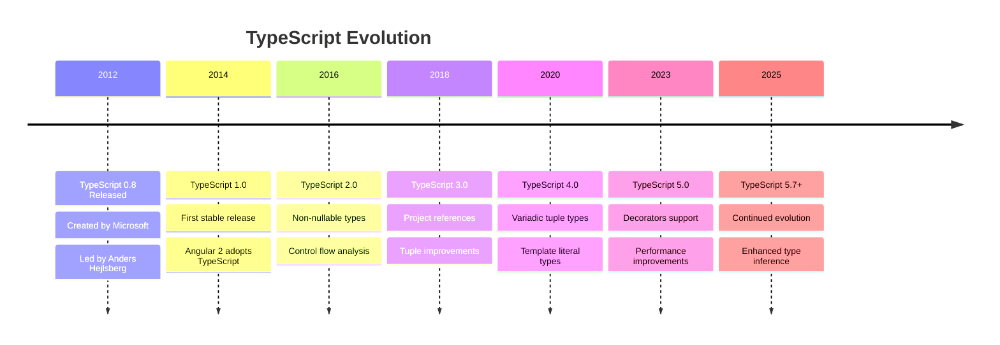

### Creation Story

**TypeScript** was developed by **Microsoft** and first released in **October 2012**. The project was led by **Anders Hejlsberg**, the architect behind C# and Turbo Pascal.

#### Motivation for Creation

1. **JavaScript's Scalability Issues**: As web applications grew larger, JavaScript's lack of static typing made codebases difficult to maintain
2. **Developer Tooling**: Need for better IDE support with autocomplete and refactoring
3. **Enterprise Requirements**: Large organizations needed more structured JavaScript development

#### Key Milestones

- **2012**: TypeScript 0.8 - Initial public release
- **2014**: TypeScript 1.0 - First production-ready version
- **2015**: Angular 2 announced with TypeScript as the primary language
- **2016**: TypeScript adoption grows rapidly
- **2017**: Major frameworks (Vue.js, React) add TypeScript support
- **2020**: TypeScript becomes the 7th most popular language on GitHub
- **2023-Present**: Industry standard for large-scale JavaScript applications

### Why It Succeeded

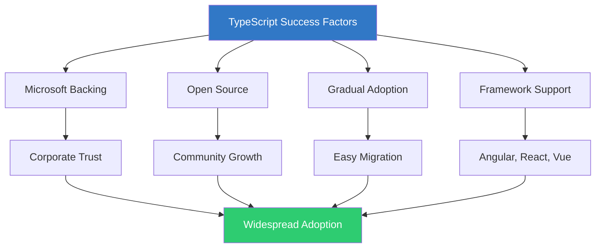

1. **Open Source**: Free and community-driven
2. **Gradual Adoption**: Can be added incrementally to existing JavaScript projects
3. **Framework Endorsement**: Angular, Vue, and React all support TypeScript
4. **Active Development**: Regular updates and improvements from Microsoft

---

## ⚙️ How TypeScript Works

### The Compilation Process

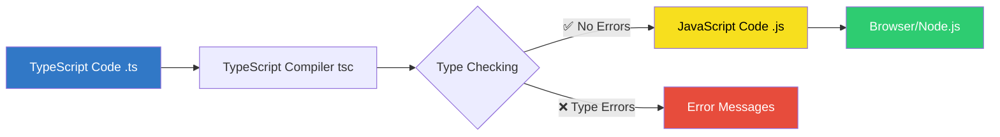

### Step-by-Step Process

#### 1. Write TypeScript Code

Create a file `example.ts`:

```typescript
function greet(name: string): string {
  return `Hello, ${name}!`;
}

const message: string = greet('World');
console.log(message);
```

#### 2. TypeScript Compiler Checks Types

The compiler (`tsc`) analyzes your code:

- ✅ Validates type annotations
- ✅ Checks for type mismatches
- ✅ Ensures type safety rules

#### 3. Transpilation to JavaScript

If no errors, TypeScript generates JavaScript:

```javascript
// example.js (compiled output)
function greet(name) {
  return 'Hello, '.concat(name, '!');
}

const message = greet('World');
console.log(message);
```

**Notice**: Type annotations are **removed**—JavaScript has no types!

#### 4. JavaScript Runs Anywhere

The generated `.js` file runs in:

- Browsers
- Node.js
- Any JavaScript runtime

### Compile-time vs Runtime

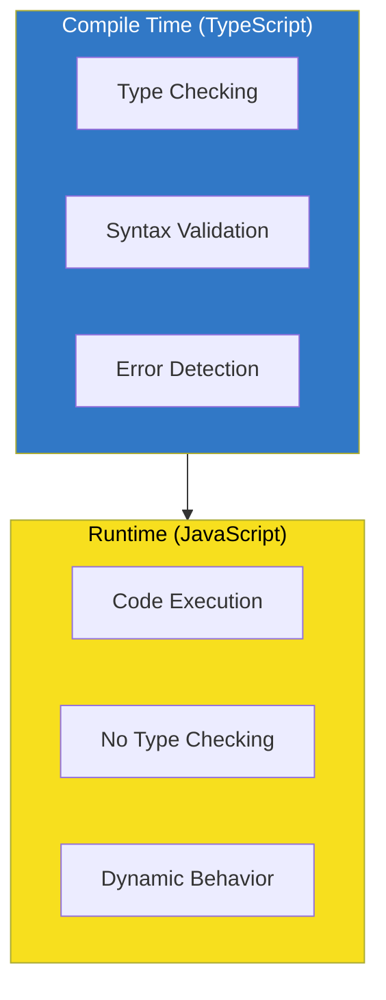

**Key Point**: TypeScript checks types **before** your code runs, preventing many bugs before they reach production.

---

## 🔤 Basic Type System

TypeScript provides several built-in types to annotate your code.

### Primitive Types

```typescript
// String
let username: string = 'Alice';
let greeting: string = `Hello, ${username}`;

// Number
let age: number = 25;
let price: number = 99.99;
let hex: number = 0xf00d;

// Boolean
let isActive: boolean = true;
let hasAccess: boolean = false;

// Array
let numbers: number[] = [1, 2, 3, 4, 5];
let names: Array<string> = ['Alice', 'Bob', 'Charlie'];

// Tuple (fixed-length array with specific types)
let user: [string, number] = ['Alice', 30];

// Any (opt-out of type checking)
let data: any = 'hello';
data = 42; // OK
data = true; // OK

// Void (no return value)
function logMessage(message: string): void {
  console.log(message);
}

// Null and Undefined
let empty: null = null;
let notDefined: undefined = undefined;
```

### Type Inference

TypeScript can automatically infer types:

```typescript
// Type inference in action
let message = 'Hello'; // TypeScript infers: string
let count = 42; // TypeScript infers: number
let isValid = true; // TypeScript infers: boolean

// message = 123;       // ❌ Error: Type 'number' is not assignable to type 'string'
```

### Object Types

```typescript
// Object type annotation
let person: { name: string; age: number } = {
  name: 'Alice',
  age: 30,
};

// Interface (reusable type definition)
interface User {
  id: number;
  name: string;
  email: string;
  isActive?: boolean; // Optional property
}

const user: User = {
  id: 1,
  name: 'Bob',
  email: 'bob@example.com',
};
```

### Function Types

```typescript
// Function with typed parameters and return type
function add(a: number, b: number): number {
  return a + b;
}

// Arrow function
const multiply = (a: number, b: number): number => a * b;

// Function type annotation
let calculate: (x: number, y: number) => number;

calculate = add; // ✅ OK
calculate = multiply; // ✅ OK
```

### Union Types

```typescript
// Variable can be multiple types
let value: string | number;

value = 'hello'; // ✅ OK
value = 42; // ✅ OK
// value = true;  // ❌ Error

// Function with union type parameter
function printId(id: string | number) {
  console.log(`ID: ${id}`);
}

printId(101); // ✅ OK
printId('ABC'); // ✅ OK
```

### Type Diagram

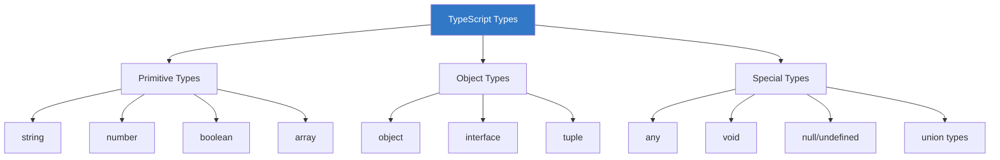

---

## 🚀 Getting Started

### Prerequisites

- **Node.js** (v18 or higher)
- **npm** (comes with Node.js)
- A code editor (VS Code recommended)

### Installation

#### Install TypeScript Globally

```bash
npm install -g typescript
```

Verify installation:

```bash
tsc --version
```

#### Install as Project Dependency (Recommended)

```bash
# Create a new project directory
mkdir my-typescript-project
cd my-typescript-project

# Initialize npm project
npm init -y

# Install TypeScript as dev dependency
npm install --save-dev typescript
```

### Your First TypeScript Program

#### Step 1: Create TypeScript File

Create `hello.ts`:

```typescript
function greet(name: string): string {
  return `Hello, ${name}!`;
}

const message: string = greet('World');
console.log(message);
```

#### Step 2: Compile TypeScript

```bash
# If installed globally
tsc hello.ts

# If installed locally
npx tsc hello.ts
```

This generates `hello.js`:

```javascript
function greet(name) {
  return 'Hello, '.concat(name, '!');
}

const message = greet('World');
console.log(message);
```

#### Step 3: Run the JavaScript

```bash
node hello.js
```

**Output:**

```
Hello, World!
```

### TypeScript Configuration

#### Initialize `tsconfig.json`

```bash
npx tsc --init
```

- add a build script to package.json

```json
  "scripts": {
    "build": "tsc -p .",
    "dev": "tsx --watch ./src/index.ts"
  },
```

- run the build

```bash
npm run build
```

This creates a configuration file with recommended settings:

```json
{
  "compilerOptions": {
    "target": "ES2016",
    "module": "commonjs",
    "strict": true,
    "esModuleInterop": true,
    "skipLibCheck": true,
    "forceConsistentCasingInFileNames": true,
    "outDir": "./dist"
  },
  "include": ["src/**/*"],
  "exclude": ["node_modules"]
}
```

#### Project Structure

```
my-typescript-project/
├── src/
│   └── index.ts
├── dist/
│   └── index.js (generated)
├── package.json
├── tsconfig.json
└── node_modules/
```

#### Compile with Config

```bash
# Compiles all .ts files in src/ to dist/
npx tsc

# Watch mode (auto-recompile on changes)
npx tsc --watch
```

### Development Workflow

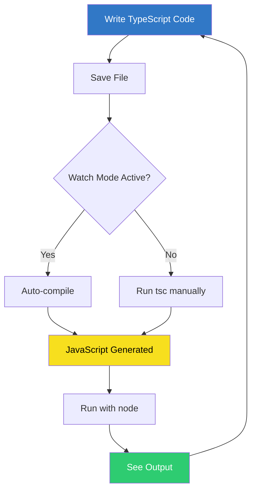

---

## 🎓 Key Takeaways

### What We Learned

✅ **TypeScript is a superset of JavaScript** with static typing  
✅ **Type checking happens at compile time**, catching errors early  
✅ **TypeScript code transpiles to JavaScript** that runs anywhere  
✅ **Benefits include**: better IDE support, early error detection, and improved maintainability  
✅ **TypeScript vs JavaScript**: Static vs dynamic typing, compile-time vs runtime errors  
✅ **Created by Microsoft in 2012**, now an industry standard  
✅ **Basic types**: string, number, boolean, array, object, union types  
✅ **Getting started**: Install TypeScript, write `.ts` files, compile with `tsc`

### Why Use TypeScript?

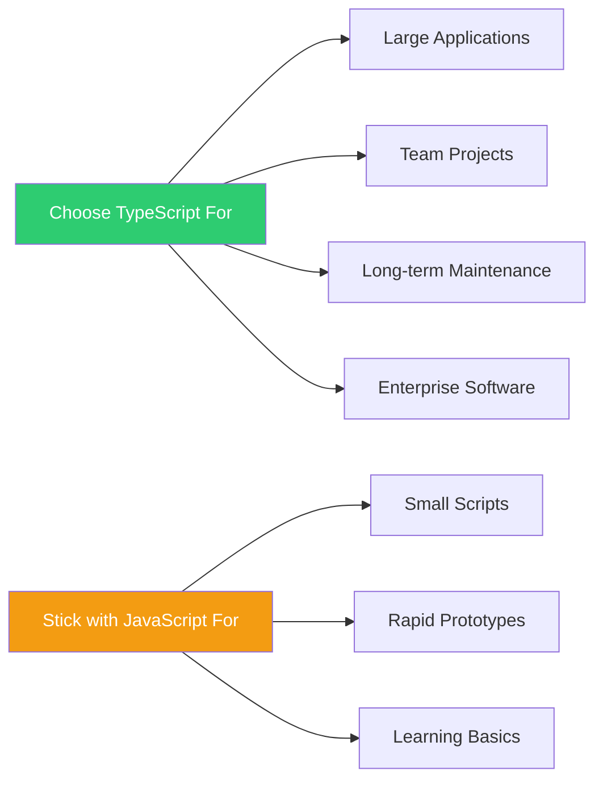

### The Evolution

```
JavaScript (Dynamic)
    ↓
TypeScript (Static Typing)
    ↓
Better Code Quality & Developer Experience
```

### Community & Tools

- [DefinitelyTyped](https://github.com/DefinitelyTyped/DefinitelyTyped) - Type definitions for JavaScript libraries
- [TypeScript GitHub Repository](https://github.com/microsoft/TypeScript)
- [VS Code TypeScript Support](https://code.visualstudio.com/docs/languages/typescript)

---

**Happy Learning! 🚀**

_Educational content by Bashar Alwarad - Software Engineering Course_
