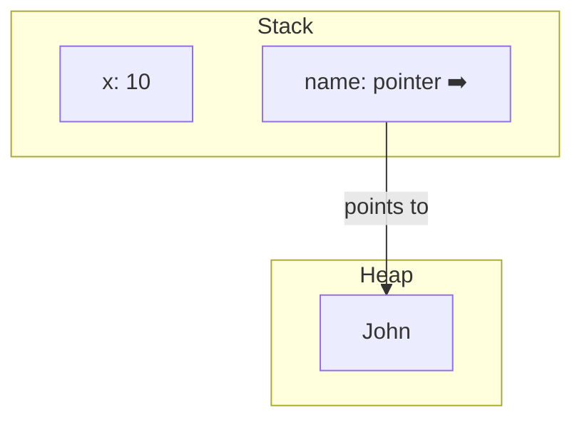

# 06_variables

## Variables in C#

### What is a Variable?

A variable is a named storage location for data. You use variables to store values that your program can use and change while it runs.

### How to Create a Variable

In C#, you declare a variable by specifying its type (or using `var`), followed by its name, and optionally assign a value:

```c#
int age = 25; // integer variable
string name = "Alice"; // string variable
var city = "London"; // type is inferred (string)
```

### What is `var`?

`var` lets the compiler figure out the variable's type from the value you assign. It's still strongly typed!

```c#
var message = "Hello"; // message is a string
var number = 42; // number is an int
```

### What is `const`?

`const` creates a variable whose value cannot change after it's set.

```c#
const int DaysInWeek = 7;
const string Greeting = "Hi!";
```

### What are `int` and `string`?

- `int` is for whole numbers (integers)
- `string` is for text

---

---

## How C# Treats Variables in Memory

In C#, variables can be stored in two main places in memory: the **stack** and the **heap**.

- **Stack:** Stores value types (like `int`, `bool`, `double`) and local variables. Fast access, automatically managed.
- **Heap:** Stores reference types (like `string`, arrays, objects). Variables on the stack hold a reference (pointer) to the data on the heap.

### Example

```c#
int x = 42; // Value type, stored on the stack
string name = "Alice"; // Reference type, variable on stack, data on heap
```

### Memory Allocation Diagram



**Explanation:**

- `x` is stored directly on the stack.
- `name` is a reference type: the variable on the stack holds a pointer to the actual string data on the heap.

---

**Why?**

- Value types (like int, double, bool, structs) are stored directly on the stack because they are simple and lightweight. This makes them fast to access and easy to clean up automatically.
- Reference types (like string, arrays, classes) can be larger and more complex, so their actual data is stored on the heap. The stack only keeps a reference (pointer) to the heap data. This allows for flexible memory management and sharing of objects.

So: for value types, both the variable and its value are on the stack. For reference types, the variable (reference) is on the stack, but the value is on the heap.
