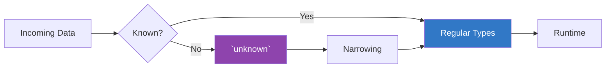

# 🧩 TypeScript Special Types

> **Educational content by Bashar Alwarad**  
> A focused guide to TypeScript's special types and when to use them.

## Connect with Me [](https://www.linkedin.com/in/bashar-alwarad-2a960b1b6/)

## 📚 Table of Contents

- [🧩 TypeScript Special Types](#-typescript-special-types)
  - [Connect with Me ](#connect-with-me-)
  - [📚 Table of Contents](#-table-of-contents)
  - [🎯 Why Special Types?](#-why-special-types)
  - [🔓 `any` — Opting Out](#-any--opting-out)
  - [🛡️ `unknown` — Safe Flexibility](#️-unknown--safe-flexibility)
  - [🚫 `never` — Impossible States](#-never--impossible-states)
  - [🌫️ `undefined` \& `null` — Explicit Nothing](#️-undefined--null--explicit-nothing)
  - [🎈 `void` — No Return Value](#-void--no-return-value)
  - [🧭 Choosing the Right Type](#-choosing-the-right-type)
    - [Quick Decision Notes](#quick-decision-notes)
  - [📌 Quick Reference](#-quick-reference)

---

## 🎯 Why Special Types?

Special types help describe edge cases: unknown inputs, unreachable code paths, and explicit absence of values. They make intent clear and prevent silent failures.



---

## 🔓 `any` — Opting Out

`any` disables type checking for a value. Use only as a last resort.

```typescript
let value: any = 42;
value = 'hello'; // ✅ allowed
value.toUpperCase(); // ✅ allowed at compile time, may crash at runtime
```

**When (sparingly) to use**

- Migrating JavaScript to TypeScript
- Working with truly dynamic data you will validate later
- Temporary escape hatch during refactors

**Pitfall**: Loses IntelliSense and compile-time safety. Prefer `unknown` when possible.

---

## 🛡️ `unknown` — Safe Flexibility

`unknown` says "this could be anything, so prove what it is before use." It forces narrowing.

```typescript
function handleInput(input: unknown) {
  if (typeof input === 'string') {
    return input.toUpperCase(); // input is string here
  }
  if (Array.isArray(input)) {
    return input.length; // input is any[] here
  }
  return 'unhandled';
}

handleInput('hi'); // "HI"
handleInput([1, 2, 3]); // 3
```

**Why prefer over `any`?**

- You cannot access properties or call methods without narrowing
- Enforces runtime guards → safer code

**Common narrowing patterns**

- `typeof`, `Array.isArray`, `instanceof`
- User-defined type predicates

---

## 🚫 `never` — Impossible States

`never` represents a value that should never occur. Useful for functions that don't return and for exhaustiveness checks.

```typescript
// 1) Function that never returns
function fail(message: string): never {
  throw new Error(message);
}

// 2) Exhaustive checking
type Shape =
  | { kind: 'circle'; radius: number }
  | { kind: 'square'; side: number };

function area(shape: Shape): number {
  switch (shape.kind) {
    case 'circle':
      return Math.PI * shape.radius ** 2;
    case 'square':
      return shape.side ** 2;
    default: {
      const _exhaustive: never = shape; // ❌ compile error if a case is missing
      return _exhaustive;
    }
  }
}
```

**When to use**

- Functions that always throw or loop forever
- Enforcing exhaustive `switch` over discriminated unions
- Signaling impossible code paths

---

## 🌫️ `undefined` & `null` — Explicit Nothing

Both have their own types. With `strictNullChecks` on, they are only assignable where explicitly allowed.

```typescript
let u: undefined = undefined;
let n: null = null;

// Optional parameters become unioned with undefined
function greet(name?: string) {
  return `Hello, ${name ?? 'stranger'}`;
}

interface User {
  name: string;
  age?: number; // number | undefined
}

// Safe access
const street = user?.address?.street; // optional chaining
const label = user.name ?? 'Anonymous'; // nullish coalescing
```

**Enable safety**

```json
// tsconfig.json
{
  "compilerOptions": {
    "strictNullChecks": true
  }
}
```

---

## 🎈 `void` — No Return Value

Use `void` for functions that do not return anything meaningful.

```typescript
function log(message: string): void {
  console.log(message);
}
```

**Contrast**

- `void` means "returns nothing useful"
- `never` means "does not return at all"

---

## 🧭 Choosing the Right Type

```mermaid
graph TD
  A[Need flexibility?] --> B[Use unknown]
  B --> C[Then narrow]
  A --> D[Skip checking?]
  D --> E[Use any (avoid)]
  A --> F[Impossible state?]
  F --> G[Use never]
  A --> H[Represents nothing?]
  H --> I[Use undefined/null]
  H --> J[No return value? Use void]
  style E fill:#e74c3c,color:#fff
  style B fill:#8e44ad,color:#fff
  style G fill:#2c3e50,color:#fff
  style I fill:#7f8c8d,color:#fff
  style J fill:#7f8c8d,color:#fff
```

### Quick Decision Notes

- Prefer `unknown` over `any` to force narrowing
- Use `never` for exhaustive checks and non-returning functions
- Turn on `strictNullChecks` and handle `undefined`/`null` explicitly
- Use `void` for side-effect-only functions

---

## 📌 Quick Reference

| Type        | Purpose                      | Must Narrow? | Typical Use Case                         |
| ----------- | ---------------------------- | ------------ | ---------------------------------------- |
| `any`       | Opt out of type checking     | No           | Migration escape hatch (avoid long-term) |
| `unknown`   | Safe "could be anything"     | Yes          | Unvalidated inputs (APIs, user data)     |
| `never`     | Impossible value / no return | N/A          | Exhaustive switches, throwing functions  |
| `undefined` | Value not assigned           | N/A          | Optional params/props, defaults          |
| `null`      | Explicit empty value         | N/A          | Intentional "no value" markers           |
| `void`      | No meaningful return value   | N/A          | Logging, event handlers                  |

---

**Happy Learning! 🚀**

_Educational content by Bashar Alwarad - Software Engineering Course_
