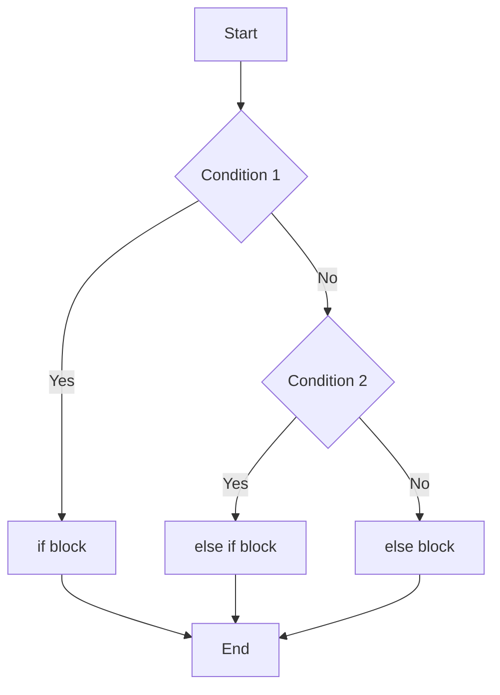

# 14_if_else

## if, else if, and else Statements in C#

### What are if, else if, and else?

- **if**: Used to execute code if a condition is true.
- **else if**: Used to check another condition if the previous if (or else if) was false.
- **else**: Used to execute code if none of the previous conditions were true.

### Syntax

```csharp
if (condition1)
{
    // code block if condition1 is true
}
else if (condition2)
{
    // code block if condition2 is true
}
else
{
    // code block if none of the above are true
}
```

### When to Use Each

- Use **if** for the first condition you want to check.
- Use **else if** for additional, mutually exclusive conditions.
- Use **else** for a default action if none of the above conditions are met.

### Example

```csharp
int number = 10;
if (number > 10)
{
    Console.WriteLine("Greater than 10");
}
else if (number == 10)
{
    Console.WriteLine("Equal to 10");
}
else
{
    Console.WriteLine("Less than 10");
}
```

### Diagram


