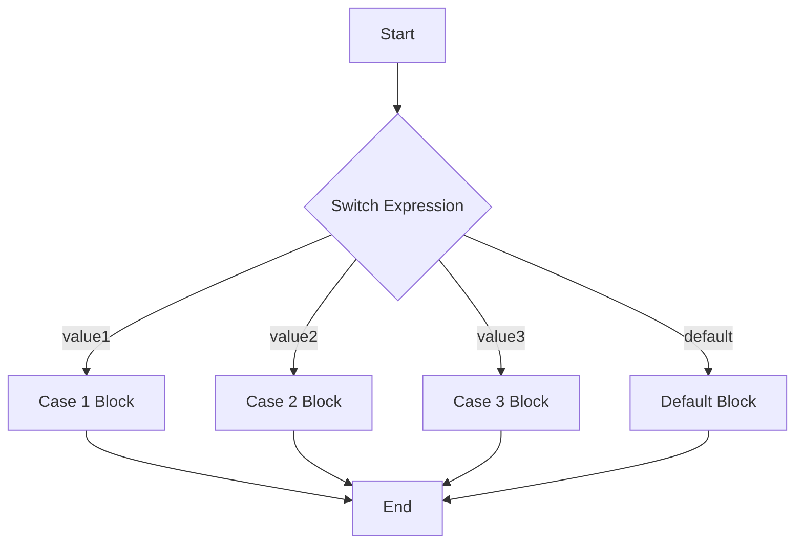

# 15_switch

## The switch Statement in C#

### What is switch?

The `switch` statement is used to select one of many code blocks to execute, based on the value of a variable or expression. It is often used as a cleaner alternative to multiple `if-else if` statements when checking a single value against many possible matches.

### Syntax

```csharp
switch (expression)
{
    case value1:
        // code block
        break;
    case value2:
        // code block
        break;
    default:
        // code block
        break;
}
```

### Example

```csharp
int day = 3;
switch (day)
{
    case 1:
        Console.WriteLine("Monday");
        break;
    case 2:
        Console.WriteLine("Tuesday");
        break;
    case 3:
        Console.WriteLine("Wednesday");
        break;
    default:
        Console.WriteLine("Other day");
        break;
}
```

### Grouping Cases (Multiple Cases for Same Code)

You can group multiple cases together if they should execute the same code:

```csharp
char grade = 'B';
switch (grade)
{
    case 'A':
    case 'B':
        Console.WriteLine("Good job!");
        break;
    case 'C':
        Console.WriteLine("Passed");
        break;
    default:
        Console.WriteLine("Try again");
        break;
}
```

### The break and continue Statements in switch

- **break**: Ends the current case and exits the switch block. Required after each case unless you want to fall through to the next case.
- **continue**: Not allowed directly in a switch, but you can use it inside a loop that contains a switch to skip to the next iteration of the loop.

#### Example with break:

```csharp
switch (value)
{
    case 1:
        // code
        break; // exits switch
    // ...
}
```

#### Example with continue in a loop:

```csharp
for (int i = 0; i < 5; i++)
{
    switch (i)
    {
        case 2:
            continue; // skips the rest of the loop body for i==2
        default:
            Console.WriteLine(i);
            break;
    }
}
```

### Diagram



### switch vs if-else

- Use `switch` when you need to compare the same variable/expression to many constant values.
- Use `if-else` for more complex conditions, ranges, or when comparing different variables.
- `switch` is often more readable and organized for many discrete cases.

#### Example: if-else vs switch

```csharp
// Using if-else
if (day == 1) Console.WriteLine("Monday");
else if (day == 2) Console.WriteLine("Tuesday");
else if (day == 3) Console.WriteLine("Wednesday");
else Console.WriteLine("Other day");

// Using switch
switch (day)
{
    case 1:
        Console.WriteLine("Monday");
        break;
    case 2:
        Console.WriteLine("Tuesday");
        break;
    case 3:
        Console.WriteLine("Wednesday");
        break;
    default:
        Console.WriteLine("Other day");
        break;
}
```

### When to Use Each

- Use `switch` for many discrete, known values of a single variable.
- Use `if-else` for complex, range-based, or unrelated conditions.

---
