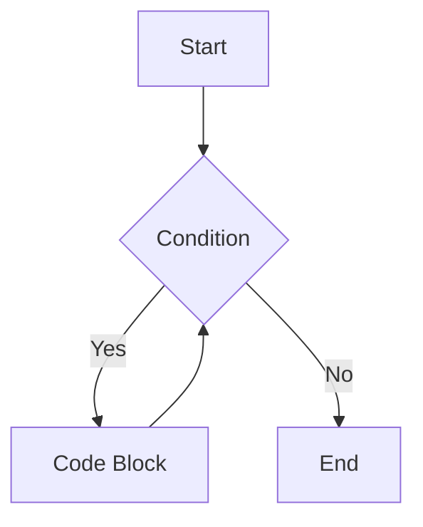
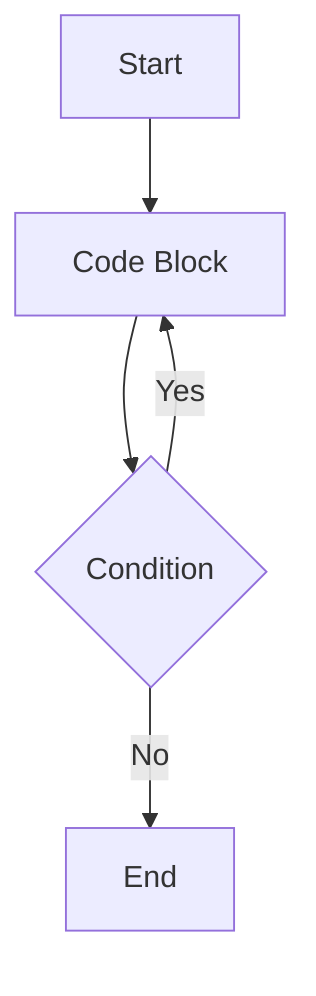

# 16_while_loop

## The while Loop in C#

### What is a while loop?

A `while` loop repeatedly executes a block of code as long as a specified condition is true. It is useful when the number of iterations is not known in advance.

### Syntax

```csharp
while (condition)
{
    // code block to be executed
}
```

### Example

```csharp
int i = 0;
while (i < 5)
{
    Console.WriteLine($"i = {i}");
    i++;
}
```

### Diagram (while loop)



---

## The do-while Loop in C#

### What is a do-while loop?

A `do-while` loop is similar to a `while` loop, but it always executes the code block at least once before checking the condition.

### Syntax

```csharp
do
{
    // code block to be executed
} while (condition);
```

### Example

```csharp
int j = 0;
do
{
    Console.WriteLine($"j = {j}");
    j++;
} while (j < 5);
```

### Diagram (do-while loop)



---

### When to Use Each

- Use a `while` loop when you may not need to execute the code block at all (condition checked first).
- Use a `do-while` loop when you always want to execute the code block at least once (condition checked after).

### while vs for vs do-while vs foreach

- **while**: Use when the number of iterations is unknown and the condition is checked before each iteration.
- **for**: Use when you know how many times to loop (counter-controlled).
- **do-while**: Use when you want the loop to run at least once (condition checked after the loop body).
- **foreach**: Use to iterate over collections or arrays.

---
