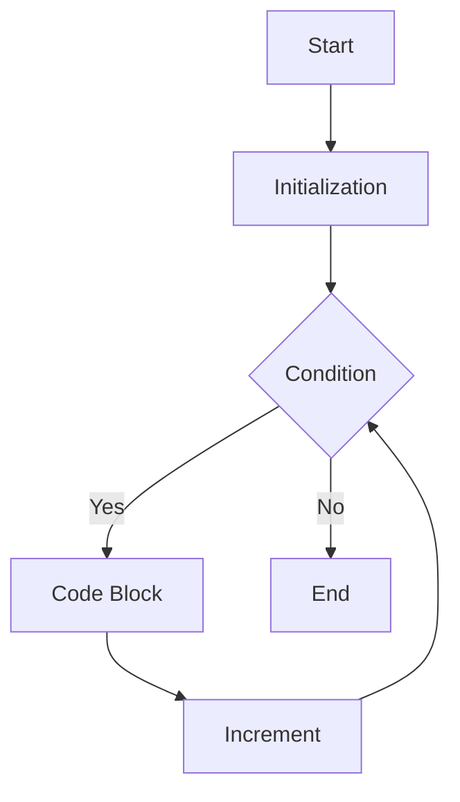
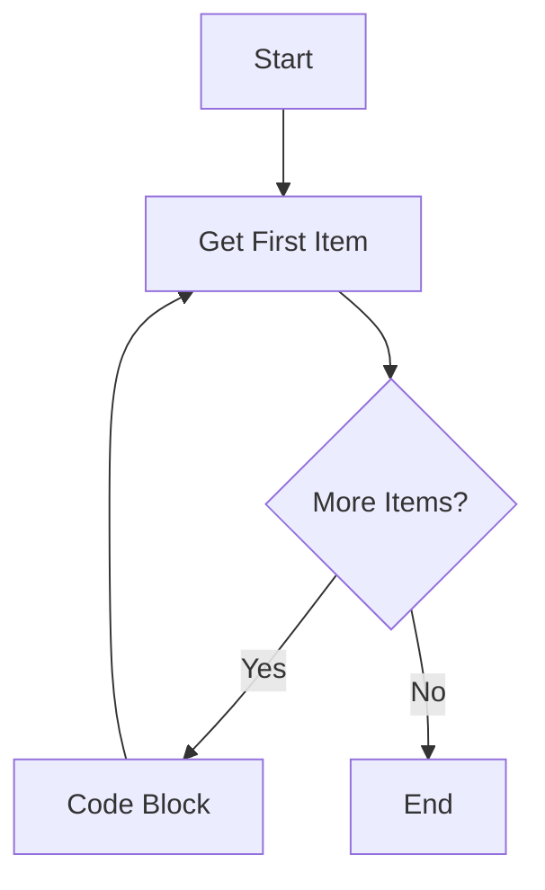

# 17_for_loop

## The for Loop in C#

### What is a for loop?

A `for` loop is used to execute a block of code a specific number of times. It is ideal when you know in advance how many times you want to loop.

### Syntax

```csharp
for (initialization; condition; increment)
{
    // code block to be executed
}
```

### Example

```csharp
for (int i = 0; i < 5; i++)
{
    Console.WriteLine($"i = {i}");
}
```

### Diagram (for loop)



---

## The foreach Loop in C#

### What is a foreach loop?

A `foreach` loop is used to iterate over the elements of a collection or array. It is simple and safe for accessing each item in a sequence.

### Syntax

```csharp
foreach (var item in collection)
{
    // code block to be executed
}
```

### Example

```csharp
string[] colors = { "red", "green", "blue" };
foreach (string color in colors)
{
    Console.WriteLine(color);
}
```

### Diagram (foreach loop)



---

### When to Use Each

- Use a `for` loop when you need a counter or want to modify the index.
- Use a `foreach` loop when you want to process every element in a collection or array without changing the collection.
