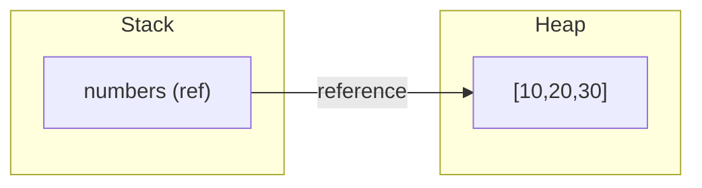
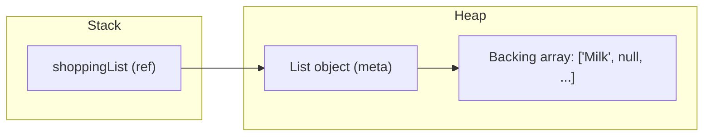
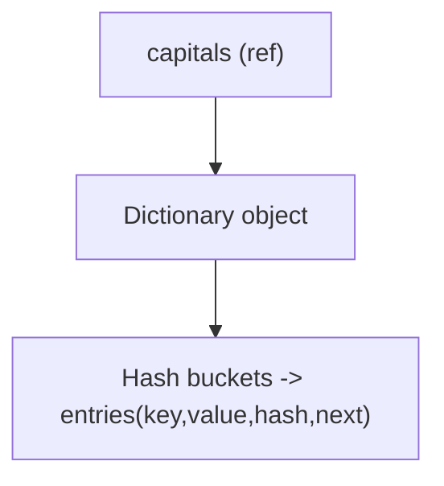
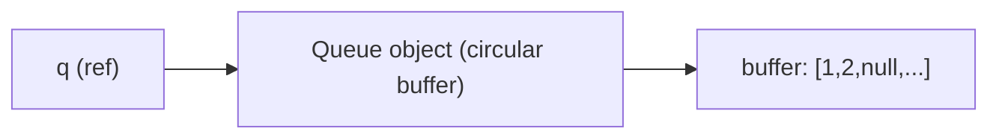
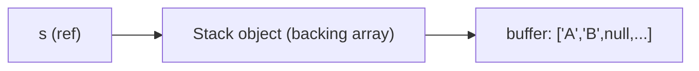
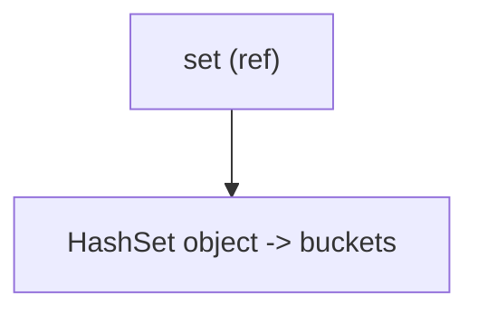
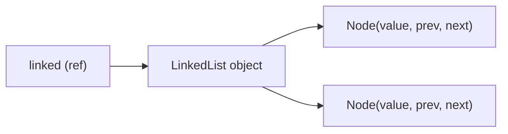
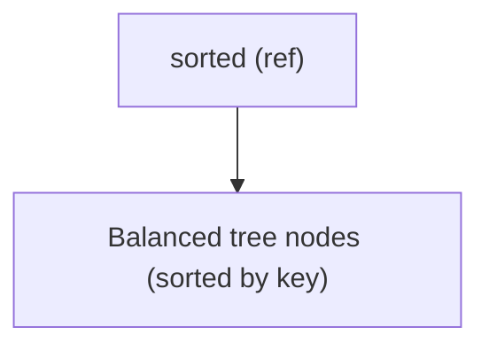

## Arrays & Collections — organized lecture

This lecture is a structured, practical guide to arrays and the common collection types in C#. It is split into two parts:

- Part A — core collection types: short intro, code example, and a memory diagram for each type.
- Part B — deeper topics: copying semantics (shallow vs deep), important Array APIs, common pitfalls, performance guidance, exercises and tests.

Prerequisites: basic familiarity with C# (variables, loops, methods) and a C# compiler / .NET SDK installed.

---

## Part A — Core collection types in C#

For each collection below you'll find:

- A short description and recommended use-case.
- Minimal code example (no LINQ) showing creation and common operations.
- A small Mermaid diagram showing how the collection is represented in memory (conceptual).

### 1) Array (T[])

- Fixed-size, strongly typed, contiguous elements, zero-based index.
- Use when you know the size in advance or need compact memory and very fast indexed access.

Code example:

```csharp
// create and populate
int[] numbers = new int[3];
numbers[0] = 10;
numbers[1] = 20;
numbers[2] = 30;

// iterate
for (int i = 0; i < numbers.Length; i++)
{
		Console.WriteLine(numbers[i]);
}
```

Simple alternatives and common patterns:

```csharp
// 1) Literal initializer (when you know values at compile time)
string[] cars = { "Volvo", "BMW", "Ford", "Mazda" };

// 2) Compiler type inference with new[]
var carsInferred = new[] { "Volvo", "BMW", "Ford", "Mazda" }; // string[]

// 3) Mixed types: use object[] (boxing for value types)
object[] mixed = { 1, "hello", 3.14, true };
foreach (var item in mixed)
	Console.WriteLine($"{item} (type: {item.GetType()})");

// 4) Read values safely using pattern matching
foreach (var item in mixed)
{
	if (item is int n)
		Console.WriteLine("int: " + (n + 1));
	else if (item is string s)
		Console.WriteLine("string length: " + s.Length);
}

// 5) Tuple array for structured mixed data (type-safe)
(string Name, int Age)[] people = { ("Alice", 30), ("Bob", 25) };
foreach (var p in people)
	Console.WriteLine($"{p.Name} is {p.Age}");

// 6) Anonymous-object arrays (limited scope and same shape)
var anonArr = new[] { new { Name = "A", Age = 20 }, new { Name = "B", Age = 25 } };
Console.WriteLine(anonArr[0].Name);
```

Memory diagram (conceptual):



Notes: arrays are fixed-size; resizing creates a new array and copies elements.

---

### 2) List<T>

- Growable array-backed list. Good default for dynamic collections.

Code example:

```csharp
var shoppingList = new List<string>();
shoppingList.Add("Milk");
shoppingList.Add("Bread");
shoppingList.Remove("Bread");
Console.WriteLine(shoppingList[0]); // indexed access
```

Simple alternatives and common patterns for List<T>:

```csharp
// 1) Collection initializer
var list = new List<string> { "Milk", "Eggs", "Bread" };

// 2) From array
string[] arr = { "A", "B", "C" };
var fromArray = new List<string>(arr);

// 3) Mixed types: List<object>
var mixedList = new List<object> { 1, "two", 3.0 };
foreach (var item in mixedList)
	Console.WriteLine($"{item} (type: {item.GetType()})");

// 4) Safe reads with pattern matching
foreach (var item in mixedList)
{
	if (item is int n)
		Console.WriteLine("int: " + (n + 1));
	else if (item is string s)
		Console.WriteLine("string length: " + s.Length);
}

// 5) Useful methods: Insert, Contains, IndexOf, RemoveAt
list.Insert(1, "Butter");
Console.WriteLine(list.Contains("Eggs"));
Console.WriteLine(list.IndexOf("Bread"));
```

Memory diagram (conceptual):



Notes: adding beyond capacity grows the backing array (alloc+copy).

---

### 3) Dictionary<TKey, TValue>

- Key-value map with fast lookups by key (hash-based).

Code example:

```csharp
var capitals = new Dictionary<string, string>();
capitals["Germany"] = "Berlin";
capitals["France"] = "Paris";
if (capitals.ContainsKey("France"))
		Console.WriteLine(capitals["France"]);
```

Simple alternatives and common patterns for Dictionary<TKey, TValue>:

```csharp
// 1) Collection initializer
var scores = new Dictionary<string, int> { ["Alice"] = 90, ["Bob"] = 82 };

// 2) TryGetValue (safe lookup)
if (scores.TryGetValue("Alice", out var aliceScore))
	Console.WriteLine(aliceScore);
else
	Console.WriteLine("Alice not found");

// 3) Iteration over pairs
foreach (var kvp in scores)
	Console.WriteLine($"{kvp.Key} -> {kvp.Value}");

// 4) Mixed keys/values (object) — rarely recommended
var mixedDict = new Dictionary<object, object> { [1] = "one", ["two"] = 2 };
foreach (var kv in mixedDict)
	Console.WriteLine($"{kv.Key} ({kv.Key.GetType()}) -> {kv.Value} ({kv.Value.GetType()})");

// 5) Pitfall: Add throws if key exists; use indexer to overwrite
// scores.Add("Alice", 95); // throws
scores["Alice"] = 95; // overwrite
```

Memory diagram (conceptual — simplified):



Notes: iteration order is unspecified (unless using OrderedDictionary/SortedDictionary).

---

---

## Part B — Deeper topics

### Shallow copy vs Deep copy

- Shallow copy: copies references; both variables refer to the same object(s). Common shallow copy patterns include assigning a reference or cloning an array with reference-type elements using `.Clone()` (which produces a new array but the same element references).

Example (shallow vs deep copy using lists — simpler, no classes):

```csharp
// Shallow copy of a list of lists (outer list copied, inner lists referenced)
var original = new List<List<int>> { new List<int> { 1, 2 } };

// Shallow copy: new outer list, but inner lists are the same references
var shallow = new List<List<int>>(original);
shallow[0][0] = 99; // modifies the inner list referenced by both outer lists
Console.WriteLine(original[0][0]); // 99

// Deep copy: clone each inner list manually (no LINQ)
var deep = new List<List<int>>();
for (int i = 0; i < original.Count; i++)
{
	var inner = original[i];
	var innerCopy = new List<int>(inner); // copies the ints
	deep.Add(innerCopy);
}
deep[0][0] = 42; // does not affect original
Console.WriteLine(original[0][0]); // still 99

// Note: for a List<int> (value-type elements) copying with the constructor
// produces an independent list because ints are value types:
var nums = new List<int> { 1, 2, 3 };
var numsCopy = new List<int>(nums);
numsCopy[0] = 100;
Console.WriteLine(nums[0]); // still 1
```

Notes: copying a collection of value types (e.g., `List<int>`) results in independent elements. When elements are reference types (e.g., `List<object>` or `List<List<T>>`), copying the outer collection without cloning inner objects results in a shallow copy — you must clone inner objects for a true deep copy.

---

### Array API cheat-sheet (useful static members and methods)

- Array.Sort(array)
- Array.Reverse(array)
- Array.IndexOf(array, item)
- Array.LastIndexOf(array, item)
- Array.BinarySearch(array, item) // requires sorted array
- Array.Copy(source, destination, length)
- Array.Resize(ref array, newSize)
- Array.Clear(array, index, length)
- array.Clone() // returns object — needs casting

Small examples:

```csharp
int[] a = {3,1,4,2};
Array.Sort(a); // {1,2,3,4}
int idx = Array.BinarySearch(a, 3); // index of 3

int[] b = new int[a.Length];
Array.Copy(a, b, a.Length);

Array.Resize(ref a, 6); // a.Length == 6; new slots default
```

---

### Common pitfalls

- IndexOutOfRangeException: always check `0 <= index < array.Length`.
- Null arrays vs empty arrays: prefer `Array.Empty<T>()` for an immutable empty instance.
- Covariance pitfall:

```csharp
string[] s = { "a", "b" };
object[] o = s; // allowed at compile time
o[0] = 123; // runtime ArrayTypeMismatchException
```

- Reference equality vs sequence equality: `==` compares references; to compare contents you must compare element-by-element.

---

### Performance notes

- Resizing arrays is O(n) — `Array.Resize` allocates a new array and copies elements. For frequent adds/removes use `List<T>`.
- Arrays are memory-compact and slightly faster for tight loops and indexed access.
- For advanced scenarios where allocations matter, consider `Span<T>`/`Memory<T>` and `ArrayPool<T>` (advanced topic).

---

## More collection types in C#

Below are additional collection types and patterns (moved here for reference). Each has a short example and notes.

### 4) Queue<T> (FIFO)

- First-in-first-out collection; useful for scheduling and breadth-first traversals.

Code example:

```csharp
var q = new Queue<int>();
q.Enqueue(1);
q.Enqueue(2);
int first = q.Dequeue(); // 1
```

Memory diagram (conceptual):



Simple alternatives and common patterns for Queue<T>:

```csharp
// 1) Create from collection (array or List)
int[] numbers = { 1, 2, 3 };
var qFromArray = new Queue<int>(numbers);

// 2) Peek without removing
var q2 = new Queue<int>(numbers);
int peek = q2.Peek(); // 1

// 3) ToArray for snapshot
int[] snapshot = q2.ToArray();

// 4) Mixed types: Queue<object>
var qMixed = new Queue<object>();
qMixed.Enqueue(1);
qMixed.Enqueue("two");
foreach (var item in qMixed)
	Console.WriteLine($"{item} ({item.GetType()})");
```

---

### 5) Stack<T> (LIFO)

- Last-in-first-out; useful for DFS, undo stacks.

Code example:

```csharp
var s = new Stack<string>();
s.Push("A");
s.Push("B");
string top = s.Pop(); // "B"
```

Memory diagram (conceptual):



Simple alternatives and common patterns for Stack<T>:

```csharp
// 1) Create from collection
var stack = new Stack<string>(new[] { "A", "B", "C" });

// 2) Peek without popping
var s2 = new Stack<string>(new[] { "X", "Y" });
string top2 = s2.Peek();

// 3) ToArray returns items in LIFO order
string[] items = s2.ToArray();

// 4) Mixed types: Stack<object>
var mixedStack = new Stack<object>();
mixedStack.Push(1);
mixedStack.Push("two");
while (mixedStack.Count > 0)
	Console.WriteLine(mixedStack.Pop());
```

---

### 6) HashSet<T>

- Unordered set of unique elements; useful when uniqueness and fast membership checks are required.

Code example:

```csharp
var set = new HashSet<string>();
set.Add("apple");
set.Add("apple"); // ignored
Console.WriteLine(set.Contains("apple"));
```

Memory diagram (conceptual):



Simple alternatives and common patterns for HashSet<T>:

```csharp
// 1) Create with comparer (case-insensitive)
var setCi = new HashSet<string>(StringComparer.OrdinalIgnoreCase) { "apple", "Apple" };

// 2) Construct from array
var fromArr = new HashSet<int>(new[] { 1, 2, 3 });

// 3) Common set operations
var a = new HashSet<int> { 1, 2, 3 };
var b = new HashSet<int> { 2, 3, 4 };
a.UnionWith(b); // a = {1,2,3,4}
a.IntersectWith(b); // a = {2,3}

// 4) Mixed types (use HashSet<object>) — rarely recommended
var mixedSet = new HashSet<object> { 1, "one", 2.0 };
```

---

### 7) LinkedList<T>

- Doubly-linked list: O(1) insert/remove when you have the node reference. Good for frequent mid-list operations.

Code example:

```csharp
var linked = new LinkedList<int>();
linked.AddLast(1);
linked.AddFirst(0);
foreach (var v in linked)
	Console.WriteLine(v);
```

Memory diagram (conceptual):



Simple alternatives and common patterns for LinkedList<T>:

```csharp
// 1) Find, AddAfter, AddBefore
var linked2 = new LinkedList<string>();
linked2.AddLast("first");
var node = linked2.Find("first");
linked2.AddAfter(node, "second");

// 2) Convert to List/Array
var asList = new List<string>(linked2);
var asArray = linked2.ToArray();

// 3) Mixed types (LinkedList<object>)
var linkedMixed = new LinkedList<object>();
linkedMixed.AddLast(1);
linkedMixed.AddLast("two");
```

---

### 8) SortedDictionary<TKey, TValue>

- A dictionary whose keys are kept in sorted order (tree-based).

Code example:

```csharp
var sorted = new SortedDictionary<string, int>();
sorted["b"] = 2;
sorted["a"] = 1;
foreach (var kvp in sorted)
	Console.WriteLine(kvp.Key + " -> " + kvp.Value); // a, then b
```

Memory diagram (conceptual):



Simple alternatives and common patterns for SortedDictionary<TKey, TValue>:

```csharp
// 1) Keys are always sorted
var sd = new SortedDictionary<int, string> { [2] = "B", [1] = "A" };
foreach (var key in sd.Keys)
	Console.WriteLine(key); // 1 then 2

// 2) TryGetValue works the same
if (sd.TryGetValue(1, out var val1))
	Console.WriteLine(val1);

// 3) If you need sorted unique keys only, consider SortedSet<TKey>
```

---

### 9) ObservableCollection<T>

- Collection that raises events on change — useful for data binding (UI).

Code example:

```csharp
var obs = new System.Collections.ObjectModel.ObservableCollection<string>();
obs.CollectionChanged += (s, e) => Console.WriteLine("Changed");
obs.Add("item");
```

Memory diagram: conceptual link from collection ref to internal list + event handlers.

Simple alternatives and common patterns for ObservableCollection<T>:

```csharp
// 1) Subscribe to changes and inspect Action
var obs2 = new System.Collections.ObjectModel.ObservableCollection<int>();
obs2.CollectionChanged += (s, e) => Console.WriteLine($"Action: {e.Action}, Count: {obs2.Count}");
obs2.Add(1);

// 2) Create from existing list
var baseList = new List<int> { 1, 2, 3 };
var obsFrom = new System.Collections.ObjectModel.ObservableCollection<int>(baseList);

// 3) Use for data-binding scenarios (UI frameworks)
```

---

### 10) Jagged arrays vs Multidimensional arrays

- Jagged arrays: array of arrays (each row can be different length). Syntax: `T[][]`.
- Multidimensional (rectangular) arrays: `T[,]` for 2D arrays with contiguous memory for all elements in row-major order.

Code examples:

```csharp
// Multidimensional (rectangular)
int[,] rect = new int[2,3];
rect[0,1] = 42;

// Jagged
int[][] jagged = new int[2][];
jagged[0] = new int[] {1,2};
jagged[1] = new int[] {3,4,5};
jagged[1][2] = 7;
```

---
