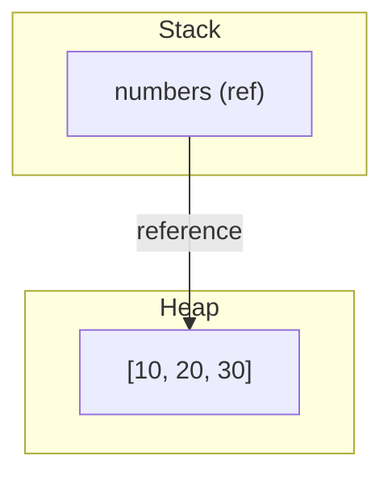
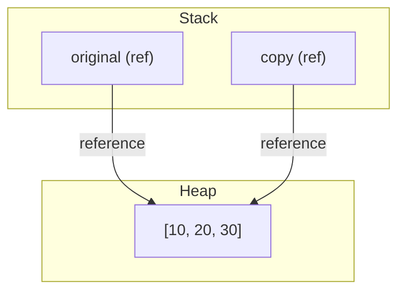
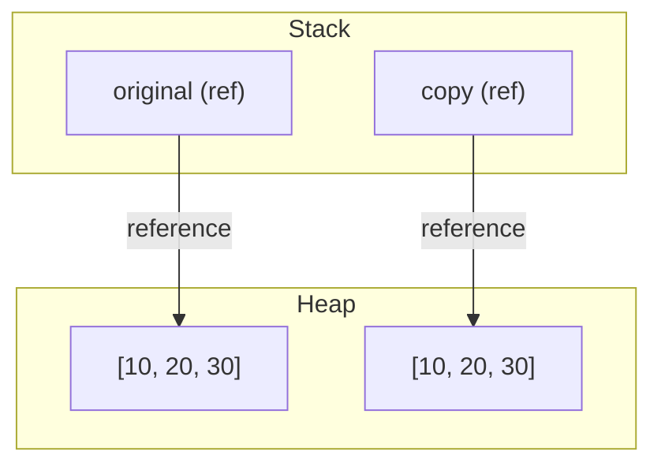
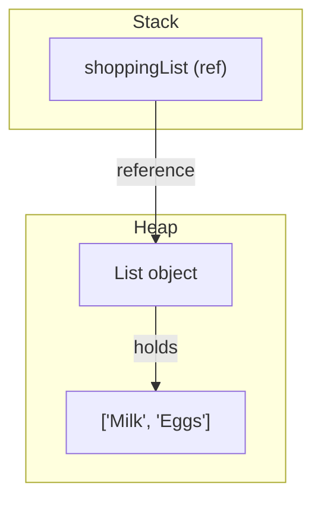
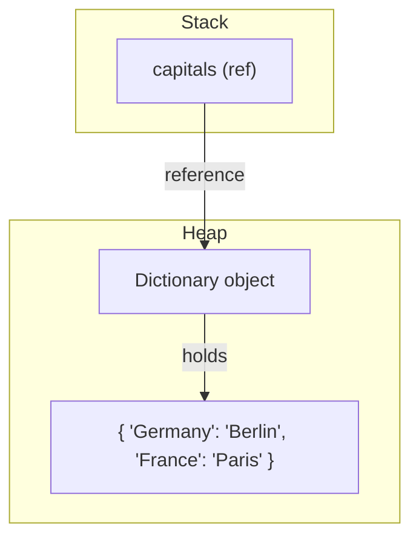
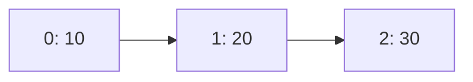
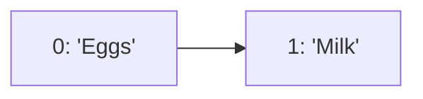
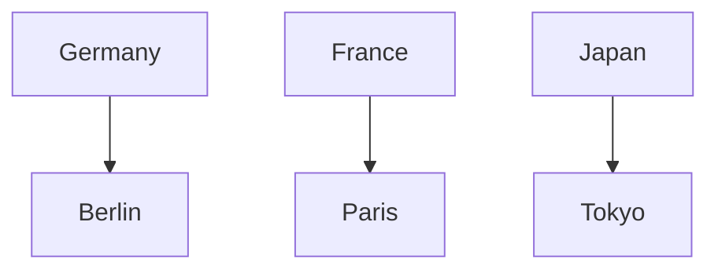

## Storing Different Types in Arrays, Lists, and Dictionaries

By default, arrays and generic collections like List<T> and Dictionary<TKey,TValue> are strongly typed in C#. This means all elements must be of the specified type. However, you can store different types by using a non-generic collection (like ArrayList), or by declaring the type as `object` (the base type of all types in C#).

### Array of object

```csharp
object[] mixedArray = { 1, "hello", 3.14, true };
foreach (var item in mixedArray)
    Console.WriteLine($"{item} ({item.GetType()})");
```

### List<object>

```csharp
var mixedList = new List<object> { 42, "world", 2.71, false };
mixedList.Add(DateTime.Now);
foreach (var item in mixedList)
    Console.WriteLine($"{item} ({item.GetType()})");
```

### Dictionary<object, object>

```csharp
var mixedDict = new Dictionary<object, object>
{
    { 1, "one" },
    { "two", 2 },
    { 3.0, true }
};
foreach (var kvp in mixedDict)
    Console.WriteLine($"{kvp.Key} ({kvp.Key.GetType()}) → {kvp.Value} ({kvp.Value.GetType()})");
```

**Note:**

- Using `object` allows any type, but you lose compile-time type safety and may need to cast when retrieving values.
- For most real-world code, prefer strongly-typed collections for safety and performance.
- For truly mixed types, consider using records, tuples, or custom classes for clarity.

# 19_arrays

## Arrays, Lists, and Dictionaries: How C# and .NET Manage Data

When you use arrays and collections in C#, you are using features provided by the .NET runtime. Collections are not unique to C#—they are part of the .NET framework and available to all .NET languages (like F# and VB.NET). This means that when you use collections, you are working with both the C# language and the .NET runtime environment.

### Stack vs Heap: Where Are Arrays, Lists, and Dictionaries Stored?

In C#, value types (like `int`, `double`, `struct`) are usually stored on the stack, while reference types (like arrays, lists, and dictionaries) are stored on the heap. The stack is fast and used for short-lived variables; the heap is used for objects that may outlive the current method call.

#### Diagram: Stack and Heap (for an array)



---

## Deep Copy vs Shallow Copy

When you copy arrays, lists, or dictionaries in C#, you can create either a shallow copy or a deep copy. Understanding the difference is crucial for avoiding bugs related to shared references.

### Shallow Copy

- Copies the reference, not the actual data.
- Both variables point to the same object in memory (on the heap).
- Changing the object through one reference affects the other.

#### Diagram: Shallow Copy (Stack & Heap)



### Deep Copy

- Copies the actual data to a new object in memory.
- Each variable points to a different object on the heap.
- Changing one does not affect the other.

#### Diagram: Deep Copy (Stack & Heap)



### Summary Table

| Copy Type    | What is copied?       | Memory (Heap) | Are objects linked? |
| ------------ | --------------------- | ------------- | ------------------- |
| Shallow Copy | Reference (pointer)   | Same object   | Yes                 |
| Deep Copy    | New object + contents | New object    | No                  |

**Tip:** For arrays and most collections of value types, `new` + constructor or `Array.Copy`/`List<T>(otherList)`/`Dictionary<K,V>(otherDict)` gives a deep copy. For collections of reference types, you may need to clone each element for a true deep copy.

#### Diagram: Stack and Heap (for a List)



#### Diagram: Stack and Heap (for a Dictionary)



---

---

## Arrays

- Fixed size, strongly typed.
- Elements are stored in contiguous memory and accessed by index (starting at 0).

```csharp
int[] numbers = new int[3];
numbers[0] = 10;
numbers[1] = 20;
numbers[2] = 30;
foreach (int n in numbers)
{
    Console.WriteLine(n);
}
```

You can also initialise directly:

```csharp
string[] names = { "Lina", "Omar", "Jonas" };
```

**Use when:** you know the size in advance and don’t need to resize.

#### Array in Memory (Index View)



---

## Lists (`List<T>`)

- Dynamic size: grows and shrinks as needed.
- Provides useful methods like Add, Remove, Contains, Sort, Insert, and Clear.

```csharp
var shoppingList = new List<string>();
shoppingList.Add("Milk");
shoppingList.Add("Bread");
shoppingList.Add("Eggs");
shoppingList.Remove("Bread");
if (shoppingList.Contains("Milk"))
{
    Console.WriteLine("Milk is on the list");
}
shoppingList.Sort();
foreach (var item in shoppingList)
{
    Console.WriteLine(item);
}
```

**Use when:** you need a flexible collection with built-in operations.

#### List in Memory (Index View)



---

## Dictionaries (`Dictionary<TKey,TValue>`)

- Store pairs of key and value.
- Extremely fast lookups by key.
- Common methods: Add, Remove, ContainsKey, TryGetValue, Keys, and Values.

```csharp
var capitals = new Dictionary<string, string>();
capitals.Add("Germany", "Berlin");
capitals["France"] = "Paris";
capitals["Japan"] = "Tokyo";
if (capitals.ContainsKey("France"))
{
    Console.WriteLine($"France → {capitals["France"]}");
}
if (capitals.TryGetValue("Spain", out var city))
{
    Console.WriteLine(city);
}
else
{
    Console.WriteLine("Spain not found");
}
foreach (var kvp in capitals)
{
    Console.WriteLine($"{kvp.Key} → {kvp.Value}");
}
```

**Use when:** you want to associate values with unique identifiers.

#### Dictionary in Memory (Key-Value View)



---

## When to Use Which

| Collection              | Size    | Access | Best for                                  |
| ----------------------- | ------- | ------ | ----------------------------------------- |
| Array                   | Fixed   | Index  | Known number of items, fast iteration     |
| List                    | Dynamic | Index  | Flexible collections, frequent add/remove |
| Dictionary<TKey,TValue> | Dynamic | Key    | Lookups, mapping one value to another     |

---

## Other Collections in .NET (with Short Examples)

- **Queue<T>** (FIFO):
  ```csharp
  var queue = new Queue<int>();
  queue.Enqueue(1);
  queue.Enqueue(2);
  int first = queue.Dequeue(); // 1
  ```
- **Stack<T>** (LIFO):
  ```csharp
  var stack = new Stack<string>();
  stack.Push("A");
  stack.Push("B");
  string top = stack.Pop(); // "B"
  ```
- **HashSet<T>** (Unique elements):
  ```csharp
  var set = new HashSet<string>();
  set.Add("apple");
  set.Add("apple"); // No duplicate
  ```
- **LinkedList<T>**:
  ```csharp
  var linked = new LinkedList<int>();
  linked.AddLast(1);
  linked.AddFirst(0);
  ```
- **SortedDictionary<TKey,TValue>**:
  ```csharp
  var sorted = new SortedDictionary<string, int>();
  sorted["b"] = 2;
  sorted["a"] = 1;
  // Keys are always sorted
  ```
- **ObservableCollection<T>** (notifies on change):
  ```csharp
  var obs = new System.Collections.ObjectModel.ObservableCollection<string>();
  obs.CollectionChanged += (s, e) => Console.WriteLine("Changed!");
  obs.Add("item");
  ```

---

## Arrays and Collections with foreach

All collections can be visited with `foreach`:

```csharp
foreach (var n in numbers)
{
    Console.WriteLine(n);
}
foreach (var item in shoppingList)
{
    Console.WriteLine(item);
}
foreach (var kvp in capitals)
{
    Console.WriteLine($"{kvp.Key} → {kvp.Value}");
}
```

---

## C# vs TypeScript: Side-by-Side

Maybe you already noticed but the typing system in C# and TypeScript looks very similar. This is because Anders Hejlsberg was the principal developer to both projects. Let’s go over a quick comparison, from basic types to generics. A key difference is that types in C# exist at runtime, whereas in TypeScript, they only exist at compile time.

### Arrays

// C#

```csharp
int[] nums = { 1, 2, 3 };
string[] names = { "Lina", "Omar" };
foreach (var n in nums)
{
    Console.WriteLine(n);
}
foreach (var name in names)
{
    Console.WriteLine(name);
}
```

// TypeScript

```typescript
const nums: number[] = [1, 2, 3];
const names: string[] = ['Lina', 'Omar'];
for (const n of nums) {
  console.log(n);
}
for (const name of names) {
  console.log(name);
}
```

### Resizable Sequences: List vs Array

// C# List<T>

```csharp
var list = new List<string>();
list.Add("milk");
list.Add("eggs");
list.Remove("milk");
list.ForEach(item => Console.WriteLine(item));
```

// TypeScript Array<string>

```typescript
const list: string[] = [];
list.push('milk');
list.push('eggs');
list.splice(list.indexOf('milk'), 1);
list.forEach((item) => console.log(item));
```

### Key–Value Lookups: Dictionary<TKey,TValue> vs Map<K,V>

// C# Dictionary<TKey,TValue>

```csharp
var capitals = new Dictionary<string, string>();
capitals["Germany"] = "Berlin";
capitals.TryGetValue("France", out var city);
foreach (var (country, capital) in capitals)
{
    Console.WriteLine($"{country} → {capital}");
}
```

// TypeScript Map<K,V>

```typescript
const capitals = new Map<string, string>();
capitals.set('Germany', 'Berlin');
const city = capitals.get('France');
for (const [country, capital] of capitals) {
  console.log(`${country} → ${capital}`);
}
```

### Generics Syntax at a Glance

// C#

```csharp
List<int> numbers = new List<int>();
Dictionary<string, double> prices = new();
```

// TypeScript

```typescript
const numbers: Array<number> = [];
const prices: Map<string, number> = new Map();
```
