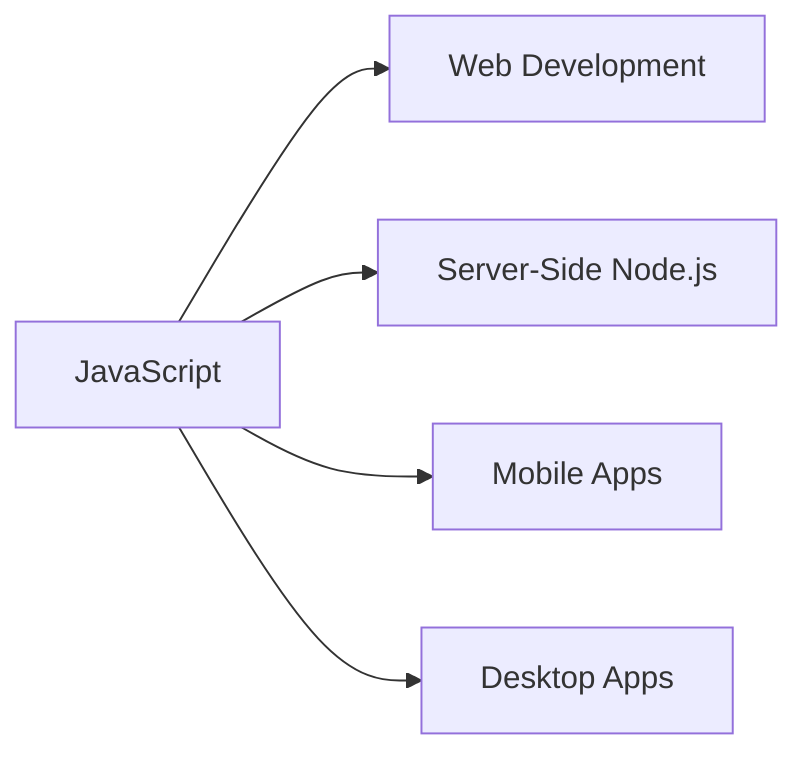
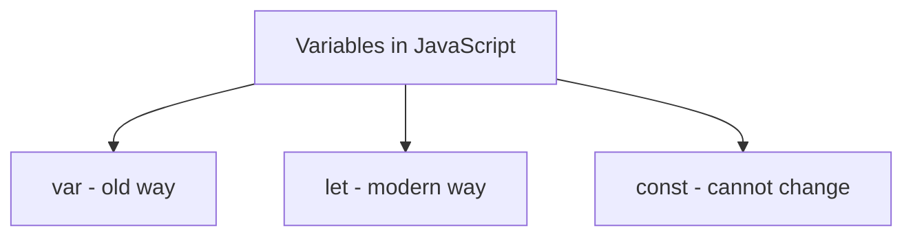
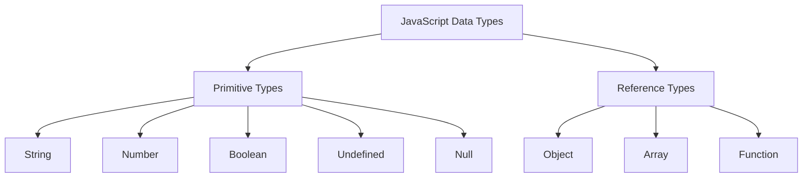
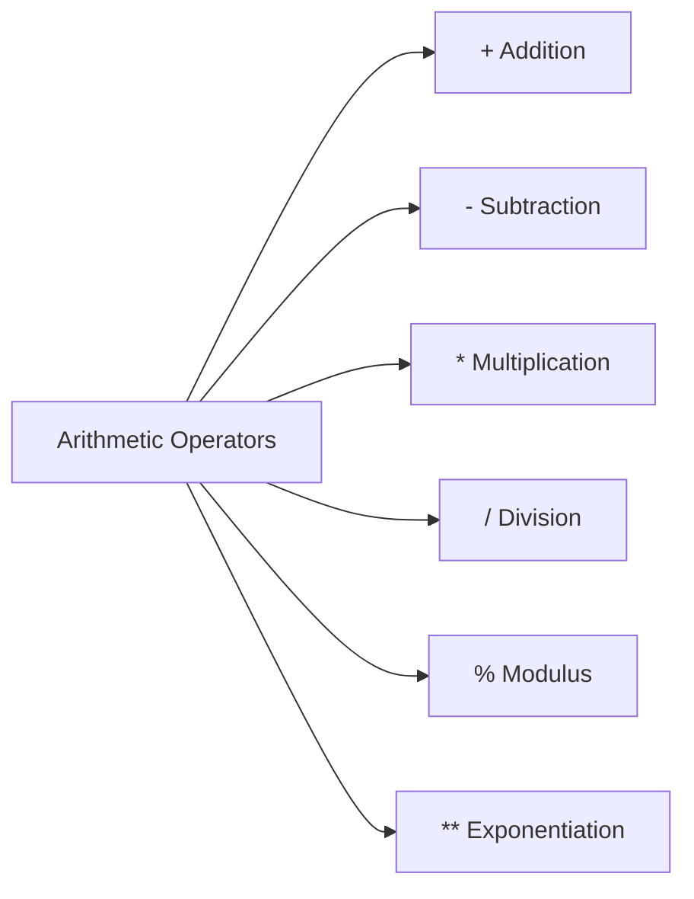
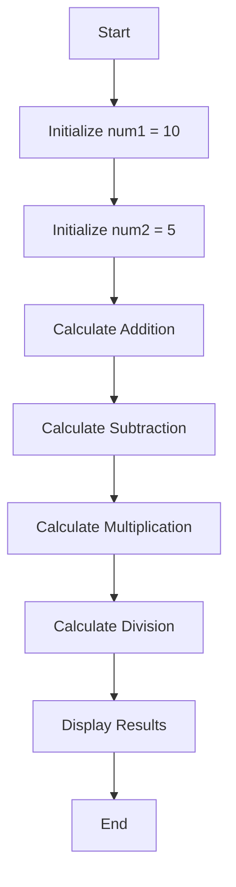
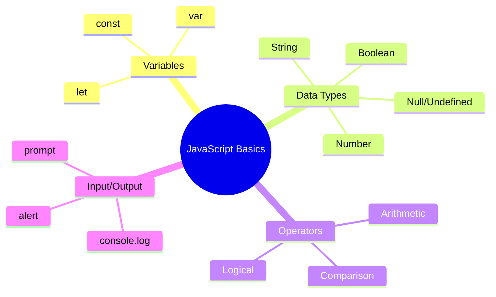

# Introduction to JavaScript

> **Educational content by Bashar Alwarad**:  
> Model Context Protocol (MCP) integration with Pokemon data.

## Connect with Me [](https://www.linkedin.com/in/bashar-alwarad-2a960b1b6/)

---

## What is JavaScript?

JavaScript is a **high-level**, **interpreted** programming language that is one of the core technologies of the web. It allows you to create interactive and dynamic content on websites.



## Why Learn JavaScript?

- 🌐 Runs in every web browser
- 📱 Build mobile apps
- 🖥️ Create desktop applications
- ⚡ Fast and lightweight
- 📚 Huge community and resources

---

## JavaScript Basics

### 1. Comments

Comments are used to explain code and are ignored by JavaScript.

```javascript
// This is a single-line comment

/*
This is a
multi-line comment
*/
```

---

### 2. Variables

Variables are containers for storing data values.



```javascript
// Using let (recommended)
let name = 'John';
let age = 25;

// Using const (for values that don't change)
const PI = 3.14159;
const country = 'USA';

// Using var (old way, avoid if possible)
var oldVariable = 'old style';
```

**Rules for Variable Names:**

- Must start with a letter, underscore (\_), or dollar sign ($)
- Can contain letters, numbers, underscores, and dollar signs
- Case-sensitive (`myVar` and `myvar` are different)
- Cannot use reserved keywords (like `let`, `const`, `function`)

```javascript
// Valid variable names
let firstName = 'Alice';
let _privateVar = 10;
let $jquery = true;
let user123 = 'valid';

// Invalid variable names
// let 123user = "invalid";  // Cannot start with number
// let my-name = "invalid";  // Cannot use hyphens
```

---

### 3. Data Types

JavaScript has several basic data types:



#### String

Text enclosed in quotes.

```javascript
let greeting = 'Hello, World!';
let name = 'Alice';
let message = `Welcome ${name}`; // Template literal

console.log(greeting); // Output: Hello, World!
console.log(message); // Output: Welcome Alice
```

#### Number

Integers and decimals.

```javascript
let age = 25;
let price = 19.99;
let negative = -10;

console.log(age + 5); // Output: 30
console.log(price * 2); // Output: 39.98
```

#### Boolean

True or false values.

```javascript
let isStudent = true;
let hasLicense = false;

console.log(isStudent); // Output: true
console.log(hasLicense); // Output: false
```

#### Undefined and Null

```javascript
let notAssigned; // undefined
let empty = null; // null (intentionally empty)

console.log(notAssigned); // Output: undefined
console.log(empty); // Output: null
```

---

### 4. Operators

#### Arithmetic Operators

```javascript
let a = 10;
let b = 3;

console.log(a + b); // Addition: 13
console.log(a - b); // Subtraction: 7
console.log(a * b); // Multiplication: 30
console.log(a / b); // Division: 3.333...
console.log(a % b); // Modulus (remainder): 1
console.log(a ** b); // Exponentiation: 1000
```



#### Comparison Operators

```javascript
let x = 5;
let y = 10;

console.log(x == y); // Equal to: false
console.log(x != y); // Not equal: true
console.log(x > y); // Greater than: false
console.log(x < y); // Less than: true
console.log(x >= 5); // Greater or equal: true
console.log(x <= 10); // Less or equal: true

// Strict equality (checks value AND type)
console.log(5 === '5'); // false (different types)
console.log(5 == '5'); // true (only checks value)
```

#### Logical Operators

```javascript
let isAdult = true;
let hasID = false;

console.log(isAdult && hasID); // AND: false
console.log(isAdult || hasID); // OR: true
console.log(!isAdult); // NOT: false
```

---

### 5. Output / Printing

```javascript
// Print to console (for debugging)
console.log('Hello, JavaScript!');

// Multiple values
let name = 'Bob';
let age = 20;
console.log('Name:', name, 'Age:', age);

// Alert box (browser only)
alert('This is an alert!');

// Write to HTML document (browser only)
document.write('Hello from JavaScript!');
```

---

### 6. Input from User

```javascript
// Using prompt (browser only)
let userName = prompt('What is your name?');
console.log('Hello, ' + userName);

// Using prompt with a number
let userAge = prompt('What is your age?');
let age = Number(userAge); // Convert string to number
console.log('Next year you will be', age + 1);
```

---

## Simple Program Example

Let's create a simple calculator:

```javascript
// Simple Calculator
let num1 = 10;
let num2 = 5;

console.log('Addition:', num1 + num2);
console.log('Subtraction:', num1 - num2);
console.log('Multiplication:', num1 * num2);
console.log('Division:', num1 / num2);
```



---

## Practice Exercises

1. **Variable Practice:**
   - Create variables for your name, age, and favorite color
   - Print them using `console.log()`

2. **Calculator:**
   - Create two number variables
   - Perform all arithmetic operations
   - Print the results

3. **Greeting Program:**
   - Use `prompt()` to ask for a user's name
   - Print a personalized greeting

---

## Summary



### Key Takeaways:

- ✅ Use `let` and `const` for variables
- ✅ JavaScript has dynamic typing
- ✅ Use `console.log()` for debugging
- ✅ Operators work similar to math
- ✅ Always end statements with semicolons (optional but recommended)

---

## Next Steps

In the next lesson, we'll learn about:

- Control Flow (if/else statements)
- Loops (for, while)
- Functions
- Arrays and Objects

Happy Coding! 🚀
