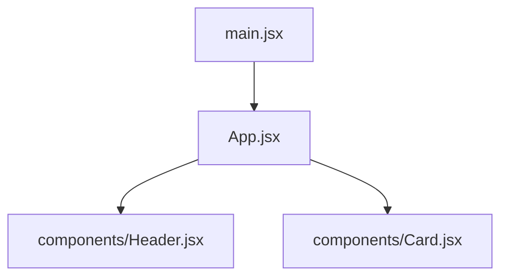
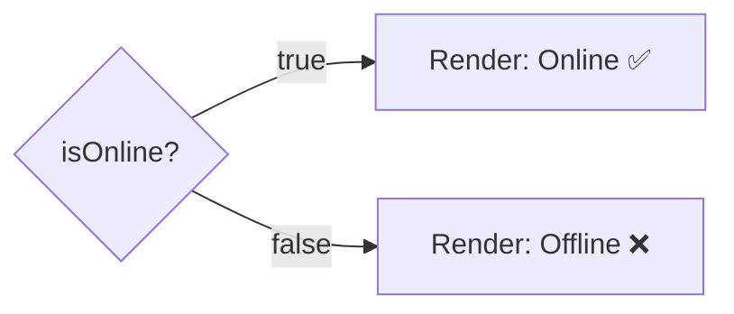
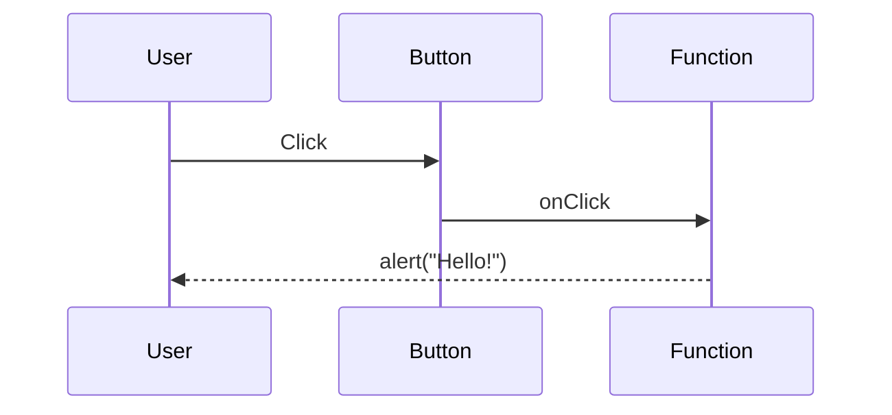

# Lecture: Intro to React (Basics)

> **Educational content by Bashar Alwarad**  
> A friendly, beginner-focused introduction to React with Vite.

---

## What is React?

**React** is a JavaScript library for building user interfaces.
It helps you build UI by composing **small, reusable components**.

### Why React?

- ✅ Build UIs with **components**
- ✅ Reuse code across screens
- ✅ Keep UI in sync with data
- ✅ Large ecosystem and community

---

## What is Vite?

**Vite** is a modern build tool that makes creating and running React apps **fast and simple**.

### Why Vite?

- ✅ Quick setup
- ✅ Instant dev server
- ✅ Optimized builds

---

## Create a Vite + React Project

```bash
npm create vite@latest my-react-app -- --template react
cd my-react-app
npm install
npm run dev
```

---

## Project Organization (Simple)

```
my-react-app/
├─ public/
├─ src/
│  ├─ components/
│  │  ├─ Header.jsx
│  │  └─ Card.jsx
│  ├─ App.jsx
│  ├─ main.jsx
│  └─ index.css
├─ index.html
└─ package.json
```

**Mermaid view:**



---

## The Entry Point

**`main.jsx`** renders your app into the DOM.

```jsx
import React from 'react';
import ReactDOM from 'react-dom/client';
import App from './App.jsx';
import './index.css';

ReactDOM.createRoot(document.getElementById('root')).render(<App />);
```

---

## Components

A **component** is a JavaScript function that returns JSX.

```jsx
function Header() {
  return <h1>Welcome to React</h1>;
}

export default Header;
```

---

## Nested Components

```jsx
import Header from './components/Header.jsx';

function App() {
  return (
    <div>
      <Header />
      <p>This is the main page.</p>
    </div>
  );
}

export default App;
```

---

## JSX (JavaScript + HTML)

JSX looks like HTML but runs inside JavaScript.

```jsx
const title = 'React Basics';

function App() {
  return <h2>{title}</h2>;
}
```

---

## Styling (3 Simple Ways)

### 1) Global CSS

```css
/* index.css */
body {
  font-family: Arial, sans-serif;
}
```

### 2) Class Names

```jsx
function Card() {
  return <div className="card">Hello</div>;
}
```

```css
/* index.css */
.card {
  padding: 12px;
  border: 1px solid #ddd;
}
```

### 3) Inline Styles

```jsx
function Badge() {
  return <span style={{ backgroundColor: 'gold', padding: '4px' }}>New</span>;
}
```

---

## Displaying Data

```jsx
const name = 'Ava';
const score = 95;

function App() {
  return (
    <div>
      <p>Name: {name}</p>
      <p>Score: {score}</p>
    </div>
  );
}
```

---

## Conditional Rendering (No Hooks)

```jsx
const isOnline = true;

function Status() {
  return <p>{isOnline ? 'Online ✅' : 'Offline ❌'}</p>;
}
```

**Mermaid:**



---

## Rendering a List

```jsx
const skills = ['HTML', 'CSS', 'JavaScript'];

function SkillsList() {
  return (
    <ul>
      {skills.map((skill) => (
        <li key={skill}>{skill}</li>
      ))}
    </ul>
  );
}
```

---

## Events (No Hooks)

```jsx
function App() {
  const sayHello = () => {
    alert('Hello!');
  };

  return <button onClick={sayHello}>Click me</button>;
}
```

**Mermaid:**



---

## Putting It Together (Tiny App)

```jsx
import Header from './components/Header.jsx';

const items = ['Apple', 'Banana', 'Orange'];
const showMessage = false;

function App() {
  return (
    <div>
      <Header />
      <p>{showMessage ? 'Message shown' : 'Message hidden'}</p>

      <h3>Fruits</h3>
      <ul>
        {items.map((item) => (
          <li key={item}>{item}</li>
        ))}
      </ul>

      <button onClick={() => alert('Nice!')}>Say Hi</button>
    </div>
  );
}

export default App;
```

---

## Summary

- ✅ React builds UI using **components**
- ✅ Vite makes React setup **fast**
- ✅ JSX mixes JavaScript and HTML
- ✅ Use **props**, **lists**, and **events**
- ✅ Conditional rendering is easy with `? :`
- ✅ Start simple and build up gradually
