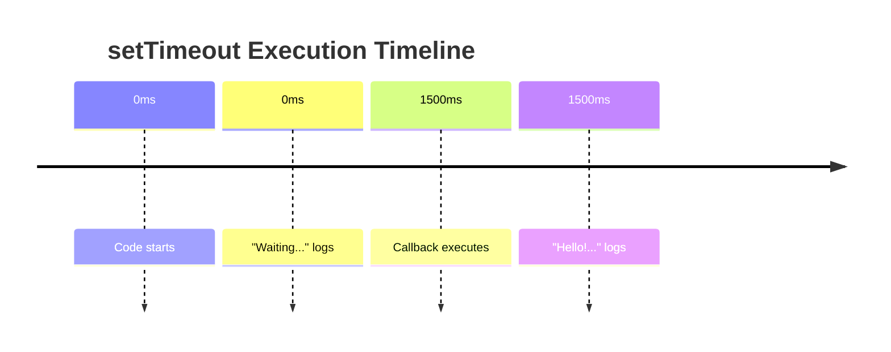
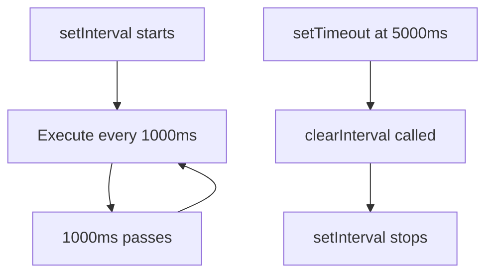
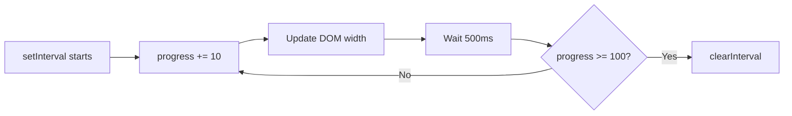
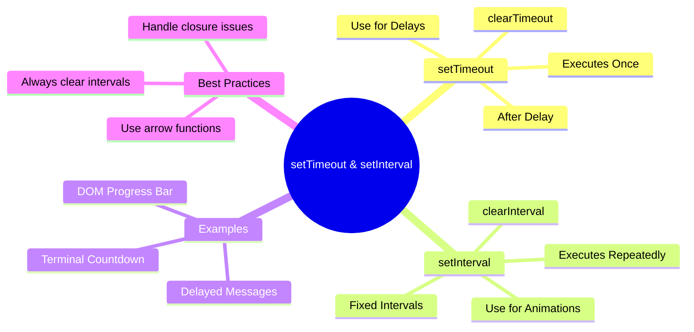

# Lecture 5: setTimeout and setInterval

> **Educational content by Bashar Alwarad**  
> Understanding asynchronous timing in JavaScript.

## Connect with Me [](https://www.linkedin.com/in/bashar-alwarad-2a960b1b6/)

---

## What is setTimeout?

`setTimeout` is a function that executes code **once** after a specified delay (in milliseconds).

### Basic Syntax

```js
setTimeout(function, delay);
```

- **function**: The code to execute.
- **delay**: Time to wait in milliseconds (1000ms = 1 second).

### Example 1: Simple Delay

```js
console.log('Start');

setTimeout(() => {
  console.log('This runs after 2 seconds');
}, 2000);

console.log('End');
```

**Output:**

```
Start
End
This runs after 2 seconds
```

Notice: "End" prints before the delayed message!

---

### Example 2: Greeting with Delay

```js
console.log('Waiting for greeting...');

setTimeout(() => {
  console.log('Hello! You have been waiting.');
}, 1500);
```

**Diagram:**



---

## What is setInterval?

`setInterval` executes code **repeatedly** at fixed intervals.

### Basic Syntax

```js
setInterval(function, delay);
```

- **function**: The code to repeat.
- **delay**: Time between executions in milliseconds.

### Example 1: Counter

```js
let count = 0;

const timer = setInterval(() => {
  count++;
  console.log('Count:', count);

  if (count === 5) {
    clearInterval(timer); // Stop the interval
  }
}, 1000);
```

**Output:**

```
Count: 1
Count: 2
Count: 3
Count: 4
Count: 5
```

---

### Example 2: Clock Display

```js
const clock = setInterval(() => {
  const now = new Date();
  console.log(now.toLocaleTimeString());
}, 1000);

// Stop after 5 seconds
setTimeout(() => {
  clearInterval(clock);
  console.log('Clock stopped');
}, 5000);
```

**Diagram:**



---

## setTimeout vs setInterval

| Feature        | setTimeout | setInterval     |
| -------------- | ---------- | --------------- |
| Executes       | Once       | Repeatedly      |
| Good for       | Delays     | Animations      |
| Stopping       | Automatic  | clearInterval() |
| Timing Control | Simple     | More complex    |

---

## Clearing Timers

Use `clearTimeout()` and `clearInterval()` to stop timers before they execute.

### Example: Cancel a Timeout

```js
const timeoutId = setTimeout(() => {
  console.log('This will NOT print');
}, 1000);

// Cancel before it runs
clearTimeout(timeoutId);
console.log('Timeout cancelled');
```

**Output:**

```
Timeout cancelled
```

---

### Example: Stop an Interval

```js
let seconds = 0;

const intervalId = setInterval(() => {
  seconds++;
  console.log('Seconds:', seconds);

  if (seconds === 3) {
    clearInterval(intervalId);
    console.log('Stopped!');
  }
}, 1000);
```

**Output:**

```
Seconds: 1
Seconds: 2
Seconds: 3
Stopped!
```

---

## Real Example 1: DOM - Progress Bar

Update a progress bar every 100ms.

**HTML:**

```html
<div id="bar"></div>
<p>Progress: <span id="percent">0</span>%</p>
```

**CSS:**

```css
#bar {
  width: 0%;
  height: 30px;
  background-color: green;
  transition: width 0.1s;
}
```

**JavaScript:**

```js
let progress = 0;
const bar = document.getElementById('bar');
const percent = document.getElementById('percent');

const interval = setInterval(() => {
  progress += 10;
  bar.style.width = progress + '%';
  percent.textContent = progress;

  if (progress >= 100) {
    clearInterval(interval);
    console.log('Progress complete!');
  }
}, 500);
```

**Diagram:**



---

## Real Example 2: Terminal - Countdown Timer

A countdown timer that runs in Node.js.

**Create `countdown.js`:**

```js
const args = process.argv.slice(2);
let seconds = parseInt(args[0]) || 10;

console.log(`Starting countdown from ${seconds} seconds...\n`);

const timer = setInterval(() => {
  console.log(`Time remaining: ${seconds}s`);
  seconds--;

  if (seconds < 0) {
    clearInterval(timer);
    console.log('\n🎉 Time is up!');
  }
}, 1000);
```

**Run it:**

```bash
node countdown.js 5
```

**Output:**

```
Starting countdown from 5 seconds...

Time remaining: 5s
Time remaining: 4s
Time remaining: 3s
Time remaining: 2s
Time remaining: 1s
Time remaining: 0s

🎉 Time is up!
```

---

### Example 2b: Terminal - Delayed Message

Show messages with delays in the terminal.

**Create `delayed-messages.js`:**

```js
console.log('Task started');

setTimeout(() => {
  console.log('✓ Step 1 complete');
}, 1000);

setTimeout(() => {
  console.log('✓ Step 2 complete');
}, 2000);

setTimeout(() => {
  console.log('✓ Step 3 complete');
  console.log('\nAll tasks finished!');
}, 3000);
```

**Run it:**

```bash
node delayed-messages.js
```

**Output:**

```
Task started
✓ Step 1 complete
✓ Step 2 complete
✓ Step 3 complete

All tasks finished!
```

---

## Real Example 3: Fetching API Data with Delays

Fetch users from JSONPlaceholder API and display them one by one with a delay.

**HTML:**

```html
<body class="bg-gray-100 p-5">
  <h1 class="text-center text-3xl font-bold text-gray-800 mb-8">
    JSONPlaceholder Users
  </h1>
  <div id="loading" class="text-center text-lg text-gray-600">
    Loading users...
  </div>
  <div id="users-container" class="flex flex-col gap-4 max-w-2xl mx-auto"></div>
</body>
```

**Update the JavaScript to use Tailwind classes for cards (`users-api.js`):**

**JavaScript (`users-api.js`):**

```js
// Fetch users from JSONPlaceholder API and display them with a delay
async function loadUsers() {
  const loadingElement = document.getElementById('loading');
  const usersContainer = document.getElementById('users-container');

  try {
    // Fetch the users data from JSONPlaceholder API
    const response = await fetch('https://jsonplaceholder.typicode.com/users');

    // Check if the response is successful
    if (!response.ok) {
      throw new Error(`HTTP error! status: ${response.status}`);
    }

    // Parse the JSON response
    const users = await response.json();

    // Hide the loading message
    loadingElement.style.display = 'none';

    // Display each user with a 800ms delay
    users.forEach((user, index) => {
      // Use setTimeout to delay the display of each user
      setTimeout(() => {
        const userCard = createUserCard(user);
        usersContainer.appendChild(userCard);
        console.log(`User ${index + 1} (${user.name}) added to DOM`);
      }, index * 800); // 800ms delay between each user
    });
  } catch (error) {
    // Handle any errors
    loadingElement.textContent = `Error loading users: ${error.message}`;
    console.error('Error:', error);
  }
}

// Helper function to create a user card element with Tailwind CSS
function createUserCard(user) {
  const card = document.createElement('div');
  card.className =
    'bg-white p-5 rounded-lg shadow-md hover:shadow-lg transition-shadow duration-300 animate-slideIn';

  card.innerHTML = `
    <h2 class="text-xl font-bold text-blue-600 mb-3">${user.name}</h2>
    <p class="text-gray-700 mb-2"><strong>Username:</strong> @${user.username}</p>
    <p class="text-gray-700 mb-2"><strong>Email:</strong> ${user.email}</p>
    <p class="text-gray-700 mb-2"><strong>Phone:</strong> ${user.phone}</p>
    <p class="text-gray-700 mb-2"><strong>Company:</strong> ${user.company.name}</p>
    <p class="text-gray-700"><strong>City:</strong> ${user.address.city}</p>
  `;

  return card;
}

// Call the function when the page loads
document.addEventListener('DOMContentLoaded', loadUsers);
```

**How it works:**

1. **Fetch API Data**: `fetch()` retrieves the list of users from `https://jsonplaceholder.typicode.com/users`
2. **Parse JSON**: Convert the response to a JavaScript array
3. **Loop with Delays**: Use `forEach()` with `setTimeout()` to display each user with an 800ms delay
4. **Dynamic DOM**: Each user card is created dynamically with Tailwind classes
5. **Smooth Styling**: Tailwind provides responsive, modern styling out of the box

**Output Timeline:**

```
0ms   → "Loading users..." visible
0ms   → Fetch request sent
~100ms → Response received, loading hidden
800ms → User 1 (Leanne Graham) appears
1600ms → User 2 (Ervin Howell) appears
2400ms → User 3 (Clementine Bauch) appears
...
9200ms → User 10 appears (10 users total)
```

**Key Concepts:**

- ✅ **async/await** for clean API fetching
- ✅ **setTimeout** with index to create staggered delays
- ✅ **forEach** to iterate through users
- ✅ **DOM manipulation** to dynamically create elements
- ✅ **Tailwind CSS** for modern, responsive styling

---

## Common Mistakes

### ❌ Forgetting to clear setInterval

```js
// This runs forever!
setInterval(() => {
  console.log('This never stops');
}, 1000);
```

**Solution:** Always clear when done.

```js
const id = setInterval(() => {
  // ...code...
}, 1000);

// Clear it later
clearInterval(id);
```

---

### ❌ Using setTimeout in a loop (Race condition)

```js
// Wrong: All execute after same delay
for (let i = 1; i <= 3; i++) {
  setTimeout(() => {
    console.log(i); // Prints: 4, 4, 4
  }, 1000);
}
```

**Solution:** Use a closure or arrow function.

```js
// Correct: Capture i in each iteration
for (let i = 1; i <= 3; i++) {
  setTimeout(() => {
    console.log(i);
  }, i * 1000);
}
```

---

## Quick Summary



### Key Takeaways:

- ✅ `setTimeout` runs code **once** after a delay.
- ✅ `setInterval` runs code **repeatedly** at intervals.
- ✅ Always **clear intervals** when done (`clearInterval`).
- ✅ Time is in **milliseconds** (1000ms = 1 second).
- ✅ Use **arrow functions** to preserve `this` context.
- ✅ Both work in the browser (DOM) and Node.js (terminal).

---
