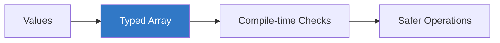
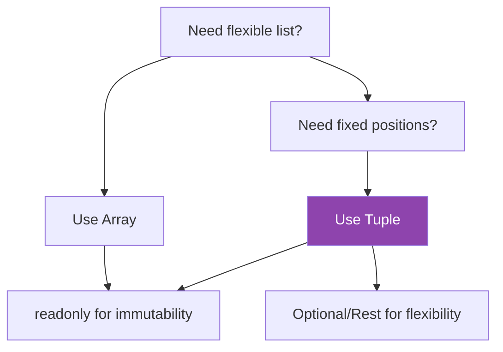

# 🧮 Arrays and Tuples in TypeScript

> **Educational content by Bashar Alwarad**  
> Practical guide to working with arrays and tuples in TypeScript.

## Connect with Me [](https://www.linkedin.com/in/bashar-alwarad-2a960b1b6/)

---

## 📚 Table of Contents

- [🧮 Arrays and Tuples in TypeScript](#-arrays-and-tuples-in-typescript)
  - [Connect with Me ](#connect-with-me-)
  - [📚 Table of Contents](#-table-of-contents)
  - [🎯 Why Typed Arrays?](#-why-typed-arrays)
  - [📦 Array Basics](#-array-basics)
  - [🛠️ Common Array Operations](#️-common-array-operations)
  - [🔒 Readonly Arrays](#-readonly-arrays)
  - [🧱 Tuples: Ordered, Fixed Length](#-tuples-ordered-fixed-length)
  - [🧩 Tuple Variations](#-tuple-variations)
    - [Optional Elements](#optional-elements)
    - [Rest Elements](#rest-elements)
    - [Readonly Tuples](#readonly-tuples)
    - [Labelled Tuples (improves readability)](#labelled-tuples-improves-readability)
  - [⚖️ Choosing Between Arrays and Tuples](#️-choosing-between-arrays-and-tuples)
  - [📌 Quick Reference](#-quick-reference)

---

## 🎯 Why Typed Arrays?

Typed arrays improve safety and autocomplete while keeping JavaScript flexibility.



---

## 📦 Array Basics

Two equivalent syntaxes:

```typescript
// Bracket syntax
const scores: number[] = [90, 85, 100];

// Generic syntax
const names: Array<string> = ['Alice', 'Bob'];
```

Mixed types via unions:

```typescript
const mixed: (number | string)[] = [1, 'two', 3];
```

---

## 🛠️ Common Array Operations

```typescript
const nums: number[] = [1, 2, 3];

nums.push(4); // [1,2,3,4]
const doubled = nums.map((n) => n * 2); // [2,4,6,8]
const evens = nums.filter((n) => n % 2 === 0); // [2,4]
const total = nums.reduce((sum, n) => sum + n, 0); // 10
```

Type-safe spreads and destructuring:

```typescript
const base = ['red', 'green'] as const;
const palette: string[] = ['blue', ...base];

const [first, second] = palette; // first: string, second: string
```

---

## 🔒 Readonly Arrays

Use `readonly` to prevent mutation.

```typescript
const coords: readonly [number, number] = [10, 20];
// coords[0] = 5; // ❌ Error: Cannot assign to read only property

function logColors(colors: readonly string[]) {
  // colors.push("blue"); // ❌
  console.log(colors.join(', '));
}
```

`ReadonlyArray<T>` is equivalent to `readonly T[]`.

---

## 🧱 Tuples: Ordered, Fixed Length

Tuples encode position and type.

```typescript
const user: [number, string, boolean] = [1, 'Alice', true];

// Access keeps the type
const active: boolean = user[2];
```

Why tuples?

- Model structured, small records (e.g., `[id, name]`)
- Preserve order and arity
- Great for function returns with multiple values

Example return:

```typescript
function getPoint(): [number, number] {
  return [10, 20];
}
```

---

## 🧩 Tuple Variations

### Optional Elements

```typescript
type HTTPResponse = [number, string?, string?];
const ok: HTTPResponse = [200, 'OK']; // optional message & body
```

### Rest Elements

```typescript
type StringList = [string, ...string[]];
const tags: StringList = ['ts', 'types', 'safety'];
```

### Readonly Tuples

```typescript
const origin: readonly [0, 0] = [0, 0];
// origin[0] = 1; // ❌ cannot modify
```

### Labelled Tuples (improves readability)

```typescript
type UserTuple = [id: number, name: string, active: boolean];
const u: UserTuple = [7, 'Bob', false];
```

---

## ⚖️ Choosing Between Arrays and Tuples



- Arrays: homogeneous or union-typed collections where order/length can vary.
- Tuples: small, fixed-shape records where position conveys meaning.
- Apply `readonly` to lock structure when passing around data.

---

## 📌 Quick Reference

| Feature             | Arrays                           | Tuples                                   |
| ------------------- | -------------------------------- | ---------------------------------------- |
| Shape               | Variable length                  | Fixed/known length (can mix types)       |
| Typical contents    | Homogeneous (or union) elements  | Positional fields                        |
| Access typing       | Element type or union            | Precise per index                        |
| Mutation control    | `readonly T[]` / `ReadonlyArray` | `readonly [T1, T2, ...]`                 |
| Flexibility helpers | Spread, map, filter              | Optional elements, rest elements         |
| Best for            | Lists of similar items           | Small structured records / multi-returns |

---

**Happy Learning! 🚀**

_Educational content by Bashar Alwarad - Software Engineering Course_
