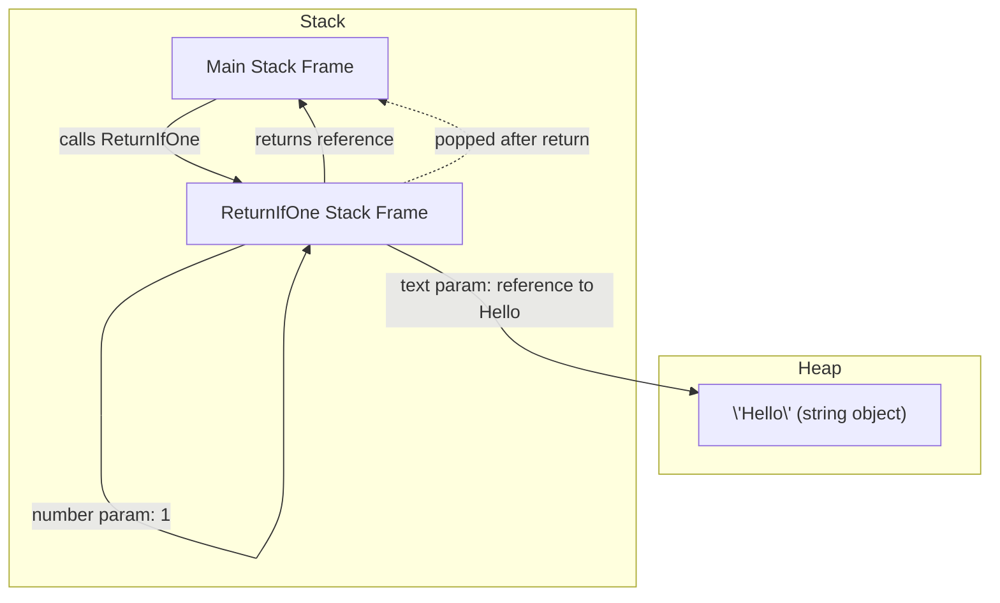

# 21_method_parameters

## Method Parameters in C#

Method parameters allow you to pass information into methods, making them flexible and reusable.

### Declaring Methods with Parameters

```csharp
void PrintSum(int a, int b)
{
    Console.WriteLine($"Sum: {a + b}");
}
PrintSum(3, 5); // Output: Sum: 8
```

### Parameter Types (with Examples and Explanations)

- **Value parameters**: The default; a copy of the value is passed.

  - _Why/When_: Use when you don't want the method to modify the original variable. Most common for numbers, strings, etc.

  ```csharp
  void PrintValue(int x) { Console.WriteLine(x); }
  int a = 10;
  PrintValue(a); // a is still 10 after the call
  ```

- **Reference parameters (`ref`)**: Use `ref` to pass a reference to the variable.

  - _Why/When_: Use when you want the method to modify the caller's variable.

  ```csharp
  void Increment(ref int x) { x++; }
  int n = 1;
  Increment(ref n); // n is now 2
  ```

  > **Why is 'ref' mandatory in both places?**
  > In C#, the `ref` keyword must be used in both the method declaration and the call. This tells the compiler that the method can modify the caller's variable directly. Without `ref`, the method would only receive a copy, and changes inside the method would not affect the original variable. This requirement makes your intent explicit and helps prevent accidental changes to variables.

- **Output parameters (`out`)**: Used to return multiple values from a method.

  - _Why/When_: Use when you need to return more than one value from a method.

  ```csharp
  void GetValues(out int x, out int y) { x = 10; y = 20; }
  int a, b;
  GetValues(out a, out b); // a = 10, b = 20
  ```

  > **Why is 'out' mandatory in both places?**
  > In C#, the `out` keyword must be used in both the method declaration and the call. This tells the compiler that the method will assign a value to the variable before it is used. Variables passed as `out` do not need to be initialized before the call, but they must be assigned inside the method. This makes it clear that the method is responsible for providing the value.

- **Optional parameters**: Provide a default value in the method signature.

  - _Why/When_: Use to make parameters optional for the caller, providing a default if not specified.

  ```csharp
  double Power(double x, double y = 2) { return Math.Pow(x, y); }
  Power(3); // 9
  Power(3, 3); // 27
  ```

- **Named arguments**: Specify parameter names when calling a method for clarity or to skip optional parameters.

  - _Why/When_: Use for readability or to skip some optional parameters.

  ```csharp
  void DisplayInfo(string name, int age = 18, string city = "Unknown") {
          Console.WriteLine($"Name: {name}, Age: {age}, City: {city}");
  }
  DisplayInfo("Alice", city: "Paris"); // Skips age, uses default
  ```

- **Params keyword**: Allows passing a variable number of arguments as an array.

  - _Why/When_: Use when you want to allow the caller to pass any number of arguments.

  ```csharp
  void PrintNumbers(params int[] numbers) {
          foreach (int num in numbers)
                  Console.WriteLine(num);
  }
  PrintNumbers(1, 2, 3, 4);
  ```

- **In parameters**: Use `in` to pass a parameter by reference, but as read-only.

  - _Why/When_: Use for performance (avoid copying large structs) but don't want the method to modify the value.

  ```csharp
  void PrintIn(in int x) { Console.WriteLine(x); /* x = 5; // Error */ }
  int z = 42;
  PrintIn(z);
  ```

- **Parameter modifiers order**: `ref`, `out`, and `in` must be specified in both method declaration and call.
  - _Why/When_: C# requires you to use the same modifier in both the method and the call for clarity and safety.
  ```csharp
  void Change(ref int x) { x = 99; }
  int v = 5;
  Change(ref v); // Must use 'ref' in both places
  ```

### Examples

```csharp
// Value parameter
void PrintValue(int x) { Console.WriteLine(x); }
PrintValue(10);

// Reference parameter (ref)
void Increment(ref int x) { x++; }
int n = 1;
Increment(ref n); // n is now 2

// Out parameter
void GetValues(out int x, out int y) { x = 10; y = 20; }
int a, b;
GetValues(out a, out b);

// In parameter (read-only reference)
void PrintIn(in int x) { Console.WriteLine(x); /* x = 5; // Error: cannot assign */ }
int z = 42;
PrintIn(z);

// Optional parameter
double Power(double x, double y = 2) { return Math.Pow(x, y); }
Power(3); // 9
Power(3, 3); // 27

// Named arguments
void DisplayInfo(string name, int age = 18, string city = "Unknown")
{
    Console.WriteLine($"Name: {name}, Age: {age}, City: {city}");
}
DisplayInfo("Alice", city: "Paris"); // Skips age, uses default

// Params keyword
void PrintNumbers(params int[] numbers)
{
    foreach (int num in numbers)
        Console.WriteLine(num);
}
PrintNumbers(1, 2, 3, 4);

// Example: Simple Function with Two Parameters
string ReturnIfOne(string text, int number)
{
    if (number == 1)
        return text;
    return "Not one";
}
string result = ReturnIfOne("Hello", 1); // result = "Hello"
```

### How Arguments and Parameters Work in Memory (Stack and Heap)

When you call `ReturnIfOne("Hello", 1)`, here's what happens step by step:

1. The string literal `"Hello"` is stored in the heap (as all strings are reference types).
2. The integer `1` is a value type and is pushed onto the stack as an argument.
3. The method call creates a new stack frame for `ReturnIfOne`:
   - The reference to the string (pointer to heap) and the integer value are pushed onto the stack as parameters.
4. Inside the method, the `if` statement checks the value of `number` (from the stack).
5. If `number == 1`, the method returns the reference to the string (from the stack, pointing to the heap).
6. The stack frame for `ReturnIfOne` is removed (popped) after the return, and only the result reference remains in the calling method's stack frame.

### Diagram: Stack and Heap During Function Call



### Step-by-Step Stack Operation

1. Main method pushes arguments (`"Hello"` reference, `1`) onto the stack and calls `ReturnIfOne`.
2. New stack frame for `ReturnIfOne` is created with parameters.
3. Method logic executes using stack values and heap reference.
4. Return value (reference to string or new string) is passed back to main stack frame.
5. `ReturnIfOne` stack frame is removed from the stack.

### Notes

- `ref` and `out` require variables to be initialized before passing (except `out`, which must be assigned in the method).
- `in` parameters are passed by reference but cannot be modified in the method.
- Named arguments improve readability and allow skipping optional parameters.
- `params` must be the last parameter in the method signature.

---
