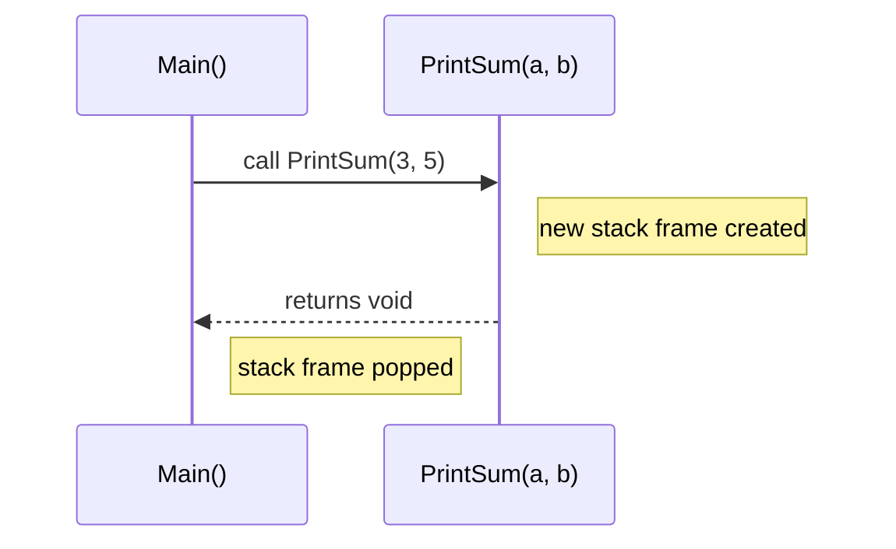
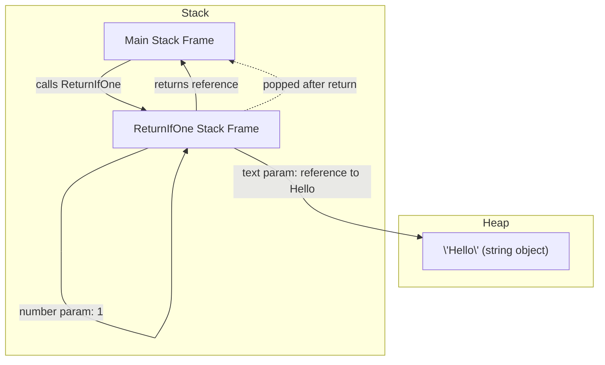
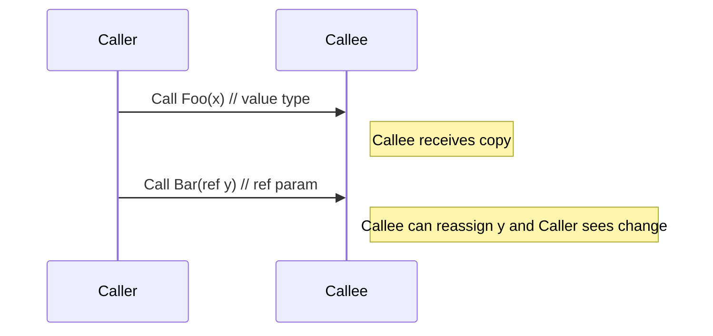

# 21_method_parameters

## Method Parameters in C#

Method parameters allow you to pass information into methods, making them flexible and reusable.

### Declaring Methods with Parameters

```csharp
void PrintSum(int a, int b)
{
  Console.WriteLine($"Sum: {a + b}");
}
// Caller
PrintSum(3, 5); // Output: Sum: 8
```

Below is a simple Mermaid sequence diagram that shows how a caller invokes a method with parameters and how the parameters are bound in the called method's stack frame.



### Parameter Types (with Examples and Explanations)

- **Value parameters**: The default; a copy of the value is passed.

  - Use when you don't want the method to modify the original variable. Most common for numbers, strings, etc.

  ```csharp
  void PrintValue(int x) { Console.WriteLine(x); }
  int a = 10;
  PrintValue(a); // a is still 10 after the call
  ```

- **Reference parameters (`ref`)**: Use `ref` to pass a reference to the variable.

  - Use when you want the method to modify the caller's variable.

  ```csharp
  void Increment(ref int x) { x++; }
  int n = 1;
  Increment(ref n); // n is now 2
  ```

  > **Why is 'ref' mandatory in both places?**
  > In C#, the `ref` keyword must be used in both the method declaration and the call. This tells the compiler that the method can modify the caller's variable directly. Without `ref`, the method would only receive a copy, and changes inside the method would not affect the original variable. This requirement makes your intent explicit and helps prevent accidental changes to variables.

- **Output parameters (`out`)**: Used to return multiple values from a method.

  - Use when you need to return more than one value from a method.

  ```csharp
  void GetValues(out int x, out int y) { x = 10; y = 20; }
  int a, b;
  GetValues(out a, out b); // a = 10, b = 20
  ```

  > **Why is 'out' mandatory in both places?**
  > In C#, the `out` keyword must be used in both the method declaration and the call. This tells the compiler that the method will assign a value to the variable before it is used. Variables passed as `out` do not need to be initialized before the call, but they must be assigned inside the method. This makes it clear that the method is responsible for providing the value.

- **Optional parameters**: Provide a default value in the method signature.

  - Use to make parameters optional for the caller, providing a default if not specified.

  ```csharp
  double Power(double x, double y = 2) { return Math.Pow(x, y); }
  Power(3); // 9
  Power(3, 3); // 27
  ```

- **Named arguments**: Specify parameter names when calling a method for clarity or to skip optional parameters.

  - Use for readability or to skip some optional parameters.

  ```csharp
  void DisplayInfo(string name, int age = 18, string city = "Unknown") {
          Console.WriteLine($"Name: {name}, Age: {age}, City: {city}");
  }
  DisplayInfo("Alice", city: "Paris"); // Skips age, uses default
  ```

- **Params keyword**: Allows passing a variable number of arguments as an array.

  - Use when you want to allow the caller to pass any number of arguments.

  ```csharp
  void PrintNumbers(params int[] numbers) {
          foreach (int num in numbers)
                  Console.WriteLine(num);
  }
  PrintNumbers(1, 2, 3, 4);
  ```

  ### Quick contract (for lesson planning)

  - Inputs: method name, parameter list (types + names), call site arguments
  - Outputs: method return value (or void), potential mutated variables via ref/out
  - Error modes: wrong number/types of args, null reference for reference types, uninitialized out variables

  ### Simple classroom talking points

  - Show declaration vs call: signature describes what a method expects; call provides concrete values.
  - Emphasize intent keywords: ref/out/in — and that they must appear in both declaration and call.
  - Optional and named arguments change the call site readability but do not alter memory semantics.

- **In parameters**: Use `in` to pass a parameter by reference, but as read-only.

  - Use for performance (avoid copying large structs) but don't want the method to modify the value.

  ```csharp
  void PrintIn(in int x) { Console.WriteLine(x); /* x = 5; // Error */ }
  int z = 42;
  PrintIn(z);
  ```

- **Parameter modifiers order**: `ref`, `out`, and `in` must be specified in both method declaration and call.
  - C# requires you to use the same modifier in both the method and the call for clarity and safety.
  ```csharp
  void Change(ref int x) { x = 99; }
  int v = 5;
  Change(ref v); // Must use 'ref' in both places
  ```

### How Arguments and Parameters Work in Memory (Stack and Heap)

When you call `ReturnIfOne("Hello", 1)`, here's what happens step by step:

1. The string literal `"Hello"` is stored in the heap (as all strings are reference types).
2. The integer `1` is a value type and is pushed onto the stack as an argument.
3. The method call creates a new stack frame for `ReturnIfOne`:
   - The reference to the string (pointer to heap) and the integer value are pushed onto the stack as parameters.
4. Inside the method, the `if` statement checks the value of `number` (from the stack).
5. If `number == 1`, the method returns the reference to the string (from the stack, pointing to the heap).
6. The stack frame for `ReturnIfOne` is removed (popped) after the return, and only the result reference remains in the calling method's stack frame.

### Diagram: Stack and Heap During Function Call



### Detailed RAM view: Stack (above) and Heap (below)

The diagram below places the Stack visually above the Heap and shows concrete frames, parameters, and heap objects during a call. This is useful for classroom whiteboard translation: you can show the stack growing with each call and the heap remaining stable across calls.

```mermaid
flowchart TB
  %% Stack (top) and Heap (bottom)
  subgraph Stack [Stack (top)]
    direction TB
    Main["Main Frame\nlocals:\n  int num = 5\n  Person p -> 0xABC"]
    Call["Foo Frame\nparams:\n  int x (value) = 5\n  Person pRef -> 0xABC\n  returnAddress"]
  end

  subgraph Heap [Heap (bottom)]
    direction TB
    Obj["0xABC: Person { Name = 'Sam' }"]
    Str["0x100: 'Hello' (string) "]
  end

  Main -->|call Foo(num, p)| Call
  Call -->|pRef ->| Obj
  Main -.->|holds reference ->| Obj
  Call -.->|reads/writes object| Obj
  Call -.->|returns value/reference| Main

  %% visual hints
  classDef stack fill:#e8f4ff,stroke:#4aa3ff
  class Main,Call stack
  classDef heap fill:#fff0d6,stroke:#d99a00
  class Obj,Str heap
```

Explanation / reading the diagram:

- Top area labelled `Stack` shows the active frames. `Main Frame` holds local variables and references to heap objects. When `Foo` is called a `Foo Frame` is pushed with parameter copies or references (depending on type/modifier).
- Bottom area `Heap` contains objects like `Person` or interned strings. Stack frames hold pointers (references) to these heap objects.
- When `Foo` returns, its stack frame is popped; heap objects remain until no references point to them and the GC collects them.

Use this diagram live in class to annotate: change the numeric addresses (0xABC) or values, draw arrows that show mutation (property changes) versus reassignments (with/without `ref`).

### Expanded memory explanation (value vs reference)

Key points:

- Value types (int, double, structs without reference fields) are copied onto the callee's stack frame. Mutating the parameter inside the method does not affect the caller's variable.
- Reference types (class instances, strings) cause a reference (pointer) to be passed on the stack; the actual object stays on the heap. Reassigning the parameter variable in the callee does not change the caller's reference, but mutating the object referenced (e.g., modifying a property) will be visible to the caller.
- `ref` and `out` change semantics by passing the caller's variable itself (an alias) so that reassignments in the callee affect the caller.

### Visual: ref vs value effect (sequence + memory note)



### Small examples and edge-cases to demonstrate in class

- Example 1: Mutating reference type's property inside method

```csharp
class Person { public string Name; }
void Rename(Person p) { p.Name = "Bob"; }
Person a = new Person { Name = "Alice" };
Rename(a); // a.Name == "Bob"
```

- Example 2: Reassigning a reference parameter without `ref`

```csharp
void Reassign(Person p) { p = new Person { Name = "Z" }; }
Person a = new Person { Name = "A" };
Reassign(a); // a still refers to original object
```

- Example 3: Using `ref` to reassign the caller's reference

```csharp
void ReassignRef(ref Person p) { p = new Person { Name = "New" }; }
Person a = new Person { Name = "Old" };
ReassignRef(ref a); // a now refers to new object
```

### Notes

- `ref` and `out` require variables to be initialized before passing (except `out`, which must be assigned in the method).
- `in` parameters are passed by reference but cannot be modified in the method.
- Named arguments improve readability and allow skipping optional parameters.
- `params` must be the last parameter in the method signature.

---
