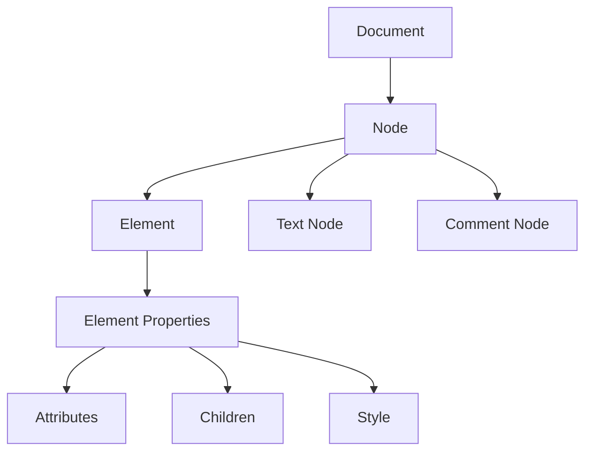
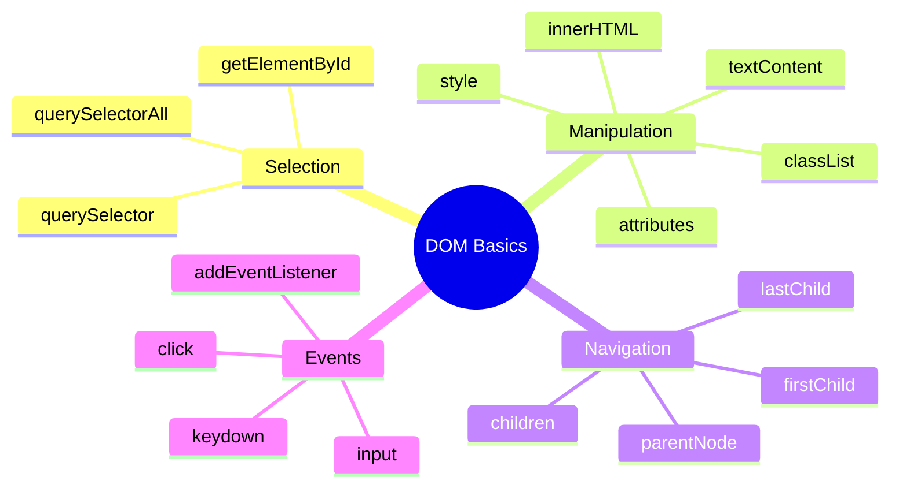

# Block 7: DOM in JavaScript

> **Educational content by Bashar Alwarad**  
> Manipulating HTML documents with the Document Object Model (DOM).

## Connect with Me [](https://www.linkedin.com/in/bashar-alwarad-2a960b1b6/)

---

## What is the DOM?

The **DOM** (Document Object Model) is an interface that lets JavaScript interact with HTML documents. It represents the page as a tree of objects, allowing you to read, create, and modify elements dynamically.

### Why the DOM?

- 🎨 Change HTML content dynamically.
- 🖱️ Respond to user interactions (clicks, typing, etc.).
- 🎯 Add/remove elements from the page.
- 📝 Update styles and attributes in real-time.

---

## 📚 Core DOM Concepts

### 1. Document

The **Document** interface represents the entire HTML document. It's your entry point to access and manipulate page elements.

```javascript
// Access the document
console.log(document.title); // Get page title
console.log(document.URL); // Get page URL

// The document provides methods to query elements
let elem = document.getElementById('myId');
```

### 2. Node

A **Node** is the fundamental building block of the DOM. Everything in the DOM is a node: elements, text, attributes, comments, etc.

```javascript
// Every element is a node
const div = document.querySelector('div');
console.log(div.nodeType); // 1 (element node)

// Access node properties
console.log(div.nodeName); // "DIV"
console.log(div.parentNode); // parent element
```

### 3. Element

An **Element** is a specific type of node representing an HTML tag like `<div>`, `<p>`, `<button>`, etc. Elements have properties for attributes, content, and children.

```html
<p id="greeting">Hello!</p>
```

```javascript
const para = document.getElementById('greeting');

// Access/modify content
console.log(para.textContent); // "Hello!"
para.textContent = 'Hi there!';

// Access/modify attributes
para.setAttribute('class', 'highlight');
console.log(para.getAttribute('id')); // "greeting"
```

### 4. NodeList

A **NodeList** is a collection of nodes (similar to an array). It's returned by methods like `querySelectorAll()`.

```javascript
const items = document.querySelectorAll('.item');
console.log(items.length); // number of items

// Loop through NodeList
items.forEach((item) => {
  console.log(item.textContent);
});
```

---



---

## 📚 Selecting Elements

### getElementById()

Returns a single element by its `id` (or `null` if not found).

```html
<div id="header">Welcome</div>
```

```javascript
const header = document.getElementById('header');
console.log(header.textContent); // "Welcome"
```

### getElementsByClassName()

Returns a **live** HTMLCollection of elements with the specified class.

```html
<p class="item">Item 1</p>
<p class="item">Item 2</p>
```

```javascript
const items = document.getElementsByClassName('item');
console.log(items.length); // 2

// HTMLCollection updates automatically when DOM changes
```

### getElementsByTagName()

Returns a **live** HTMLCollection of all elements with the specified tag.

```javascript
const allDivs = document.getElementsByTagName('div');
console.log(allDivs.length);
```

### querySelector()

Returns the **first** element matching a CSS selector.

```html
<div class="box">Box 1</div>
<div class="box">Box 2</div>
<button id="submit">Submit</button>
```

```javascript
const first = document.querySelector('.box');
console.log(first.textContent); // "Box 1"

const btn = document.querySelector('#submit');
console.log(btn.textContent); // "Submit"
```

### querySelectorAll()

Returns a **static** NodeList of all elements matching a CSS selector.

```javascript
const boxes = document.querySelectorAll('.box');
boxes.forEach((box) => {
  console.log(box.textContent);
});
// Output: "Box 1", "Box 2"
```

---

## Live vs. Static Collections

| Method                   | Type           | Auto-updates |
| ------------------------ | -------------- | ------------ |
| `getElementById`         | Single         | N/A          |
| `getElementsByClassName` | HTMLCollection | ✅ Live      |
| `getElementsByTagName`   | HTMLCollection | ✅ Live      |
| `querySelector`          | Single         | N/A          |
| `querySelectorAll`       | NodeList       | ❌ Static    |

---

## 📚 Manipulating Elements

### Content & Text

```javascript
const div = document.querySelector('#content');

// textContent: plain text only
div.textContent = 'Hello World';

// innerHTML: HTML markup
div.innerHTML = '<strong>Bold text</strong>';
```

### Attributes

```javascript
const link = document.querySelector('a');

// Get attribute
console.log(link.getAttribute('href'));

// Set attribute
link.setAttribute('href', 'https://google.com');

// Remove attribute
link.removeAttribute('title');
```

### Classes

```javascript
const btn = document.querySelector('button');

// Add class
btn.classList.add('active');

// Remove class
btn.classList.remove('disabled');

// Toggle class
btn.classList.toggle('highlight');

// Check if has class
if (btn.classList.contains('active')) {
  console.log('Button is active');
}
```

### Style (Inline CSS)

```javascript
const box = document.querySelector('.box');

// Modify inline styles
box.style.color = 'red';
box.style.backgroundColor = 'yellow';
box.style.padding = '10px';
box.style.borderRadius = '5px';
```

---

## 📚 Working with Children

```html
<ul id="list">
  <li>Item 1</li>
  <li>Item 2</li>
  <li>Item 3</li>
</ul>
```

```javascript
const list = document.getElementById('list');

// Access children
console.log(list.children.length); // 3
console.log(list.firstElementChild.textContent); // "Item 1"
console.log(list.lastElementChild.textContent); // "Item 3"

// Add child element
const newItem = document.createElement('li');
newItem.textContent = 'Item 4';
list.appendChild(newItem);

// Remove child
const first = list.firstElementChild;
list.removeChild(first);
```

---

## 📚 Event Handling with EventTarget

The **EventTarget** interface allows elements to listen for and respond to events (clicks, typing, mouse movement, etc.).

### addEventListener()

Registers an event handler for a specified event type.

```html
<button id="myBtn">Click me!</button>
```

```javascript
const btn = document.getElementById('myBtn');

// Add event listener
btn.addEventListener('click', function () {
  console.log('Button clicked!');
});

// With arrow function
btn.addEventListener('click', () => {
  console.log('Clicked again!');
});
```

### Common Events

```javascript
const input = document.querySelector('input');
const div = document.querySelector('div');

// Click
input.addEventListener('click', () => console.log('Clicked'));

// Mouse events
div.addEventListener('mouseenter', () => console.log('Mouse entered'));
div.addEventListener('mouseleave', () => console.log('Mouse left'));

// Keyboard events
input.addEventListener('keydown', (e) => console.log('Key pressed:', e.key));
input.addEventListener('keyup', () => console.log('Key released'));

// Input event
input.addEventListener('input', (e) => console.log('Value:', e.target.value));

// Form submit
document.querySelector('form').addEventListener('submit', (e) => {
  e.preventDefault(); // prevent page reload
  console.log('Form submitted');
});
```

### Event Object

When an event fires, a callback function receives an **event object** with useful properties:

```javascript
btn.addEventListener('click', (event) => {
  console.log(event.type); // 'click'
  console.log(event.target); // the element clicked
  console.log(event.key); // (for keyboard events)
});
```

---

## 📚 Complete Example

```html
<!-- HTML -->
<div id="app">
  <input type="text" id="nameInput" placeholder="Enter your name" />
  <button id="greetBtn">Greet</button>
  <p id="output"></p>
</div>
```

```javascript
// JavaScript
const input = document.getElementById('nameInput');
const btn = document.getElementById('greetBtn');
const output = document.getElementById('output');

btn.addEventListener('click', () => {
  const name = input.value;
  output.textContent = `Hello, ${name}!`;
  output.style.color = 'blue';
  output.classList.add('highlight');
});
```

---

## Quick Summary



### Key Takeaways:

- ✅ Document is your entry point to the DOM.
- ✅ Use `querySelector` / `querySelectorAll` for flexible element selection.
- ✅ Modify elements with `textContent`, `innerHTML`, `classList`, `style`.
- ✅ Use `addEventListener` to respond to user interactions.
- ✅ Event objects contain useful info about what happened.
- ✅ Always use `e.preventDefault()` to stop default behaviors when needed.

---
