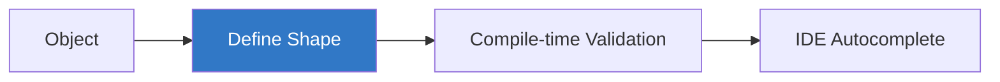
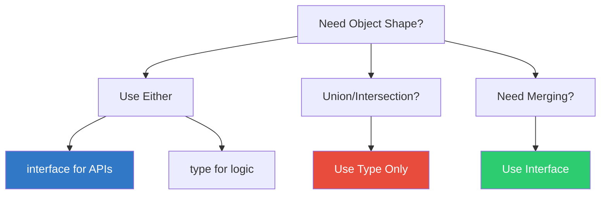

# 🏗️ Object Types in TypeScript

> **Educational content by Bashar Alwarad**  
> Master object shapes with inline types, interfaces, and type aliases.

## Connect with Me [](https://www.linkedin.com/in/bashar-alwarad-2a960b1b6/)

---

## 📚 Table of Contents

- [🏗️ Object Types in TypeScript](#️-object-types-in-typescript)
  - [Connect with Me ](#connect-with-me-)
  - [📚 Table of Contents](#-table-of-contents)
  - [🎯 Why Type Objects?](#-why-type-objects)
  - [🔤 Inline Object Types](#-inline-object-types)
  - [🔍 Type Inference](#-type-inference)
  - [❓ Optional Properties](#-optional-properties)
  - [🔑 Index Signatures](#-index-signatures)
  - [📦 Type Aliases](#-type-aliases)
  - [🎭 Interfaces](#-interfaces)
  - [⚖️ Type vs Interface](#️-type-vs-interface)
  - [🔗 Extending Objects](#-extending-objects)
  - [📌 Quick Reference](#-quick-reference)
  - [💡 Best Practices](#-best-practices)

---

## 🎯 Why Type Objects?

Objects are fundamental to JavaScript. Typing them prevents property typos and ensures consistency.



---

## 🔤 Inline Object Types

Define object properties inline with type annotations:

```typescript
const car: { type: string; model: string; year: number } = {
  type: 'Toyota',
  model: 'Corolla',
  year: 2009,
};
```

TypeScript validates structure and types:

```typescript
car.type = 'Ford'; // ✅ OK
car.year = '2010'; // ❌ Error: Type 'string' is not assignable to type 'number'
car.color = 'red'; // ❌ Error: Property 'color' does not exist
```

---

## 🔍 Type Inference

TypeScript infers object shape from initial values:

```typescript
const user = {
  name: 'Alice', // infers: string
  age: 30, // infers: number
  active: true, // infers: boolean
};

user.name = 'Bob'; // ✅ OK
user.age = 25; // ✅ OK
user.age = 'twenty'; // ❌ Error: Type 'string' is not assignable to type 'number'
```

---

## ❓ Optional Properties

Mark properties as optional with `?`:

```typescript
const user: {
  name: string;
  age?: number; // optional
  email?: string; // optional
} = {
  name: 'Alice',
};

// All valid:
user.age = 30;
user.email = 'alice@example.com';
console.log(user.age); // 30 or undefined
```

---

## 🔑 Index Signatures

Allow properties with unknown names (dictionary-like):

```typescript
const scores: { [name: string]: number } = {};

scores.Alice = 95; // ✅ OK
scores.Bob = 87; // ✅ OK
scores.Charlie = 'A'; // ❌ Error: Type 'string' is not assignable to type 'number'
```

Mix known and dynamic properties:

```typescript
interface Config {
  name: string;
  [key: string]: string | number;
}

const cfg: Config = {
  name: 'AppConfig',
  timeout: 5000,
  retries: 3,
};
```

---

## 📦 Type Aliases

Create reusable type names:

```typescript
type Car = {
  type: string;
  model: string;
  year: number;
};

const myCar: Car = {
  type: 'Toyota',
  model: 'Corolla',
  year: 2009,
};

const anotherCar: Car = {
  type: 'Honda',
  model: 'Civic',
  year: 2015,
};
```

**Type aliases can also represent unions and other shapes:**

```typescript
type Status = 'success' | 'error' | 'pending';
type Id = string | number;

let response: Status = 'success';
let userId: Id = 123; // or "abc-123"
```

---

## 🎭 Interfaces

Similar to type aliases, but only for objects. Interfaces are ideal for defining public APIs and object contracts:

```typescript
interface User {
  id: number;
  name: string;
  email: string;
  active?: boolean;
}

const user: User = {
  id: 1,
  name: 'Alice',
  email: 'alice@example.com',
};
```

**Interface merging** (declaration merging):

```typescript
interface Animal {
  name: string;
}

interface Animal {
  age: number;
}

// Automatically merged
const dog: Animal = {
  name: 'Fido',
  age: 5,
};
```

---

## ⚖️ Type vs Interface



| Feature                 | Type          | Interface           |
| ----------------------- | ------------- | ------------------- |
| **Define objects**      | ✅            | ✅                  |
| **Unions**              | ✅            | ❌                  |
| **Intersections**       | ✅            | ❌                  |
| **Declaration merging** | ❌            | ✅                  |
| **Extend other types**  | ✅ (with `&`) | ✅ (with `extends`) |
| **Implement in class**  | ✅            | ✅                  |

**Best Practice:**

- **Interface** → Object shapes, public APIs
- **Type** → Unions, intersections, logic types

---

## 🔗 Extending Objects

**Type aliases with intersection (`&`):**

```typescript
type Animal = { name: string };
type Bear = Animal & { honey: boolean };

const bear: Bear = {
  name: 'Winnie',
  honey: true,
};
```

**Interfaces with `extends`:**

```typescript
interface Shape {
  width: number;
  height: number;
}

interface ColoredShape extends Shape {
  color: string;
}

const rect: ColoredShape = {
  width: 10,
  height: 20,
  color: 'red',
};
```

---

## 📌 Quick Reference

| Concept             | Syntax                                         | Use Case                        |
| ------------------- | ---------------------------------------------- | ------------------------------- |
| **Inline Type**     | `{ name: string; age: number }`                | Quick, local types              |
| **Type Alias**      | `type User = { name: string; age: number }`    | Reusable, unions, intersections |
| **Interface**       | `interface User { name: string; age: number }` | APIs, public contracts, merging |
| **Optional**        | `{ age?: number }`                             | Properties that may not exist   |
| **Index Signature** | `{ [key: string]: number }`                    | Dynamic property names          |
| **Union Type**      | `type Status = "ok" \| "error"`                | Limited valid values            |
| **Intersection**    | `type Both = A & B`                            | Combine multiple types          |
| **Extend**          | `interface B extends A {}`                     | Build on existing shape         |

---

## 💡 Best Practices

✅ **Use `interface` for object contracts**  
✅ **Use `type` for unions and intersections**  
✅ **Mark optional fields with `?`**  
✅ **Document your types with comments**  
✅ **Keep object types focused and small**  
✅ **Avoid `any` — use unions or `unknown` instead**  
✅ **Use `readonly` for immutable props**

```typescript
interface ApiResponse {
  readonly status: number;
  readonly data: string;
}
```

---

**Happy Learning! 🚀**

_Educational content by Bashar Alwarad - Software Engineering Course_
