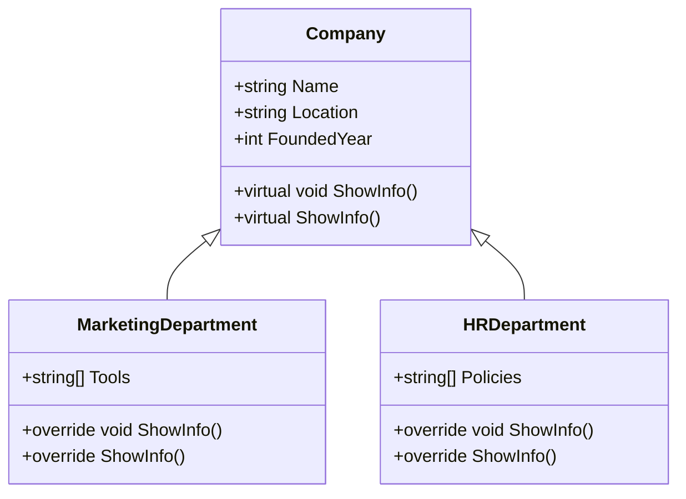
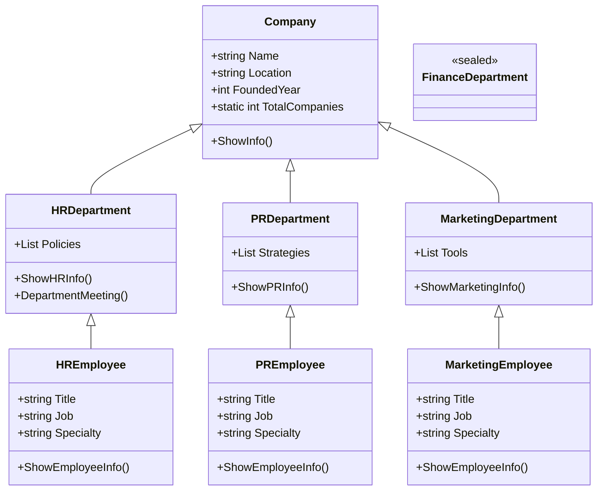
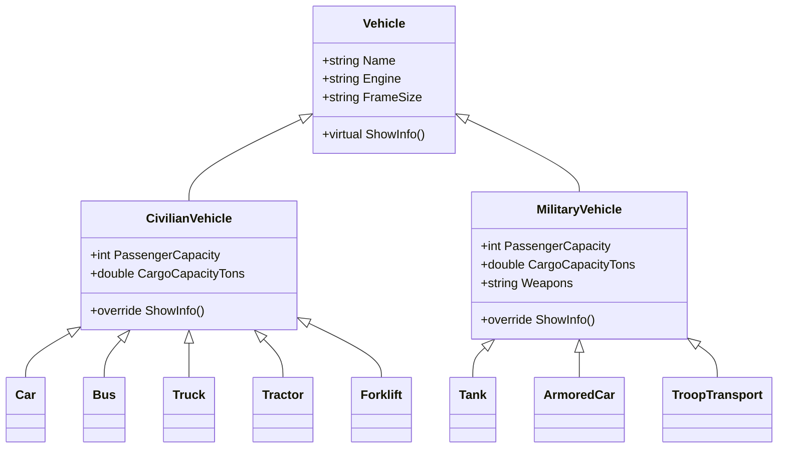

# 30_inheritance

## Inheritance in C# (Company Example)

Inheritance allows you to create a new class (derived class) that reuses, extends, or modifies the behavior of another class (base class). This is a core concept in object-oriented programming and helps organize code, avoid duplication, and model real-world relationships.

---

## Scenario: Company Structure

We'll model a company with several departments. Each department is a subclass of `Company`, and each department has its own unique features. Then, each department has its own `Employee` subclass, with specific roles and specialties.

### Step 1: Base Class - Company

- Main properties: Name, Location, FoundedYear
- Method: ShowInfo()

### Step 2: Department Classes (inherit from Company)

- HRDepartment: manages employees, has unique HR policies
- PRDepartment: manages public relations, has unique PR strategies
- MarketingDepartment: manages marketing campaigns, has unique marketing tools

### Step 3: Employee Classes (inherit from their Department)

- HREmployee: title, job, specialty (e.g., Recruiter, Payroll)
- PREmployee: title, job, specialty (e.g., Media Manager, Event Coordinator)
- MarketingEmployee: title, job, specialty (e.g., Content Creator, SEO Specialist)

---

## Advanced Inheritance Concepts in C#

### Abstract Classes and Methods

- **abstract class**: Cannot be instantiated. Used as a base for other classes.
- **abstract method**: Must be overridden in derived classes.

```csharp
abstract class Department
{
    public abstract void DepartmentMeeting();
}

class HRDepartment : Department
{
    public override void DepartmentMeeting()
    {
        Console.WriteLine("HR Department Meeting");
    }
}
```

### Virtual and Override

- **virtual method**: Can be overridden in derived classes.
- **override**: Used to provide a new implementation in a derived class.

```csharp
class Company
{
    public virtual void ShowInfo() { Console.WriteLine("Company Info"); }
}
class MarketingDepartment : Company
{
    public override void ShowInfo() { Console.WriteLine("Marketing Department Info"); }
}
```

Here's a focused Mermaid diagram that visualizes how a virtual method in a base class can be overridden by a derived class (runtime polymorphism):



### Static Members

- **static**: Belongs to the class, not to any instance. Shared by all objects.

```csharp
class Company
{
    public static int TotalCompanies = 0;
    public Company() { TotalCompanies++; }
}
```

### Sealed Classes and Methods

- **sealed class**: Cannot be inherited.
- **sealed method**: Cannot be overridden further.

```csharp
sealed class FinanceDepartment : Company { }

class HRDepartment : Company
{
    public sealed override void ShowInfo() { Console.WriteLine("HR Info"); }
}
```

---

## Mermaid Diagram: Inheritance Structure



---

## Inheritance vs. Composition

- **Inheritance**: "Is a" relationship. Use when a class should extend another class's behavior.
- **Composition**: "Has a" relationship. Use when a class should contain or use another class.

**Example:**

```csharp
// Inheritance
class Car : Vehicle { }

// Composition
class Engine { }
class Car
{
    private Engine engine; // Car has an Engine
}
```

- Inheritance is best for shared behavior and polymorphism.
- Composition is best for flexibility and code reuse without tight coupling.

---

## Vehicle example: hierarchy and usage

Below is an expanded example that builds a small vehicle class hierarchy. We add a base `Vehicle` with a couple of shared properties (`Engine`, `FrameSize`) and then split into `CivilianVehicle` and `MilitaryVehicle`. From each of those we derive concrete vehicle types such as `Car`, `Bus`, `Truck`, `Tractor`, `Forklift` (civilian) and `Tank`, `ArmoredCar`, `TroopTransport` (military).



And here is a minimal C# example you can copy into a `.cs` file or paste into a small console project to try it out. It demonstrates inheritance, properties, and virtual/override behavior. When you call `ShowInfo()` on a `Vehicle`-typed reference, the runtime invokes the overridden implementation on the concrete instance (polymorphism).

```csharp
using System;

// Base vehicle with shared properties
public class Vehicle
{
    public static int TotalCars = 0;
    public string Name { get; set; }
    public string Engine { get; set; }
    public string FrameSize { get; set; }

    public Vehicle(string name, string engine, string frameSize)
    {
        Name = name;
        Engine = engine;
        FrameSize = frameSize;
        TotalCars++;
    }

    public virtual void ShowInfo()
    {
        Console.WriteLine($"{Name} (Engine: {Engine}, Frame: {FrameSize})");
    }
}

// Split into civilian and military categories
public class CivilianVehicle : Vehicle
{
    // Civilian vehicles often have passenger/cargo data
    public int PassengerCapacity { get; set; }
    public double CargoCapacityTons { get; set; }

    public CivilianVehicle(string name, string engine, string frameSize,
        int passengerCapacity = 0, double cargoCapacityTons = 0)
        : base(name, engine, frameSize)
    {
        PassengerCapacity = passengerCapacity;
        CargoCapacityTons = cargoCapacityTons;
    }

    public override void ShowInfo()
    {
        Console.WriteLine($"Civilian {Name} - Engine: {Engine}, Frame: {FrameSize}, Passengers: {PassengerCapacity}, CargoTons: {CargoCapacityTons}");
    }
}

public class MilitaryVehicle : Vehicle
{
    // Military vehicles also may carry passengers/cargo and usually have weapons
    public int PassengerCapacity { get; set; }
    public double CargoCapacityTons { get; set; }
    public string Weapons { get; set; }

    public MilitaryVehicle(string name, string engine, string frameSize,
        int passengerCapacity = 0, double cargoCapacityTons = 0, string weapons = null)
        : base(name, engine, frameSize)
    {
        PassengerCapacity = passengerCapacity;
        CargoCapacityTons = cargoCapacityTons;
        Weapons = weapons ?? string.Empty;
    }

    public override void ShowInfo()
    {
        var weapons = !string.IsNullOrEmpty(Weapons) ? Weapons : "None";
        Console.WriteLine($"Military {Name} - Engine: {Engine}, Frame: {FrameSize}, Passengers: {PassengerCapacity}, CargoTons: {CargoCapacityTons}, Weapons: {weapons}");
    }
}

// Civilian types
public class Car : CivilianVehicle
{
    public Car(string name, string engine, string frameSize,
        int passengerCapacity = 0, double cargoCapacityTons = 0)
        : base(name, engine, frameSize, passengerCapacity, cargoCapacityTons) { }

    public override void ShowInfo() => Console.WriteLine($"Car: {Name} - Engine: {Engine}, Frame: {FrameSize}, Passengers: {PassengerCapacity}, CargoTons: {CargoCapacityTons}");
}

public class Bus : CivilianVehicle
{
    public Bus(string name, string engine, string frameSize,
        int passengerCapacity = 0, double cargoCapacityTons = 0)
        : base(name, engine, frameSize, passengerCapacity, cargoCapacityTons) { }

    public override void ShowInfo() => Console.WriteLine($"Bus: {Name} - Engine: {Engine}, Frame: {FrameSize}, Passengers: {PassengerCapacity}, CargoTons: {CargoCapacityTons}");
}

public class Truck : CivilianVehicle
{
    public Truck(string name, string engine, string frameSize,
        int passengerCapacity = 0, double cargoCapacityTons = 0)
        : base(name, engine, frameSize, passengerCapacity, cargoCapacityTons) { }

    public override void ShowInfo() => Console.WriteLine($"Truck: {Name} - Engine: {Engine}, Frame: {FrameSize}, Passengers: {PassengerCapacity}, CargoTons: {CargoCapacityTons}");
}

public class Tractor : CivilianVehicle
{
    public Tractor(string name, string engine, string frameSize,
        int passengerCapacity = 0, double cargoCapacityTons = 0)
        : base(name, engine, frameSize, passengerCapacity, cargoCapacityTons) { }

    public override void ShowInfo() => Console.WriteLine($"Tractor: {Name} - Engine: {Engine}, Frame: {FrameSize}, Passengers: {PassengerCapacity}, CargoTons: {CargoCapacityTons}");
}

public class Forklift : CivilianVehicle
{
    public Forklift(string name, string engine, string frameSize,
        int passengerCapacity = 0, double cargoCapacityTons = 0)
        : base(name, engine, frameSize, passengerCapacity, cargoCapacityTons) { }

    public override void ShowInfo() => Console.WriteLine($"Forklift: {Name} - Engine: {Engine}, Frame: {FrameSize}, Passengers: {PassengerCapacity}, CargoTons: {CargoCapacityTons}");
}

// Military types
public sealed class Tank : MilitaryVehicle
{
    public Tank(string name, string engine, string frameSize,
        int passengerCapacity = 0, double cargoCapacityTons = 0, string weapons = null)
        : base(name, engine, frameSize, passengerCapacity, cargoCapacityTons, weapons) { }

    public override void ShowInfo() => Console.WriteLine($"Tank: {Name} - Engine: {Engine}, Frame: {FrameSize}, Passengers: {PassengerCapacity}, CargoTons: {CargoCapacityTons}, Weapons: {(!string.IsNullOrEmpty(Weapons)?Weapons:"None")}");
}

public class ArmoredCar : MilitaryVehicle
{
    public ArmoredCar(string name, string engine, string frameSize,
        int passengerCapacity = 0, double cargoCapacityTons = 0, string weapons = null)
        : base(name, engine, frameSize, passengerCapacity, cargoCapacityTons, weapons) { }

    public override void ShowInfo() => Console.WriteLine($"ArmoredCar: {Name} - Engine: {Engine}, Frame: {FrameSize}, Passengers: {PassengerCapacity}, CargoTons: {CargoCapacityTons}, Weapons: {(!string.IsNullOrEmpty(Weapons)?Weapons:"None")}");
}

public class TroopTransport : MilitaryVehicle
{
    public TroopTransport(string name, string engine, string frameSize,
        int passengerCapacity = 0, double cargoCapacityTons = 0, string weapons = null)
        : base(name, engine, frameSize, passengerCapacity, cargoCapacityTons, weapons) { }

    public override void ShowInfo() => Console.WriteLine($"TroopTransport: {Name} - Engine: {Engine}, Frame: {FrameSize}, Passengers: {PassengerCapacity}, CargoTons: {CargoCapacityTons}, Weapons: {(!string.IsNullOrEmpty(Weapons)?Weapons:"None")}");
}

// Example usage (a simple Main method)
public class Program
{
    public static void Main()
    {
        new Car("FamilyCar", "I4", "Medium", passengerCapacity: 5).ShowInfo();
        new Bus("CityBus", "Diesel V6", "Large", passengerCapacity:40).ShowInfo();
        new Truck("Hauler", "Diesel V8", "Large", cargoCapacityTons:12.5).ShowInfo();
        new Tractor("FarmTractor", "Diesel I3", "Large").ShowInfo();
        new Forklift("WarehouseLift", "Electric", "Small", cargoCapacityTons:1.2).ShowInfo();
        new Tank("Abrams", "Gas Turbine", "Huge", passengerCapacity:4, cargoCapacityTons:2.0, weapons:"120mm cannon, MG").ShowInfo();
        new ArmoredCar("APC", "Diesel V6", "Large", passengerCapacity:8, weapons:"7.62mm MG").ShowInfo();
        new TroopTransport("TroopCarrier", "Diesel V8", "Large", passengerCapacity:20).ShowInfo();
        Console.WriteLine(Vehicle.TotalCars);
    }
}
```

Notes & assumptions:

- I standardized class names (e.g., `Truck` instead of "trucktor") and used `TroopTransport` for troop transport vehicles.
- `Engine` and `FrameSize` are strings in this simple example for clarity; you can convert them to enums or specific types in a larger project.
- This example is intentionally small and designed to show inheritance, properties, and polymorphism.
