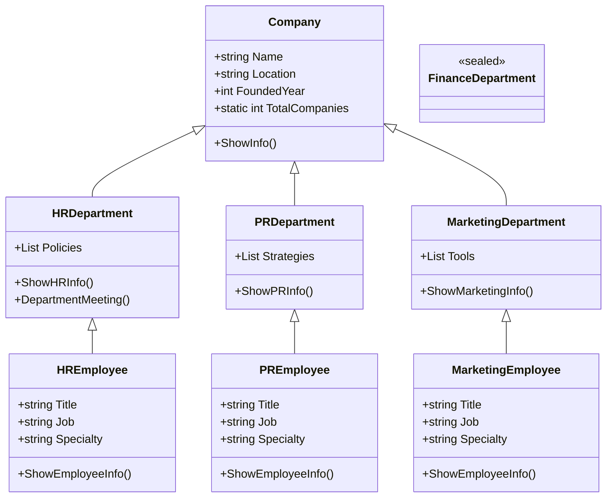

# 30_inheritance

## Inheritance in C# (Company Example)

Inheritance allows you to create a new class (derived class) that reuses, extends, or modifies the behavior of another class (base class). This is a core concept in object-oriented programming and helps organize code, avoid duplication, and model real-world relationships.

---

## Scenario: Company Structure

We'll model a company with several departments. Each department is a subclass of `Company`, and each department has its own unique features. Then, each department has its own `Employee` subclass, with specific roles and specialties.

### Step 1: Base Class - Company

- Main properties: Name, Location, FoundedYear
- Method: ShowInfo()

### Step 2: Department Classes (inherit from Company)

- HRDepartment: manages employees, has unique HR policies
- PRDepartment: manages public relations, has unique PR strategies
- MarketingDepartment: manages marketing campaigns, has unique marketing tools

### Step 3: Employee Classes (inherit from their Department)

- HREmployee: title, job, specialty (e.g., Recruiter, Payroll)
- PREmployee: title, job, specialty (e.g., Media Manager, Event Coordinator)
- MarketingEmployee: title, job, specialty (e.g., Content Creator, SEO Specialist)

---

## Advanced Inheritance Concepts in C#

### Abstract Classes and Methods

- **abstract class**: Cannot be instantiated. Used as a base for other classes.
- **abstract method**: Must be overridden in derived classes.

```csharp
abstract class Department
{
    public abstract void DepartmentMeeting();
}

class HRDepartment : Department
{
    public override void DepartmentMeeting()
    {
        Console.WriteLine("HR Department Meeting");
    }
}
```

### Virtual and Override

- **virtual method**: Can be overridden in derived classes.
- **override**: Used to provide a new implementation in a derived class.

```csharp
class Company
{
    public virtual void ShowInfo() { Console.WriteLine("Company Info"); }
}
class MarketingDepartment : Company
{
    public override void ShowInfo() { Console.WriteLine("Marketing Department Info"); }
}
```

### Static Members

- **static**: Belongs to the class, not to any instance. Shared by all objects.

```csharp
class Company
{
    public static int TotalCompanies = 0;
    public Company() { TotalCompanies++; }
}
```

### Sealed Classes and Methods

- **sealed class**: Cannot be inherited.
- **sealed method**: Cannot be overridden further.

```csharp
sealed class FinanceDepartment : Company { }

class HRDepartment : Company
{
    public sealed override void ShowInfo() { Console.WriteLine("HR Info"); }
}
```

---

## Mermaid Diagram: Inheritance Structure



---

## Inheritance vs. Composition

- **Inheritance**: "Is a" relationship. Use when a class should extend another class's behavior.
- **Composition**: "Has a" relationship. Use when a class should contain or use another class.

**Example:**

```csharp
// Inheritance
class Car : Vehicle { }

// Composition
class Engine { }
class Car
{
    private Engine engine; // Car has an Engine
}
```

- Inheritance is best for shared behavior and polymorphism.
- Composition is best for flexibility and code reuse without tight coupling.

---

## Teacher's Step-by-Step Guide: Teaching Classes & Inheritance with the Company Project

1. **Introduce the Concept of Classes**

   - Explain what a class is and why we use it.
   - Show a simple class (e.g., Company) with properties and a method.

2. **Demonstrate Creating Objects**

   - Show how to create an object from a class and access its members.

3. **Explain Inheritance**

   - Describe how a class can inherit from another class (e.g., HRDepartment inherits from Company).
   - Show how inherited classes can add their own properties and methods.

4. **Add More Departments**

   - Create PRDepartment and MarketingDepartment, each with unique properties (as strings).
   - Discuss the benefit of code reuse and organization.

5. **Introduce Abstract Classes and Methods**

   - Explain what abstract means and why we use it.
   - Show how Department is abstract and how each department implements DepartmentMeeting().

6. **Teach Virtual, Override, and Sealed**

   - Show how virtual methods can be overridden in derived classes.
   - Explain sealed methods/classes and why you might use them.

7. **Discuss Static Members**

   - Explain static fields (e.g., TotalCompanies) and how they are shared across all objects.

8. **Add Employees**

   - Create employee classes for each department, inheriting from their department.
   - Add properties for title, job, and specialty.

9. **Introduce Composition**

   - Explain the difference between inheritance (is-a) and composition (has-a).
   - Show how each department "has" equipment (as a string property).

10. **Walk Through the Main Program**

    - Show how to create and use all classes and demonstrate their relationships.
    - Encourage students to add their own departments, employees, or equipment.

11. **Review and Practice**
    - Ask students to explain the difference between inheritance and composition.
    - Have students modify or extend the project to reinforce learning.

---

**Tip:** Encourage students to draw their own class diagrams and experiment with adding new features to the project!
