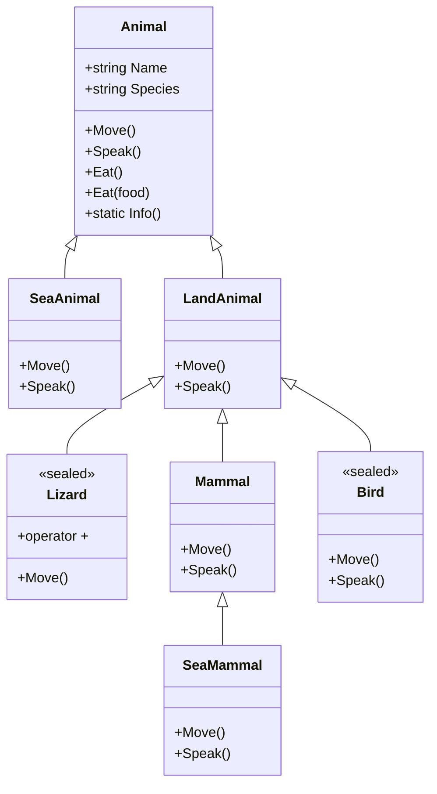

# 31_polymorphism

## Polymorphism in C# (Evolution Example)

Polymorphism means "many forms". In C#, it allows you to use a single interface (such as a base class or method) to represent different types of objects. The most common use is with method overriding in inheritance.

---

## Evolution Example: Animal Hierarchy

We'll model evolution using animals:

- **Animal** (base class, with Name and Species properties)
  - **SeaAnimal** (inherits Animal)
  - **LandAnimal** (inherits Animal)
    - **Lizard** (inherits LandAnimal, sealed)
    - **Mammal** (inherits LandAnimal)
      - **SeaMammal** (inherits Mammal)
    - **Bird** (inherits LandAnimal, sealed)

Each class will override methods like Move() and Speak(). Some classes will be sealed to prevent further inheritance. We'll also show static methods for class-level behavior. Each animal can have a Name or Species for more realistic output.

---

## Mermaid Diagram: Animal Evolution Program Structure



---

### Method Overriding (Run-time Polymorphism)

- Use when you want derived classes to provide a specific implementation of a method defined in a base class.
- Enables dynamic behavior based on the actual object type at runtime. Essential for flexible, extensible code.
- **How:** Use `virtual` in the base class and `override` in derived classes.

```csharp
class Animal {
    public virtual void Speak() { Console.WriteLine("Animal sound"); }
}
class Bird : Animal {
    public override void Speak() { Console.WriteLine("Bird says tweet"); }
}
Animal a = new Bird("Eddie", "Eagle");
a.Speak(); // Output: Bird says tweet
```

### Method Hiding (new keyword)

- Use when you want to define a new method in a derived class with the same name as in the base class, but do not want to override the base method.
- Useful when you want to change the behavior for the derived class, but still allow the base class method to exist and be called via a base reference.
- **How:** Use `new` in the derived class to hide a base class method.

```csharp
class Animal {
    public void Speak() { Console.WriteLine("Animal sound"); }
}
class LandAnimal : Animal {
    public new void Speak() { Console.WriteLine("Land animal makes a sound"); }
}
LandAnimal la = new LandAnimal("Leo", "Lion");
la.Speak(); // Output: Land animal makes a sound
((Animal)la).Speak(); // Output: Animal sound
```

### Method Overloading (Compile-time Polymorphism)

- Use when you want multiple methods with the same name but different parameters in the same class.
- Improves code readability and usability by allowing the same method name for similar actions with different data.
- **How:** Define multiple methods with the same name but different parameter lists.

```csharp
class Animal {
    public void Eat() { Console.WriteLine("Animal eats"); }
    public void Eat(string food) { Console.WriteLine($"Animal eats {food}"); }
}
Animal a = new Animal("Generic", "Animal");
a.Eat(); // Output: Animal eats
a.Eat("plants"); // Output: Animal eats plants
```

### Operator Overloading

- Use when you want to define how operators (+, -, etc.) work for your own classes.
- Makes custom types easier and more natural to use, especially for mathematical or collection-like classes.
- **How:** Use the `operator` keyword in your class.

```csharp
sealed class Lizard : LandAnimal {
    public Lizard(string name) : base(name, "Lizard") { }
    public static Lizard operator +(Lizard a, Lizard b) {
        Console.WriteLine($"{a.Name} and {b.Name} the Lizards meet!");
        return new Lizard($"Child of {a.Name} and {b.Name}");
    }
}
Lizard l1 = new Lizard("Larry");
Lizard l2 = new Lizard("Lizzy");
var l3 = l1 + l2; // Output: Larry and Lizzy the Lizards meet!
```

### Sealed Classes and Methods

- Use when you want to prevent further inheritance or overriding.
- Ensures the class or method cannot be changed by further derived classes, which can improve security and performance.
- **How:** Use the `sealed` keyword.

```csharp
sealed class Bird : LandAnimal {
    public Bird(string name, string species) : base(name, species) { }
    public override void Move() { Console.WriteLine($"{Name} the {Species} flies"); }
}
// Bird cannot be inherited further
```

### Static Methods

- Use when a method should belong to the class itself, not to any instance.
- Useful for utility or helper methods, or to represent behavior common to all instances.
- **How:** Use the `static` keyword.

```csharp
class Animal {
    public static void Info() { Console.WriteLine("All animals can move and make sounds."); }
}
Animal.Info(); // Output: All animals can move and make sounds.
```

---

## Overriding vs. Hiding

- **Overriding**
  - When you want derived classes to provide a specific implementation of a base class method.
  - Enables dynamic, run-time behavior based on the actual object type.
- **Hiding**
  - When you want to define a new method in a derived class with the same name as in the base class, but not override it.
  - Useful for changing behavior in the derived class while still allowing the base method to exist.

## Method Overloading

- When you want to provide multiple ways to call a method with different parameters.
- Improves usability and flexibility.

## Operator Overloading

- When you want to make your class work naturally with operators.
- Makes custom types easier to use and more expressive.

## Compile-time vs. Run-time Polymorphism

- **Compile-time:** Method overloading, operator overloading. Decided by the compiler.
- **Run-time:** Method overriding. Decided at runtime based on the object's type.

---
