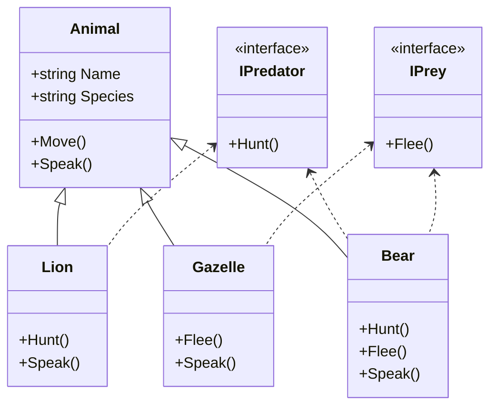

animal.Speak(); // Output: Woof!

# 33_interface

## Interfaces in C#

An interface defines a contract for what a class can do, without specifying how it does it. Interfaces contain only method signatures, properties, events, or indexers—no implementation. Any class that implements an interface must provide the actual code for its members.

### Why Use Interfaces?

- To achieve abstraction (focus on what, not how)
- To allow multiple inheritance of behavior (a class can implement multiple interfaces)
- To define common behavior for unrelated classes
- To enable flexible, decoupled code (e.g., for dependency injection, testing, or plugins)

### When to Use Interfaces

- When you want to define a contract for classes from different hierarchies
- When you want to allow multiple behaviors (e.g., a class can be both a predator and prey)
- When you want to enable polymorphism without forcing inheritance

### How to Use Interfaces

1. Define the interface with the `interface` keyword.
2. Implement the interface in a class using a colon `:`.
3. Provide concrete implementations for all interface members.

### Interface vs. Class

| Feature        | Interface            | Class               |
| -------------- | -------------------- | ------------------- |
| Implementation | No (only signatures) | Yes (can have code) |
| Inheritance    | Multiple allowed     | Single inheritance  |
| Constructors   | Not allowed          | Allowed             |
| Fields         | Not allowed          | Allowed             |
| Use for        | Behavior contract    | Data + behavior     |

---

## Example: Animal Hierarchy with Interfaces

We'll use the animal evolution example, but add interfaces for predator and prey behaviors. This shows how interfaces can be used alongside class inheritance to add flexible, reusable behaviors.

### Code Example

```csharp
interface IPredator { void Hunt(); }
interface IPrey { void Flee(); }

class Animal { /* ...base class... */ }
class Lion : Animal, IPredator { /* ... */ }
class Gazelle : Animal, IPrey { /* ... */ }
class Bear : Animal, IPredator, IPrey { /* ... */ }
```

### Mermaid Diagram: Animal Hierarchy with Interfaces



---

### Key Points

- Interfaces let you add behaviors to any class, regardless of its inheritance tree.
- A class can implement multiple interfaces, but only inherit from one class.
- Interfaces are great for modeling "can do" relationships (e.g., can hunt, can flee), while classes model "is a" relationships (e.g., is a Lion).

---
