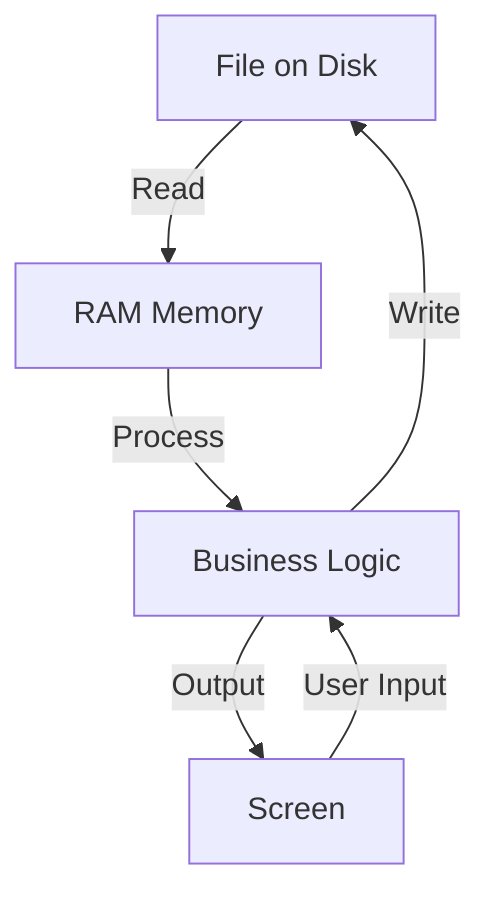

# 35_files

## Files as a Simple Database

In many applications, files are used to store data just like a database. Each file type (TXT, CSV, JSON) can represent structured or unstructured data, and can be used in a three-tier architecture:

**Three-Tier Architecture:**

- **Presentation Layer:** User interface (e.g., Console, Web, Desktop)
- **Business Logic Layer:** Code that processes data (CRUD functions)
- **Data Layer:** Files (TXT, CSV, JSON) act as the data source

---

## TXT, CSV, and JSON: Differences & Usage

| Format | Structure                   | Use Case                    | Pros                                   | Cons                          |
| ------ | --------------------------- | --------------------------- | -------------------------------------- | ----------------------------- |
| TXT    | Unstructured                | Simple notes, logs          | Easy to use                            | No structure, hard to parse   |
| CSV    | Tabular (rows/columns)      | Tables, spreadsheets        | Human-readable, easy for data exchange | No nested data, limited types |
| JSON   | Structured (objects/arrays) | Complex data, configs, APIs | Supports nested data, widely used      | Larger size, needs parsing    |

- **TXT**: Best for plain text, logs, or simple messages.
- **CSV**: Best for tabular data (like Excel), easy to import/export.
- **JSON**: Best for structured, hierarchical data (objects, lists), common in web APIs.

---

## How Memory is Handled: File → RAM → Screen

- Data is loaded from the file into RAM.
- Business logic processes the data in memory.
- Results are displayed on the screen.
- User actions can update the data, which is then written back to the file.

---
