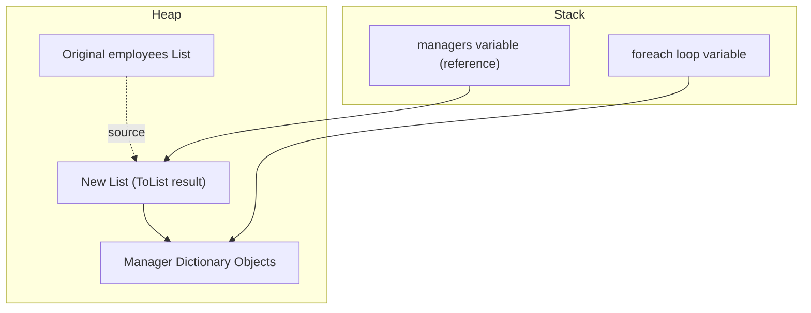
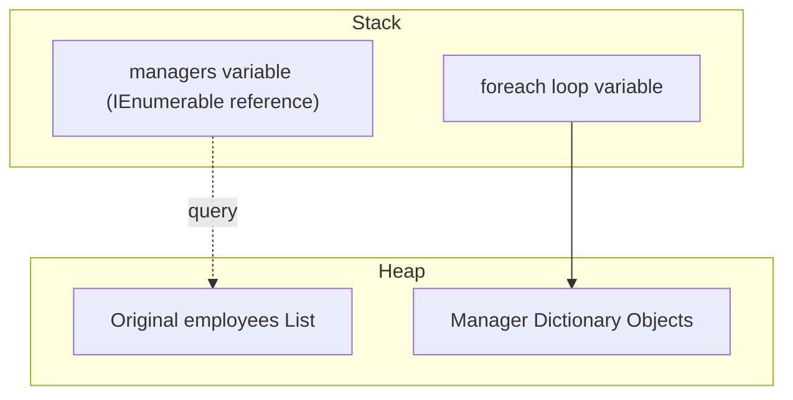
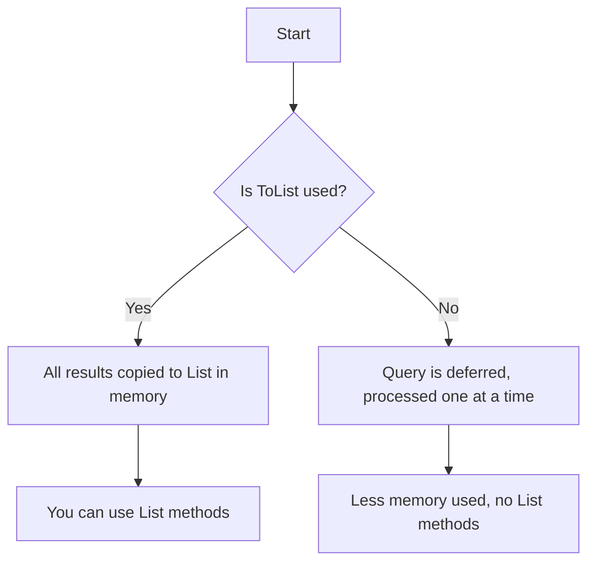
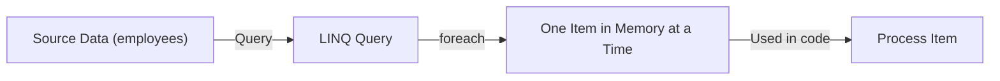

# 37_linq

## Why Use LINQ?

LINQ (Language Integrated Query) lets you write queries directly in C# to filter, select, and transform data from collections, databases, XML, and more. It makes code more readable, concise, and expressive compared to traditional loops.

### Example: Filtering with LINQ vs. Traditional Loop

Suppose you have a list of employees and want to find all managers:

**Without LINQ:**

```csharp
List<Employee> employees = ...;
List<Employee> managers = new List<Employee>();
foreach (var emp in employees)
{
    if (emp.IsManager)
        managers.Add(emp);
}
```

**With LINQ:**

```csharp
var managers = employees.Where(emp => emp.IsManager).ToList();
```

---

## Static Data Setup

We'll use two lists of dictionaries to represent employees and departments:

```csharp
var employees = new List<Dictionary<string, object>>
{
    new() { ["Id"] = 1, ["FirstName"] = "Bob", ["LastName"] = "Jones", ["AnnualSalary"] = 60000.3m, ["IsManager"] = true, ["DepartmentId"] = 1 },
    new() { ["Id"] = 2, ["FirstName"] = "Sarah", ["LastName"] = "Jameson", ["AnnualSalary"] = 80000.1m, ["IsManager"] = true, ["DepartmentId"] = 2 },
    new() { ["Id"] = 3, ["FirstName"] = "Douglas", ["LastName"] = "Roberts", ["AnnualSalary"] = 40000.2m, ["IsManager"] = false, ["DepartmentId"] = 2 },
    new() { ["Id"] = 4, ["FirstName"] = "Jane", ["LastName"] = "Stevens", ["AnnualSalary"] = 30000.2m, ["IsManager"] = false, ["DepartmentId"] = 3 }
};

var departments = new List<Dictionary<string, object>>
{
    new() { ["Id"] = 1, ["ShortName"] = "HR", ["LongName"] = "Human Resources" },
    new() { ["Id"] = 2, ["ShortName"] = "FN", ["LongName"] = "Finance" },
    new() { ["Id"] = 3, ["ShortName"] = "TE", ["LongName"] = "Technology" }
};
```

---

## LINQ Features and Examples

### Querying Objects (Where, Select, OrderBy, etc.)

#### Filtering (Where)

// Filters employees whose AnnualSalary is greater than 50000.

```csharp
var highEarners = employees.Where(e => (decimal)e["AnnualSalary"] > 50000);
```

#### Selecting (Select)

// Projects each employee to their full name as a string.

```csharp
var names = employees.Select(e => $"{e["FirstName"]} {e["LastName"]}");
```

#### Ordering (OrderBy, ThenBy)

// Orders employees by last name, then by first name.

```csharp
var ordered = employees.OrderBy(e => e["LastName"]).ThenBy(e => e["FirstName"]);
```

#### ToList()

// Converts the filtered result to a List for immediate use and further manipulation.

```csharp
var employeeList = employees.Where(e => (bool)e["IsManager"]).ToList();
```

#### Chaining Operations

// Combines filtering, ordering, and selecting in a single LINQ query.

```csharp
var result = employees
    .Where(e => (decimal)e["AnnualSalary"] > 50000)
    .OrderBy(e => e["LastName"])
    .Select(e => e["FirstName"]);
```

#### SelectMany

// Flattens all first names into a single sequence of characters.

```csharp
var allChars = employees.SelectMany(e => ((string)e["FirstName"]).ToCharArray());
```

#### Zip

// Combines employees and departments by index into a new sequence.

```csharp
var zipped = employees.Zip(departments, (e, d) => $"{e["FirstName"]} - {d["ShortName"]}");
```

---

### Joins

#### Inner Join (Method Syntax)

// Joins employees with departments based on DepartmentId.

```csharp
var joined = employees.Join(
    departments,
    e => e["DepartmentId"],
    d => d["Id"],
    (e, d) => new { Name = $"{e["FirstName"]} {e["LastName"]}", Department = d["LongName"] }
);
```

#### Group Join

// Groups employees by their department, producing hierarchical results.

```csharp
var groupJoin = departments.GroupJoin(
    employees,
    d => d["Id"],
    e => e["DepartmentId"],
    (d, emps) => new { Department = d["LongName"], Employees = emps }
);
```

#### Grouping

// Groups employees by DepartmentId.

```csharp
var grouped = employees.GroupBy(e => e["DepartmentId"]);
```

---

### Query Expression Equivalents

#### Filtering

// Filters employees whose AnnualSalary is greater than 50000 using query syntax.

```csharp
var highEarners = from e in employees
                  where (decimal)e["AnnualSalary"] > 50000
                  select e;
```

#### Join

// Joins employees with departments using query syntax.

```csharp
var joined = from e in employees
             join d in departments on e["DepartmentId"] equals d["Id"]
             select new { Name = $"{e["FirstName"]} {e["LastName"]}", Department = d["LongName"] };
```

#### Grouping

// Groups employees by DepartmentId using query syntax.

```csharp
var grouped = from e in employees
              group e by e["DepartmentId"];
```

---

### More Advanced LINQ Features

- SelectMany: flattening nested collections
- Zip: combining two sequences
- GroupJoin: hierarchical results
- Chaining: combining multiple LINQ operations

---

## Summary

LINQ makes querying, filtering, and transforming data in C# much easier and more expressive than traditional loops. It works with arrays, lists, dictionaries, and more.

## Deep Dive: Stack and Heap Memory with LINQ

### With ToList() (Immediate Execution)



**Explanation:**

- The `managers` variable (on the stack) points to a new list on the heap created by `ToList()`.
- The new list contains references to the same manager dictionary objects as in the original employees list (also on the heap).
- The foreach loop variable (on the stack) references each manager object as you iterate.
- Both the original and new lists exist in memory until they go out of scope.

### Without ToList() (Deferred Execution)



**Explanation:**

- The `managers` variable (on the stack) is just a query reference (IEnumerable), not a real list.
- No new list is created on the heap.
- As you iterate, the foreach loop variable (on the stack) references each manager object from the original employees list (on the heap), one at a time.
- Only the original list and objects exist in memory; no extra memory is used for a new list.

## Visualizing Memory Usage: ToList() vs Deferred Execution

### 1. Using ToList() (Immediate Execution)



**Explanation:** The query is executed immediately, and all results are copied into a new list in memory. You can use list operations on the result.

### 2. Without ToList() (Deferred Execution)



**Explanation:** The query is not executed until you iterate (e.g., foreach). Only one item is processed and in memory at a time, saving memory.

## Memory Behavior: ToList() vs. Deferred Execution

When you use `.ToList()` in a LINQ query, all the results are immediately copied into a new list in memory. This means the data is stored as a separate collection, and you can modify it (add, remove, index, etc.) without affecting the original data source. The memory is allocated up front for all results.

If you do not use `.ToList()`, the query result is an `IEnumerable<T>` and uses deferred execution. No memory is allocated for the results until you actually iterate over them (e.g., with a `foreach` loop). Each time you iterate, the query runs again, and only one item at a time is in memory as you loop through. This is more memory-efficient for large data sets or when you only need to read the data once.

**Summary:**

- `.ToList()` = immediate, full copy in memory (modifiable, fixed snapshot)
- No `.ToList()` = deferred, on-demand, minimal memory (not modifiable, always reflects current source)
