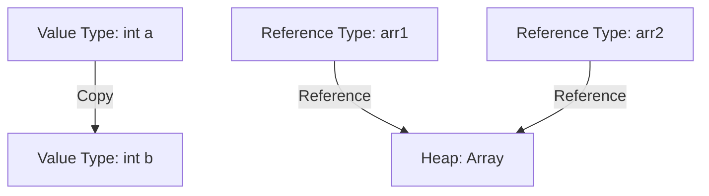
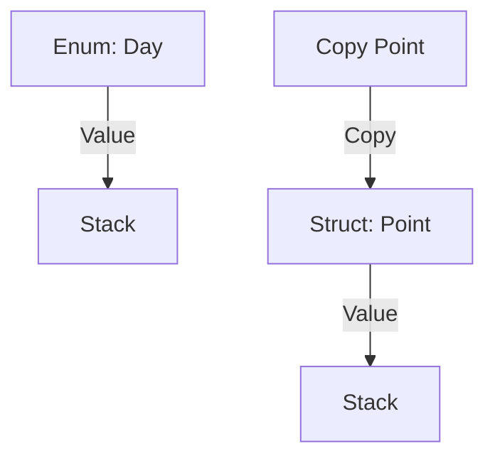
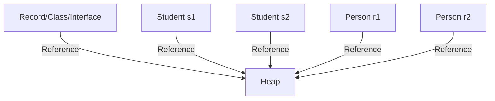
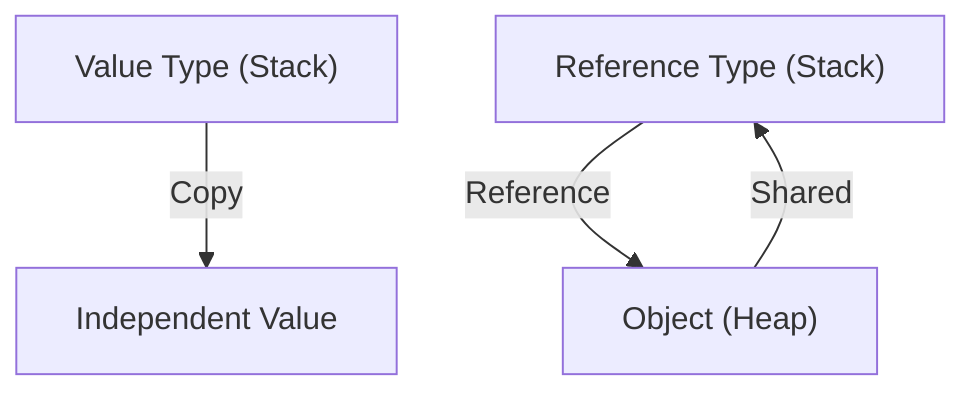

# 38_comparison

## Section 1: Value vs Reference Types

**Value Types:**

- Examples: `int`, `double`, `bool`, `struct`, `enum`
- Stored on the stack
- Copying a value type creates a new independent copy
- Use for small, simple data

**Reference Types:**

- Examples: `class`, `array`, `string`, `record`, `interface`
- Stored on the heap
- Copying a reference type copies the reference, not the object itself
- Use for objects, collections, and complex data

**Example:**

```csharp
int a = 5;
int b = a;
b++;
// a = 5, b = 6

int[] arr1 = { 1, 2, 3 };
int[] arr2 = arr1;
arr2[0] = 99;
// arr1[0] = 99, arr2[0] = 99
```

**Memory Handling:**

- Value types: allocated and managed on the stack
- Reference types: reference stored on stack, object on heap

**When to Use:**

- Value types for simple, short-lived data
- Reference types for complex, shared, or large data

**Mermaid Diagram:**



---

## Section 2: Enumerations and Structs

**Enumerations (enum):**

- Named set of constants
- Value type, stored on stack
- Use for readable code and named values

**Structs:**

- Custom value types
- Can have fields, properties, methods
- Stored on stack
- Use for small data objects

**Example:**

```csharp
public enum Day { Sunday, Monday, Tuesday, ... }
Day today = Day.Monday;

public struct Point {
    public int X;
    public int Y;
    public Point(int x, int y) { X = x; Y = y; }
}
Point p1 = new Point(1, 2);
Point p2 = p1;
p2.X = 10;
// p1.X = 1, p2.X = 10
```

**Memory Handling:**

- Both enums and structs are value types, stored on stack

**When to Use:**

- Enums for named constants
- Structs for small, immutable data objects

**Mermaid Diagram:**



---

## Section 3: Records, Classes, and Interfaces

**Records:**

- Reference type, stored on heap
- Immutable by default
- Use for data models, especially when equality matters

**Classes:**

- Reference type, stored on heap
- Mutable by default
- Use for general objects and business logic

**Interfaces:**

- Define contracts for classes
- Reference type
- Use for abstraction and polymorphism

**Example:**

```csharp
public record Person(string Name, int Age);
Person r1 = new Person("Alice", 30);
Person r2 = r1 with { Age = 31 };
// r1 = Alice,30; r2 = Alice,31

public class Student : IGreeter {
    public string Name { get; set; }
    public int Age { get; set; }
    public void Greet() => Console.WriteLine($"Hello, I'm {Name} and I'm {Age} years old.");
}
Student s1 = new Student { Name = "Bob", Age = 20 };
Student s2 = s1;
s2.Age = 21;
// s1.Age = 21, s2.Age = 21

public interface IGreeter {
    void Greet();
}
IGreeter greeter = new Student { Name = "Charlie", Age = 22 };
greeter.Greet();
```

**Memory Handling:**

- Records, classes, and interfaces are reference types, stored on heap

**When to Use:**

- Records for immutable data
- Classes for general objects
- Interfaces for abstraction and contracts

**Mermaid Diagram:**



---

## Memory Diagram



---

## Summary Table

| Type       | Stack/Heap | Mutable | Use Case              |
| ---------- | ---------- | ------- | --------------------- |
| Value Type | Stack      | Yes     | Simple data, numbers  |
| Reference  | Heap       | Yes/No  | Objects, collections  |
| Enum       | Stack      | No      | Named constants       |
| Struct     | Stack      | Yes     | Small data objects    |
| Record     | Heap       | No      | Immutable data models |
| Class      | Heap       | Yes     | General objects       |
| Interface  | Heap       | N/A     | Abstraction/contracts |

---

## When and Why to Use Each

- Use value types for performance and simplicity
- Use reference types for flexibility and shared data
- Use enums for clarity
- Use structs for small, immutable objects
- Use records for data models with equality
- Use classes for business logic
- Use interfaces for abstraction and testability
