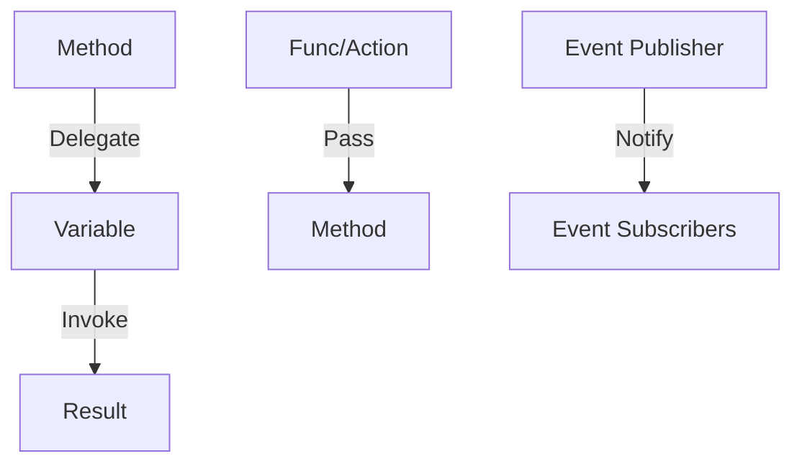

# Delegates and Actions in C#

## Introduction

Delegates and actions are powerful features in C# that let you treat methods as variables. You can pass them around, store them, and invoke them later. This makes your code flexible and reusable.

---

## Section 1: Delegates (Real-life Example: Chef)

A delegate is a type-safe object that can reference a method with a specific signature. Think of a chef who can cook food in different ways—grill, boil, fry. You can pass the cooking method to the chef!

**Example:**

```csharp
public delegate string Cook(string ingredient);
class Chef {
    public string Prepare(string ingredient, Cook cookMethod) {
        return cookMethod(ingredient);
    }
    public static string Grill(string ingredient) => $"Grilled {ingredient}";
    public static string Boil(string ingredient) => $"Boiled {ingredient}";
}

Chef chef = new Chef();
Console.WriteLine(chef.Prepare("Chicken", Chef.Grill)); // Grilled Chicken
Console.WriteLine(chef.Prepare("Eggs", Chef.Boil));    // Boiled Eggs
```

**Why use delegates?**

- Pass behavior into methods
- Build flexible code

---

## Section 2: Func & Action (Real-life Examples: Price Calculator & Logger)

**Func** is a built-in delegate that returns a value. **Action** is a built-in delegate that does not return a value.

**Func Example:**

```csharp
class PriceCalculator {
    public decimal Calculate(decimal price, Func<decimal, decimal> strategy) {
        return strategy(price);
    }
}
Func<decimal, decimal> halfOff = p => p / 2;
Func<decimal, decimal> addTax = p => p * 1.2m;
PriceCalculator calc = new PriceCalculator();
Console.WriteLine(calc.Calculate(100, halfOff)); // 50
Console.WriteLine(calc.Calculate(100, addTax));  // 120
```

**Action Example:**

```csharp
class Logger {
    public void Log(string message, Action<string> logAction) {
        logAction(message);
    }
}
Logger logger = new Logger();
logger.Log("Hello, Console!", msg => Console.WriteLine($"Console: {msg}"));
logger.Log("Hello, File!", msg => File.AppendAllText("log.txt", msg + "\n"));
```

**Why use Func and Action?**

- Save boilerplate code
- Easily swap behaviors

---

## Section 3: Events (Real-life Example: Doorbell)

Events are special delegates for publish–subscribe communication. Imagine a doorbell: when it rings, everyone in the house can respond!

**Example:**

```csharp
public class DoorbellEventArgs : EventArgs {
    public string Message { get; }
    public DoorbellEventArgs(string message) => Message = message;
}
class Door {
    public event EventHandler<DoorbellEventArgs>? DoorbellRang;
    public void Ring(string msg) {
        Console.WriteLine($"Door: {msg}");
        DoorbellRang?.Invoke(this, new DoorbellEventArgs(msg));
    }
}
class Person {
    public string Name { get; set; }
    public void OnDoorbell(object? sender, DoorbellEventArgs e) {
        Console.WriteLine($"{Name} heard: {e.Message}");
    }
}

Door door = new Door();
Person alice = new Person { Name = "Alice" };
Person bob = new Person { Name = "Bob" };
door.DoorbellRang += alice.OnDoorbell;
door.DoorbellRang += bob.OnDoorbell;
door.Ring("Someone is at the door!");
```

**Why use events?**

- Enable loose coupling
- Foundation for GUIs and notifications

---

## Mermaid Diagram: How Delegates, Func, Action, and Events Work



---

## Summary Table

| Type     | Returns Value? | Parameters  | Example                                                     |
| -------- | -------------- | ----------- | ----------------------------------------------------------- |
| Delegate | Custom         | Custom      | public delegate string Cook(string ingredient);             |
| Func     | Yes            | Up to 16    | Func<int, int, int> op = (x, y) => x + y;                   |
| Action   | No             | Up to 16    | Action<string> log = Console.WriteLine;                     |
| Event    | N/A            | Subscribers | public event EventHandler<DoorbellEventArgs>? DoorbellRang; |

---

## When to Use

- Use delegates for custom callback scenarios
- Use Func/Action for flexible, reusable code
- Use events for notifications and publish–subscribe patterns
