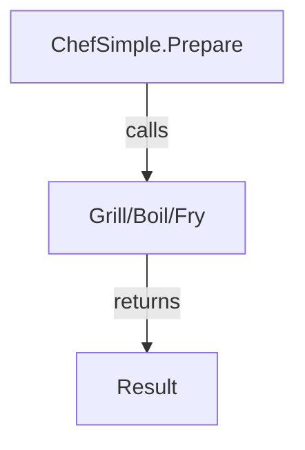
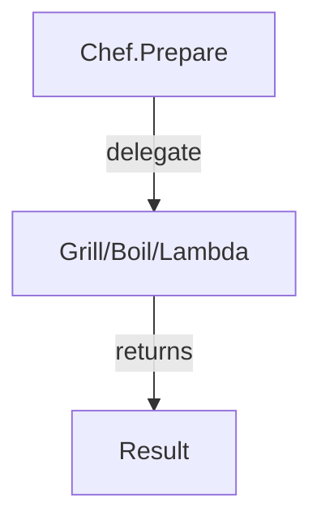
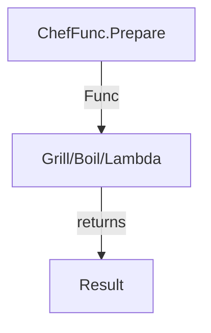
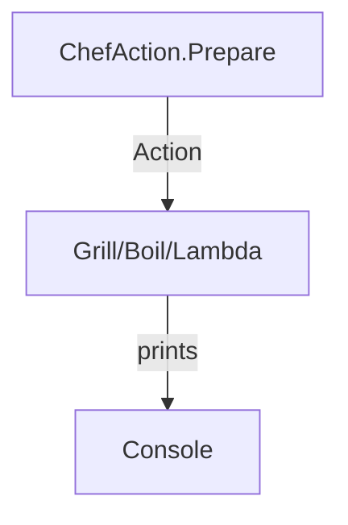
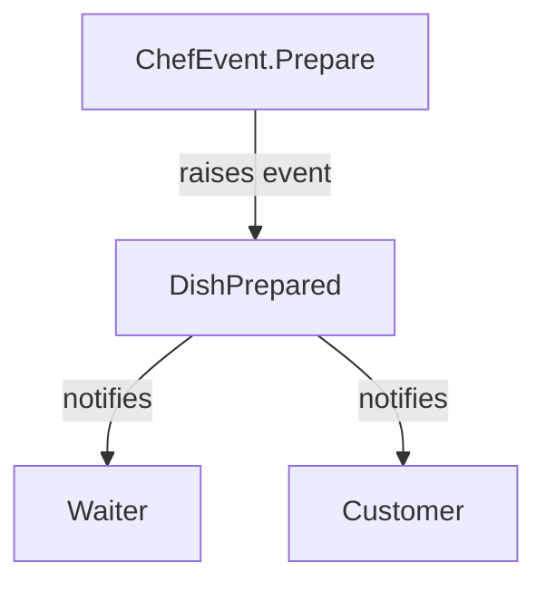

# Delegates, Func, Action, and Events in C#

## Introduction

This lecture demonstrates how to pass behavior to a method using a simple Chef and cooking scenario. We progress through four approaches:

1. Direct method calls (A_SimpleChefExample.cs)
2. Delegates (B_DelegatesExample.cs)
3. Func (C_FuncExample.cs)
4. Action (D_ActionExample.cs)
5. Events (E_EventExample.cs)

---

## A. Direct Method Calls (Simple)

The Chef class calls specific methods directly based on a string. This is easy to understand, but not flexible or reusable.

**Example:**

```csharp
ChefSimple chef = new ChefSimple();
Console.WriteLine(chef.Prepare("Chicken", "grill")); // Grilled Chicken
Console.WriteLine(chef.Prepare("Eggs", "boil"));    // Boiled Eggs
Console.WriteLine(chef.Prepare("Fish", "fry"));     // Fried Fish
```

**Mermaid Diagram:**



---

## B. Delegates

A delegate lets you pass a method as a parameter. This makes your code flexible and reusable.

**Example:**

```csharp
Chef chef = new Chef();
Cook grill = Chef.Grill;
Cook boil = Chef.Boil;
Console.WriteLine(chef.Prepare("Chicken", grill)); // Grilled Chicken
Console.WriteLine(chef.Prepare("Eggs", boil));    // Boiled Eggs
Console.WriteLine(chef.Prepare("Fish", ingredient => $"Fried {ingredient}")); // Fried Fish
```

**Mermaid Diagram:**



---

## C. Func

Func is a built-in delegate type. It lets you pass methods or lambdas easily, without declaring a custom delegate.

**Example:**

```csharp
ChefFunc chef = new ChefFunc();
Func<string, string> grill = ingredient => $"Grilled {ingredient}";
Func<string, string> boil = ingredient => $"Boiled {ingredient}";
Console.WriteLine(chef.Prepare("Chicken", grill)); // Grilled Chicken
Console.WriteLine(chef.Prepare("Eggs", boil));    // Boiled Eggs
Console.WriteLine(chef.Prepare("Fish", ingredient => $"Fried {ingredient}")); // Fried Fish
```

**Mermaid Diagram:**



---

## D. Action

Action is a built-in delegate type for methods that do not return a value. The Chef class uses Action to perform cooking actions (e.g., print the result).

**Example:**

```csharp
ChefAction chef = new ChefAction();
Action<string> grill = ingredient => Console.WriteLine($"Grilled {ingredient}");
Action<string> boil = ingredient => Console.WriteLine($"Boiled {ingredient}");
chef.Prepare("Chicken", grill); // Grilled Chicken
chef.Prepare("Eggs", boil);     // Boiled Eggs
chef.Prepare("Fish", ingredient => Console.WriteLine($"Fried {ingredient}")); // Fried Fish
```

**Mermaid Diagram:**



---

## E. Events

Events let objects notify subscribers when something happens. The Chef class raises an event when a dish is prepared, and subscribers (Waiter, Customer) react.

**Example:**

```csharp
ChefEvent chef = new ChefEvent();
chef.DishPrepared += waiter.OnDishPrepared;
chef.DishPrepared += customer.OnDishPrepared;
chef.Prepare("Chicken", "grill");
chef.Prepare("Eggs", "boil");
chef.Prepare("Fish", "fry");
```

**Mermaid Diagram:**



---

## Comparison Table

| Approach    | Flexibility | Reusability | Type Safety | Use Case          |
| ----------- | ----------- | ----------- | ----------- | ----------------- |
| Direct Call | Low         | Low         | Medium      | Simple            |
| Delegate    | High        | High        | High        | Callbacks, events |
| Func        | High        | High        | High        | LINQ, lambdas     |
| Action      | High        | High        | High        | Logging, actions  |
| Event       | Very High   | Very High   | High        | Notifications     |

---

## Summary

- Start with direct calls for simple code.
- Use delegates for flexible, reusable code and callbacks.
- Use Func for type-safe code with lambdas.
- Use Action for methods that do not return a value.
- Use events for publish–subscribe scenarios.
