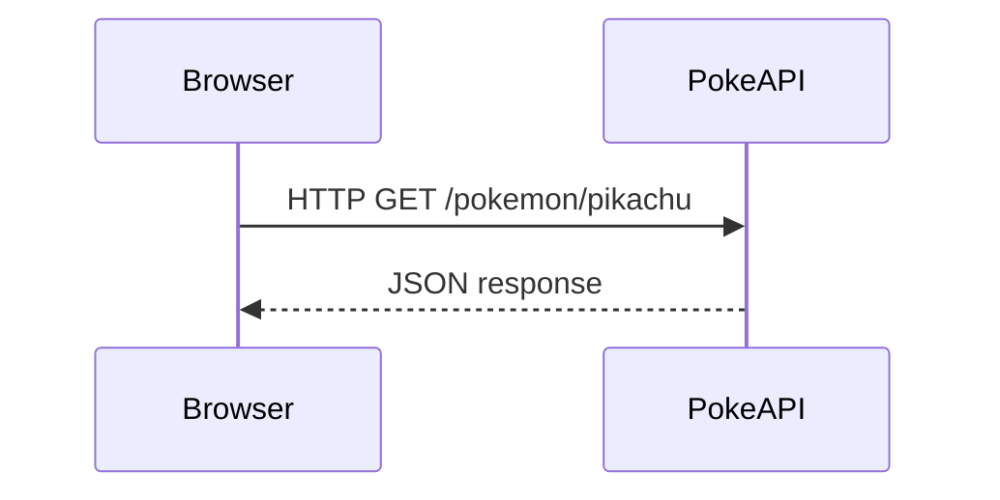
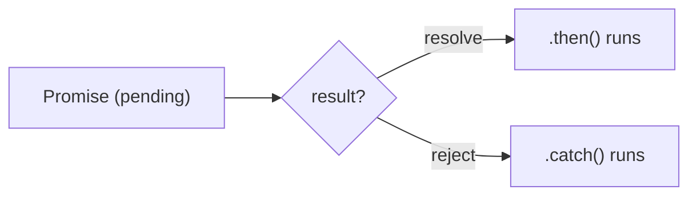
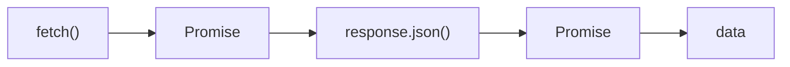
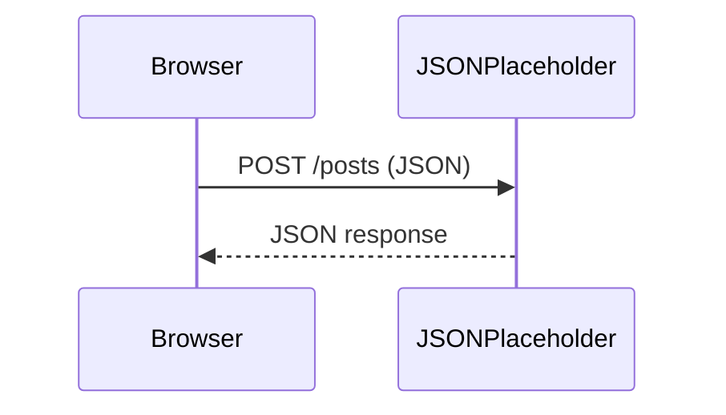
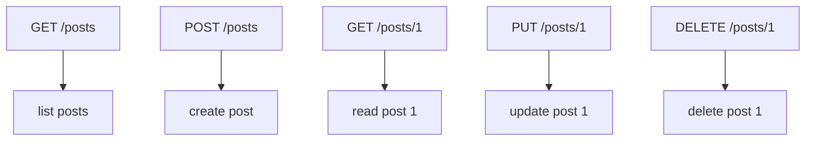
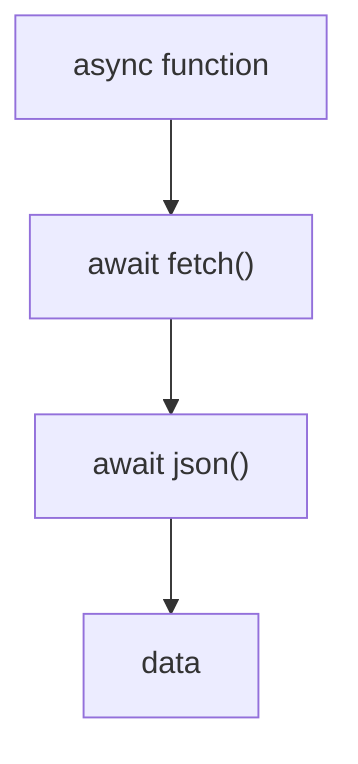

# Lecture 3: Fetch in JavaScript (Basics)

## 1 Intro: Full example (GET from a free API)

We will fetch a Pokémon by name.

```js
fetch('https://pokeapi.co/api/v2/pokemon/pikachu')
  .then((response) => response.json())
  .then((data) => {
    console.log('Name:', data.name);
    console.log('Height:', data.height);
  })
  .catch((error) => {
    console.log('Error:', error);
  });
```

**Diagram (Request → Response):**



---

## 2 What is a Promise?

### The Problem: Timing Issues

Consider this code without a Promise:

```js
console.log('Study hard');

setTimeout(() => {
  console.log('Pass exam');
}, 1000);
```

**Output:**

```
Study hard
Pass exam    (appears after 1 second)
```

The problem: You can't control WHEN the code inside `setTimeout` runs. If you need to ensure one action completes before another starts, this becomes messy.

---

### The Solution: Using a Promise

A Promise represents a value that will be ready **later**. It lets you control the order of operations.

```js
const study = new Promise((resolve, reject) => {
  setTimeout(() => {
    console.log('Studying...');
    resolve('Study complete!'); // Success
  }, 1000);
});

study.then((message) => {
  console.log(message);
  console.log('Pass exam');
});
```

**Output:**

```
Studying...
Study complete!
Pass exam
```

Now the order is guaranteed!

---

### Promise with Reject (Error Handling)

```js
const study = new Promise((resolve, reject) => {
  const isReady = true;

  setTimeout(() => {
    if (isReady) {
      resolve('Ready for exam!');
    } else {
      reject('Not prepared yet');
    }
  }, 1000);
});

study
  .then((message) => {
    console.log('Success:', message);
  })
  .catch((error) => {
    console.log('Error:', error);
  });
```

**Diagram:**



---

## 3) Fetch API: Getting data (GET)

Fetch returns a Promise. You must convert to JSON.

```js
fetch('https://pokeapi.co/api/v2/pokemon/ditto')
  .then((res) => res.json())
  .then((data) => console.log(data))
  .catch((err) => console.log(err));
```

**Diagram:**



---

## 4) Fetch API: Sending data (POST)

We will send data to a test API.

```js
fetch('https://jsonplaceholder.typicode.com/posts', {
  method: 'POST',
  headers: { 'Content-Type': 'application/json' },
  body: JSON.stringify({
    title: 'My Post',
    body: 'Hello world',
    userId: 1,
  }),
})
  .then((res) => res.json())
  .then((data) => console.log('Created:', data))
  .catch((err) => console.log(err));
```

**Diagram:**



---

## 5) What is a RESTful API?

REST uses HTTP methods and clear URLs.

**Common methods:**

- **GET** `/posts` → read data
- **POST** `/posts` → create data
- **PUT** `/posts/1` → update data
- **DELETE** `/posts/1` → delete data

**Diagram:**



---

## 6) Async/Await (simpler syntax)

Same as `.then`, but looks like normal code.

```js
async function getPokemon() {
  try {
    const res = await fetch('https://pokeapi.co/api/v2/pokemon/eevee');
    const data = await res.json();
    console.log(data.name);
  } catch (err) {
    console.log(err);
  }
}

getPokemon();
```

**Diagram:**


