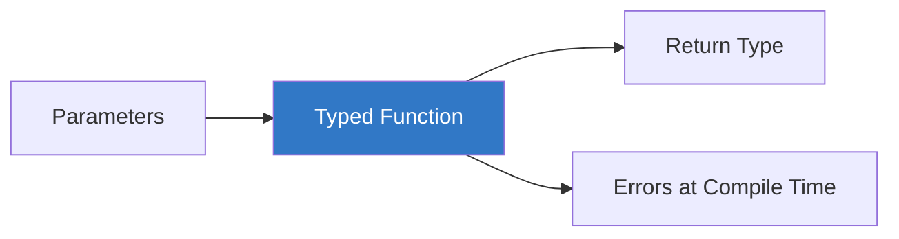

# ⚙️ Functions in TypeScript

> **Educational content by Bashar Alwarad**  
> Learn how to type functions, parameters, returns, overloads, and callbacks in TypeScript.

## Connect with Me [](https://www.linkedin.com/in/bashar-alwarad-2a960b1b6/)

---

## 📚 Table of Contents

- [⚙️ Functions in TypeScript](#️-functions-in-typescript)
  - [Connect with Me ](#connect-with-me-)
  - [📚 Table of Contents](#-table-of-contents)
  - [🎯 Why Type Functions?](#-why-type-functions)
  - [🧾 Function Type Basics](#-function-type-basics)
  - [🎁 Return Types](#-return-types)
  - [🔀 Optional \& Default Params](#-optional--default-params)
  - [🧩 Function Types as Variables](#-function-types-as-variables)
  - [🏹 Arrow Functions](#-arrow-functions)
  - [📑 Overloads (Signatures)](#-overloads-signatures)
  - [➕ Rest Parameters](#-rest-parameters)
  - [🔗 Callbacks](#-callbacks)
  - [🧭 This Parameter](#-this-parameter)

---

## 🎯 Why Type Functions?

Typed functions catch mismatched arguments and unintended returns at compile time, improving reliability and autocomplete.



---

## 🧾 Function Type Basics

Annotate parameters and return types:

```typescript
function add(a: number, b: number): number {
  return a + b;
}

add(2, 3); // ✅ 5
add('2', 3); // ❌ Error: 'string' not assignable to 'number'
```

Type inference often knows the return type, but explicit annotations help APIs stay clear.

---

## 🎁 Return Types

```typescript
function greet(name: string): string {
  return `Hello, ${name}`;
}

function log(message: string): void {
  console.log(message); // no return value
}

function fail(message: string): never {
  throw new Error(message); // never returns
}
```

---

## 🔀 Optional & Default Params

```typescript
function formatName(first: string, last?: string): string {
  return last ? `${first} ${last}` : first;
}

function power(base: number, exp: number = 2): number {
  return base ** exp;
}
```

---

## 🧩 Function Types as Variables

```typescript
let combine: (a: number, b: number) => number;

combine = (x, y) => x + y; // ✅
// combine = (x: string, y: string) => x + y; // ❌ type mismatch
```

Re-use via type aliases:

```typescript
type BinaryOp = (a: number, b: number) => number;
const multiply: BinaryOp = (a, b) => a * b;
```

---

## 🏹 Arrow Functions

Arrow functions are concise and capture `this` lexically:

```typescript
const lengths = ['a', 'bb', 'ccc'].map((s): number => s.length);
```

---

## 📑 Overloads (Signatures)

Provide multiple call signatures for one implementation:

```typescript
function toArray(value: number): number[];
function toArray(value: string): string[];
function toArray(value: number | string) {
  return [value];
}

toArray(5); // number[]
toArray('hi'); // string[]
// toArray(true); // ❌ no overload for boolean
```

---

## ➕ Rest Parameters

Handle variable arguments safely:

```typescript
function sum(...nums: number[]): number {
  return nums.reduce((total, n) => total + n, 0);
}

sum(1, 2, 3); // 6
```

---

## 🔗 Callbacks

Type callback parameters for safety:

```typescript
function mapStrings(values: string[], fn: (s: string) => number): number[] {
  return values.map(fn);
}

mapStrings(['hi', 'ts'], (s) => s.length); // ✅
// mapStrings(["hi"], (n: number) => n); // ❌ callback type mismatch
```

---

## 🧭 This Parameter

Annotate `this` for functions using it (especially in object methods):

```typescript
interface Button {
  label: string;
  click(this: Button): void;
}

const btn: Button = {
  label: 'Save',
  click() {
    console.log(`${this.label} clicked`);
  },
};
```

---

**Happy Learning! 🚀**

_Educational content by Bashar Alwarad - Software Engineering Course_
