# Async/Await and Tasks in C#

## What is a Thread?

A thread is the smallest unit of execution in a program. Each thread can run code independently, allowing multiple operations to happen at the same time.

### How are threads created in a computer?

- When a program starts, the operating system creates a process for it. Each process has at least one thread (the main thread).
- The CPU (processor) executes instructions for each thread. The OS can create more threads as needed, allocating memory for each thread's stack in RAM.
- Threads are managed by the OS scheduler, which decides which thread runs on which CPU core and when.

**Diagram: Thread Creation**

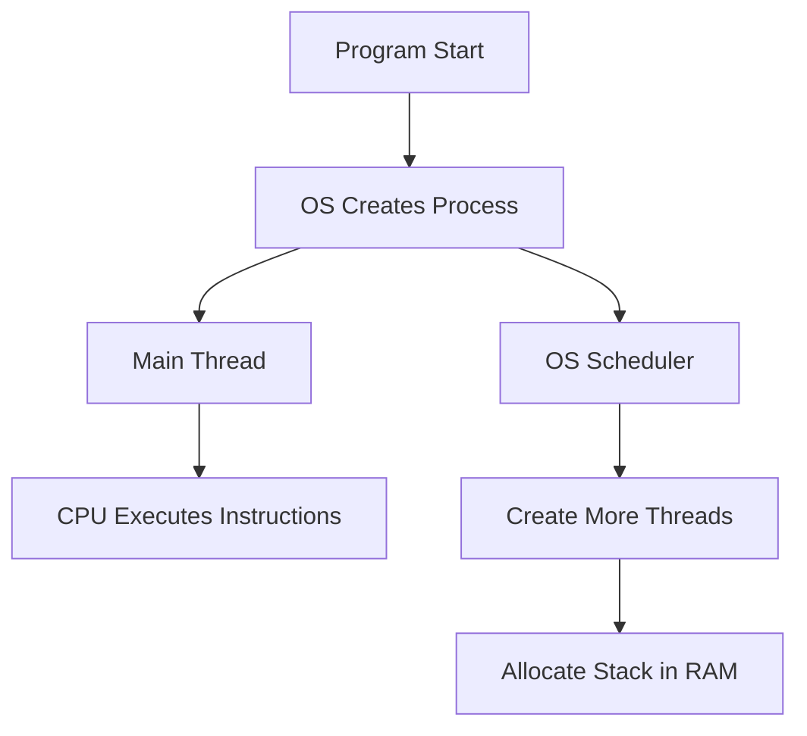

### Behind the scenes: CPU, RAM, and threads

- The CPU switches between threads rapidly (context switching), giving the illusion of parallelism even on a single core.
- Each thread needs its own stack in RAM to store local variables, function calls, and execution state.
- More threads mean more memory usage and more work for the OS to manage scheduling and context switching.

**Diagram: Behind the Scenes**

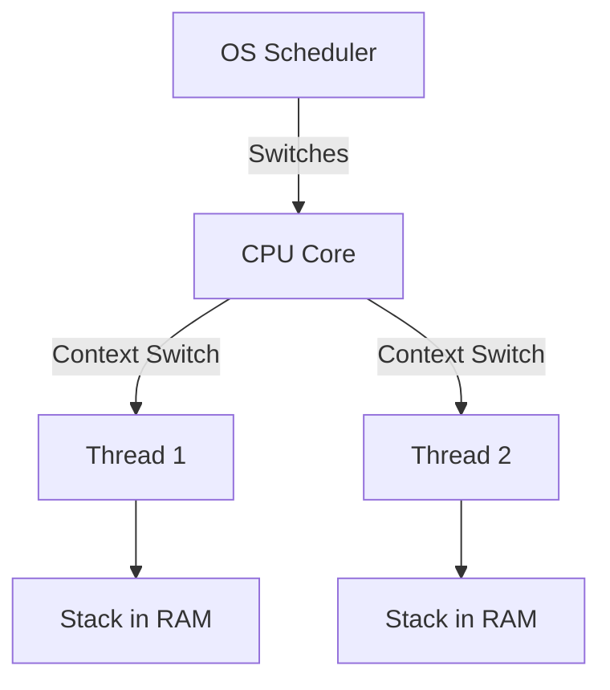

### Why are threads expensive?

- Creating a thread requires allocating memory for its stack and resources for its execution context.
- Switching between threads (context switching) uses CPU time and can slow down performance if there are too many threads.
- Too many threads can exhaust system resources (RAM, CPU), leading to slowdowns or crashes.
- Async/await and tasks help you use threads efficiently, freeing them up while waiting for I/O or long-running operations.

**Diagram: Why Threads Are Expensive**

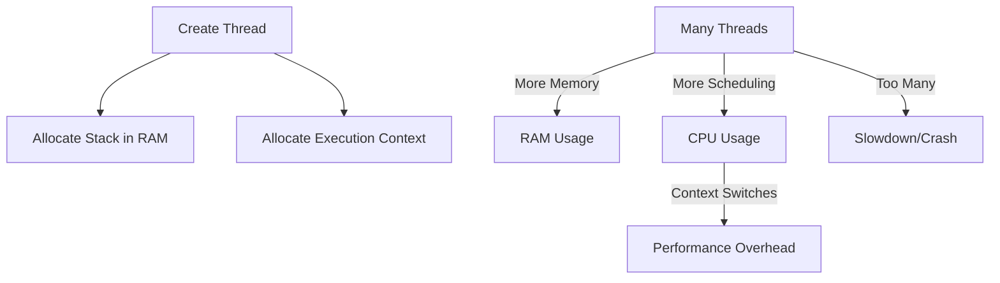

### Single-threaded vs Multi-threaded languages

- **Single-threaded languages** (like JavaScript) run all code on one thread. Only one operation can execute at a time, so long-running tasks block everything else.
- **Multi-threaded languages** (like C#) can run code on multiple threads. This allows true parallelism, where several tasks can run simultaneously.

**Why does this matter for async programming?**

- In single-threaded environments, async/await is used to avoid blocking the main thread, keeping the app responsive.
- In multi-threaded environments, async/await helps you write scalable code that uses threads efficiently, freeing them up for other work while waiting for I/O or long-running tasks.

**Mermaid Diagram:**

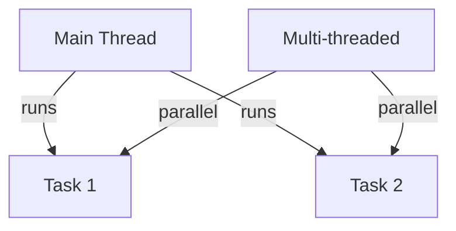

---

## A. The Problem: Blocking Functions

Blocking operations (e.g., `Thread.Sleep`) prevent your application from doing other work while waiting for a task to finish.

**Example:**

```csharp
A_BlockingProblem.Run(); // Makes coffee, then makes a sandwich (sequential, blocking)
```

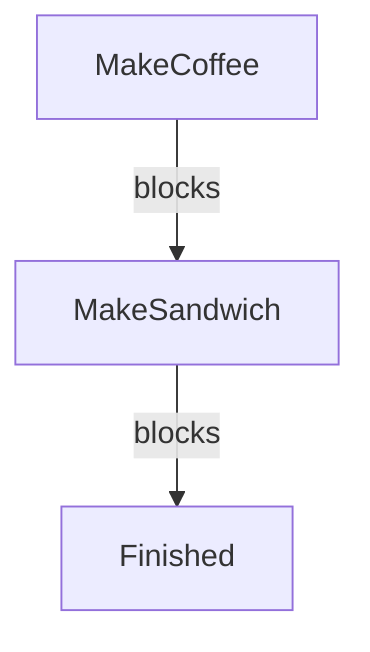

---

## B. The Solution: Async/Await for Parallel Tasks

Async/await lets you run tasks in parallel, so your application remains responsive and efficient.

**Example:**

```csharp
await B_AsyncSolution.Run(); // Makes coffee and sandwich in parallel (non-blocking)
```

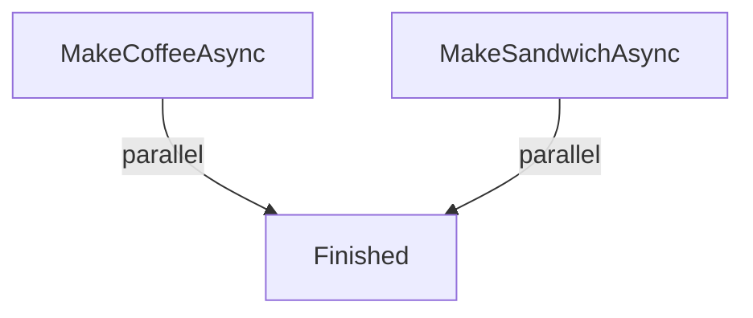

---

## C. Fetching Data Asynchronously

Async/await is essential for non-blocking I/O, such as fetching data from a web API.

**Example:**

```csharp
await C_FetchRequest.Run(); // Fetches data from a URL asynchronously
```

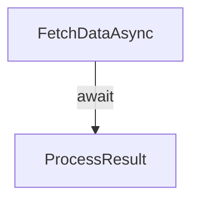

---

## D. Exception Handling in Async Methods

Async methods propagate exceptions through their `Task`. Use try/catch to handle errors.

**Example:**

```csharp
await D_AsyncExceptionHandling.Run(); // Handles errors from async fetch
```

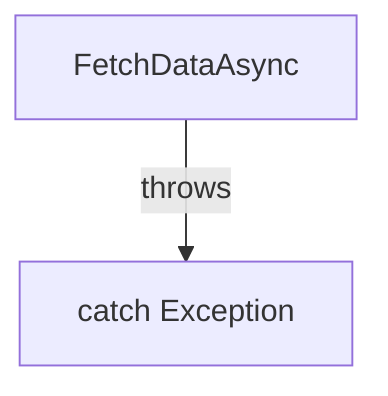

---

## E. Returning Values from Async Methods

Async methods can return values using `Task<T>`. Await the result to get the value.

**Example:**

```csharp
await E_AsyncReturnValue.Run(); // Returns a calculated value asynchronously
```

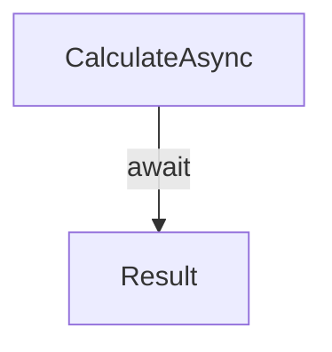

---

## F. Composing Multiple Tasks

Use `Task.WhenAll` to run multiple async operations in parallel and await all results.

**Example:**

```csharp
await F_AsyncComposition.Run(); // Fetches multiple URLs in parallel
```

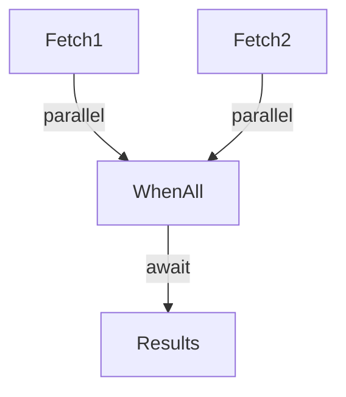

---

## G. Best Practices & Constraints

- Always use `await` for async methods.
- Avoid blocking async code with `.Result` or `.Wait()`.
- Make methods async "all the way down".

**Example:**

```csharp
await G_AsyncBestPractices.Run(); // Demonstrates correct and incorrect async usage
```

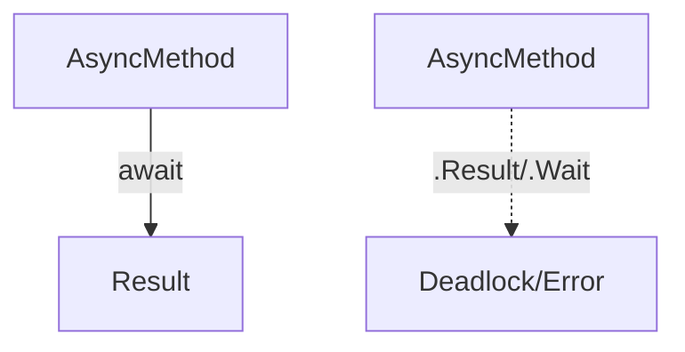

---

## H. Async Yield Example (IAsyncEnumerable)

Use `yield` with async streams to return results one at a time, as soon as they are available. This is efficient for streaming or large data sets.

**Example:**

```csharp
await H_AsyncYieldExample.Run(); // Yields results from multiple fetch requests
```

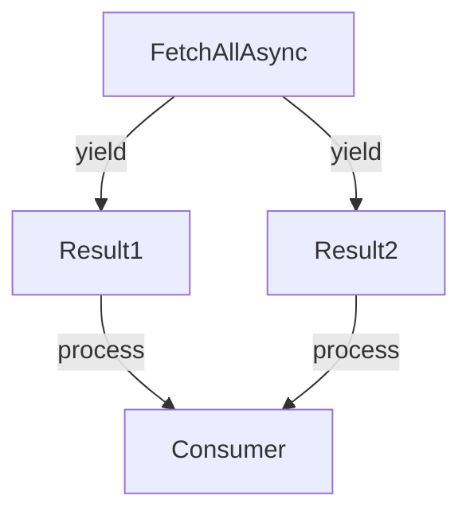

---

## Summary

- Use async/await to run tasks in parallel and keep your app responsive.
- Handle exceptions and return values with async methods.
- Compose multiple tasks for scalable solutions.
- Use async streams and yield for efficient, real-time data processing.
- Follow best practices for robust, deadlock-free async code.
