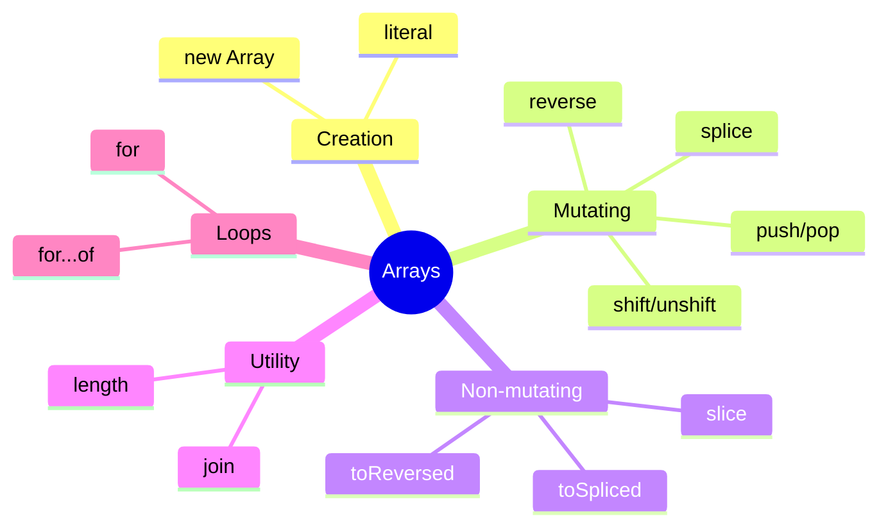

# Block 4: Arrays in JavaScript

> **Educational content by Bashar Alwarad**  
> javascript arrays.

## Connect with Me [](https://www.linkedin.com/in/bashar-alwarad-2a960b1b6/)

---

## 📚 Intro to Arrays

Arrays store multiple values in a single variable. Elements are indexed starting at 0.

```javascript
// Create arrays
let fruits = ['apple', 'banana', 'cherry'];
let numbers = [1, 2, 3, 4, 5];
let mixed = [1, 'hello', true, null];

// Access elements
console.log(fruits[0]); // 'apple'
console.log(fruits.length); // 3

// Modify elements
fruits[1] = 'orange';
console.log(fruits); // ['apple', 'orange', 'cherry']
```

---

## 📚 Push, Pop, Shift and Unshift

These methods modify the array **in place**.

```javascript
let stack = ['a', 'b'];

// push: add to end
stack.push('c', 'd');
console.log(stack); // ['a', 'b', 'c', 'd']

// pop: remove from end
let last = stack.pop();
console.log(last); // 'd'
console.log(stack); // ['a', 'b', 'c']

// unshift: add to beginning
stack.unshift('x');
console.log(stack); // ['x', 'a', 'b', 'c']

// shift: remove from beginning
let first = stack.shift();
console.log(first); // 'x'
console.log(stack); // ['a', 'b', 'c']
```

---

## 📚 Reverse and toReversed

- `reverse()`: modifies the original array.
- `toReversed()`: returns a new reversed array (original unchanged).

```javascript
let nums = [1, 2, 3, 4];

// reverse: mutates original
let rev1 = nums.reverse();
console.log(rev1); // [4, 3, 2, 1]
console.log(nums); // [4, 3, 2, 1] (changed)

// toReversed: creates new array
let nums2 = [1, 2, 3, 4];
let rev2 = nums2.toReversed();
console.log(rev2); // [4, 3, 2, 1]
console.log(nums2); // [1, 2, 3, 4] (unchanged)
```

---

## 📚 Splice and toSpliced

- `splice()`: removes/replaces elements in place, returns removed elements.
- `toSpliced()`: returns a new array with changes (original unchanged).

```javascript
// splice: mutates original
let arr1 = ['a', 'b', 'c', 'd'];
let removed = arr1.splice(1, 2, 'x', 'y');
console.log(removed); // ['b', 'c']
console.log(arr1); // ['a', 'x', 'y', 'd']

// toSpliced: creates new array
let arr2 = ['a', 'b', 'c', 'd'];
let newArr = arr2.toSpliced(1, 2, 'x', 'y');
console.log(newArr); // ['a', 'x', 'y', 'd']
console.log(arr2); // ['a', 'b', 'c', 'd'] (unchanged)
```

---

## 📚 Slice and Join

- `slice()`: extracts a portion (returns new array, doesn't mutate).
- `join()`: converts array to string with a separator.

```javascript
// slice: get a portion
let colors = ['red', 'green', 'blue', 'yellow'];
let subset = colors.slice(1, 3);
console.log(subset); // ['green', 'blue']
console.log(colors); // unchanged

// slice from index to end
let fromTwo = colors.slice(2);
console.log(fromTwo); // ['blue', 'yellow']

// join: array to string
let sentence = colors.join(' - ');
console.log(sentence); // 'red - green - blue - yellow'

let csv = colors.join(',');
console.log(csv); // 'red,green,blue,yellow'
```

---

## 📚 Loops in Arrays: for and for...of

```javascript
let items = ['apple', 'banana', 'cherry'];

// traditional for loop (access index)
for (let i = 0; i < items.length; i++) {
  console.log(i, items[i]);
}
// Output:
// 0 apple
// 1 banana
// 2 cherry

// for...of loop (access value directly)
for (let item of items) {
  console.log(item);
}
// Output:
// apple
// banana
// cherry

// for...of with index using entries()
for (let [i, item] of items.entries()) {
  console.log(i, item);
}
// Output:
// 0 apple
// 1 banana
// 2 cherry
```

---

## Advanced: Behind the Scenes in RAM

### Why Arrays Were Invented

Before arrays, storing multiple related values required separate variables:

```javascript
// Without arrays (inefficient)
let fruit0 = 'apple';
let fruit1 = 'banana';
let fruit2 = 'cherry';
// ... scales poorly
```

**Arrays solve this by:**

- 🎯 Storing multiple values in **one contiguous block** of memory.
- 🚀 Fast access via index (O(1) time complexity).
- 📦 Efficient memory management and iteration.

```javascript
// With arrays (efficient)
let fruits = ['apple', 'banana', 'cherry'];
console.log(fruits[0]); // fast lookup by index
```

### RAM Layout: Stack vs Heap

When you create an array, JavaScript allocates memory in two places:

```javascript
let fruits = ['apple', 'banana', 'cherry'];
```

**Stack (stores the reference):**

```
┌─────────────────┐
│ fruits → 0x1000 │  (pointer/reference to heap address)
└─────────────────┘
```

**Heap (stores the actual data):**

```
Address    Data
0x1000  ┌─────────────────────────────────┐
        │ ['apple', 'banana', 'cherry']   │
        │ (contiguous memory blocks)      │
        └─────────────────────────────────┘
```

### How Pointers Work

A **pointer** is an address in memory. When you pass an array to a function, you pass the pointer (not a copy of the whole array):

```javascript
let arr = [1, 2, 3];

function modify(arr) {
  arr[0] = 99; // modifies the SAME array on the heap
}

modify(arr);
console.log(arr[0]); // 99 (original changed!)
```

Both `arr` (in main) and `arr` (in function) point to **the same heap address**:

```
Stack:
┌──────────────┐     ┌──────────────┐
│ arr → 0x2000 │     │ arr → 0x2000 │  (same address!)
└──────────────┘     └──────────────┘
  (main scope)         (function scope)
        ↓                     ↓
      Heap:
      0x2000: [1, 2, 3]
      (when we change it, both scopes see the change)
```

### Primitives vs References in Arrays

```javascript
// Primitives: stored by VALUE
let nums = [1, 2, 3];
let copy = nums;
nums[0] = 99;
console.log(copy[0]); // 99 (both point to same heap location)

// Objects in arrays: stored by REFERENCE
let users = [{ name: 'Alice' }];
let ref = users[0];
ref.name = 'Bob';
console.log(users[0].name); // 'Bob' (same object in heap)
```

---

## Quick Summary



### Key Takeaways:

- ✅ Arrays are ordered collections (index starts at 0).
- ✅ Mutating methods: `push`, `pop`, `shift`, `unshift`, `reverse`, `splice`.
- ✅ Non-mutating methods: `slice`, `toReversed`, `toSpliced`, `join`.
- ✅ Use `for` when you need the index; use `for...of` for simple iteration.
- ✅ Prefer non-mutating methods to avoid unexpected changes.

---
