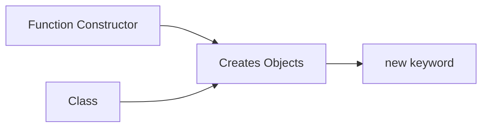
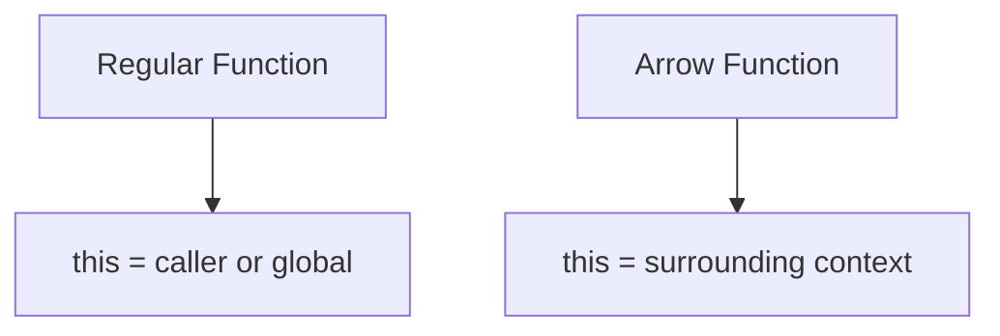
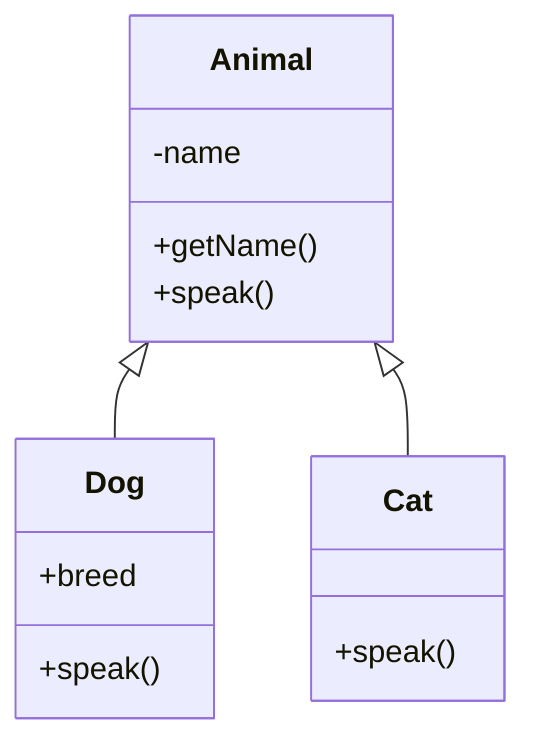
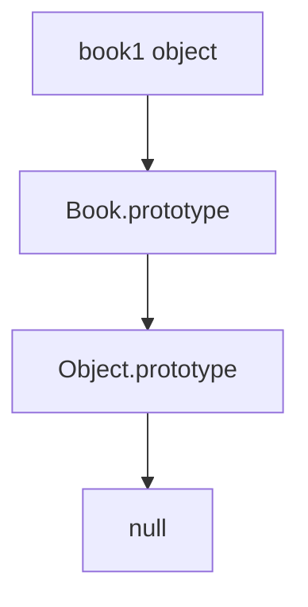
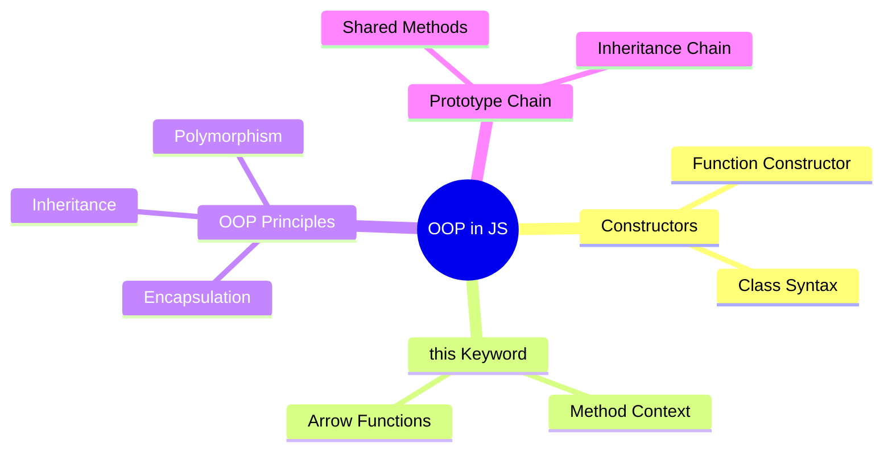

# Lecture 4: Object-Oriented Programming in JavaScript

> **Educational content by Bashar Alwarad**  
> Understanding OOP concepts in JavaScript.

## Connect with Me [](https://www.linkedin.com/in/bashar-alwarad-2a960b1b6/)

---

## 1) Function Constructors and Classes

### Function Constructor

A function constructor is the old way to create objects in JavaScript.

```js
console.info('Function Constructor');

function Car(brand, year) {
  this.brand = brand;
  this.year = year;

  this.describe = function () {
    return `${this.brand} (${this.year})`;
  };
}

let car1 = new Car('Toyota', 2020);
let car2 = new Car('Honda', 2022);

console.log(car1.describe()); // "Toyota (2020)"
console.log(car2.describe()); // "Honda (2022)"
```

### Class

Classes are the modern way to create objects. They are **syntax sugar** over function constructors.

```js
console.info('Class Syntax');

class Vehicle {
  constructor(brand, year) {
    this.brand = brand;
    this.year = year;
  }

  describe() {
    return `${this.brand} (${this.year})`;
  }
}

let bike = new Vehicle('Yamaha', 2021);
console.log(bike.describe()); // "Yamaha (2021)"
```

### Both are Functions!

```js
console.info('Both are functions');
console.log(typeof Car); // "function"
console.log(typeof Vehicle); // "function"
```

**Diagram:**



---

## 2) The `this` Keyword

The `this` keyword refers to the object that is executing the current function.

### Global Context

```js
console.log(this); // undefined in strict mode, window in browser
```

### Function Context

```js
function show() {
  console.log(this); // undefined in strict mode
}
show();
```

### Method Context

```js
let product = {
  name: 'Laptop',
  getInfo: function () {
    console.log('Product:', this.name); // 'this' refers to 'product'
  },
};

product.getInfo(); // "Product: Laptop"
```

### Arrow Function Context

Arrow functions do **not** have their own `this`. They inherit it from the surrounding context.

```js
let product2 = {
  name: 'Phone',
  getInfo: () => {
    console.log(this?.name); // undefined (inherits global this)
  },
};

product2.getInfo();
```

### Problem: Losing Context

```js
console.info('Callback loses context');

let shop = {
  name: 'SuperMart',
  items: ['apple', 'banana', 'orange'],
  listItems: function () {
    this.items.forEach(function (item) {
      console.log(`${this?.name} sells ${item}`); // this is undefined!
    });
  },
};

shop.listItems();
```

### Solution: Arrow Function

```js
console.info('Arrow function keeps context');

let shop2 = {
  name: 'SuperMart',
  items: ['apple', 'banana', 'orange'],
  listItems: function () {
    this.items.forEach((item) => {
      console.log(`${this.name} sells ${item}`); // this refers to shop2
    });
  },
};

shop2.listItems();
```

**Diagram:**



---

## 3) A Bit of OOP

OOP has 4 main principles:

- **Encapsulation**: Hide data inside objects.
- **Inheritance**: Child classes inherit from parent classes.
- **Polymorphism**: Same method, different behavior.
- **Abstraction**: Hide complex details.

### Example: Animals

```js
// Base class
class Animal {
  #name; // Private field

  constructor(name) {
    this.#name = name;
  }

  getName() {
    return this.#name;
  }

  speak() {
    return 'Some sound';
  }
}

// Child class
class Dog extends Animal {
  constructor(name, breed) {
    super(name);
    this.breed = breed;
  }

  speak() {
    return 'Woof!';
  }
}

class Cat extends Animal {
  speak() {
    return 'Meow!';
  }
}

// Create instances
let dog = new Dog('Max', 'Labrador');
let cat = new Cat('Luna');

console.log(dog.getName()); // "Max"
console.log(dog.speak()); // "Woof!"
console.log(cat.speak()); // "Meow!"

// Polymorphism
const animals = [dog, cat];
animals.forEach((animal) => {
  console.log(`${animal.getName()} says ${animal.speak()}`);
});
```

**Diagram:**



---

## 4) The Prototype Chain

Every object in JavaScript has a prototype. The prototype is an object from which it inherits methods and properties.

### Built-in Example: Array

```js
const myArray = [10, 20, 30];
console.log(myArray);

// Check browser console:
// [[Prototype]]: Array(0)
//   - forEach, map, filter, etc.

myArray.forEach((num) => console.log(num));
const doubled = myArray.map((num) => num * 2);
console.log(doubled); // [20, 40, 60]
```

All arrays share methods from `Array.prototype`.

### Custom Example: Book

```js
class Book {
  #title;
  #author;

  constructor(title, author) {
    this.#title = title;
    this.#author = author;
  }

  getInfo() {
    return `${this.#title} by ${this.#author}`;
  }
}

const book1 = new Book('1984', 'George Orwell');
console.log(book1);
console.log(book1.getInfo());

// Check browser console:
// [[Prototype]]: Book
//   - getInfo()
//   - [[Prototype]]: Object
```

Every instance of `Book` shares the `getInfo` method from `Book.prototype`.

**Diagram:**



---

## Quick Summary



### Key Takeaways:

- ✅ Use **classes** for modern object creation.
- ✅ **`this`** refers to the calling object in methods.
- ✅ Arrow functions **inherit** `this` from surrounding context.
- ✅ OOP helps organize code with **inheritance** and **encapsulation**.
- ✅ All objects inherit from a **prototype chain**.
- ✅ Private fields use **`#`** prefix.

---
