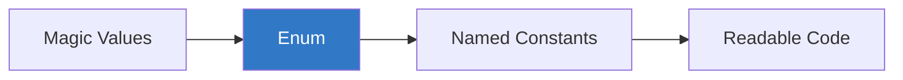
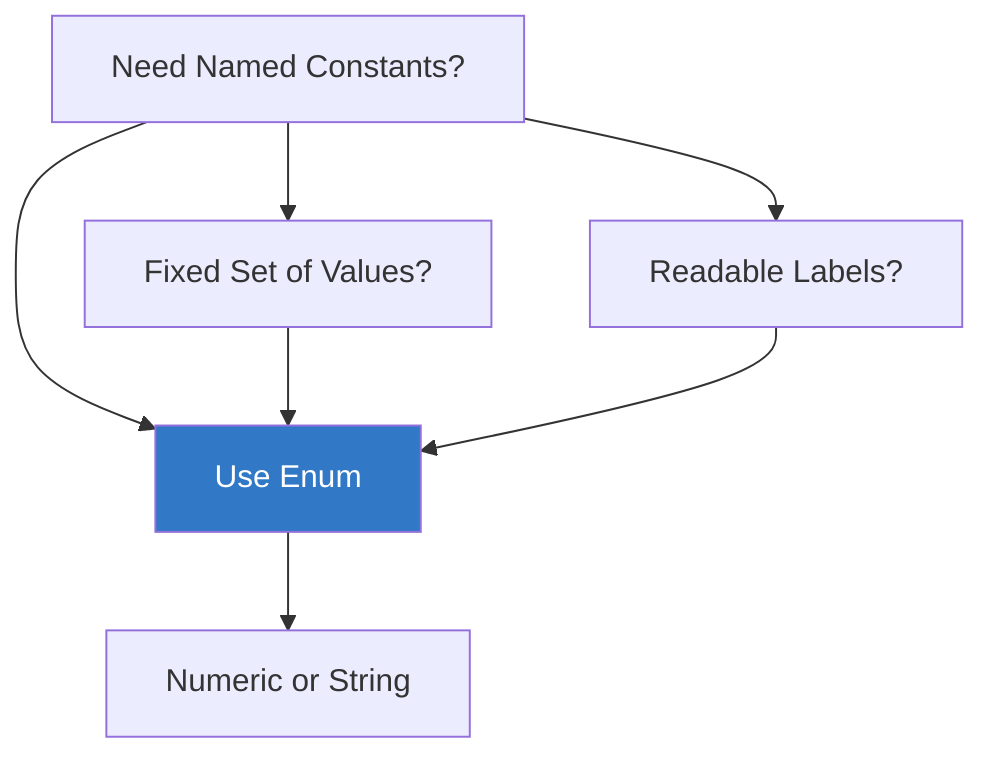

# 🎯 Enums and Type Narrowing in TypeScript

> **Educational content by Bashar Alwarad**  
> Learn how to use enums for named constants and narrow types safely in TypeScript.

## Connect with Me [](https://www.linkedin.com/in/bashar-alwarad-2a960b1b6/)

---

## 📚 Table of Contents

- [🎯 Enums and Type Narrowing in TypeScript](#-enums-and-type-narrowing-in-typescript)
  - [Connect with Me ](#connect-with-me-)
  - [📚 Table of Contents](#-table-of-contents)
  - [🏷️ What Are Enums?](#️-what-are-enums)
  - [🔢 Numeric Enums](#-numeric-enums)
    - [Default (auto-increment from 0)](#default-auto-increment-from-0)
    - [Initialized (custom start)](#initialized-custom-start)
    - [Fully Initialized](#fully-initialized)
  - [🔤 String Enums](#-string-enums)
  - [🤔 When to Use Enums](#-when-to-use-enums)
  - [🔍 Type Narrowing Overview](#-type-narrowing-overview)
  - [🔬 typeof Guards](#-typeof-guards)
  - [✅ Truthiness Narrowing](#-truthiness-narrowing)
  - [🔗 Equality Narrowing](#-equality-narrowing)
  - [🗝️ in Operator](#️-in-operator)
  - [🏗️ instanceof Narrowing](#️-instanceof-narrowing)
  - [🎯 Type Predicates](#-type-predicates)
  - [🏷️ Discriminated Unions](#️-discriminated-unions)
  - [📌 Quick Reference](#-quick-reference)
    - [Enums](#enums)
    - [Type Narrowing](#type-narrowing)
  - [💡 Best Practices](#-best-practices)

---

## 🏷️ What Are Enums?

**Enums** (enumerations) represent a set of named constants. They make code more readable and prevent magic numbers/strings.



---

## 🔢 Numeric Enums

### Default (auto-increment from 0)

```typescript
enum Direction {
  Up, // 0
  Down, // 1
  Left, // 2
  Right, // 3
}

let move: Direction = Direction.Up;
console.log(move); // 0
```

### Initialized (custom start)

```typescript
enum Status {
  Pending = 1,
  Active, // 2
  Completed, // 3
}

console.log(Status.Active); // 2
```

### Fully Initialized

```typescript
enum HttpStatus {
  OK = 200,
  NotFound = 404,
  ServerError = 500,
}

console.log(HttpStatus.NotFound); // 404
```

---

## 🔤 String Enums

String enums are more readable and self-documenting:

```typescript
enum Direction {
  Up = 'UP',
  Down = 'DOWN',
  Left = 'LEFT',
  Right = 'RIGHT',
}

console.log(Direction.Up); // "UP"

function move(direction: Direction) {
  console.log(`Moving ${direction}`);
}

move(Direction.Left); // Moving LEFT
```

**Benefits:**

- Better debugging (values are meaningful)
- Serialization-friendly (JSON-safe)
- No numeric confusion

---

## 🤔 When to Use Enums



**Good use cases:**

- Status codes (pending, active, completed)
- Directions (north, south, east, west)
- User roles (admin, user, guest)
- API response codes

**Avoid when:**

- Values change frequently
- You need dynamic keys
- Simple union types suffice: `type Status = "pending" | "active"`

---

## 🔍 Type Narrowing Overview

**Type narrowing** refines broad types (like `unknown` or unions) into specific types using runtime checks.


---

## 🔬 typeof Guards

Check primitive types:

```typescript
function format(value: string | number): string {
  if (typeof value === 'string') {
    return value.toUpperCase(); // value is string here
  }
  return value.toFixed(2); // value is number here
}

format('hello'); // "HELLO"
format(42.567); // "42.57"
```

---

## ✅ Truthiness Narrowing

Filter out falsy values (`null`, `undefined`, `0`, `""`, `false`):

```typescript
function greet(name?: string) {
  if (name) {
    console.log(`Hello, ${name.toUpperCase()}`); // name is string
  } else {
    console.log('Hello, stranger');
  }
}
```

---

## 🔗 Equality Narrowing

Compare values to narrow types:

```typescript
function process(value: string | number | null) {
  if (value === null) {
    console.log('No value');
    return;
  }

  if (typeof value === 'string') {
    console.log(value.toUpperCase());
  } else {
    console.log(value.toFixed(2));
  }
}
```

---

## 🗝️ in Operator

Check if a property exists:

```typescript
type Cat = { meow: () => void };
type Dog = { bark: () => void };

function makeSound(animal: Cat | Dog) {
  if ('meow' in animal) {
    animal.meow(); // animal is Cat
  } else {
    animal.bark(); // animal is Dog
  }
}
```

---

## 🏗️ instanceof Narrowing

Check class instances:

```typescript
class User {
  constructor(public name: string) {}
}

class Admin extends User {
  constructor(name: string, public level: number) {
    super(name);
  }
}

function greet(user: User | Admin) {
  if (user instanceof Admin) {
    console.log(`Admin ${user.name}, level ${user.level}`);
  } else {
    console.log(`User ${user.name}`);
  }
}
```

---

## 🎯 Type Predicates

Custom type guards:

```typescript
interface Fish {
  swim: () => void;
}

interface Bird {
  fly: () => void;
}

function isFish(pet: Fish | Bird): pet is Fish {
  return (pet as Fish).swim !== undefined;
}

function move(pet: Fish | Bird) {
  if (isFish(pet)) {
    pet.swim(); // pet is Fish
  } else {
    pet.fly(); // pet is Bird
  }
}
```

---

## 🏷️ Discriminated Unions

Use a common property to narrow:

```typescript
interface Circle {
  kind: 'circle';
  radius: number;
}

interface Square {
  kind: 'square';
  side: number;
}

type Shape = Circle | Square;

function area(shape: Shape): number {
  switch (shape.kind) {
    case 'circle':
      return Math.PI * shape.radius ** 2;
    case 'square':
      return shape.side ** 2;
  }
}
```

---

## 📌 Quick Reference

### Enums

| Type           | Example                    | Use Case                      |
| -------------- | -------------------------- | ----------------------------- |
| Numeric (auto) | `enum Dir { Up, Down }`    | Simple incremental values     |
| Numeric (init) | `enum Status { OK = 200 }` | HTTP codes, error codes       |
| String         | `enum Dir { Up = "UP" }`   | Readable, serializable values |

### Type Narrowing

| Technique           | Syntax                          | Narrows From             | To              |
| ------------------- | ------------------------------- | ------------------------ | --------------- |
| `typeof`            | `typeof x === "string"`         | `string \| number`       | `string`        |
| Truthiness          | `if (value)`                    | `T \| null \| undefined` | `T`             |
| Equality            | `x === null`                    | `T \| null`              | `null` or `T`   |
| `in`                | `"prop" in obj`                 | Union of objects         | Specific type   |
| `instanceof`        | `x instanceof Class`            | `Class \| OtherClass`    | `Class`         |
| Type predicate      | `function isFish(x): x is Fish` | `Fish \| Bird`           | `Fish`          |
| Discriminated union | `switch (shape.kind)`           | Union with `kind`        | Specific member |

---

## 💡 Best Practices

✅ **Use string enums for better debugging**  
✅ **Prefer union types (`"a" | "b"`) over enums when simple**  
✅ **Use type predicates for complex narrowing**  
✅ **Discriminated unions for clear pattern matching**  
✅ **Always narrow before accessing properties**  
✅ **Avoid force casting — use narrowing instead**

---

**Happy Learning! 🚀**

_Educational content by Bashar Alwarad - Software Engineering Course_
