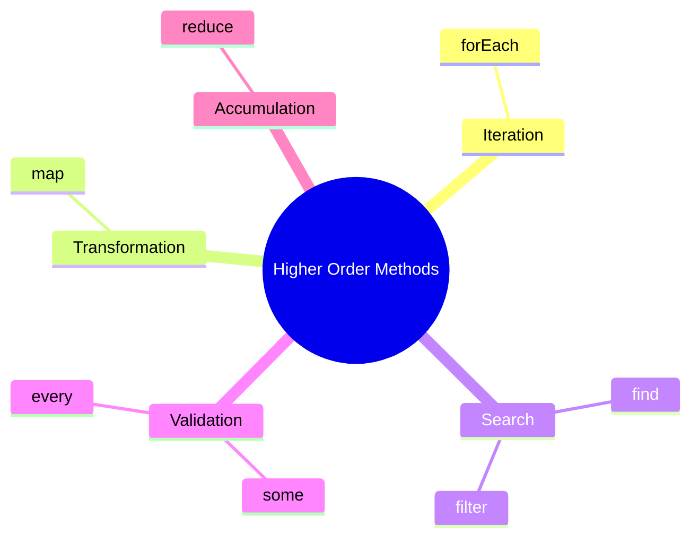

# Block 5: Higher Order Array Methods

> **Educational content by Bashar Alwarad**  
> javascript higher order array methods.

## Connect with Me [](https://www.linkedin.com/in/bashar-alwarad-2a960b1b6/)

---

## 📚 Higher Order Array Methods

**Higher-order functions** take other functions as arguments. Array methods like `map`, `filter`, and `reduce` use callbacks to transform data without manual loops.

```javascript
// Instead of this:
let nums = [1, 2, 3];
let doubled = [];
for (let i = 0; i < nums.length; i++) {
  doubled.push(nums[i] * 2);
}

// We can do this:
let doubled2 = nums.map((n) => n * 2);
console.log(doubled2); // [2, 4, 6]
```

---

## 📚 forEach() and map()

### forEach()

Executes a function for each element. **Does not return** a new array.

```javascript
let fruits = ['apple', 'banana', 'cherry'];

fruits.forEach((fruit, index) => {
  console.log(index, fruit);
});
// Output:
// 0 apple
// 1 banana
// 2 cherry

// Common use: side effects (logging, DOM updates)
fruits.forEach((fruit) => {
  console.log(`I like ${fruit}`);
});
```

### map()

Transforms each element and **returns a new array**.

```javascript
let numbers = [1, 2, 3, 4];

let squared = numbers.map((n) => n ** 2);
console.log(squared); // [1, 4, 9, 16]

let words = ['hi', 'bye'];
let lengths = words.map((w) => w.length);
console.log(lengths); // [2, 3]

// With objects
let users = [
  { name: 'Alice', age: 25 },
  { name: 'Bob', age: 30 },
];
let names = users.map((user) => user.name);
console.log(names); // ['Alice', 'Bob']
```

---

## 📚 find() and filter()

### find()

Returns the **first element** that matches the condition (or `undefined`).

```javascript
let ages = [12, 18, 25, 30];

let adult = ages.find((age) => age >= 18);
console.log(adult); // 18 (first match)

let users = [
  { id: 1, name: 'Alice' },
  { id: 2, name: 'Bob' },
];
let user = users.find((u) => u.id === 2);
console.log(user); // { id: 2, name: 'Bob' }
```

### filter()

Returns a **new array** with all elements that match the condition.

```javascript
let ages = [12, 18, 25, 30];

let adults = ages.filter((age) => age >= 18);
console.log(adults); // [18, 25, 30]

let numbers = [1, 2, 3, 4, 5, 6];
let evens = numbers.filter((n) => n % 2 === 0);
console.log(evens); // [2, 4, 6]

let users = [
  { name: 'Alice', active: true },
  { name: 'Bob', active: false },
  { name: 'Charlie', active: true },
];
let activeUsers = users.filter((u) => u.active);
console.log(activeUsers);
// [{ name: 'Alice', active: true }, { name: 'Charlie', active: true }]
```

---

## 📚 some() and every()

### some()

Returns `true` if **at least one** element passes the test.

```javascript
let ages = [12, 16, 18, 22];

let hasAdult = ages.some((age) => age >= 18);
console.log(hasAdult); // true

let numbers = [1, 3, 5];
let hasEven = numbers.some((n) => n % 2 === 0);
console.log(hasEven); // false
```

### every()

Returns `true` if **all** elements pass the test.

```javascript
let ages = [20, 25, 30];

let allAdults = ages.every((age) => age >= 18);
console.log(allAdults); // true

let numbers = [2, 4, 6];
let allEven = numbers.every((n) => n % 2 === 0);
console.log(allEven); // true

let mixed = [2, 3, 4];
let allEvenMixed = mixed.every((n) => n % 2 === 0);
console.log(allEvenMixed); // false
```

---

## 📚 reduce()

Reduces an array to a **single value** by applying a function cumulatively.

```javascript
// Syntax: array.reduce((accumulator, current) => { ... }, initialValue)

// Sum all numbers
let numbers = [1, 2, 3, 4];
let sum = numbers.reduce((acc, num) => acc + num, 0);
console.log(sum); // 10

// Find max
let max = numbers.reduce((acc, num) => (num > acc ? num : acc), numbers[0]);
console.log(max); // 4

// Count occurrences
let fruits = ['apple', 'banana', 'apple', 'cherry', 'banana', 'apple'];
let count = fruits.reduce((acc, fruit) => {
  acc[fruit] = (acc[fruit] || 0) + 1;
  return acc;
}, {});
console.log(count);
// { apple: 3, banana: 2, cherry: 1 }

// Flatten array
let nested = [[1, 2], [3, 4], [5]];
let flat = nested.reduce((acc, arr) => acc.concat(arr), []);
console.log(flat); // [1, 2, 3, 4, 5]

// Total price in cart
let cart = [
  { item: 'book', price: 10 },
  { item: 'pen', price: 2 },
  { item: 'bag', price: 25 },
];
let total = cart.reduce((acc, item) => acc + item.price, 0);
console.log(total); // 37
```

---

## Quick Summary



### Key Takeaways:

- ✅ **forEach**: iterate without returning (side effects).
- ✅ **map**: transform each element, return new array.
- ✅ **find**: return first match or `undefined`.
- ✅ **filter**: return all matches as new array.
- ✅ **some**: check if at least one passes.
- ✅ **every**: check if all pass.
- ✅ **reduce**: accumulate to a single value.
- ✅ All methods (except forEach) are **chainable**.

---

## Method Chaining Example

```javascript
let users = [
  { name: 'Alice', age: 17, active: true },
  { name: 'Bob', age: 25, active: false },
  { name: 'Charlie', age: 30, active: true },
  { name: 'David', age: 22, active: true },
];

let result = users
  .filter((u) => u.active) // keep active users
  .filter((u) => u.age >= 18) // keep adults
  .map((u) => u.name.toUpperCase()) // get names in uppercase
  .join(', '); // join to string

console.log(result); // "CHARLIE, DAVID"
```

---
