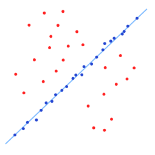
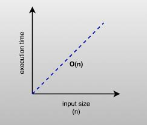
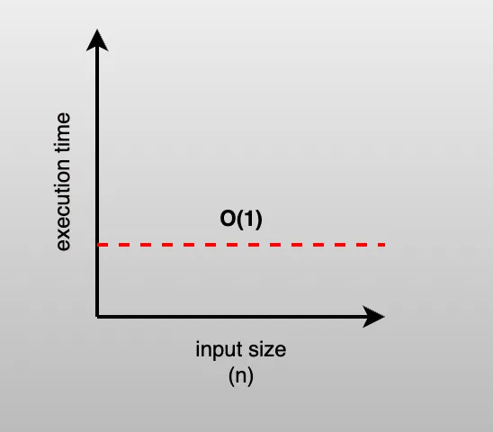
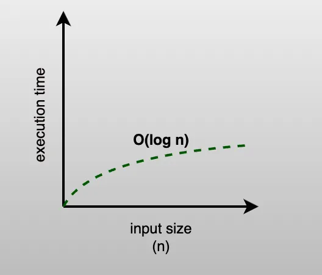
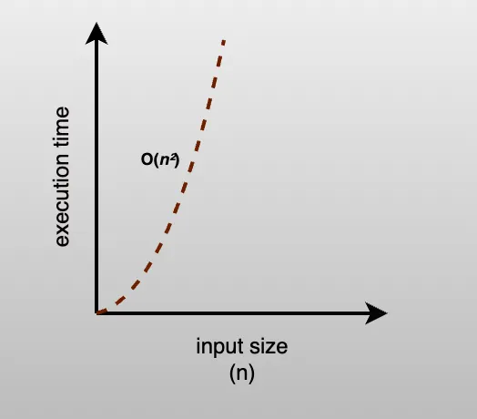

# 🧠 Algorithms 101 & Big O Notation

---

## 📌 What is an Algorithm?

An **algorithm** is a step-by-step set of instructions or rules designed to **solve a specific problem** or **perform a particular task**.

They are the foundation of computer science and programming, allowing us to process data and achieve outcomes efficiently and reliably.

---

## 🎯 Real-Life Problem: Guess the Number

We'll play a simple guessing game to learn different search strategies and understand how efficient each one is.

---

## 🎮 Game 1: Guess a Random Number (1–10)

Let's compare different methods to guess a secret number between 1 and 10.

### 1. 🧪 Random Guessing

This simulates guessing without any plan — just hoping to hit the right number.

```python
import random

def random_guess(secret_number):
    attempts = 0
    while True:
        guess = random.randint(1, 10)
        attempts += 1
        print(f"Random guess: {guess}")
        if guess == secret_number:
            print(f"Found {guess} in {attempts} tries!")
            break

random_guess(7)
```

> ⏱️ Time Complexity: **Unpredictable (average case: O(n))**



---

### 2. 🔁 Linear (Sequential) Search

Try every number from 1 to 10, one by one.

```python
def linear_guess(secret_number):
    for guess in range(1, 11):
        print(f"Trying {guess}")
        if guess == secret_number:
            print(f"Found it! The number is {guess}")
            return guess

linear_guess(7)
```

> ⏱️ Time Complexity: **O(n)**



### 3. ⛳ Constant Time `O(1)` (if we magically knew it)

In theory, constant time is when you know exactly where the target is — one operation.

```python
def constant_guess(secret_number):
    print(f"The number is {secret_number}!")

constant_guess(7)
```

> ⏱️ Time Complexity: **O(1)**



### 4. 📉 Binary Search (Smart Guessing)

Cut the range in half each time.

```python
def binary_guess(secret_number):
    low = 1
    high = 10
    steps = 0
    while low <= high:
        steps += 1
        mid = (low + high) // 2
        print(f"Step {steps}: Trying {mid}")
        if mid == secret_number:
            print(f"Found it! The number is {mid}")
            return mid
        elif mid < secret_number:
            low = mid + 1
        else:
            high = mid - 1

binary_guess(7)
```

> ⏱️ Time Complexity: **O(log n)**



### 5. 🌀 Quadratic Search (Nested Loops)

Try every possible pair of numbers (not efficient for guessing, but shows O(n²) behavior).

```python
def quadratic_guess(secret_number):
    attempts = 0
    for i in range(1, 11):
        for j in range(1, 11):
            attempts += 1
            print(f"Trying pair ({i}, {j})")
            if i == secret_number and j == secret_number:
                print(f"Found it! The number is {i}")
                print(f"Total attempts: {attempts}")
                return i

quadratic_guess(7)
```

> ⏱️ Time Complexity: **O(n²)**



## 🔁 All Algorithms Must:

1. Have **a clear starting point**
2. Follow **a defined series of steps**
3. Always **produce a result**
4. **Terminate** after a finite number of steps

---

## ⚙️ Algorithm Efficiency

We use **Big O notation** to describe how fast or slow an algorithm is.

### 1. Time Complexity

How the runtime grows with input size `n`.

### 2. Space Complexity

How much memory the algorithm uses.

---

## 🔤 Definitions

### 🔎 Linear Search

Searches items one by one.

> Time: O(n)

### 🧠 Binary Search

Searches by dividing the list in half each time.

```text
1. List must be ordered
2. Find the middle item
3. If it matches, return it
4. If target > middle, search right
5. If target < middle, search left
6. Repeat
```

> Time: O(log n)

---

### Linear Search Flow


### Binary Search Flow


---

## 🧠 Big O Cheat Sheet

| Big O      | Name        | Example                |
| ---------- | ----------- | ---------------------- |
| O(1)       | Constant    | Direct lookup          |
| O(log n)   | Logarithmic | Binary search          |
| O(n)       | Linear      | Loop through list      |
| O(n log n) | Quasilinear | Merge sort             |
| O(n²)      | Quadratic   | Nested loops           |
| O(n³)      | Cubic       | 3 nested loops         |
| O(2ⁿ)      | Exponential | Recursive combinations |
| O(n!)      | Factorial   | Permutations           |

---

## 🔢 Math Refreshment: The Essentials for Big O

To understand algorithm performance, we need to briefly review **three key math concepts**: **Exponents**, **Logarithms**, and **Factorials**.

---

## 1. 🧮 Exponents (Powers)

An **exponent** means multiplying a number by itself multiple times.

> `2^3 = 2 * 2 * 2 = 8`

- `2^4 = 16`
- `10^2 = 100`

### In Algorithms:

- Exponential growth (e.g., `O(2^n)`) means the algorithm **doubles in work** every time the input grows by 1.
- Very **slow** for big inputs — avoid if possible!

---

## 2. 🧠 Logarithms — The Inverse of Powers

A **logarithm** answers the question:

> _“To what power must we raise a number to get another number?”_

### Example:

> `log₂(8) = 3` because `2^3 = 8`

> `log₁₀(1000) = 3` because `10^3 = 1000`

### In Algorithms:

- Binary search runs in `O(log₂ n)` time
- That means if you double the input size, you only add **one extra step**

| Input size `n` | log₂(n) (approx steps) |
| -------------- | ---------------------- |
| 10             | 4                      |
| 100            | 7                      |
| 1,000          | 10                     |
| 1,000,000      | 20                     |

✅ **Logarithmic time is very efficient!**

---

## 3. 🎡 Factorials — "All Possible Orders"

The **factorial of `n`** is the product of all numbers from `n` to `1`.

```python
# In Python
import math
print(math.factorial(4))  # Output: 24
```

### Examples:

- `3! = 3 × 2 × 1 = 6`
- `4! = 4 × 3 × 2 × 1 = 24`
- `5! = 5 × 4 × 3 × 2 × 1 = 120`

### In Algorithms:

Used in problems where we check **every possible combination** — like brute-force password cracking or solving traveling salesman problems.

> Time complexity: **O(n!)** → **Very slow** — avoid for large `n`!

---

### 💡 Comparing Growth Rates Visually

| `n` | `log n` | `n` | `n log n` | `n²` | `2ⁿ` |    `n!` |
| --- | ------: | --: | --------: | ---: | ---: | ------: |
| 1   |       0 |   1 |         0 |    1 |    2 |       1 |
| 5   |   \~2.3 |   5 |    \~11.6 |   25 |   32 |     120 |
| 10  |   \~3.3 |  10 |      \~33 |  100 | 1024 | 3628800 |
| 20  |   \~4.3 |  20 |      \~86 |  400 |  1M+ | 2.4e+18 |

---

## ✨ Takeaway

| Concept   | Growth Type       | Examples in Algorithms            | Good or Bad?              |
| --------- | ----------------- | --------------------------------- | ------------------------- |
| `log n`   | Very slow growth  | Binary search, Tree traversal     | ✅ Very good              |
| `n`       | Linear growth     | Linear search, loops              | ✅ Acceptable             |
| `n log n` | Efficient sorting | Merge sort, Heap sort             | ✅ Efficient              |
| `n²`      | Quadratic         | Nested loops, bubble sort         | ⚠️ Slower                 |
| `2ⁿ`      | Exponential       | Recursive brute force             | ❌ Very slow              |
| `n!`      | Combinatorial     | All permutations, TSP brute force | ❌ Unusable for large `n` |

---

Would you like this turned into a visual chart using Mermaid or a Python-based plot?

---

## 🏁 Summary

- Algorithms are structured problem solvers.
- Big O measures performance.
- Smart algorithms (like binary search) are much faster than brute force.
- Understanding efficiency helps write better, faster code.

---
