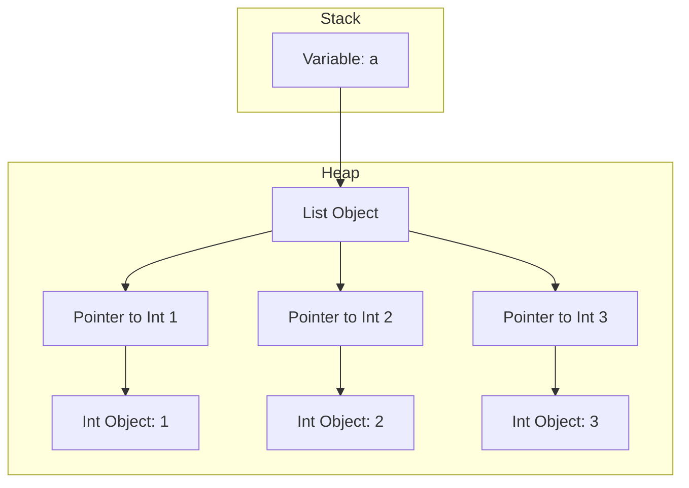
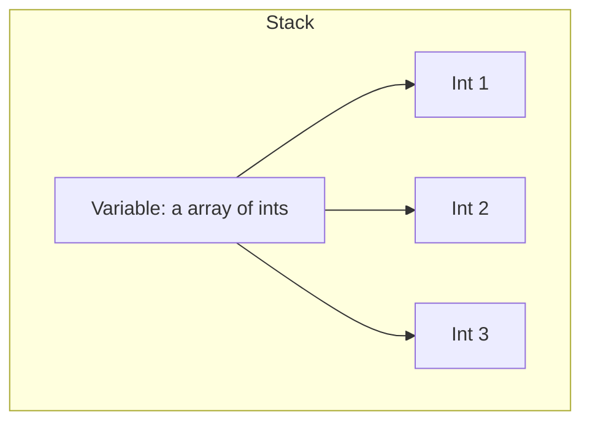
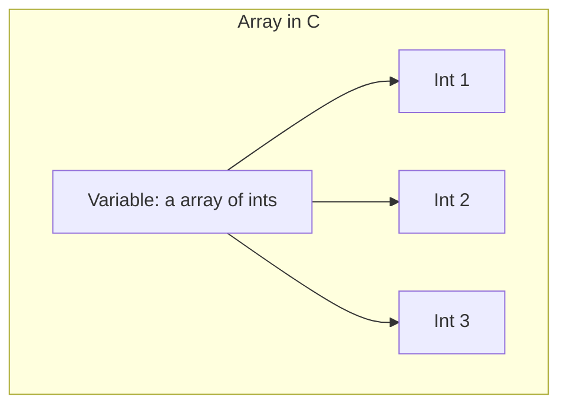
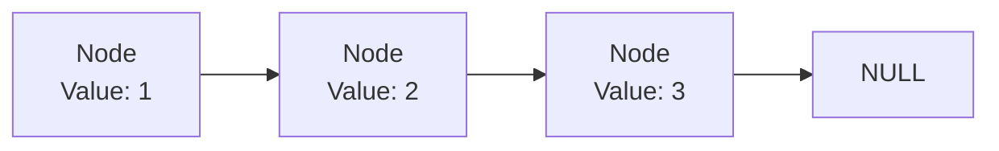
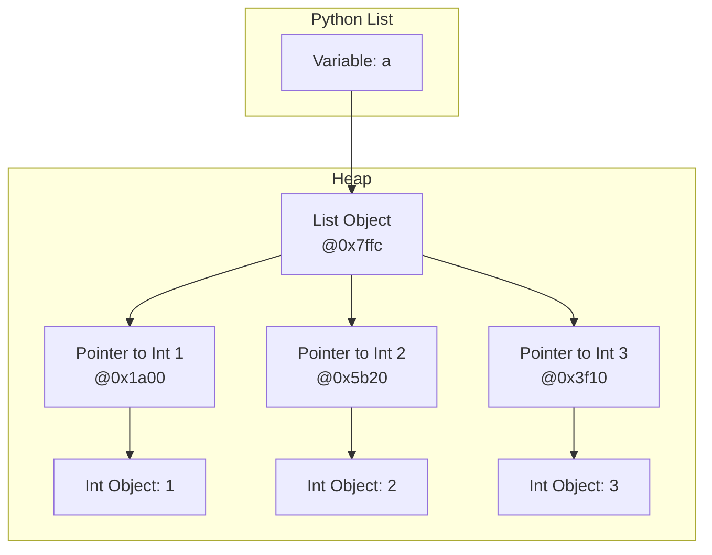
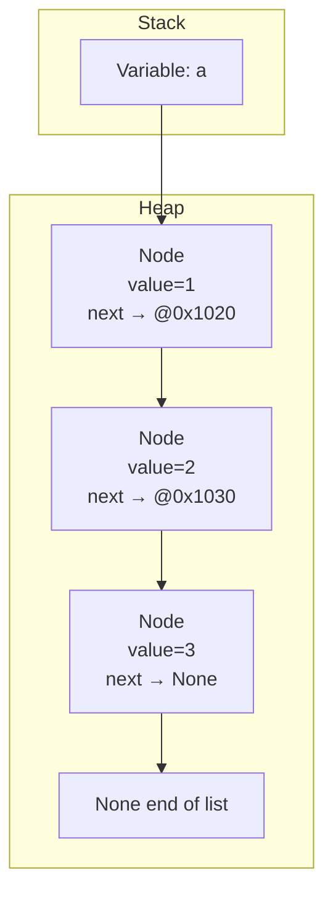
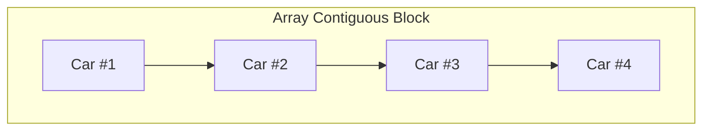
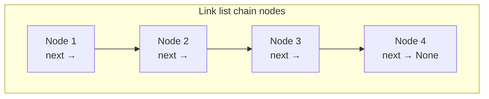
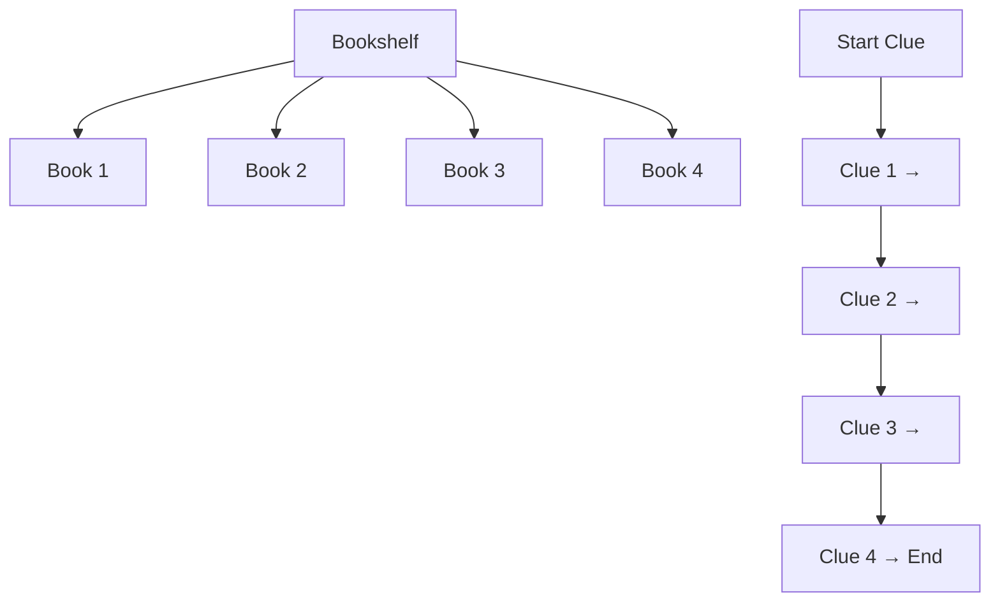

# 📊 Data Structures in Python: Arrays Deep Dive

Welcome to this lesson on **arrays** in Python. We’ll explore how arrays work, how they compare to C arrays and linked lists, and when to use them effectively. This includes Python’s built-in `list`, `array.array`, and memory diagrams to visualize the difference.

---

## 🧠 What You Will Learn

- How Python arrays (`list`, `array.array`) work in memory.
- Differences between arrays in Python and C.
- Arrays vs linked lists (in Python and C).
- Performance comparison using real code.
- When to use lists, arrays, or linked lists.

---

## 🧬 How Arrays Work in Python

### Python List in Memory



✅ Flexible, dynamic, heterogeneous.
⚠️ Slower for large numerical data due to storing references, not values.

---

## 🧮 Array in C



✅ Fast, efficient memory layout.
⚠️ Fixed type and size, no built-in resizing.

---

## 🔗 Arrays vs Linked Lists in C

### Array in C



### Singly Linked List in C



---

## 🐍 Arrays vs Linked Lists in Python

### Python List



### Manually Built Linked List



⚠️ Python does **not** have a built-in linked list. We typically implement one using classes.
✅ For efficient double-ended queues, use `collections.deque`.

---

## 🧠 Comparison Table

| Feature                    | Python List                        | Python `array.array`                |
| -------------------------- | ---------------------------------- | ----------------------------------- |
| **Memory layout**          | List of pointers to objects        | Contiguous block of primitive types |
| **Heterogeneous elements** | ✅ Yes                             | ❌ No (typed)                       |
| **Storage**                | References to separate objects     | Values packed in memory             |
| **Speed**                  | Slower (more flexible)             | Faster for numeric data             |
| **Dynamic resizing**       | ✅ Yes (over-allocated internally) | ✅ Yes (less efficient resizing)    |
| **Use case**               | General-purpose containers         | Efficient numeric data              |

---

## 🚂 Real-World Analogy: Train

- **Array**: like train cars **attached tightly**, all moving together in one block (contiguous).
- **Linked List**: like train cars **with gaps**, where each car knows only its neighbor.

---

## 🚂 Real-World Analogies: Understanding Arrays vs Linked Lists

Real-world analogies help us _visualize_ how data structures work behind the scenes.

### 📦 Analogy 1: **Train Cars**

| Structure       | Analogy                                                                   | Concept Highlighted                       |
| --------------- | ------------------------------------------------------------------------- | ----------------------------------------- |
| **Array**       | 🚂 A train where cars are tightly attached, fixed in order                | **Contiguous memory**, fast random access |
| **Linked List** | 🚋 Train cars connected loosely, each with a note saying where to go next | **Node chaining**, sequential access      |





---

### 📚 Analogy 2: **Bookshelf vs Scavenger Hunt**

| Structure       | Analogy                                            | Concept Highlighted             |
| --------------- | -------------------------------------------------- | ------------------------------- |
| **Array**       | 📚 A bookshelf where you can directly grab book #5 | **Indexing (O(1))**             |
| **Linked List** | 🕵️ A scavenger hunt: each clue leads to the next   | **Sequential traversal (O(n))** |



---

### 🗺️ Analogy 3: **Subway Map**

- **Array**: Like a straight line train. You know exactly how many stops and can jump directly to stop #7.
- **Linked List**: Like a subway system where each station shows where the next one is. You must follow the path.

---

## 💬 Summary of Key Differences

| Feature                | Array                          | Linked List                 |
| ---------------------- | ------------------------------ | --------------------------- |
| **Memory layout**      | Contiguous block               | Scattered nodes             |
| **Access time**        | O(1) random access             | O(n) sequential             |
| **Insertion/Deletion** | Slow (needs shifting elements) | Fast (just update pointers) |
| **Resizing**           | Needs new allocation           | Dynamically grows           |
| **Pointer overhead**   | None                           | Extra memory for links      |

---

---

## 🧪 Hands-on with `array.py`

```python
from array import array
import sys, random, time

# array.array is typed and contiguous
x = array("i", (1, 2, 3, 4))
for i in x:
    print(f"value: {i} | address: {id(i)}")
print(type(x), isinstance(x, array), isinstance(x, list), id(x))

# Python list is flexible and dynamic
my_list = [1, 2, 3, 4]
my_list.insert(0, 0)
my_list.insert(3, 9)
my_list.append(5)
for i in my_list:
    print(f"value: {i} | address: {id(i)}")

# Memory over-allocation in list
a = []
print(sys.getsizeof(a))  # bytes
a.append(1)
print(sys.getsizeof(a))
a.append(2)
print(sys.getsizeof(a))

# Performance comparison: list vs dict
size = 1_000_000
data_list = list(range(size))
data_dict = {i: True for i in range(size)}
search_item = random.randint(0, size - 1)

start_time = time.time()
found = search_item in data_list
print(f"List search: {found} | Time: {time.time() - start_time:.6f}s")

start_time = time.time()
found = search_item in data_dict
print(f"Dict search: {found} | Time: {time.time() - start_time:.6f}s")
```

---

## 📊 Bonus: NumPy Arrays

```python
import numpy as np

arr = np.array([1, 2, 3, 4])
print(arr, arr.dtype, arr.shape)
```

- ✅ Fast numerical computation
- ✅ True C-style contiguous memory
- ❌ Fixed type and shape

---

## 🔁 `deque`: Python’s Efficient Double-Ended List

```python
from collections import deque

d = deque([1, 2, 3])
d.appendleft(0)
d.append(4)
print(d)
```

- ✅ O(1) insertions/removals at both ends
- ❌ Slower random access than list

---

## ⚡ Performance Cheatsheet

| Operation      | Python List | `deque` | Linked List (manual) |
| -------------- | ----------- | ------- | -------------------- |
| Append (end)   | O(1)\*      | O(1)    | O(1)                 |
| Insert (start) | O(n)        | O(1)    | O(1)                 |
| Search         | O(n)        | O(n)    | O(n)                 |
| Random Access  | O(1)        | O(n)    | O(n)                 |

---

## 🧠 Key Takeaways

- Use **lists** for general-purpose containers where flexibility is needed.
- Use `array.array` or **NumPy arrays** for numeric performance.
- Use **linked lists** or `deque` for frequent insert/delete at ends.
- Python lists store **references**, not values. C arrays are **contiguous**.
- Data structure choice affects performance, readability, and memory.

---
