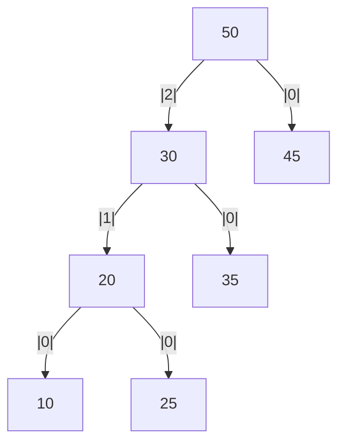
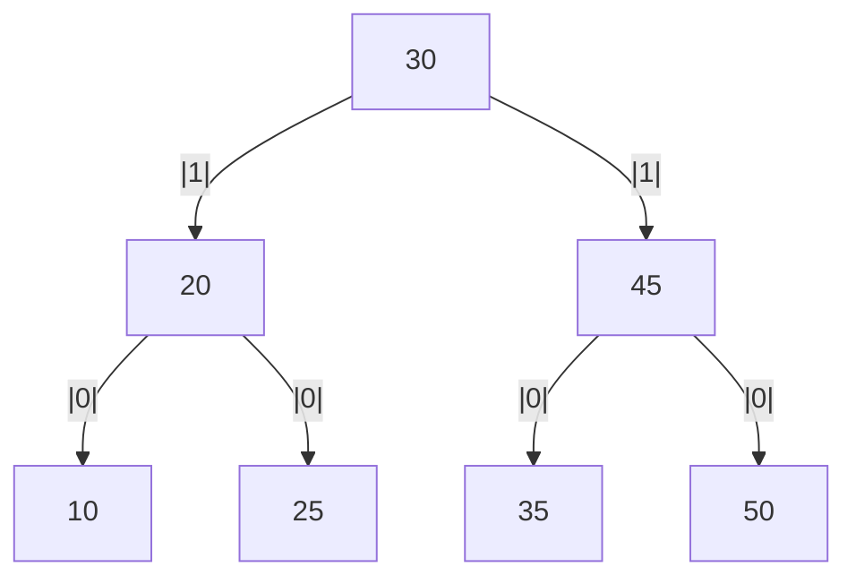
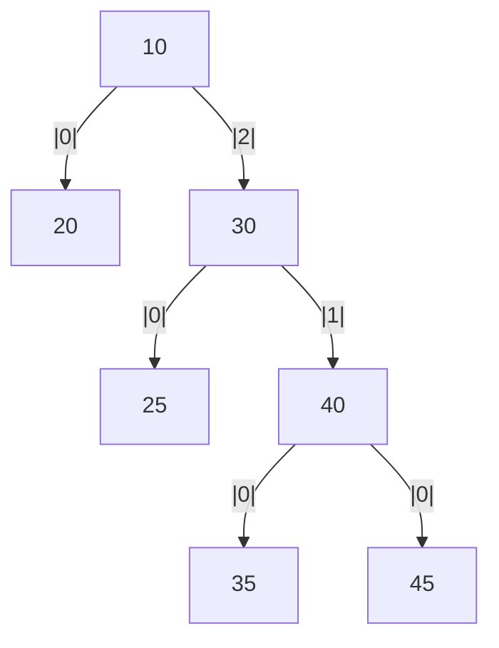
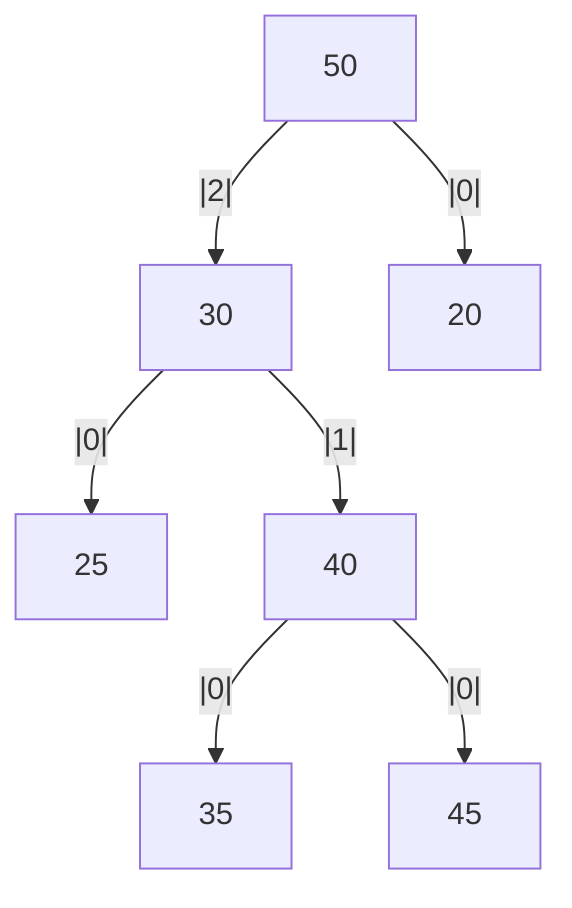
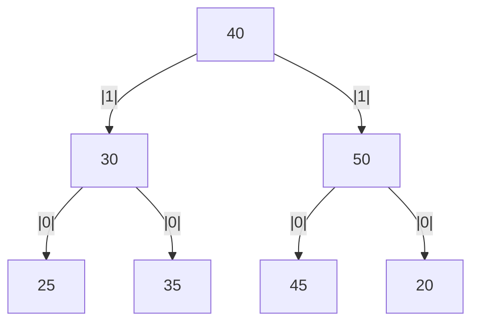
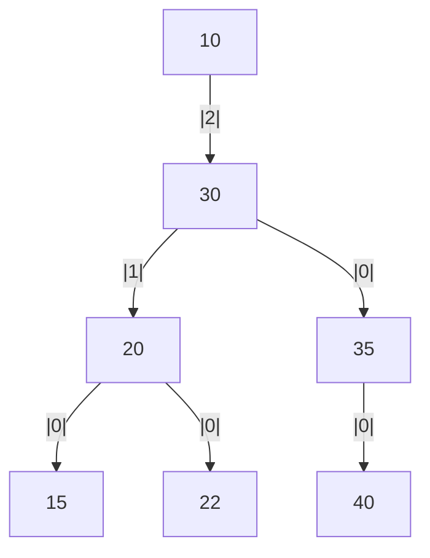
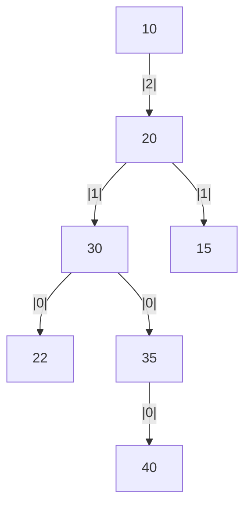
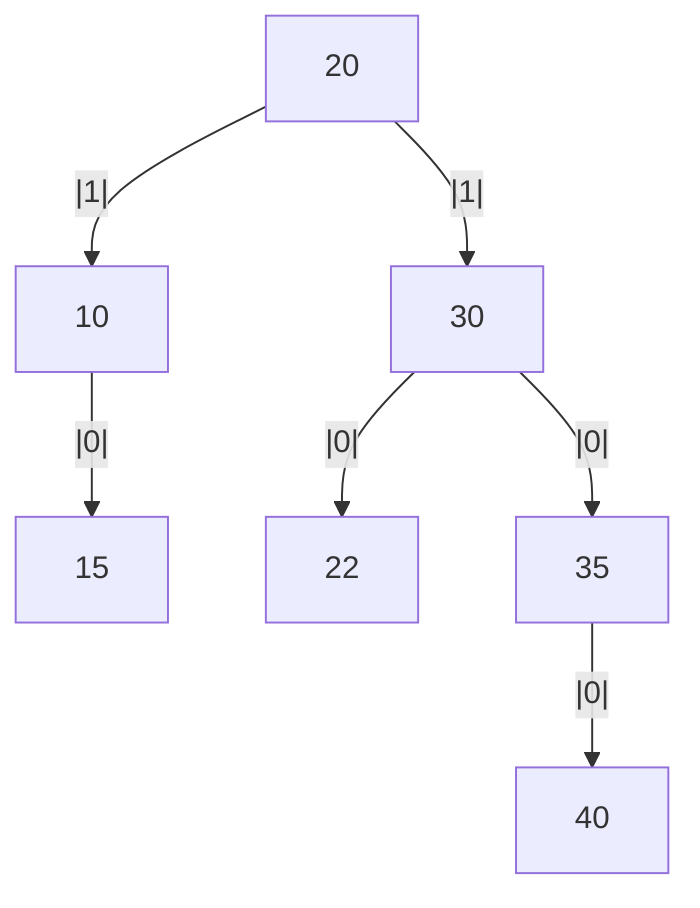

# AVL Tree Rotations – Fixing Unbalanced Trees

AVL Trees are **self-balancing Binary Search Trees**. When nodes are inserted or deleted, the tree may become **unbalanced**. To restore balance, **rotations** are applied.

Each case includes:

- Trees with multiple levels
- Realistic subtrees (instead of placeholders)
- Edge weights labeled by level (`|0|` at leaves, incrementing upward)

---

## 1. LL (Left-Left) Imbalance

### 🔴 Problem:

Inserting a node into the **left subtree of the left child** creates a left-heavy imbalance.

### 🧠 Before Insertion:



- Node `20` inserted → imbalance at `50` (balance factor > 1)

### ✅ Solution: **Right Rotation on 50**



---

## 2. RR (Right-Right) Imbalance

### 🔴 Problem:

Inserting a node into the **right subtree of the right child** creates a right-heavy imbalance.

### 🧠 Before Insertion:



- Node `40` inserted → imbalance at `10` (balance factor < -1)

### ✅ Solution: **Left Rotation on 10**


---

## 3. LR (Left-Right) Imbalance

### 🔴 Problem:

A node is inserted into the **right subtree of the left child**, forming a zig-zag.

### 🧠 Before Insertion:



- Node `40` inserted → imbalance at `50`

### ✅ Solution:

#### Step 1: **Left Rotation on 30**


#### Step 2: **Right Rotation on 50**



---

## 4. RL (Right-Left) Imbalance

### 🔴 Problem:

A node is inserted into the **left subtree of the right child**, forming a mirrored zig-zag.

### 🧠 Before Insertion:



- Node `20` inserted → imbalance at `10`

### ✅ Solution:

#### Step 1: **Right Rotation on 30**



#### Step 2: **Left Rotation on 10**



```mermaid
%% graph TD
%%     C((20))
%%     A[10]
%%     B[30]
%%     D[15]
%%     E[22]
%%     F[35]
%%     G([40])

%%     C --|1| --> A
%%     C --|1| --> B
%%     A --|0| --> D
%%     B --|0| --> E
%%     B --|0| --> F
%%     F --|0| --> G

%%     linkStyle 0 stroke:#ff0000,stroke-width:5px
%%     linkStyle 5 stroke:#0000ff,stroke-width:2px
```

---

## 🌳 Summary of Rotations

| Imbalance | Tree Shape           | Fix                       |
| --------- | -------------------- | ------------------------- |
| LL        | Heavy on left-left   | **Right Rotation**        |
| RR        | Heavy on right-right | **Left Rotation**         |
| LR        | Zig-zag left-right   | **Left → Right Rotation** |
| RL        | Zig-zag right-left   | **Right → Left Rotation** |

AVL Trees guarantee **O(log n)** operations for **search, insert, delete** by keeping the height difference between subtrees at most **1** through timely rebalancing.
