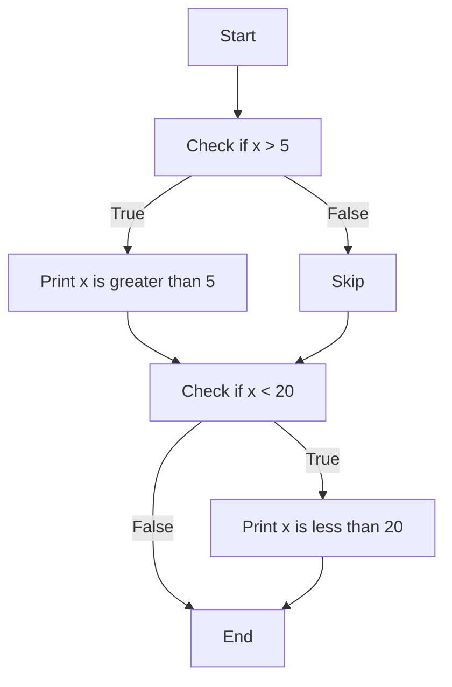
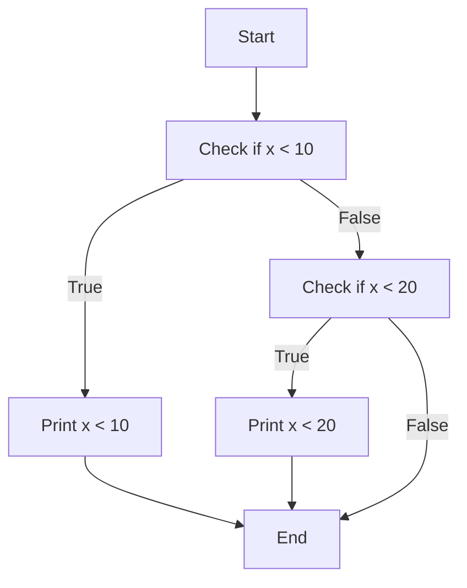
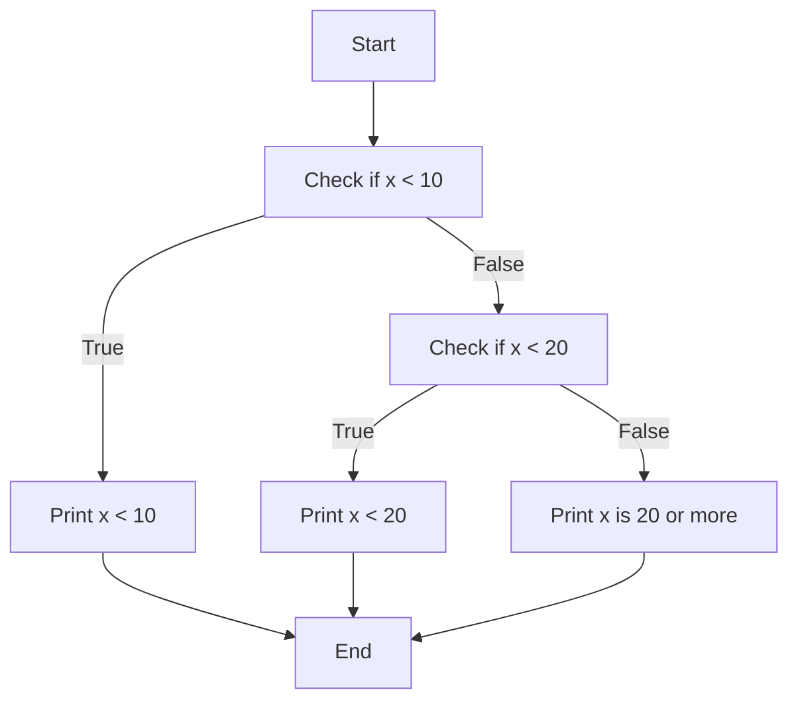
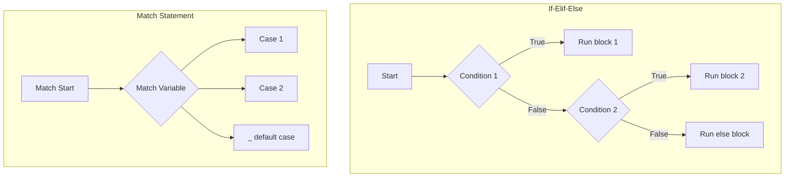

<nav>
    <ul>
        <li><a href="./README.md">Intro</a></li>
        <li><a href="./STRING.md">String</a></li>
        <li><a href="./DEF.md">Def</a></li>
        <li><a href="./CONDITIONALS.md">Conditionals</a></li>
    </ul>
</nav>

# Python Comparisons and Conditionals

## `> < >= <= == !=`

These are comparison operators used in Python:

| Operator | Description           | Example  | Result  |
| -------- | --------------------- | -------- | ------- |
| `>`      | Greater than          | `5 > 3`  | `True`  |
| `<`      | Less than             | `2 < 4`  | `True`  |
| `>=`     | Greater than or equal | `5 >= 5` | `True`  |
| `<=`     | Less than or equal    | `3 <= 2` | `False` |
| `==`     | Equal to              | `7 == 7` | `True`  |
| `!=`     | Not equal to          | `6 != 5` | `True`  |

---

## `if`

The `if` statement runs a block of code only if a condition is `True`.

```python
x = 10
if x > 5:
    print("x is greater than 5")
```

---

## Boolean

A Boolean value is either `True` or `False`. You can use it to control flow.

```python
is_hot = True

if is_hot:
    print("It's hot outside!")
```

---

## Create two inputs from the user and compare them in `if`

```python
a = int(input("Enter first number: "))
b = int(input("Enter second number: "))

if a > b:
    print("First number is greater.")
```

---

## Use multi `if` statements

```python
x = 10

if x > 5:
    print("x is greater than 5")

if x < 20:
    print("x is less than 20")
```

---

## Show in chart the flow of multi `if` statements



---

## `elif`

`elif` stands for "else if" and checks another condition if the previous `if` is `False`.

```python
x = 15

if x < 10:
    print("x is less than 10")
elif x < 20:
    print("x is less than 20")
```

---

## Show in chart the flow of `if` and `elif`



---

## `else`

`else` runs if none of the `if` or `elif` conditions are met.

```python
x = 25

if x < 10:
    print("x is less than 10")
elif x < 20:
    print("x is less than 20")
else:
    print("x is 20 or more")
```

---

## Show in chart the flow of `if`, `elif` and `else`



---

## Multi conditions `if x < y or x > y:`

```python
x = 5
y = 10

if x < y or x > y:
    print("x and y are not equal")
```

---

## Function `grade()`

```python
def grade(score):
    if 90 <= score <= 100:
        return "A"
    elif 80 <= score < 90:
        return "B"
    elif 70 <= score < 80:
        return "C"
    elif 60 <= score < 70:
        return "D"
    else:
        return "F"
```

---

## Chain conditions `if 90 <= score <= 100: `

Python allows chaining comparisons:

```python
score = 85

if 80 <= score <= 90:
    print("Score is between 80 and 90")
```

---

## Parity: Even vs Odd Numbers

```python
number = int(input("Enter a number: "))

if number % 2 == 0:
    print("Even")
else:
    print("Odd")
```

---

## `return True if n % 2 == 0 else False`

```python
def is_even(n):
    return True if n % 2 == 0 else False
```

---

## `return (n % 2 == 0)`

Same logic in a simpler way:

```python
def is_even(n):
    return n % 2 == 0
```

---

## `match` example about the students

### 1. Build the example using `if elif else`

```python
student = "John"

if student == "John":
    print("Excellent!")
elif student == "Jane":
    print("Good job!")
elif student == "Mike":
    print("Needs improvement.")
else:
    print("Unknown student")
```

---

### 2. Rebuild the example using `match`

```python
student = "John"

match student:
    case "John":
        print("Excellent!")
    case "Jane":
        print("Good job!")
    case "Mike":
        print("Needs improvement.")
    case _:
        print("Unknown student")
```

---

### 3. Use `|` in `match`

```python
student = "John"

match student:
    case "John" | "Gorge":
        print("Group A")
    case "Jane" | "Lina":
        print("Group B")
    case _:
        print("Group Unknown")
```

---

### 4. Use `_` (wildcard)

```python
subject = "Math"

match subject:
    case "Math":
        print("Numbers and logic")
    case "Science":
        print("Experiments and theories")
    case _:
        print("Subject not recognized")
```

---

## When to Use `if`, `if-elif-else`, or `match`

| Scenario                                   | Best Choice            | Reason                                                          |
| ------------------------------------------ | ---------------------- | --------------------------------------------------------------- |
| One or two conditions                      | `if`                   | Simple and clear                                                |
| Multiple conditions with priority          | `if-elif-else`         | Easy to read and efficient for decision chains                  |
| Comparing a single variable to many values | `match` (Python 3.10+) | Cleaner syntax and better for handling enums, commands, options |
| Complex boolean logic                      | `if` or `if-elif`      | Allows combining conditions with `and`, `or`, etc.              |

---

### Comparison Flow Diagram: `if`, `if-elif`, `if-elif-else`, `match`


