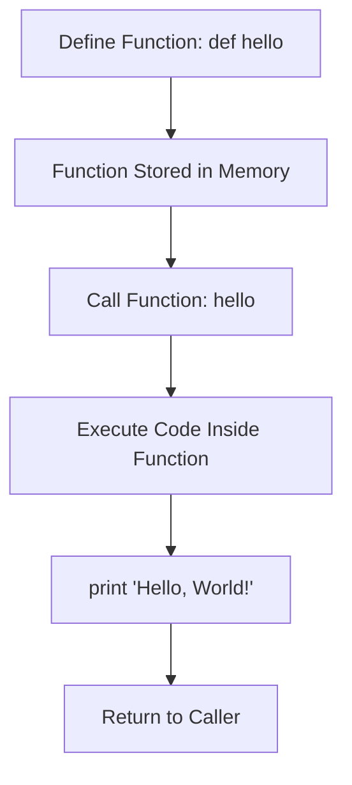
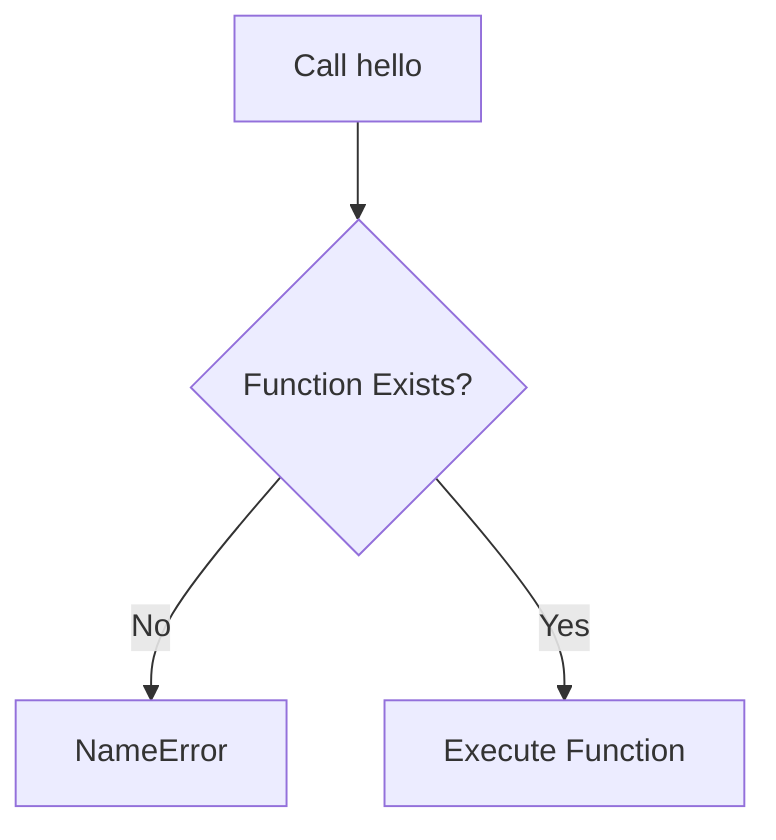
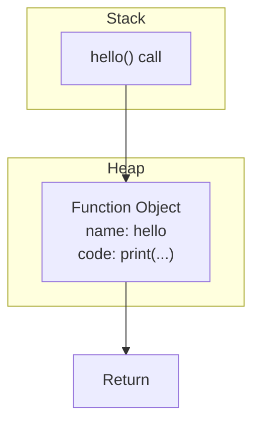
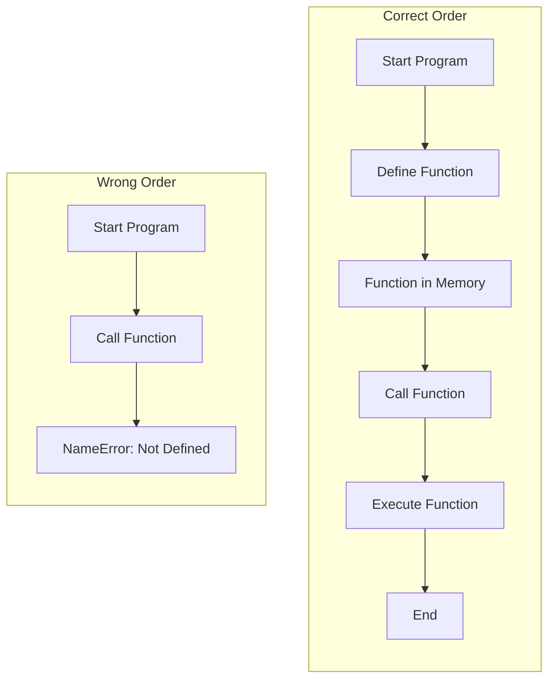
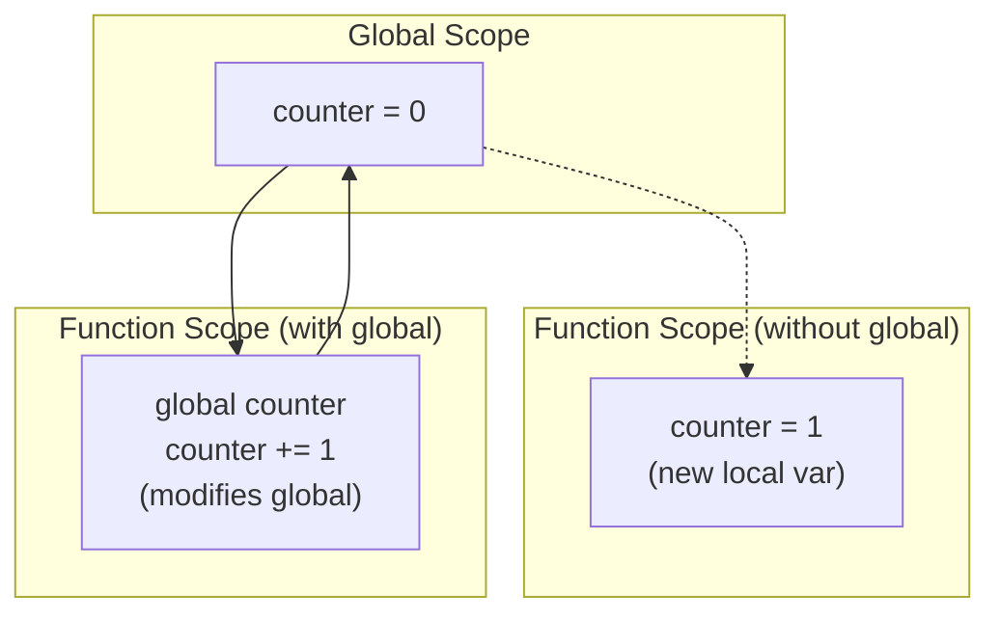
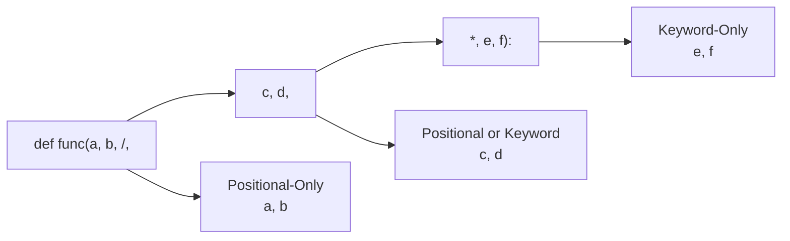
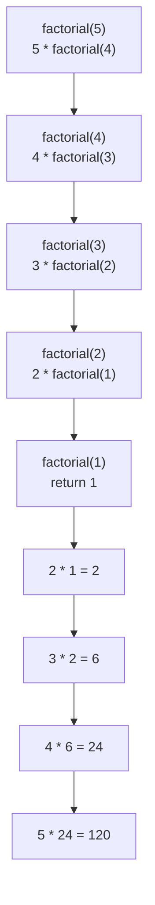
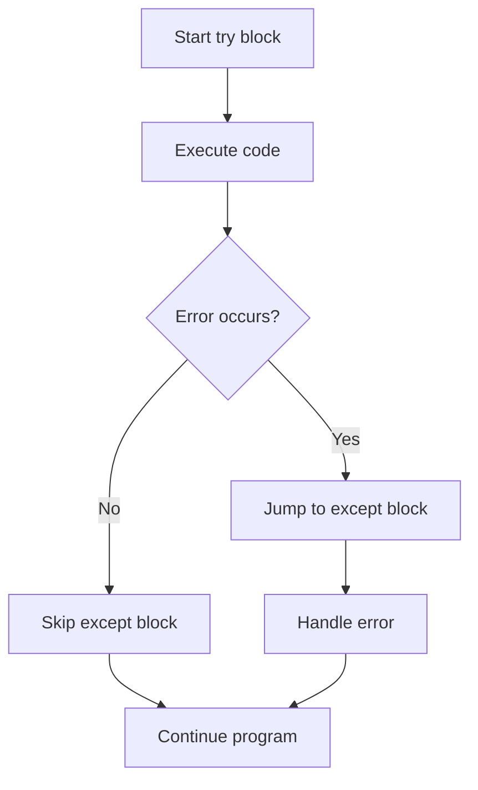
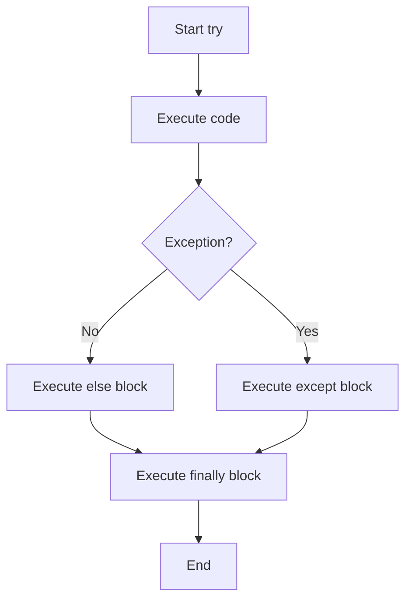

<nav>
    <ul>
        <li><a href="./README.md">Intro</a></li>
        <li><a href="./STRING.md">String</a></li>
        <li><a href="./DEF.md">Def</a></li>
        <li><a href="./CONDITIONALS.md">Conditionals</a></li>
        <li><a href="./DICT.md">Dictionary</a></li>
        <li><a href="./LOOP.md">Loops</a></li>
    </ul>
</nav>

# 🔧 Python Functions

Welcome! This guide covers Python functions from basics to advanced concepts. You'll learn how to create, call, and use functions effectively to write clean, reusable code.

---

## 📌 What is a Function?

A **function** is a reusable block of code that performs a specific task. Functions help you:

- **Organize** your code into logical sections
- **Reuse** code without repetition (DRY - Don't Repeat Yourself)
- **Debug** more easily by isolating functionality
- **Read** code more clearly with descriptive names

Python provides built-in functions like `print()`, `len()`, `input()`, and you can create your own!

---

## ✨ Creating Your First Function

### Basic Function Syntax

```python
def function_name():
    # code to execute
```

### Example: Hello Function

```python
def hello():
    print("Hello, World!")

# Call the function
hello()

# Output:
# Hello, World!
```

### Function Flow



---

## 🚫 Calling a Non-Existent Function

What happens if you call a function that doesn't exist?

```python
# This will cause an error!
# hello()

# Output:
# NameError: name 'hello' is not defined
```



---

## 💾 Functions in Memory

When you define a function, Python stores it in memory for later use.



---

## 📥 Parameters and Arguments

**Parameters** are variables in the function definition.  
**Arguments** are the actual values passed when calling the function.

### Function with Parameters

```python
def greet(name):  # 'name' is a parameter
    print(f"Hello, {name}!")

# Call with argument
greet("Alice")    # "Alice" is an argument
greet("Bob")

# Output:
# Hello, Alice!
# Hello, Bob!
```

### Multiple Parameters

```python
def add(a, b):
    result = a + b
    print(f"{a} + {b} = {result}")

add(5, 3)
add(10, 20)

# Output:
# 5 + 3 = 8
# 10 + 20 = 30
```

---

## 🎯 Parameters vs Arguments

| Term          | Definition                      | Example            |
| ------------- | ------------------------------- | ------------------ |
| **Parameter** | Variable in function definition | `def greet(name):` |
| **Argument**  | Value passed to function        | `greet("Alice")`   |

---

## 🎁 Default Parameter Values

You can set default values for parameters. If no argument is provided, the default is used.

### Default Values

```python
def greet(name="Guest"):
    print(f"Hello, {name}!")

greet("Alice")  # Uses "Alice"
greet()         # Uses default "Guest"

# Output:
# Hello, Alice!
# Hello, Guest!
```

### Multiple Defaults

```python
def create_profile(name="Unknown", age=0, city="Berlin"):
    print(f"Name: {name}, Age: {age}, City: {city}")

create_profile("Alice", 25, "Munich")
create_profile("Bob", 30)
create_profile("Charlie")
create_profile()

# Output:
# Name: Alice, Age: 25, City: Munich
# Name: Bob, Age: 30, City: Berlin
# Name: Charlie, Age: 0, City: Berlin
# Name: Unknown, Age: 0, City: Berlin
```

---

## 📝 Named Arguments (Keyword Arguments)

You can specify arguments by parameter name, allowing any order.

```python
def introduce(name, age, city):
    print(f"I'm {name}, {age} years old, from {city}")

# Positional arguments
introduce("Alice", 25, "Hamburg")

# Named arguments (any order)
introduce(city="Frankfurt", name="Bob", age=30)
introduce(age=28, city="Stuttgart", name="Charlie")

# Output:
# I'm Alice, 25 years old, from Hamburg
# I'm Bob, 30 years old, from Frankfurt
# I'm Charlie, 28 years old, from Stuttgart
```

---

## 🔄 Function Definition Order

In Python, you must **define** a function before you **call** it.

### ❌ Wrong Order

```python
# This will cause an error!
# hello()  # Called before definition

# def hello():
#     print("Hello!")

# Output:
# NameError: name 'hello' is not defined
```

### ✅ Correct Order

```python
# Define first
def hello():
    print("Hello!")

# Then call
hello()

# Output:
# Hello!
```

### Function Order Flow



---

## 🌍 Scope: Local vs Global

**Scope** determines where a variable can be accessed.

### Local Scope

Variables defined inside a function are **local** - only accessible within that function.

```python
def my_function():
    x = 10  # Local variable
    print(f"Inside function: x = {x}")

my_function()
# print(x)  # Error! x doesn't exist outside function

# Output:
# Inside function: x = 10
```

### Global Scope

Variables defined outside functions are **global** - accessible everywhere.

```python
x = 10  # Global variable

def my_function():
    print(f"Inside function: x = {x}")

my_function()
print(f"Outside function: x = {x}")

# Output:
# Inside function: x = 10
# Outside function: x = 10
```

---

## 🌐 The `global` Keyword

To modify a global variable inside a function, use the `global` keyword.

### Without global (Creates Local Variable)

```python
counter = 0  # Global

def increment():
    counter = 1  # Creates NEW local variable
    print(f"Inside: {counter}")

increment()
print(f"Outside: {counter}")

# Output:
# Inside: 1
# Outside: 0  # Global unchanged!
```

### With global (Modifies Global Variable)

```python
counter = 0  # Global

def increment():
    global counter  # Use global variable
    counter += 1
    print(f"Inside: {counter}")

increment()
increment()
print(f"Outside: {counter}")

# Output:
# Inside: 1
# Inside: 2
# Outside: 2  # Global modified!
```

### Global Scope Visualization



---

## 🔙 Return Values

Functions can send data back to the caller using `return`.

### Basic Return

```python
def add(a, b):
    return a + b

result = add(5, 3)
print(result)

# Output: 8
```

### Return vs Print

```python
def add_print(a, b):
    print(a + b)  # Prints but returns None

def add_return(a, b):
    return a + b  # Returns value

# Print version
result1 = add_print(5, 3)  # Prints: 8
print(f"Result: {result1}")  # Result: None

# Return version
result2 = add_return(5, 3)  # Silent
print(f"Result: {result2}")  # Result: 8
```

### Multiple Return Values

```python
def get_name():
    first = "John"
    last = "Doe"
    return first, last  # Returns tuple

first_name, last_name = get_name()
print(f"{first_name} {last_name}")

# Output: John Doe
```

### Early Return

```python
def check_age(age):
    if age < 18:
        return "Too young"
    if age > 65:
        return "Senior"
    return "Adult"

print(check_age(15))  # Too young
print(check_age(30))  # Adult
print(check_age(70))  # Senior
```

---

## 📊 Function Examples

### Example 1: Calculator

```python
def calculator(a, b, operation):
    if operation == "add":
        return a + b
    elif operation == "subtract":
        return a - b
    elif operation == "multiply":
        return a * b
    elif operation == "divide":
        if b != 0:
            return a / b
        else:
            return "Error: Division by zero"
    else:
        return "Invalid operation"

print(calculator(10, 5, "add"))       # 15
print(calculator(10, 5, "subtract"))  # 5
print(calculator(10, 5, "multiply"))  # 50
print(calculator(10, 5, "divide"))    # 2.0
```

### Example 2: Grade Calculator

```python
def calculate_grade(score):
    if score < 0 or score > 100:
        return "Invalid score"
    elif score >= 90:
        return "A"
    elif score >= 80:
        return "B"
    elif score >= 70:
        return "C"
    elif score >= 60:
        return "D"
    else:
        return "F"

students = [
    ("Alice", 95),
    ("Bob", 82),
    ("Charlie", 78),
    ("Diana", 91)
]

for name, score in students:
    grade = calculate_grade(score)
    print(f"{name}: {score} -> {grade}")

# Output:
# Alice: 95 -> A
# Bob: 82 -> B
# Charlie: 78 -> C
# Diana: 91 -> A
```

### Example 3: Temperature Converter

```python
def celsius_to_fahrenheit(celsius):
    return (celsius * 9/5) + 32

def fahrenheit_to_celsius(fahrenheit):
    return (fahrenheit - 32) * 5/9

# Test conversions
print(f"0°C = {celsius_to_fahrenheit(0)}°F")
print(f"100°C = {celsius_to_fahrenheit(100)}°F")
print(f"32°F = {fahrenheit_to_celsius(32)}°C")
print(f"212°F = {fahrenheit_to_celsius(212)}°C")

# Output:
# 0°C = 32.0°F
# 100°C = 212.0°F
# 32°F = 0.0°C
# 212°F = 100.0°C
```

---

## 🎨 Advanced Function Features

### 1. \*args - Variable Number of Arguments

```python
def sum_all(*numbers):
    total = 0
    for num in numbers:
        total += num
    return total

print(sum_all(1, 2, 3))           # 6
print(sum_all(10, 20, 30, 40))    # 100
print(sum_all(5))                 # 5
```

### 2. \*\*kwargs - Keyword Arguments

```python
def print_info(**info):
    for key, value in info.items():
        print(f"{key}: {value}")

print_info(name="Alice", age=25, city="Berlin")

# Output:
# name: Alice
# age: 25
# city: Berlin
```

### 3. Lambda Functions (Anonymous)

```python
# Regular function
def square(x):
    return x ** 2

# Lambda function
square_lambda = lambda x: x ** 2

print(square(5))         # 25
print(square_lambda(5))  # 25

# Lambda with multiple parameters
add = lambda a, b: a + b
print(add(3, 4))  # 7
```

---

## 📚 Docstrings

Document your functions with docstrings.

```python
def calculate_area(radius):
    """
    Calculate the area of a circle.

    Parameters:
        radius (float): The radius of the circle

    Returns:
        float: The area of the circle
    """
    return 3.14159 * radius ** 2

# Access docstring
print(calculate_area.__doc__)

# Use the function
area = calculate_area(5)
print(f"Area: {area}")
```

---

## 🎯 Positional-Only and Keyword-Only Arguments

Python allows you to enforce how arguments must be passed to functions using `/` and `*` separators. This gives you fine-grained control over your function's API.

### Positional-Only Arguments (/)

Arguments **before** the `/` can **only** be passed positionally, not by keyword.

```python
def only_positional(a, b, /):
    """a and b must be passed positionally."""
    return a + b

# ✅ Correct: Positional arguments
print(only_positional(10, 20))  # 30

# ❌ Error: Cannot use keyword arguments
# print(only_positional(a=10, b=20))  # TypeError
# print(only_positional(10, b=20))    # TypeError
```

#### Why Use Positional-Only?

```python
def greet(name, /):
    """Prevent users from relying on parameter names."""
    print(f"Hello, {name}!")

greet("Alice")  # ✅ Works
# greet(name="Bob")  # ❌ Error

# Benefit: You can change parameter name without breaking code
def greet(person_name, /):  # Changed name, still works!
    print(f"Hello, {person_name}!")

greet("Alice")  # ✅ Still works!
```

---

### Keyword-Only Arguments (\*)

Arguments **after** the `*` can **only** be passed by keyword, not positionally.

```python
def only_keyword(*, x, y):
    """x and y must be passed as keywords."""
    return x * y

# ✅ Correct: Keyword arguments
print(only_keyword(x=5, y=3))  # 15

# ❌ Error: Cannot use positional arguments
# print(only_keyword(5, 3))  # TypeError
```

#### Why Use Keyword-Only?

```python
def create_user(*, username, email, age):
    """Force clear, readable function calls."""
    return {
        "username": username,
        "email": email,
        "age": age
    }

# ✅ Clear and readable
user = create_user(username="alice", email="alice@email.com", age=25)

# ❌ This would be confusing if allowed:
# user = create_user("alice", "alice@email.com", 25)
# Which is which? Hard to tell!
```

---

### Combined: Positional-Only AND Keyword-Only

You can combine both to have maximum control over your function's interface.

#### Syntax Pattern

```python
def function(pos_only, /, pos_or_kw, *, kw_only):
    """
    - pos_only: Must be positional
    - pos_or_kw: Can be either
    - kw_only: Must be keyword
    """
    pass
```

#### Example 1: Basic Combined

```python
def combined_args(a, b, c, /, *, d, e):
    """
    a, b, c: Positional-only
    d, e: Keyword-only
    """
    return (a, b, c, d, e)

# ✅ Correct usage
print(combined_args(1, 2, 3, d=4, e=5))  # (1, 2, 3, 4, 5)

# ❌ Errors:
# print(combined_args(a=1, b=2, c=3, d=4, e=5))  # a, b, c must be positional
# print(combined_args(1, 2, 3, 4, 5))            # d, e must be keywords
```

#### Example 2: Real-World Use Case

```python
def send_email(recipient, /, subject, *, cc=None, bcc=None, priority="normal"):
    """
    Send an email with specific argument requirements.

    Parameters:
        recipient (str): Must be positional (can change param name safely)
        subject (str): Can be positional or keyword
        cc (str): Must be keyword-only (optional)
        bcc (str): Must be keyword-only (optional)
        priority (str): Must be keyword-only with default
    """
    print(f"To: {recipient}")
    print(f"Subject: {subject}")
    if cc:
        print(f"CC: {cc}")
    if bcc:
        print(f"BCC: {bcc}")
    print(f"Priority: {priority}")

# ✅ Valid calls
send_email("alice@email.com", "Hello")
send_email("bob@email.com", "Update", cc="manager@email.com")
send_email("charlie@email.com", subject="Urgent", priority="high", bcc="archive@email.com")

# ❌ Invalid calls
# send_email(recipient="alice@email.com", subject="Hello")  # recipient must be positional
# send_email("alice@email.com", "Hello", "manager@email.com")  # cc must be keyword
```

---

### Parameter Types Visualization



### Comparison Table

| Type                   | Before `/`           | Between `/` and `*`    | After `*`                |
| ---------------------- | -------------------- | ---------------------- | ------------------------ |
| **Pass as Positional** | ✅ Required          | ✅ Allowed             | ❌ Not allowed           |
| **Pass as Keyword**    | ❌ Not allowed       | ✅ Allowed             | ✅ Required              |
| **Example**            | `func(1, 2, /, ...)` | `func(..., 3, 4, ...)` | `func(..., *, e=5, f=6)` |

---

**Quick Reference:**

- Use `/` for **implementation flexibility** (can rename parameters)
- Use `*` for **API clarity** (force explicit naming)
- Use **both** for **maximum control** (mix obvious and explicit parameters)

---

## 🔄 Recursion

A function that calls itself to solve a problem.

### Factorial Example

```python
def factorial(n):
    # Base case
    if n == 0 or n == 1:
        return 1
    # Recursive case
    else:
        return n * factorial(n - 1)

print(factorial(5))  # 120
# 5 * 4 * 3 * 2 * 1 = 120
```

### Recursion Stack



---

## 🎯 Global Variable Examples

### Example 1: Counter

```python
# Global counter
total_calls = 0

def count_call():
    global total_calls
    total_calls += 1
    print(f"Function called {total_calls} times")

count_call()
count_call()
count_call()

# Output:
# Function called 1 times
# Function called 2 times
# Function called 3 times
```

### Example 2: Configuration

```python
# Global configuration
DEBUG_MODE = True
APP_NAME = "MyApp"

def log(message):
    if DEBUG_MODE:
        print(f"[{APP_NAME}] DEBUG: {message}")
    else:
        print(f"[{APP_NAME}] {message}")

log("Starting application")
log("Loading data")

# Output:
# [MyApp] DEBUG: Starting application
# [MyApp] DEBUG: Loading data
```

### Example 3: Game Score

```python
# Global game state
score = 0
lives = 3

def add_points(points):
    global score
    score += points
    print(f"Score: {score}")

def lose_life():
    global lives
    lives -= 1
    print(f"Lives remaining: {lives}")
    if lives == 0:
        print("Game Over!")

add_points(10)
add_points(25)
lose_life()
add_points(15)
lose_life()

# Output:
# Score: 10
# Score: 35
# Lives remaining: 2
# Score: 50
# Lives remaining: 1
```

---

## ⚠️ Common Pitfalls

### 1. Forgetting to Call Function

```python
def greet():
    print("Hello!")

# Bad: Forgot parentheses
# greet  # This doesn't execute the function

# Good: Call with parentheses
greet()
```

### 2. Mutable Default Arguments

```python
# Bad: Mutable default
def add_item_bad(item, my_list=[]):
    my_list.append(item)
    return my_list

print(add_item_bad(1))  # [1]
print(add_item_bad(2))  # [1, 2] - Unexpected!

# Good: Use None
def add_item_good(item, my_list=None):
    if my_list is None:
        my_list = []
    my_list.append(item)
    return my_list

print(add_item_good(1))  # [1]
print(add_item_good(2))  # [2] - Correct!
```

### 3. Modifying Global Without Declaration

```python
x = 10

def modify():
    # Bad: Creates local variable instead
    # x = x + 1  # UnboundLocalError

    # Good: Use global
    global x
    x = x + 1

modify()
print(x)  # 11
```

---

## �️ Error Handling with try...except

Error handling in Python is managed using `try...except` blocks, which allow you to catch and handle exceptions (errors) gracefully without crashing the program. By anticipating potential errors, you can ensure your program continues to run or provides informative feedback.

### Basic Structure

```python
try:
    # Code that might raise an exception
    result = 10 / 0
except ZeroDivisionError as e:
    print(f"Error: Cannot divide by zero!")
    print(f"Details: {e}")

# Output:
# Error: Cannot divide by zero!
# Details: division by zero
```

### Try-Except Flow



---

### Example 1: Handling Input Errors

```python
def get_number():
    try:
        num = int(input("Enter a number: "))
        return num
    except ValueError:
        print("That's not a valid number!")
        return None

result = get_number()
if result is not None:
    print(f"You entered: {result}")
```

### Example 2: Safe Division

```python
def safe_divide(a, b):
    try:
        result = a / b
        return result
    except ZeroDivisionError:
        print("Error: Cannot divide by zero!")
        return None
    except TypeError:
        print("Error: Both arguments must be numbers!")
        return None

print(safe_divide(10, 2))     # 5.0
print(safe_divide(10, 0))     # Error message, returns None
print(safe_divide(10, "2"))   # Error message, returns None
```

### Example 3: Multiple Exceptions

```python
def process_data(data, index):
    try:
        value = data[index]
        result = 100 / value
        return result
    except IndexError:
        print(f"Error: Index {index} is out of range!")
    except ZeroDivisionError:
        print(f"Error: Cannot divide by zero!")
    except TypeError:
        print(f"Error: Invalid data type!")
    except Exception as e:
        print(f"Unexpected error: {e}")

numbers = [10, 20, 0, 5]
print(process_data(numbers, 0))    # 10.0
print(process_data(numbers, 2))    # Error: Cannot divide by zero!
print(process_data(numbers, 10))   # Error: Index 10 is out of range!
```

---

### The `else` Clause

The `else` block executes **only if no exceptions were raised** in the try block.

```python
try:
    age = int(input("Enter your age: "))
except ValueError:
    print("Invalid input! Please enter a number.")
else:
    print(f"You are {age} years old.")
    if age >= 18:
        print("You are an adult.")

# If input is valid: else block runs
# If input is invalid: else block is skipped
```

---

### The `finally` Clause

The `finally` block **always executes**, regardless of whether an exception occurred or not. It's often used for cleanup actions.

```python
def read_file(filename):
    try:
        file = open(filename, 'r')
        content = file.read()
        print(content)
    except FileNotFoundError:
        print(f"Error: File '{filename}' not found!")
    finally:
        print("Cleanup: Closing resources...")
        # This always runs, even if there's an error

read_file("data.txt")
```

---

### Complete Example: try-except-else-finally

```python
def divide_numbers():
    try:
        a = int(input("Enter first number: "))
        b = int(input("Enter second number: "))
        result = a / b
    except ValueError:
        print("Error: Please enter valid numbers!")
    except ZeroDivisionError:
        print("Error: Cannot divide by zero!")
    else:
        # Runs only if no exception occurred
        print(f"Result: {a} / {b} = {result}")
    finally:
        # Always runs
        print("Operation completed.")

divide_numbers()

# Example outputs:
# Valid input (10, 2):
#   Result: 10 / 2 = 5.0
#   Operation completed.

# Division by zero (10, 0):
#   Error: Cannot divide by zero!
#   Operation completed.

# Invalid input (abc):
#   Error: Please enter valid numbers!
#   Operation completed.
```

---

### Error Handling Flow



---

### Practical Example: User Registration

```python
def register_user(username, age):
    try:
        # Validate age
        age = int(age)

        if age < 0:
            raise ValueError("Age cannot be negative!")
        if age < 18:
            raise ValueError("Must be 18 or older!")

        # Validate username
        if len(username) < 3:
            raise ValueError("Username must be at least 3 characters!")

    except ValueError as e:
        print(f"Registration failed: {e}")
        return False
    else:
        print(f"User '{username}' registered successfully!")
        return True
    finally:
        print("Registration process completed.")

# Test cases
register_user("Alice", "25")     # Success
register_user("Bob", "15")       # Too young
register_user("Al", "30")        # Username too short
register_user("Charlie", "abc")  # Invalid age
```

---

### Best Practices

| Practice                 | Good ✅                   | Bad ❌                         |
| ------------------------ | ------------------------- | ------------------------------ |
| **Specific exceptions**  | `except ValueError:`      | `except:` (catches everything) |
| **Minimal try block**    | Only risky code in try    | Entire function in try         |
| **Informative messages** | Tell user what went wrong | Silent failure                 |
| **Use finally**          | For cleanup (close files) | Leave resources open           |

```python
# Good: Specific exception handling
try:
    num = int(input("Number: "))
except ValueError:
    print("Invalid number!")

# Bad: Too broad
try:
    num = int(input("Number: "))
except:  # Catches ALL errors, even keyboard interrupt!
    print("Something went wrong!")
```

---

## �📝 Practice Exercises

### Exercise 1: Is Prime

```python
def is_prime(n):
    """Check if a number is prime."""
    if n < 2:
        return False
    for i in range(2, int(n ** 0.5) + 1):
        if n % i == 0:
            return False
    return True

# Test
for num in range(1, 11):
    print(f"{num}: {is_prime(num)}")
```

### Exercise 2: Fibonacci Sequence

```python
def fibonacci(n):
    """Generate Fibonacci sequence up to n terms."""
    sequence = []
    a, b = 0, 1
    for _ in range(n):
        sequence.append(a)
        a, b = b, a + b
    return sequence

print(fibonacci(10))
# Output: [0, 1, 1, 2, 3, 5, 8, 13, 21, 34]
```

### Exercise 3: Password Validator

```python
def is_valid_password(password):
    """
    Check if password is valid.
    Rules: At least 8 characters, contains digit and letter
    """
    if len(password) < 8:
        return False

    has_digit = any(char.isdigit() for char in password)
    has_letter = any(char.isalpha() for char in password)

    return has_digit and has_letter

# Test
passwords = ["abc123", "password", "Pass123!", "12345678"]
for pwd in passwords:
    print(f"{pwd}: {is_valid_password(pwd)}")
```

---

## 🎬 Summary

Functions are essential building blocks in Python:

✅ **Define once, use many times** - Reusability  
✅ **Parameters** - Make functions flexible  
✅ **Return values** - Send data back  
✅ **Scope** - Local vs Global variables  
✅ **Default values** - Optional parameters  
✅ **Docstrings** - Document your code

**Remember:**

- Define functions before calling them
- Use descriptive function names
- Keep functions focused on one task
- Use `return` to send data back
- Be careful with global variables (use sparingly)
- Document complex functions with docstrings

---

📘 **Further Reading:**

- [Python Functions Documentation](https://docs.python.org/3/tutorial/controlflow.html#defining-functions)
- [Python Scope and Namespaces](https://docs.python.org/3/tutorial/classes.html#python-scopes-and-namespaces)
- [PEP 257 - Docstring Conventions](https://www.python.org/dev/peps/pep-0257/)
