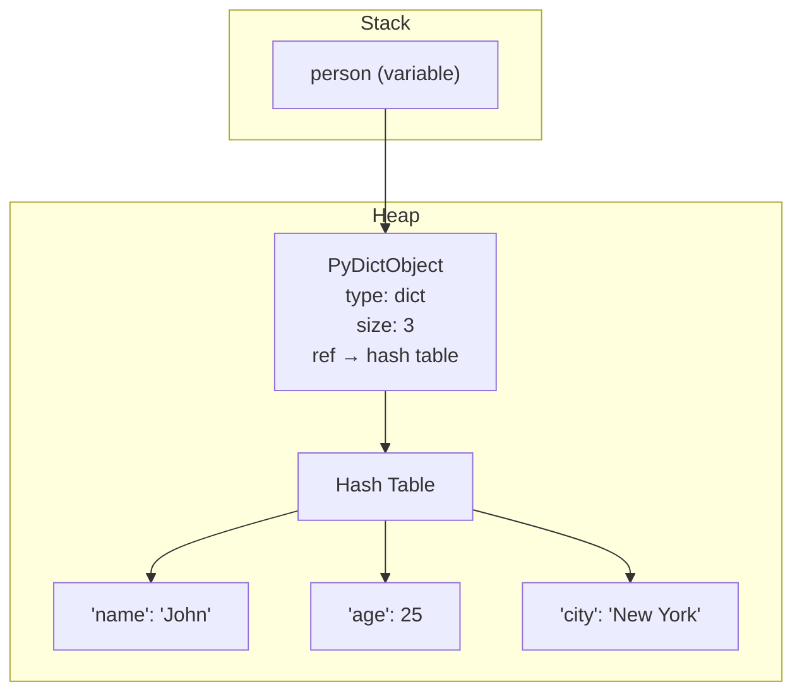
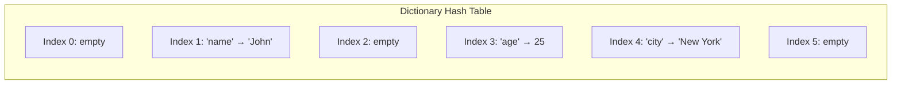
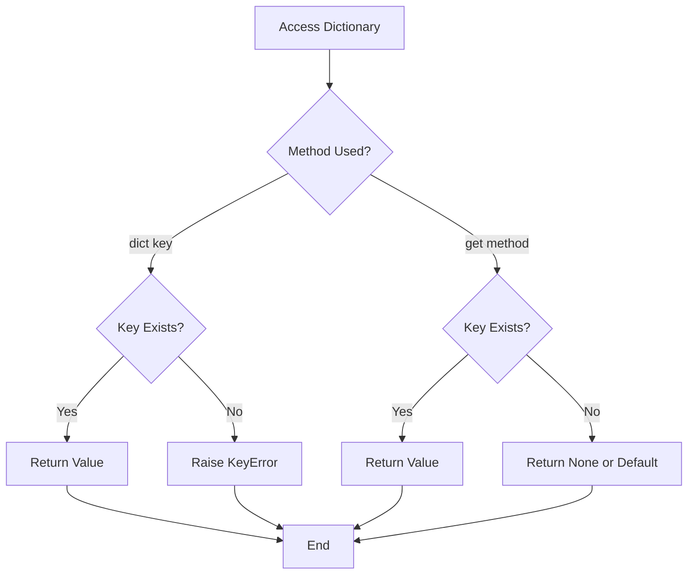
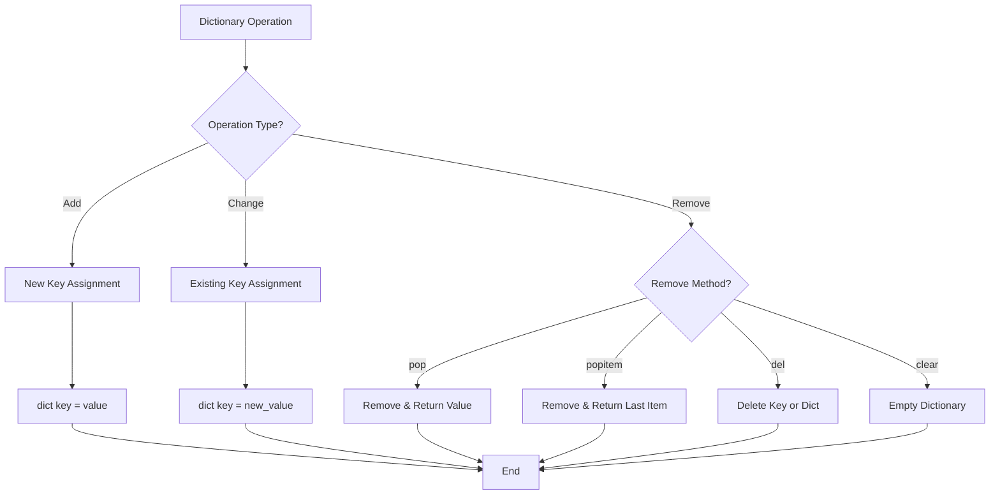
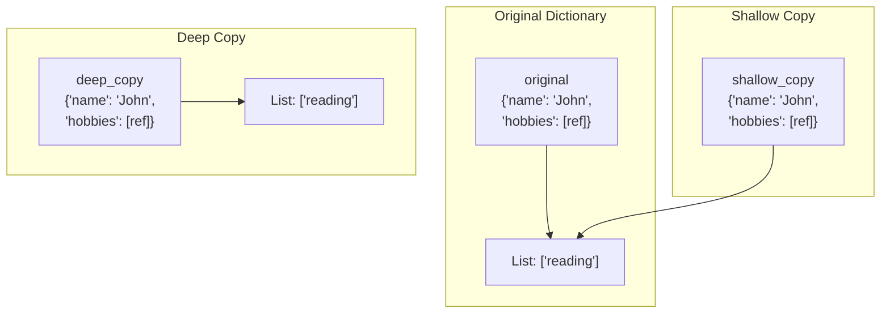
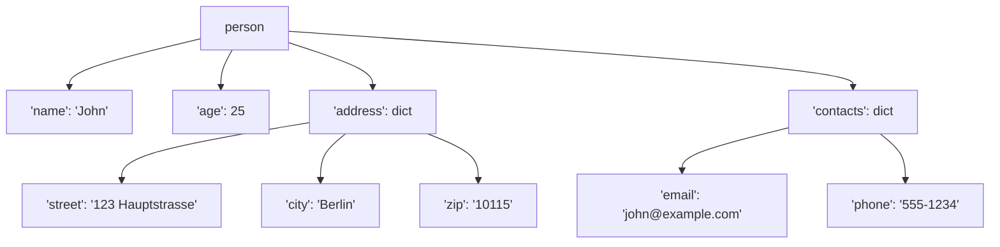
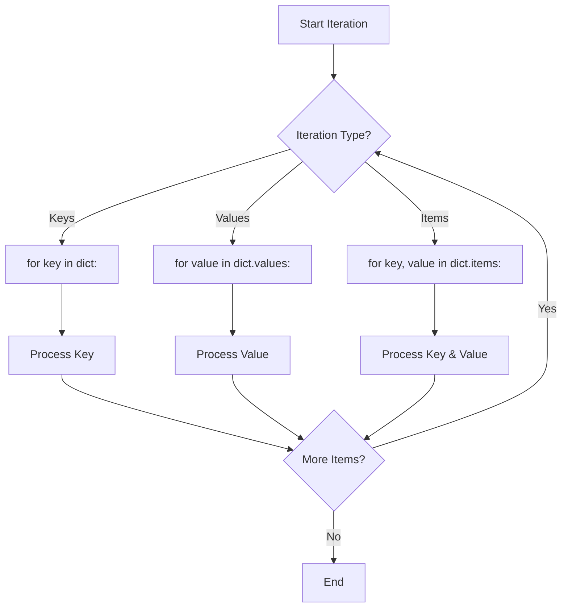
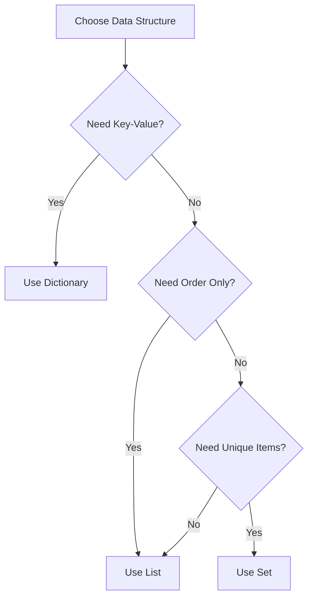

<nav>
    <ul>
        <li><a href="./README.md">Intro</a></li>
        <li><a href="./STRING.md">String</a></li>
        <li><a href="./DEF.md">Def</a></li>
        <li><a href="./CONDITIONALS.md">Conditionals</a></li>
        <li><a href="./DICT.md">Dictionary</a></li>
    </ul>
</nav>

# 📖 Python Dictionaries

Welcome! This guide covers Python dictionaries from basics to advanced concepts. You'll learn how to create, access, modify, and manipulate dictionaries effectively.

---

## 📌 What is a Dictionary?

A **dictionary** in Python is a collection of **key-value pairs** that is:

- **Ordered** (as of Python 3.7+)
- **Changeable** (mutable)
- **Does not allow duplicate keys**

Dictionaries are especially useful for representing complex entities, allowing you to associate pieces of information with meaningful keys rather than relying on positional order.

### Basic Dictionary Syntax

```python
# Creating a dictionary
person = {
    "name": "John",
    "age": 25,
    "city": "Berlin"
}

print(person)
# Output: {'name': 'John', 'age': 25, 'city': 'New York'}
```

---

## 💾 How Dictionaries Work in Memory

Dictionaries are stored as hash tables in Python. Each key is hashed to determine where its value is stored.



### Hash Table Structure



---

## 🎯 Creating Dictionaries

### Method 1: Using Curly Braces

```python
# Empty dictionary
empty_dict = {}

# Dictionary with data
student = {
    "name": "Alice",
    "grade": "A",
    "subjects": ["Math", "Science"]
}
```

### Method 2: Using dict() Constructor

```python
# From keyword arguments
person = dict(name="Bob", age=30, city="Hamburg")

# From list of tuples
items = [("key1", "value1"), ("key2", "value2")]
my_dict = dict(items)
```

### Method 3: Using fromkeys()

```python
# Create dictionary with default values
keys = ["a", "b", "c"]
default_dict = dict.fromkeys(keys, 0)
print(default_dict)
# Output: {'a': 0, 'b': 0, 'c': 0}
```

---

## 🔍 Accessing Dictionary Elements

### Using Square Brackets `dict[key]`

```python
person = {"name": "John", "age": 25, "city": "Munich"}

# Access value by key
name = person["name"]
print(name)  # Output: John

# KeyError if key doesn't exist
# print(person["salary"])  # Raises KeyError
```

### Using get() Method (Safer)

```python
person = {"name": "John", "age": 25}

# Returns None if key doesn't exist
salary = person.get("salary")
print(salary)  # Output: None

# Returns default value if key doesn't exist
salary = person.get("salary", 0)
print(salary)  # Output: 0

# Returns value if key exists
age = person.get("age", 0)
print(age)  # Output: 25
```

### Accessing Keys, Values, and Items

```python
person = {"name": "John", "age": 25, "city": "Frankfurt"}

# Get all keys
keys = person.keys()
print(keys)  # Output: dict_keys(['name', 'age', 'city'])

# Get all values
values = person.values()
print(values)  # Output: dict_values(['John', 25, 'New York'])

# Get all key-value pairs
items = person.items()
print(items)
# Output: dict_items([('name', 'John'), ('age', 25), ('city', 'New York')])

# Convert to list
keys_list = list(person.keys())
print(keys_list)  # Output: ['name', 'age', 'city']
```

### Check if Key Exists

```python
person = {"name": "John", "age": 25}

# Using 'in' keyword
if "name" in person:
    print("Name exists!")  # This will print

if "salary" not in person:
    print("Salary not found!")  # This will print
```

---

## 📊 Dictionary Access Flow



---

## ✏️ Changing Dictionary Elements

### Modify Existing Values

```python
person = {"name": "John", "age": 25, "city": "Stuttgart"}

# Change single value
person["age"] = 26
print(person)
# Output: {'name': 'John', 'age': 26, 'city': 'New York'}

# Change multiple values
person["name"] = "John Doe"
person["city"] = "Boston"
print(person)
# Output: {'name': 'John Doe', 'age': 26, 'city': 'Boston'}
```

### Using update() Method

```python
person = {"name": "John", "age": 25}

# Update with another dictionary
person.update({"age": 26, "city": "Boston"})
print(person)
# Output: {'name': 'John', 'age': 26, 'city': 'Boston'}

# Update with keyword arguments
person.update(job="Developer", salary=75000)
print(person)
# Output: {'name': 'John', 'age': 26, 'city': 'Boston', 'job': 'Developer', 'salary': 75000}
```

---

## ➕ Adding Dictionary Elements

### Add New Key-Value Pairs

```python
person = {"name": "John", "age": 25}

# Add new key
person["email"] = "john@example.com"
print(person)
# Output: {'name': 'John', 'age': 25, 'email': 'john@example.com'}

# Add multiple keys
person["phone"] = "555-1234"
person["country"] = "USA"
print(person)
```

### Using setdefault()

```python
person = {"name": "John", "age": 25}

# Add key if it doesn't exist
person.setdefault("city", "Unknown")
print(person)
# Output: {'name': 'John', 'age': 25, 'city': 'Unknown'}

# Does nothing if key exists
person.setdefault("name", "Jane")
print(person["name"])  # Output: John (unchanged)
```

---

## ➖ Removing Dictionary Elements

### Using pop() Method

```python
person = {"name": "John", "age": 25, "city": "Dresden"}

# Remove and return value
age = person.pop("age")
print(age)  # Output: 25
print(person)  # Output: {'name': 'John', 'city': 'New York'}

# Pop with default (if key doesn't exist)
salary = person.pop("salary", 0)
print(salary)  # Output: 0
```

### Using popitem() Method

```python
person = {"name": "John", "age": 25, "city": "Leipzig"}

# Remove and return last inserted item (Python 3.7+)
last_item = person.popitem()
print(last_item)  # Output: ('city', 'New York')
print(person)  # Output: {'name': 'John', 'age': 25}
```

### Using del Keyword

```python
person = {"name": "John", "age": 25, "city": "Cologne"}

# Delete specific key
del person["age"]
print(person)  # Output: {'name': 'John', 'city': 'New York'}

# Delete entire dictionary
# del person
# print(person)  # Raises NameError
```

### Using clear() Method

```python
person = {"name": "John", "age": 25, "city": "Düsseldorf"}

# Remove all items
person.clear()
print(person)  # Output: {}
```

---

## 📋 Dictionary Modification Operations Flow



---

## 📑 Copying Dictionaries

### Shallow Copy Methods

```python
original = {"name": "John", "age": 25, "hobbies": ["reading", "coding"]}

# Method 1: Using copy()
copy1 = original.copy()

# Method 2: Using dict() constructor
copy2 = dict(original)

# Method 3: Using dict comprehension
copy3 = {k: v for k, v in original.items()}

print(copy1)
print(copy2)
print(copy3)
```

### Shallow Copy Behavior

```python
original = {"name": "John", "hobbies": ["reading"]}
shallow_copy = original.copy()

# Changing top-level value doesn't affect copy
original["name"] = "Jane"
print(shallow_copy["name"])  # Output: John

# Changing nested mutable object affects both!
original["hobbies"].append("coding")
print(shallow_copy["hobbies"])  # Output: ['reading', 'coding']
```

### Deep Copy (For Nested Dictionaries)

```python
import copy

original = {"name": "John", "hobbies": ["reading"], "address": {"city": "NY"}}

# Create deep copy
deep_copy = copy.deepcopy(original)

# Changes to nested objects don't affect deep copy
original["hobbies"].append("coding")
original["address"]["city"] = "Boston"

print(deep_copy["hobbies"])  # Output: ['reading']
print(deep_copy["address"]["city"])  # Output: NY
```

---

## 🎭 Copy Types Comparison



---

## 🪆 Nested Dictionaries

### Creating Nested Dictionaries

```python
# Person with nested address
person = {
    "name": "John",
    "age": 25,
    "address": {
    "street": "123 Hauptstrasse",
    "city": "Berlin",
    "zip": "10115"
    },
    "contacts": {
        "email": "john@example.com",
        "phone": "555-1234"
    }
}
```

### Accessing Nested Elements

```python
person = {
    "name": "John",
    "address": {
        "city": "Hamburg",
        "zip": "20095"
    }
}

# Using square brackets
city = person["address"]["city"]
print(city)  # Output: Hamburg

# Using get() for safety
zip_code = person.get("address", {}).get("zip", "Unknown")
print(zip_code)  # Output: 20095

# Accessing non-existent nested key safely
country = person.get("address", {}).get("country", "Germany")
print(country)  # Output: Germany
```

### Modifying Nested Dictionaries

```python
person = {
    "name": "John",
    "address": {
        "city": "Frankfurt"
    }
}

# Modify nested value
person["address"]["city"] = "Stuttgart"
person["address"]["zip"] = "70173"

print(person)
# Output: {'name': 'John', 'address': {'city': 'Stuttgart', 'zip': '70173'}}
```

### Complex Nested Structure

```python
company = {
    "name": "Tech Corp",
    "employees": {
        "engineering": {
            "manager": "Alice",
            "team": ["Bob", "Charlie", "Diana"]
        },
        "sales": {
            "manager": "Eve",
            "team": ["Frank", "Grace"]
        }
    },
    "locations": ["Berlin", "Hamburg", "Munich", "Frankfurt"]
}

# Access deep nested value
eng_manager = company["employees"]["engineering"]["manager"]
print(eng_manager)  # Output: Alice

# Access list inside nested dict
first_engineer = company["employees"]["engineering"]["team"][0]
print(first_engineer)  # Output: Bob
```

---

## 🌳 Nested Dictionary Structure



---

## 🔄 Looping Through Dictionaries

### Loop Through Keys

```python
person = {"name": "John", "age": 25, "city": "Bremen"}

# Method 1: Default iteration
for key in person:
    print(key)

# Method 2: Using keys()
for key in person.keys():
    print(key)

# Output:
# name
# age
# city
```

### Loop Through Values

```python
person = {"name": "John", "age": 25, "city": "Hannover"}

for value in person.values():
    print(value)

# Output:
# John
# 25
# New York
```

### Loop Through Key-Value Pairs

```python
person = {"name": "John", "age": 25, "city": "Nuremberg"}

for key, value in person.items():
    print(f"{key}: {value}")

# Output:
# name: John
# age: 25
# city: New York
```

### Conditional Looping

```python
scores = {"Alice": 95, "Bob": 82, "Charlie": 78, "Diana": 91}

# Find students with A grade
for student, score in scores.items():
    if score >= 90:
        print(f"{student} got an A!")

# Output:
# Alice got an A!
# Diana got an A!
```

---

## 🔄 Dictionary Iteration Flow



---

## 📚 Dictionary Methods Reference

| Method         | Description             | Example                         |
| -------------- | ----------------------- | ------------------------------- |
| `clear()`      | Removes all elements    | `dict.clear()`                  |
| `copy()`       | Returns shallow copy    | `new_dict = dict.copy()`        |
| `fromkeys()`   | Creates dict with keys  | `dict.fromkeys(['a','b'], 0)`   |
| `get()`        | Returns value for key   | `dict.get('key', default)`      |
| `items()`      | Returns key-value pairs | `dict.items()`                  |
| `keys()`       | Returns all keys        | `dict.keys()`                   |
| `pop()`        | Removes & returns value | `dict.pop('key', default)`      |
| `popitem()`    | Removes last item       | `dict.popitem()`                |
| `setdefault()` | Gets or sets default    | `dict.setdefault('key', value)` |
| `update()`     | Updates dictionary      | `dict.update({'key': 'value'})` |
| `values()`     | Returns all values      | `dict.values()`                 |

---

## 🎓 Dictionary Methods Examples

### clear()

```python
person = {"name": "John", "age": 25}
person.clear()
print(person)  # Output: {}
```

### fromkeys()

```python
keys = ["name", "age", "city"]
default_person = dict.fromkeys(keys, "Unknown")
print(default_person)
# Output: {'name': 'Unknown', 'age': 'Unknown', 'city': 'Unknown'}
```

### setdefault()

```python
person = {"name": "John"}

# Returns existing value
name = person.setdefault("name", "Unknown")
print(name)  # Output: John

# Sets and returns new value
age = person.setdefault("age", 0)
print(age)  # Output: 0
print(person)  # Output: {'name': 'John', 'age': 0}
```

---

## 🎯 Practical Examples

### Example 1: Student Grade Book

```python
# Create grade book
grades = {
    "Alice": [95, 92, 88],
    "Bob": [78, 85, 82],
    "Charlie": [90, 87, 93]
}

# Calculate averages
for student, scores in grades.items():
    average = sum(scores) / len(scores)
    print(f"{student}: {average:.2f}")

# Output:
# Alice: 91.67
# Bob: 81.67
# Charlie: 90.00
```

### Example 2: Inventory Management

```python
# Product inventory
inventory = {
    "apple": {"price": 0.5, "stock": 100},
    "banana": {"price": 0.3, "stock": 150},
    "orange": {"price": 0.7, "stock": 80}
}

# Update stock after sale
def sell_item(product, quantity):
    if product in inventory:
        if inventory[product]["stock"] >= quantity:
            inventory[product]["stock"] -= quantity
            total = inventory[product]["price"] * quantity
            print(f"Sold {quantity} {product}(s) for ${total:.2f}")
        else:
            print(f"Not enough {product} in stock!")
    else:
        print(f"{product} not found!")

sell_item("apple", 10)
# Output: Sold 10 apple(s) for $5.00

print(inventory["apple"]["stock"])
# Output: 90
```

### Example 3: Word Counter

```python
def count_words(text):
    words = text.lower().split()
    word_count = {}

    for word in words:
        # Remove punctuation
        word = word.strip(".,!?")
        # Count occurrences
        word_count[word] = word_count.get(word, 0) + 1

    return word_count

text = "Python is great. Python is fun. Python is powerful."
counts = count_words(text)
print(counts)
# Output: {'python': 3, 'is': 3, 'great': 1, 'fun': 1, 'powerful': 1}
```

### Example 4: Dictionary Comprehension

```python
# Create dictionary using comprehension
squares = {x: x**2 for x in range(1, 6)}
print(squares)
# Output: {1: 1, 2: 4, 3: 9, 4: 16, 5: 25}

# Filter dictionary
scores = {"Alice": 95, "Bob": 72, "Charlie": 88, "Diana": 65}
passed = {name: score for name, score in scores.items() if score >= 75}
print(passed)
# Output: {'Alice': 95, 'Charlie': 88}
```

---

## 🔑 Key Takeaways

### When to Use Dictionaries

| Use Case               | Why Dictionary?              |
| ---------------------- | ---------------------------- |
| Lookup by name/ID      | Fast O(1) access by key      |
| Configuration settings | Named parameters             |
| Counting occurrences   | Key = item, Value = count    |
| Grouping data          | Key = category, Value = list |
| Caching results        | Key = input, Value = output  |

### Dictionary vs List



---

## ⚠️ Common Pitfalls

### 1. KeyError

```python
person = {"name": "John"}

# Bad: Can raise KeyError
# age = person["age"]

# Good: Use get()
age = person.get("age", 0)
```

### 2. Mutable Keys

```python
# Bad: Lists can't be keys (they're mutable)
# my_dict = {[1, 2]: "value"}  # TypeError

# Good: Use tuples instead
my_dict = {(1, 2): "value"}
```

### 3. Modifying During Iteration

```python
person = {"name": "John", "age": 25, "city": "NY"}

# Bad: Don't modify while iterating
# for key in person:
#     if key == "age":
#         del person[key]  # RuntimeError

# Good: Create list of keys first
for key in list(person.keys()):
    if key == "age":
        del person[key]
```

---

## 📝 Practice Exercises

### Exercise 1: Create a Phonebook

```python
# Create a phonebook dictionary with at least 3 contacts
# Each contact should have: name (key), phone, and email

phonebook = {
    "Alice": {"phone": "555-0001", "email": "alice@email.com"},
    "Bob": {"phone": "555-0002", "email": "bob@email.com"},
    "Charlie": {"phone": "555-0003", "email": "charlie@email.com"}
}

# Add a new contact
phonebook["Diana"] = {"phone": "555-0004", "email": "diana@email.com"}

# Update Bob's phone
phonebook["Bob"]["phone"] = "555-9999"

# Print all contacts
for name, info in phonebook.items():
    print(f"{name}: {info['phone']} - {info['email']}")
```

### Exercise 2: Merge Two Dictionaries

```python
dict1 = {"a": 1, "b": 2}
dict2 = {"c": 3, "d": 4}

# Method 1: Using update()
merged = dict1.copy()
merged.update(dict2)

# Method 2: Using unpacking (Python 3.5+)
merged = {**dict1, **dict2}

# Method 3: Using union operator (Python 3.9+)
merged = dict1 | dict2

print(merged)
# Output: {'a': 1, 'b': 2, 'c': 3, 'd': 4}
```

### Exercise 3: Invert a Dictionary

```python
original = {"a": 1, "b": 2, "c": 3}

# Swap keys and values
inverted = {value: key for key, value in original.items()}

print(inverted)
# Output: {1: 'a', 2: 'b', 3: 'c'}
```

---

## 🎬 Summary

Dictionaries are one of Python's most powerful and versatile data structures:

✅ Store data as key-value pairs  
✅ Fast lookup by key (O(1) average)  
✅ Ordered as of Python 3.7+  
✅ Flexible and mutable  
✅ Perfect for representing complex data

**Remember:**

- Use `get()` to avoid KeyError
- Keys must be immutable (strings, numbers, tuples)
- Values can be any type
- Use dictionary comprehensions for concise creation
- Choose appropriate copy method (shallow vs deep)

---

📘 **Further Reading:**

- [Python Dict Documentation](https://docs.python.org/3/tutorial/datastructures.html#dictionaries)
- [PEP 584 - Dictionary Union Operators](https://www.python.org/dev/peps/pep-0584/)
