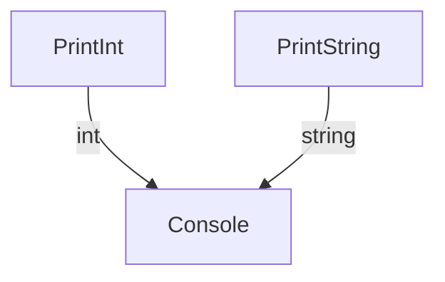
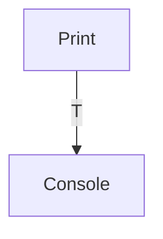
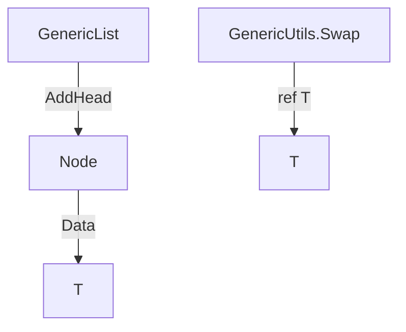
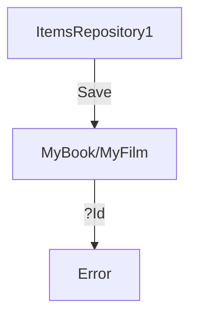
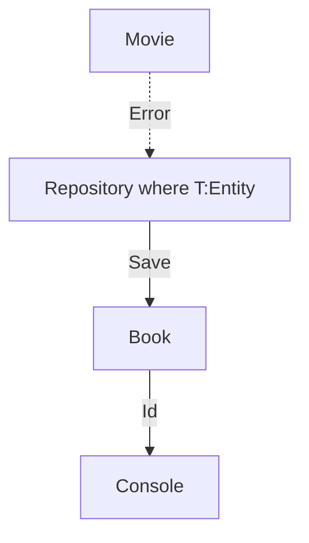
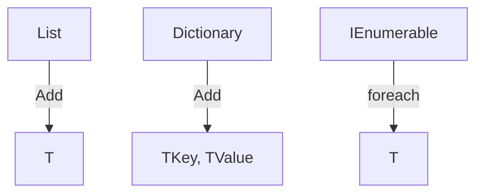

# Generics and Constraints in C#

## A. The Problem: Code Duplication

In the beginning, we write separate methods for each type, leading to repetitive code and maintenance headaches.

**Example:**

```csharp
public static void PrintInt(int value) => Console.WriteLine(value);
public static void PrintString(string value) => Console.WriteLine(value);
```



---

## B. The Solution: Generics

Generics allow us to write a single method that works for any type, eliminating duplication and improving reusability.

**Example:**

```csharp
public static void Print<T>(T value) => Console.WriteLine(value);
```



---

## C. Generic Classes and Methods

We can use generics to build reusable data structures and utility methods, such as a generic linked list or a swap method.

**Example:**

```csharp
var stringList = new GenericList<string>();
stringList.AddHead("Hello");
foreach (var s in stringList) Console.WriteLine(s);

int a = 1, b = 2;
GenericUtils.Swap(ref a, ref b);
```



---

## D. The Problem: No Constraints

Unconstrained generics can lead to type safety issues. For example, a generic repository may expect an `Id` property, but not all types have it.

**Example:**

```csharp
var bookRepo = new ItemsRepository1<MyBook>(); // MyBook has Id
var filmRepo = new ItemsRepository1<MyFilm>(); // MyFilm does NOT have Id
// Console.WriteLine(f.Id); // Compile error
```



---

## E. The Fix: Constraints

By adding constraints, we ensure that only types with the required properties (e.g., `Id`) can be used, making our code type safe.

**Example:**

```csharp
public class Repository<T> where T : Entity
{
	// Now T is guaranteed to have Id
}
var bookRepo = new Repository<Book>(); // OK
// var movieRepo = new Repository<Movie>(); // Error if Movie does not inherit Entity
```



---

## F. Other Ways to Use Generics

Generics are powerful and flexible. You can use them in methods, classes, interfaces, and with constraints for advanced scenarios.

**Examples:**

- Generic collections: `List<T>`, `Dictionary<TKey, TValue>`
- Generic interfaces: `IEnumerable<T>`, `IComparer<T>`
- Generic constraints: `where T : struct`, `where T : new()`, `where T : BaseClass`



---

## Conclusion

- Generics solve code duplication and improve reusability.
- Use constraints to ensure type safety and avoid runtime errors.
- C# generics are versatile: use them in methods, classes, interfaces, and with constraints for robust code.
