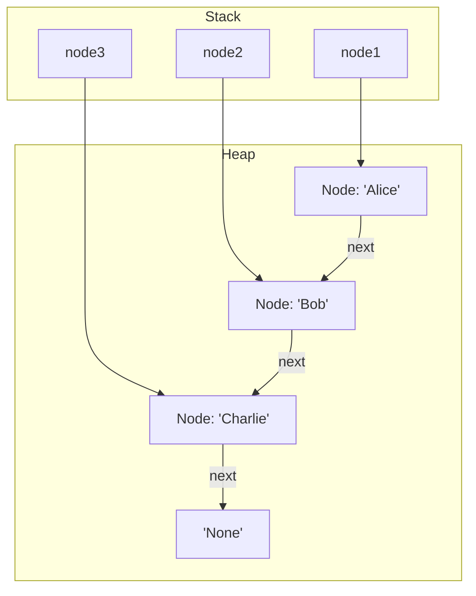
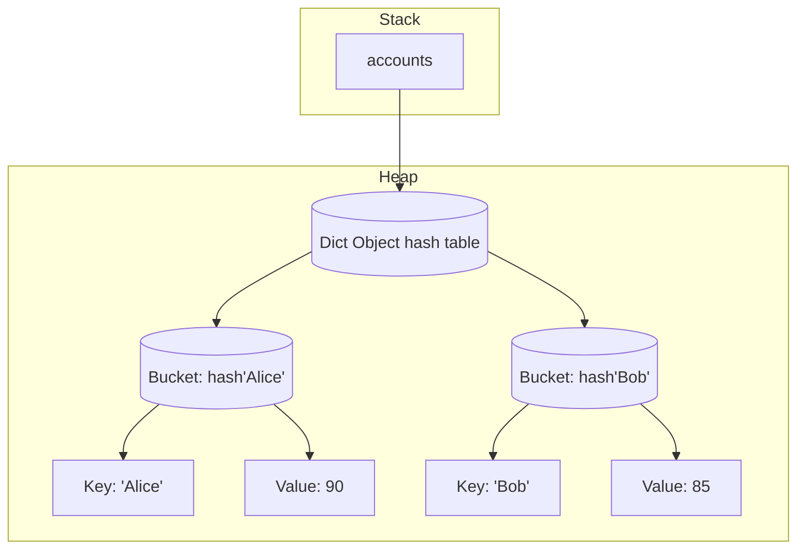
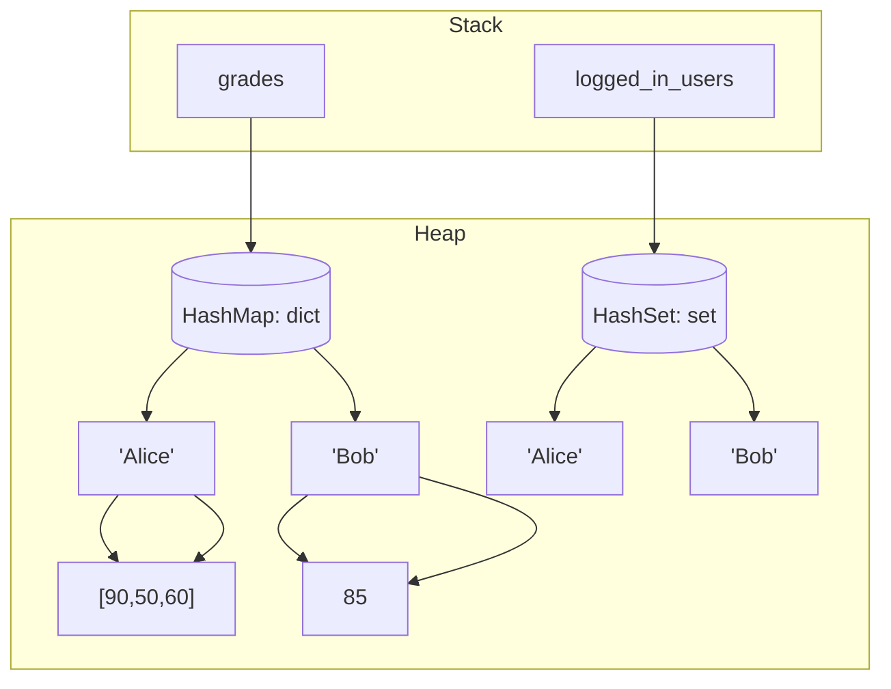

## 🧠 Lecture: **Why We Need Hash Tables in Python**

---

### 🧩 Act 1: A Simple Problem (Solved by a List)

> ❓ **Problem:** You’re building a customers roster app. You want to store the names of customers.

```python
customers = ["Alice", "Bob", "Charlie"]
```

This works great! You can:

✅ Add new customer
✅ Loop through the list
✅ Access by index

---

### 🚨 We Have a New Requirement...

> ❗ You now need to **quickly look up a customer's accounts by name**, _many times per second_.

Try doing that with a list:

```python
# Find Bob's grade
accounts = [("Alice", 90), ("Bob", 85), ("Charlie", 92)]

def get_account(name):
    for customer, account in accounts:
        if customer == name:
            return account
    return None
```

✅ It works...

❌ But it's **O(n)** time
❌ Slow when we have thousands or millions of customer
❌ You loop every time just to find one result

---

### 🔁 Let's Push It Further

> 💭 Imagine now you’re running a **real-time Bank portal**
> 1 million customers log in to check their accounts
> update accounts constantly

➡️ Using a list means **every lookup and update** becomes a full search — **too slow**.

---

### ⚠️ So... Linear Structures Are Not Enough

| Problem                  | List (Linear) Solution   | Real-World Result    |
| ------------------------ | ------------------------ | -------------------- |
| Store simple sequence    | ✅ Easy                  | Good for small data  |
| Lookup by value (name)   | ❌ Linear search (O(n))  | Slow                 |
| Update or delete by key  | ❌ Requires search first | Inefficient          |
| Frequent lookups/updates | ❌ Not scalable          | System crashes/slows |

---

### 💡 Enter: Hash Tables (Python's `dict`)

Instead of searching, we now **compute where the data lives**.

```python
customers = {
    "Alice": 90,
    "Bob": 85,
    "Charlie": 92
}
```

> Now we can:

- ✅ Get a account in **O(1)** time
- ✅ Add/update without scanning
- ✅ Check if a name exists instantly

---

### 🔬 Act 2: Under the Hood — Memory Matters

Let’s compare **lists** and **dictionaries** in memory.

---

#### 📦 List Memory

```python
customers = ["Alice", "Bob", "Charlie"]
```

- link-list python



- Items stored **in order**
- Access by **index**
- Searching by value = **linear scan**

---

#### 🔐 Dictionary Memory (Hash Table)

```python
accounts = {
    "Alice": 90,
    "Bob": 85,
    "Charlie": 92
}
```



- Each **key** is hashed to an index
- Value is placed in a **bucket**
- **Direct access** — no loop required

---

### 🧠 Act 3: Concepts You Must Understand

| Concept                      | Why It Matters                   |
| ---------------------------- | -------------------------------- |
| **Key-Value Pair**           | Structure of all hash tables     |
| **Hash Function**            | Translates keys into indexes     |
| **Collision**                | Two keys land in the same bucket |
| **Bucket**                   | Storage location in memory       |
| **Chaining/Open Addressing** | Techniques to handle collisions  |
| **Load Factor**              | Impacts performance and resizing |
| **O(1) vs O(n)**             | Real-world difference in speed   |

---

### ✅ Summary: When to Use What?

| Need                       | Use List | Use Dict                           |
| -------------------------- | -------- | ---------------------------------- |
| Maintain order             | ✅       | ⚠️ (not guaranteed pre-Python 3.7) |
| Lookup by index            | ✅       | ❌                                 |
| Fast lookup by key         | ❌       | ✅                                 |
| Scale to millions of items | ❌       | ✅                                 |
| Insert/delete frequently   | ⚠️       | ✅                                 |

---

## 🧪 Act4: What is Hashing — And Why Does It Matter?

---

### 🐣 Start Simple: Turning Names Into Numbers

Let’s say we want to **store student records** using their name. But how do we figure out where to store `"Alice"`?

We can’t use names as memory addresses directly… So we use a **hash function** to **turn data into numbers**!

```python
def very_simple_hash(name):
    return len(name)  # 🤏 Just returns the length

print(very_simple_hash("Bob"))     # 3
print(very_simple_hash("Charlie")) # 7
```

🧠 This is a **terrible** hash function—but it shows the idea:

- Input: a string (key)
- Output: a number (hash)
- Use that number to find a **bucket**

---

### ⚙️ Why Hashing?

> Hashing is the **bridge between human-readable keys and computer memory**.

| Without Hashing           | With Hashing             |
| ------------------------- | ------------------------ |
| Search entire list        | Go straight to a bucket  |
| O(n) time per operation   | O(1) time (in best case) |
| Slows down with more data | Scales efficiently       |

---

### 🛠️ Famous (Real) Hashing Methods

| Method                      | Idea                                    | Use Case / Notes                         |
| --------------------------- | --------------------------------------- | ---------------------------------------- |
| **Modulus Hashing**         | `hash % num_buckets`                    | Simple, but can cause clustering         |
| **Polynomial Rolling Hash** | Use powers and primes to mix characters | Better distribution (used in Rabin-Karp) |
| **SHA Family (SHA-256)**    | Secure cryptographic hash               | Used in passwords, security              |
| **Python’s `hash()`**       | Built-in, varies per run for security   | Used in sets and dicts internally        |

---

### 🔍 Examples of Each

#### 1. Modulo Hashing

```python
def hash_mod(key):
    total = sum(ord(c) for c in key)
    return total % 10  # 10 buckets

print(hash_mod("Alice"))  # → e.g. 3
```

#### 2. Polynomial Rolling Hash (Simplified)

```python
def rolling_hash(key, base=31, mod=10**9+7):
    hash_value = 0
    for char in key:
        hash_value = (hash_value * base + ord(char)) % mod
    return hash_value

print(rolling_hash("Alice"))  # → some large integer
```

#### 3. SHA-256 (One-Way Secure Hash)

```python
import hashlib

def sha256_hash(key):
    return hashlib.sha256(key.encode()).hexdigest()

print(sha256_hash("Alice"))
```

🔐 Cryptographic hashes like SHA are:

- **One-way**: you can’t reverse them
- **Secure**: used in login systems, blockchain, etc.

---

### 🧠 Key Properties of a Good Hash Function

| Property                      | Why It Matters              |
| ----------------------------- | --------------------------- |
| **Deterministic**             | Same input → same output    |
| **Uniform**                   | Distributes keys evenly     |
| **Fast**                      | Must compute quickly        |
| **Minimize Collisions**       | Reduces chaining/clustering |
| **Irreversible (for crypto)** | For secure applications     |

---

### ⚠️ Hashing Isn’t Perfect — Collisions Happen!

Two different keys might produce the **same hash** (collision):

```python
hash("cat") % 10 == hash("tac") % 10  # Maybe!
```

✅ That’s why we have **collision resolution** strategies like:

- **Chaining** (linked list in bucket)
- **Open Addressing** (find another empty bucket)

---

### 🔁 Real Python: What Does `hash()` Actually Do?

```python
print(hash("Alice"))  # May change each time you run the program!
```

- Python’s `hash()` is **salted** to prevent certain attacks.
- Use `hashlib` for consistent, secure hashes across runs.

---

### 🎯 Summary: Why Hashing Is Powerful

- 🔑 Turns complex keys into numbers
- 🧠 Used in dictionaries, sets, databases, caches
- ⚡ Enables fast O(1) access
- 🔐 Also critical in **security, blockchain, and encryption**

## 🧩 Act5: Hash Map vs Hash Set

Both **`dict`** and **`set`** are built on **hash tables**, but they serve **different purposes**.

| Feature       | `dict` (Hash Map)        | `set` (Hash Set)                |
| ------------- | ------------------------ | ------------------------------- |
| Stores        | **Key-Value** pairs      | **Only Keys** (no values)       |
| Use case      | Associate data to keys   | Track existence / membership    |
| Syntax        | `{"Alice": 90}`          | `{"Alice", "Bob"}`              |
| Lookup        | Key → Value              | Check if value exists           |
| Duplicates    | No duplicate keys        | No duplicate elements           |
| Example usage | Grades, configs, lookups | Membership tests, deduplication |

---

### 🔍 Code Examples

#### `dict` — Hash Map

```python
grades = {
    "Alice": 90,
    "Bob": 85
}

print(grades["Bob"])  # 85
```

#### `set` — Hash Set

```python
logged_in_users = {"Alice", "Bob"}

print("Bob" in logged_in_users)  # True
```

- A `set` is like a `dict` that **only cares about the keys**, not the values.
- Internally, `set` also uses **hashing and buckets**.

---

### 🧪 Comparison hash sets and hash maps



---

### 🎯 Summary

- Use a `dict` when each key needs a **value** (e.g., user profile, scores, settings).
- Use a `set` when you're just tracking **presence** (e.g., who logged in, what IDs exist).

---

### 🧪 Set is Just a Dict with `None` Values?

```python
fake_set = {
    "Alice": None,
    "Bob": None
}

print("Alice" in fake_set)  # True
```

🔎 This mimics how `set` internally works — it's like a `dict` where the **values are ignored**!

---
