# 🐍 Python Intro Lecture

Welcome! This guide introduces Python programming from the ground up. You'll learn about variables, functions, memory, data types, strings, and numbers. This file is designed for beginners who want a complete overview in one place.

---

## 📌 Getting Started

1. Open the **Terminal** inside VSC.
2. Create a file called `hello.py`.
3. Write your first Python code:
4. runt the file in the terminal `python hello.py`

```python
print("Hello world")
```

---

## 🧠 What is a Function?

- A **function** is a reusable block of code.
- `print()` is a built-in function that displays output.

```python
print("Hello")
```

- **Argument**: What you pass inside the parentheses.
- **Bug**: A problem or error in your code.
- **SyntaxError**: Happens when the code format is wrong (e.g., missing quotes, parentheses, etc.).

---

## 📦 Variables

Variables store data in memory. You can reuse them in your code.

```python
name = "John"
print(name)
```

### 💾 How Variables Work in Memory

```mermaid
graph TD
    subgraph Stack
        X["x = ref → 0x0001"]
    end

    subgraph Heap
        A["0x0001<br/>type: str<br/>data: John"]
    end

    X --> A
    Print["print(x)"] --> X
```



---

## 🧾 Input and Output

```python
name = input("What is your name? ")
print("Hello", name)
```

---

## 💬 Comments

Use comments to explain your code.

```python
# This is a comment
# Pseudocode: Ask for name, then say hello
name = input("What is your name?")
print("Hello", name)
```

---

## 🖨️ `print()` in Detail

```python
print("Hello " + "World")           # Concatenation
print("Hello", "World")             # Multiple arguments
print(f"Hello {name}")              # Formatted strings
print("A", "B", sep="-", end="!\n") # Output: A-B!
```

📘 [print() Docs](https://docs.python.org/3/library/functions.html#print)

---

## 🧠 Memory: Stack vs Heap

### Function Calls on Stack


### Heap Memory: Lists and Strings


### RAM Overview


---

## 🧵 Variable Naming Conventions

```python
myvar = "John"
MyVar = "John"     # PascalCase
myVar = "John"     # camelCase
my_var = "John"    # snake_case

# Invalid:
# 2myvar = "John"
# my-var = "John"
# my var = "John"
```

---

## ➕ Multiple Assignment

```python
x, y, z = 1, 2, 3
x, y, z = [1, 2, 3]
x = y = z = 1

print(x, y, z)        # 1 1 1
print(x + y - z)      # 1
```

---

## 🌐 Scope

```python
def my_function():
    myvar = "John"
    print("Hello", myvar)

my_function()

def my_function1():
    global myvar1
    myvar1 = "Jane"
    print("Hello", myvar1)

my_function1()
```

---

## 🧵 Strings in Memory


---

## 🧼 String Methods

```python
name = " john doe "

print(name.strip())         # "john doe"
print(name.capitalize())    # " john doe "
print(name.title())         # " John Doe "
print(name.strip().title()) # "John Doe"
print(name.split(" "))      # ['john', 'doe']

first, last = name.strip().split(" ")
```

---

## 🔢 Python as a Calculator

```python
1 + 1     # 2
4 * 3     # 12
10 / 3    # 3.3333333
10 % 3    # 1
```

---

## 🧠 Arithmetic Operators

| Operation | Symbol | Example  | Result |
| --------- | ------ | -------- | ------ |
| Add       | `+`    | `2 + 2`  | `4`    |
| Subtract  | `-`    | `5 - 3`  | `2`    |
| Multiply  | `*`    | `4 * 3`  | `12`   |
| Divide    | `/`    | `9 / 3`  | `3.0`  |
| Modulo    | `%`    | `10 % 3` | `1`    |

---

## 🧾 Variables with Integers

```python
x = 10
y = 2
z = x + y
print(z)  # Output: 12
```

---

## ⚠️ String vs Number Input

```python
name = input("What is your name? ")
age = input("How old are you? ")
print(name + " is " + age + " years old.")
```

This treats everything as **strings**. To treat `age` as a number:

```python
age = int(input("How old are you? "))
```

---

## 🔁 Type Conversion

```python
age = int(input("Enter age: "))
pi = float(input("Enter PI: "))
```

---

## 🎯 Rounding and Formatting

```python
z = 10 / 3

print(round(z))         # 3
print(f"{z:.2f}")       # 3.33
print(f"{z:,}")         # 3.333333
print(round(z, 2))      # 3.33
```

---

📌 In Python docs, `[]` means **optional**:

```python
round(number[, ndigits])
```

---

## 📝 Mini Project: Add Two Numbers

```python
x = int(input("Enter a number: "))
y = int(input("Enter another number: "))

z = x + y
print(f"The total is: {z}")
```

## interpreted vs compiled

```c

#include <stdio.h>

int main() {
    int x, y, z;

    printf("Enter a number: ");
    scanf("%d", &x);

    printf("Enter another number: ");
    scanf("%d", &y);

    z = x + y;

    printf("The total is: %d\n", z);

    return 0;
}

```
