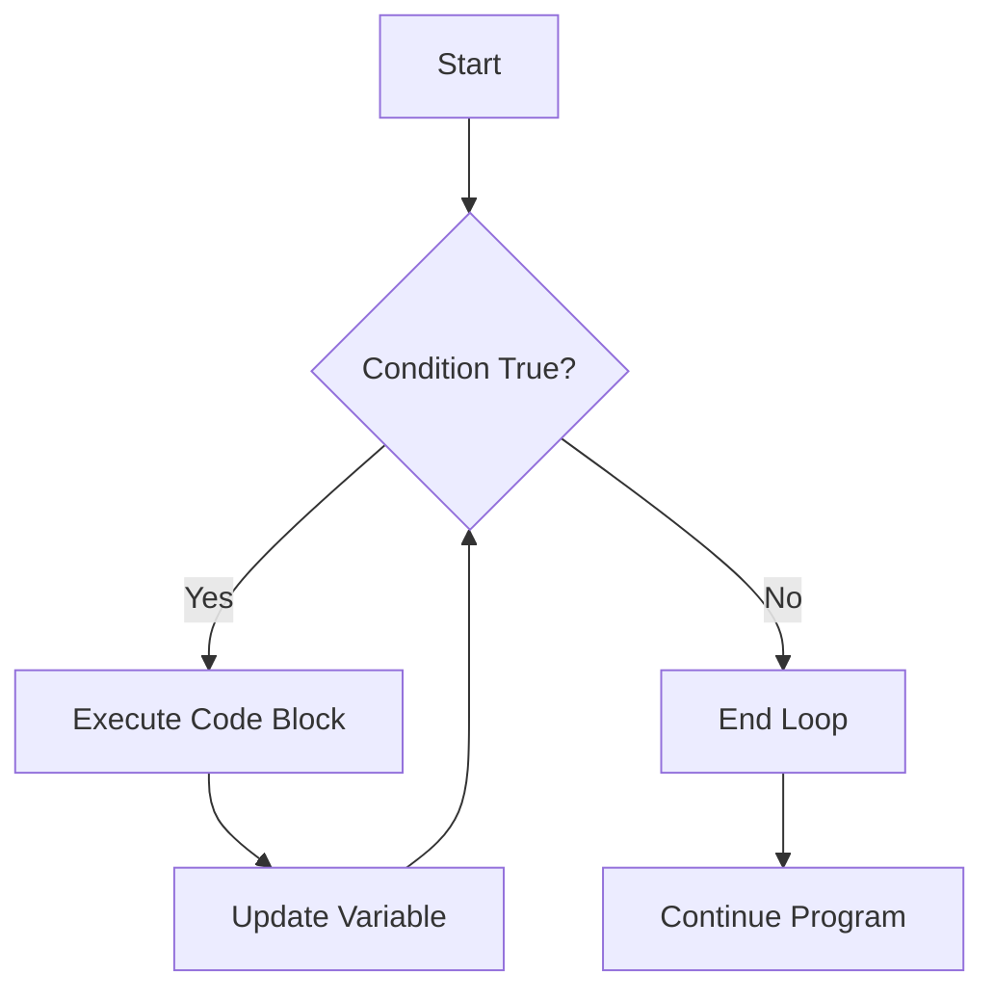
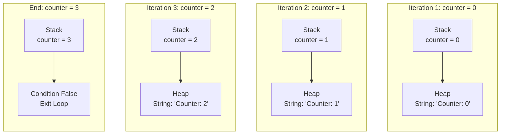
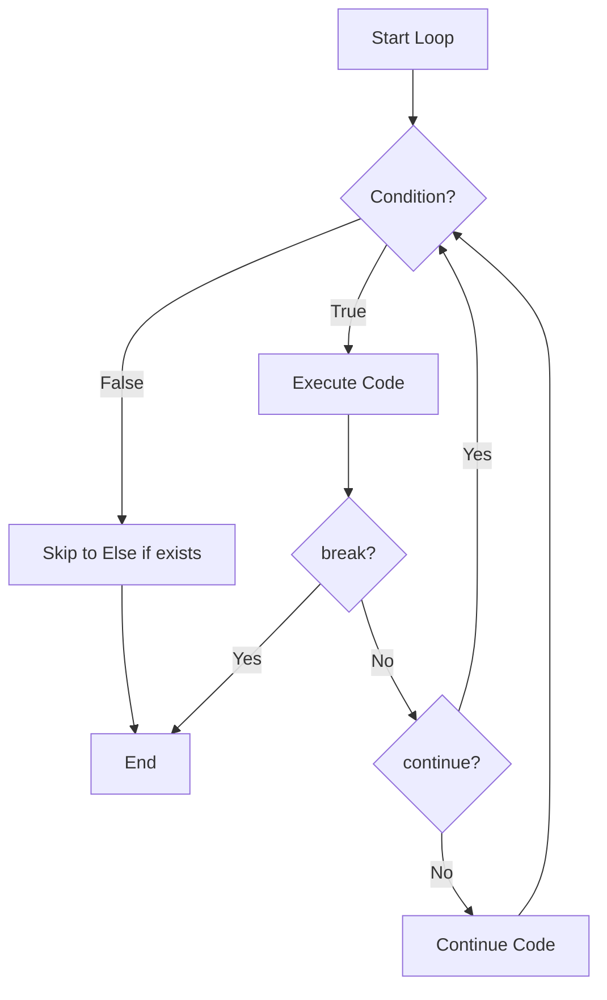
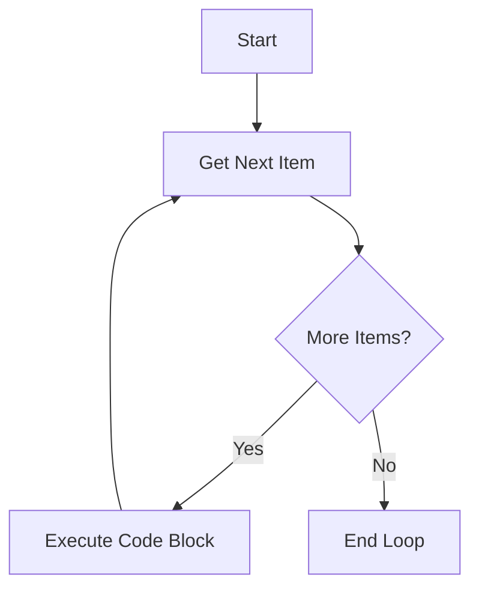
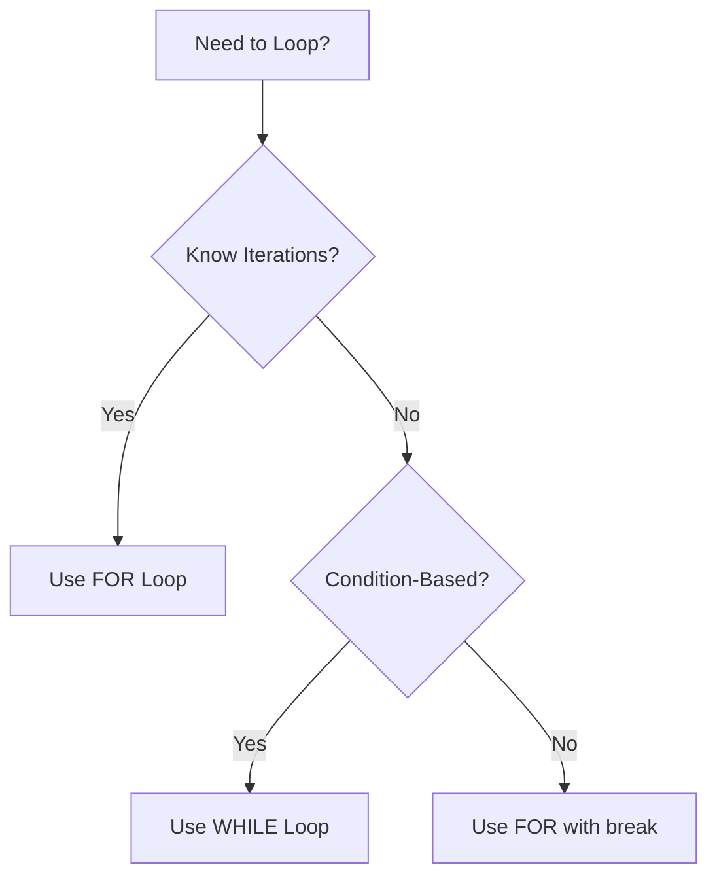
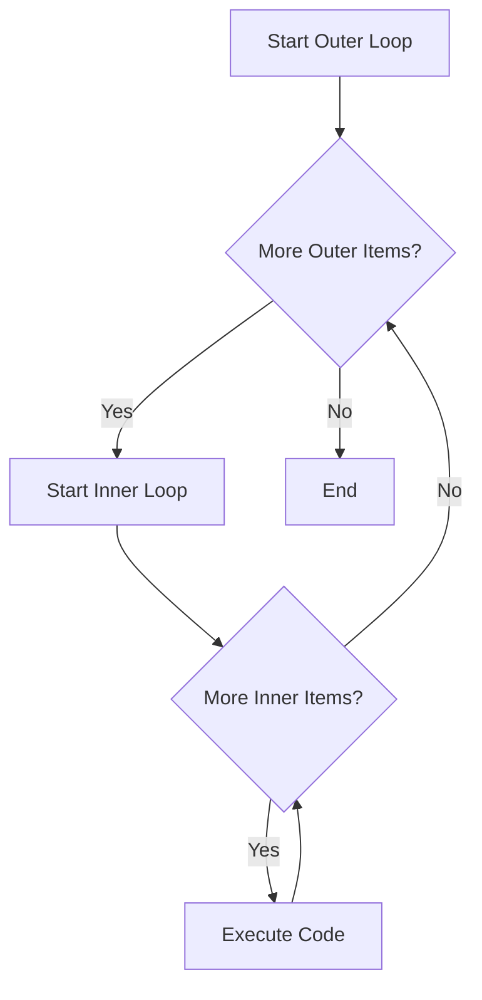

<nav>
    <ul>
        <li><a href="./README.md">Intro</a></li>
        <li><a href="./STRING.md">String</a></li>
        <li><a href="./DEF.md">Def</a></li>
        <li><a href="./CONDITIONALS.md">Conditionals</a></li>
        <li><a href="./DICT.md">Dictionary</a></li>
        <li><a href="./LOOP.md">Loops</a></li>
    </ul>
</nav>

# 🔄 Python Loops

Welcome! This guide covers Python loops from basics to advanced concepts. You'll learn about `while` loops, `for` loops, loop control statements, nested loops, and more.

---

## 📌 What is a Loop?

A **loop** is a programming construct that repeats a block of code multiple times. Loops are essential for:

- Processing collections of data
- Repeating tasks until a condition is met
- Iterating over sequences

Python provides two main types of loops:

1. **`while` loops** - Execute while a condition is `True`
2. **`for` loops** - Iterate over sequences or ranges

---

## 🔁 While Loops

A `while` loop repeatedly executes a block of code as long as a given condition remains `True`.

### Basic While Loop Syntax

```python
while condition:
    # code to execute repeatedly
```

### Example: Countdown

```python
number = 5

while number > 0:
    print(number)
    number -= 1

print("End!")

# Output:
# 5
# 4
# 3
# 2
# 1
# Blast off!
```

### While Loop Flow



---

## 💾 While Loop in Memory

Let's see how a while loop works in memory:

```python
counter = 0
while counter < 3:
    print(f"Counter: {counter}")
    counter += 1
```

### Stack and Heap During While Loop



---

## ⚠️ Infinite Loops

Be careful! If the condition never becomes `False`, you create an **infinite loop**:

```python
# WARNING: This will run forever!
# while True:
#     print("This never stops!")

# Better approach with break:
while True:
    response = input("Type 'quit' to exit: ")
    if response == "quit":
        break
    print(f"You typed: {response}")
```

---

## 🛑 Loop Control Statements

### 1. `break` - Exit the Loop

Immediately terminates the loop, regardless of the condition.

```python
count = 0
while count < 10:
    if count == 5:
        break  # Exit when count reaches 5
    print(count)
    count += 1

print("Loop ended")

# Output:
# 0
# 1
# 2
# 3
# 4
# Loop ended
```

### 2. `continue` - Skip Current Iteration

Skips the remainder of the current iteration and moves to the next one.

```python
count = 0
while count < 5:
    count += 1
    if count == 3:
        continue  # Skip printing 3
    print(count)

# Output:
# 1
# 2
# 4
# 5
```

### 3. `else` with While Loop

The `else` block executes if the loop completes normally (not via `break`).

```python
count = 0
while count < 3:
    print(count)
    count += 1
else:
    print("Loop completed normally!")

# Output:
# 0
# 1
# 2
# Loop completed normally!
```

### `else` with `break`

```python
count = 0
while count < 5:
    if count == 3:
        break
    print(count)
    count += 1
else:
    print("This won't print because of break")

# Output:
# 0
# 1
# 2
```

---

## 🎯 Loop Control Flow



---

## 🔢 While Loop with Input Validation

```python
# Keep asking until valid input
while True:
    n = int(input("Enter a positive number: "))
    if n < 0:
        print("Negative number! Try again.")
        continue
    else:
        print(f"You entered: {n}")
        break

# Alternative using condition:
n = -1
while n < 0:
    n = int(input("Enter a positive number: "))
    if n < 0:
        print("Negative number! Try again.")

print(f"You entered: {n}")
```

---

## 🔂 For Loops

A `for` loop iterates over an **iterable** (list, tuple, string, range, etc.).

### Basic For Loop Syntax

```python
for item in iterable:
    # code to execute for each item
```

### Example: Iterate Over a List

```python
fruits = ["apple", "banana", "cherry"]

for fruit in fruits:
    print(fruit)

# Output:
# apple
# banana
# cherry
```

### For Loop Flow



---

## 📊 Iterating Over Different Types

### 1. Strings

```python
word = "Python"

for letter in word:
    print(letter)

# Output:
# P
# y
# t
# h
# o
# n
```

### 2. Lists

```python
numbers = [10, 20, 30, 40]

for num in numbers:
    print(f"Number: {num}")

# Output:
# Number: 10
# Number: 20
# Number: 30
# Number: 40
```

### 3. Tuples

```python
coordinates = (5, 10, 15)

for coord in coordinates:
    print(coord)

# Output:
# 5
# 10
# 15
```

### 4. Dictionaries

```python
person = {"name": "John", "age": 25, "city": "Berlin"}

# Iterate over keys
for key in person:
    print(key)

# Iterate over values
for value in person.values():
    print(value)

# Iterate over key-value pairs
for key, value in person.items():
    print(f"{key}: {value}")

# Output:
# name: John
# age: 25
# city: Berlin
```

---

## 🔢 The `range()` Function

`range()` generates a sequence of numbers, perfect for loops.

### range() Syntax

```python
range(stop)           # 0 to stop-1
range(start, stop)    # start to stop-1
range(start, stop, step)  # start to stop-1, increment by step
```

### Examples

```python
# range(5) - 0 to 4
for i in range(5):
    print(i)

# Output: 0 1 2 3 4

# range(2, 6) - 2 to 5
for i in range(2, 6):
    print(i)

# Output: 2 3 4 5

# range(0, 10, 2) - even numbers
for i in range(0, 10, 2):
    print(i)

# Output: 0 2 4 6 8

# range(10, 0, -1) - countdown
for i in range(10, 0, -1):
    print(i)

# Output: 10 9 8 7 6 5 4 3 2 1
```

---

## 🎛️ Control Statements in For Loops

### 1. `break`

```python
for num in range(10):
    if num == 5:
        break  # Stop when num equals 5
    print(num)

# Output: 0 1 2 3 4
```

### 2. `continue`

```python
for num in range(5):
    if num == 2:
        continue  # Skip when num equals 2
    print(num)

# Output: 0 1 3 4
```

### 3. `else` with For Loop

```python
for num in range(3):
    print(num)
else:
    print("Loop completed without break!")

# Output:
# 0
# 1
# 2
# Loop completed without break!
```

### `else` with `break`

```python
for num in range(5):
    if num == 3:
        print("Found 3!")
        break
    print(num)
else:
    print("This won't print")

# Output:
# 0
# 1
# 2
# Found 3!
```

---

## 🔄 For vs While Comparison



| Feature        | `for` Loop                  | `while` Loop                   |
| -------------- | --------------------------- | ------------------------------ |
| **Use Case**   | Iterate over known sequence | Repeat until condition changes |
| **Iterations** | Predefined                  | Unknown                        |
| **Syntax**     | `for item in iterable:`     | `while condition:`             |
| **Counter**    | Automatic                   | Manual                         |
| **Example**    | Loop through list           | Input validation               |

---

## 🪆 Nested Loops

A **nested loop** is a loop inside another loop. The inner loop completes all iterations for each iteration of the outer loop.

### Basic Nested Loop

```python
for i in range(3):
    for j in range(2):
        print(f"i={i}, j={j}")

# Output:
# i=0, j=0
# i=0, j=1
# i=1, j=0
# i=1, j=1
# i=2, j=0
# i=2, j=1
```

### Nested Loop Flow



### Multiplication Table

```python
# Create a 5x5 multiplication table
for i in range(1, 6):
    for j in range(1, 6):
        print(f"{i * j:3}", end=" ")
    print()  # New line after each row

# Output:
#   1   2   3   4   5
#   2   4   6   8  10
#   3   6   9  12  15
#   4   8  12  16  20
#   5  10  15  20  25
```

### Pattern Printing

```python
# Print a triangle
for i in range(1, 6):
    for j in range(i):
        print("*", end="")
    print()

# Output:
# *
# **
# ***
# ****
# *****
```

---

### Matrix Traversal

```python
matrix = [
    [1, 2, 3],
    [4, 5, 6],
    [7, 8, 9]
]

# Iterate through 2D list
for row in matrix:
    for element in row:
        print(element, end=" ")
    print()

# Output:
# 1 2 3
# 4 5 6
# 7 8 9
```

---

## ⏸️ The `pass` Statement

`pass` is a placeholder that does nothing. Use it when syntax requires a statement but you don't want to execute any code.

```python
# Placeholder for future code
for item in [1, 2, 3]:
    pass  # TODO: Implement later

# Empty function
def my_function():
    pass  # Will implement later

# Conditional placeholder
if True:
    pass
else:
    print("This runs")
```

---

## 🎯 Practical Examples

### Example 1: Sum of Numbers

```python
# Sum numbers from 1 to 10
total = 0
for i in range(1, 11):
    total += i

print(f"Sum: {total}")
# Output: Sum: 55
```

### Example 2: Find Even Numbers

```python
numbers = [1, 2, 3, 4, 5, 6, 7, 8, 9, 10]
evens = []

for num in numbers:
    if num % 2 == 0:
        evens.append(num)

print(evens)
# Output: [2, 4, 6, 8, 10]
```

### Example 3: Password Validator

```python
attempts = 0
max_attempts = 3
correct_password = "python123"

while attempts < max_attempts:
    password = input("Enter password: ")

    if password == correct_password:
        print("Access granted!")
        break
    else:
        attempts += 1
        remaining = max_attempts - attempts
        if remaining > 0:
            print(f"Wrong! {remaining} attempts remaining.")
        else:
            print("Account locked!")
```

### Example 4: Shopping Cart

```python
cart = {
    "apple": 2,
    "banana": 3,
    "orange": 1
}

prices = {
    "apple": 0.5,
    "banana": 0.3,
    "orange": 0.7
}

total = 0
for item, quantity in cart.items():
    cost = prices[item] * quantity
    print(f"{item}: {quantity} x €{prices[item]} = €{cost:.2f}")
    total += cost

print(f"Total: €{total:.2f}")

# Output:
# apple: 2 x €0.5 = €1.00
# banana: 3 x €0.3 = €0.90
# orange: 1 x €0.7 = €0.70
# Total: €2.60
```

---

## 🔁 List Comprehensions (Bonus)

A concise way to create lists using loops:

```python
# Traditional for loop
squares = []
for i in range(5):
    squares.append(i ** 2)

# List comprehension
squares = [i ** 2 for i in range(5)]
print(squares)
# Output: [0, 1, 4, 9, 16]

# With condition
evens = [i for i in range(10) if i % 2 == 0]
print(evens)
# Output: [0, 2, 4, 6, 8]
```

---

## 🎨 Loop Shortcuts

### 1. Repeat String

```python
print("Hello\n" * 3)

# Output:
# Hello
# Hello
# Hello
```

### 2. enumerate() - Get Index and Value

```python
fruits = ["apple", "banana", "cherry"]

for index, fruit in enumerate(fruits):
    print(f"{index}: {fruit}")

# Output:
# 0: apple
# 1: banana
# 2: cherry
```

### 3. zip() - Iterate Over Multiple Lists

```python
names = ["Alice", "Bob", "Charlie"]
scores = [95, 82, 88]

for name, score in zip(names, scores):
    print(f"{name}: {score}")

# Output:
# Alice: 95
# Bob: 82
# Charlie: 88
```

### 4. reversed() - Reverse Iteration

```python
for i in reversed(range(5)):
    print(i)

# Output: 4 3 2 1 0
```

---

## ⚠️ Common Pitfalls

### 1. Infinite Loop

```python
# Bad: Forgot to update counter
# i = 0
# while i < 5:
#     print(i)
#     # Missing: i += 1

# Good:
i = 0
while i < 5:
    print(i)
    i += 1
```

### 2. Modifying List While Iterating

```python
numbers = [1, 2, 3, 4, 5]

# Bad: Don't modify list during iteration
# for num in numbers:
#     if num % 2 == 0:
#         numbers.remove(num)

# Good: Create new list or use list comprehension
numbers = [num for num in numbers if num % 2 != 0]
print(numbers)  # [1, 3, 5]
```

### 3. Off-by-One Error

```python
# Remember: range(5) is 0, 1, 2, 3, 4 (not 5!)
for i in range(5):
    print(i)
# Output: 0 1 2 3 4

# If you want 1 to 5:
for i in range(1, 6):
    print(i)
# Output: 1 2 3 4 5
```

---

## 📝 Practice Exercises

### Exercise 1: Number Guessing Game

```python
import random

secret = random.randint(1, 10)
attempts = 0

while True:
    guess = int(input("Guess a number (1-10): "))
    attempts += 1

    if guess == secret:
        print(f"Correct! It took {attempts} attempts.")
        break
    elif guess < secret:
        print("Too low!")
    else:
        print("Too high!")
```

### Exercise 2: Prime Number Checker

```python
num = int(input("Enter a number: "))

if num < 2:
    print("Not prime")
else:
    is_prime = True
    for i in range(2, int(num ** 0.5) + 1):
        if num % i == 0:
            is_prime = False
            break

    if is_prime:
        print(f"{num} is prime")
    else:
        print(f"{num} is not prime")
```

### Exercise 3: Pyramid Pattern

```python
rows = 5

for i in range(1, rows + 1):
    # Print spaces
    for j in range(rows - i):
        print(" ", end="")
    # Print stars
    for k in range(2 * i - 1):
        print("*", end="")
    print()

# Output:
#     *
#    ***
#   *****
#  *******
# *********
```

---

## 🎬 Summary

Loops are essential for repeating tasks in Python:

✅ **While loops** - Repeat while condition is `True`  
✅ **For loops** - Iterate over sequences  
✅ **Control statements** - `break`, `continue`, `else`  
✅ **Nested loops** - Loops within loops  
✅ **range()** - Generate number sequences  
✅ **Recursion** - Functions calling themselves

**Remember:**

- Use `for` when you know the number of iterations
- Use `while` when iterations depend on a condition
- Avoid infinite loops by ensuring conditions change
- Use `break` to exit early, `continue` to skip iterations
- Nested loops multiply iterations (be careful with performance)

---

📘 **Further Reading:**

- [Python Loops Documentation](https://docs.python.org/3/tutorial/controlflow.html#for-statements)
- [Python range() Function](https://docs.python.org/3/library/stdtypes.html#range)
- [List Comprehensions](https://docs.python.org/3/tutorial/datastructures.html#list-comprehensions)
