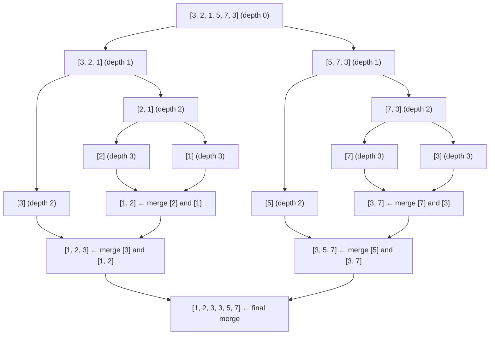

# Merge Sort – Detailed Step-by-Step Diagram

This diagram shows the recursive divide and merge steps of merge sort on the list `[3, 2, 1, 5, 7, 3]`.

```mermaid
graph TD

%% Level 0
A0["[3, 2, 1, 5, 7, 3] (depth 0)"]

%% Level 1
A0 --> B1["[3, 2, 1] (depth 1)"]
A0 --> B2["[5, 7, 3] (depth 1)"]

%% Level 2
B1 --> C1["[3] (depth 2)"]
B1 --> C2["[2, 1] (depth 2)"]

B2 --> C3["[5] (depth 2)"]
B2 --> C4["[7, 3] (depth 2)"]

%% Level 3
C2 --> D1["[2] (depth 3)"]
C2 --> D2["[1] (depth 3)"]

C4 --> D3["[7] (depth 3)"]
C4 --> D4["[3] (depth 3)"]

%% Merge Steps
D1 & D2 --> M1["[1, 2] ← merge [2] and [1]"]
C1 & M1 --> M2["[1, 2, 3] ← merge [3] and [1, 2]"]

D3 & D4 --> M3["[3, 7] ← merge [7] and [3]"]
C3 & M3 --> M4["[3, 5, 7] ← merge [5] and [3, 7]"]

M2 & M4 --> FINAL["[1, 2, 3, 3, 5, 7] ← final merge"]
```
