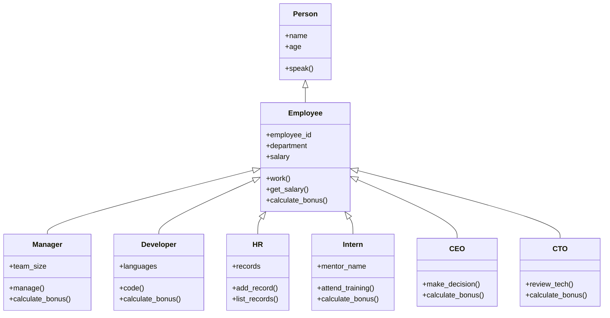

# 🏢 Python Classes & Object-Oriented Programming (OOP)

**Object-Oriented Programming** by modeling a real-world **company hierarchy** using classes and inheritance.

1. encapsulation
2. inheritance
3. abstraction
4. polymorphism

---

## 💡 What is OOP?

**Object-Oriented Programming (OOP)** is a programming paradigm based on the concept of "objects" — reusable pieces of code that bundle data and behavior.

### Key Concepts

| Concept       | Meaning                                                                |
| ------------- | ---------------------------------------------------------------------- |
| Class         | A blueprint for creating objects (instances)                           |
| Object        | An instance of a class                                                 |
| Inheritance   | One class can inherit properties and methods from another              |
| Encapsulation | Hiding internal details of an object and only exposing necessary parts |
| Polymorphism  | Using a shared method name that behaves differently in subclasses      |
| abstraction   | Representing essential features without including background details   |

---

## 🧱 Company Class Structure

We will create a class structure like this:



```
Each role will have common behaviors and some unique ones, including **salaries** and **bonuses**.
```

---

## Step 1: Define the `Person` Class

```python
class Person:
    def __init__(self, name, age):
        self.name = name
        self.age = age

    def speak(self):
        print(f"Hi, I'm {self.name}, {self.age} years old.")

```

## 🔹 Step 2: Define the Employee Class

```python
class Employee(Person):
    def __init__(self, name, age, employee_id, department, salary):
        super().__init__(name, age)
        self.employee_id = employee_id
        self.department = department
        self.salary = salary

    def work(self):
        print(f"{self.name} is working in the {self.department} department.")

    def get_salary(self):
        return self.salary

    def calculate_bonus(self):
        return self.salary * 0.1  # 10% bonus by default

```

## 🔹 Step 3: Define Specialized Roles

🧑‍💼 Manager

```python
class Manager(Employee):
    def __init__(self, name, age, employee_id, department, salary, team_size):
        super().__init__(name, age, employee_id, department, salary)
        self.team_size = team_size

    def manage(self):
        print(f"{self.name} manages a team of {self.team_size} employees.")

    def calculate_bonus(self):
        return self.salary * 0.2  # Managers get 20% bonus

```

## 👩‍💼 CEO

```python
class CEO(Employee):
    def make_decision(self):
        print(f"{self.name} is making executive decisions.")

    def calculate_bonus(self):
        return self.salary * 0.5  # CEOs get 50% bonus

```

## 👨‍💻 CTO

```python
class CTO(Employee):
    def review_tech(self):
        print(f"{self.name} is reviewing technical architecture.")

    def calculate_bonus(self):
        return self.salary * 0.4  # CTOs get 40% bonus

```

## 🧑‍💻 Developer

```python
class Developer(Employee):
    def __init__(self, name, age, employee_id, department, salary, languages):
        super().__init__(name, age, employee_id, department, salary)
        self.languages = languages

    def code(self):
        print(f"{self.name} is coding in {', '.join(self.languages)}.")

    def calculate_bonus(self):
        return self.salary * 0.15


```

## 🧑‍🔧 HR

```python
class HR(Employee):
    def __init__(self, name, age, employee_id, department, salary):
        super().__init__(name, age, employee_id, department, salary)
        self.records = []

    def add_record(self, employee_name):
        self.records.append(employee_name)
        print(f"{employee_name}'s record added to HR system.")

    def list_records(self):
        print("Employee Records:")
        for name in self.records:
            print(f"- {name}")


```

## 👩‍🎓 Intern

```python
class Intern(Employee):
    def __init__(self, name, age, employee_id, department, salary, mentor_name):
        super().__init__(name, age, employee_id, department, salary)
        self.mentor_name = mentor_name

    def attend_training(self):
        print(f"{self.name} is attending training with mentor {self.mentor_name}.")

    def calculate_bonus(self):
        return 0  # Interns don't get bonuses

```

## 🧪 Full Example

```python
# Create employees
ceo = CEO("Alice", 50, "001", "Executive", 200000)
cto = CTO("Bob", 45, "002", "Technology", 180000)
manager = Manager("Carol", 38, "003", "Engineering", 120000, team_size=8)
dev = Developer("Dave", 30, "004", "Engineering", 90000, ["Python", "JavaScript"])
hr = HR("Emma", 35, "005", "HR", 70000)
intern = Intern("Frank", 22, "006", "Engineering", 20000, mentor_name="Carol")

# Use methods
ceo.speak()
ceo.work()
ceo.make_decision()
print("CEO Bonus:", ceo.calculate_bonus())

cto.review_tech()
print("CTO Bonus:", cto.calculate_bonus())

manager.manage()
print("Manager Bonus:", manager.calculate_bonus())

dev.code()
print("Developer Bonus:", dev.calculate_bonus())

hr.add_record("Dave")
hr.add_record("Frank")
hr.list_records()

intern.attend_training()
print("Intern Bonus:", intern.calculate_bonus())

```

## ✅ Output (Sample)

```zsh
Hi, I'm Alice, 50 years old.
Alice is working in the Executive department.
Alice is making executive decisions.
CEO Bonus: 100000.0
Bob is reviewing technical architecture.
CTO Bonus: 72000.0
Carol manages a team of 8 employees.
Manager Bonus: 24000.0
Dave is coding in Python, JavaScript.
Developer Bonus: 13500.0
Dave's record added to HR system.
Frank's record added to HR system.
Employee Records:
- Dave
- Frank
Frank is attending training with mentor Carol.
Intern Bonus: 0

```

## 🔄 Lifecycle of an Object (Example Walkthrough)

Analogy Think of creating a Person object like making a new ID card:

1. **new**: The plastic card is molded and cut to size.

2. **init**: The name, photo, and details are printed on it.

3. **del**: The card is shredded when it's no longer valid.

```python
class Person:
    def __new__(cls, name, age):
        print("__new__ is called to allocate memory for a new Person object.")
        instance = super().__new__(cls)
        return instance

    def __init__(self, name, age):
        print(" __init__ is called to initialize the Person object.")
        self.name = name
        self.age = age
        print(f" Initialized with name: {self.name}, age: {self.age}")

    def __del__(self):
        print(f" __del__ is called. Person object {self.name} is being destroyed.")

```
