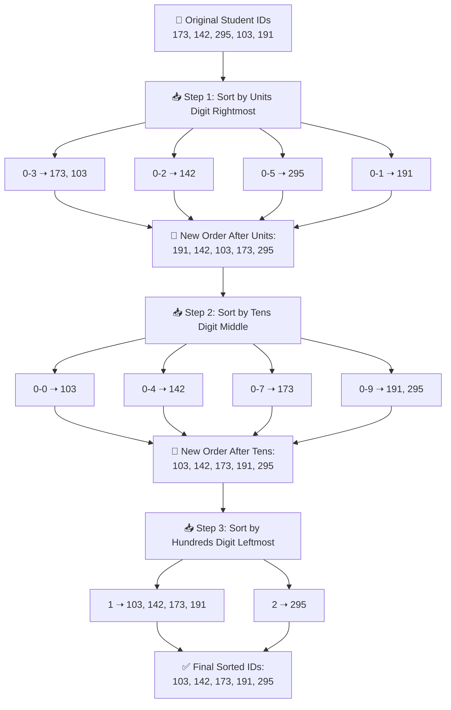

```mermaid
flowchart TD
    A[🎒 Original Student IDs<br/>173, 142, 295, 103, 191] --> B[📥 Step 1: Sort by Units Digit Rightmost]

    B --> B3[0-1 ➝ 191]
    B --> B1[0-2 ➝ 142]
    B --> B0[0-3 ➝ 173, 103]
    B --> B2[0-5 ➝ 295]

    B0 --> C1[📄 New Order After Units:<br/> 191, 142, 103, 173, 295]
    B1 --> C1
    B2 --> C1
    B3 --> C1

    C1 --> D[📥 Step 2: Sort by Tens Digit Middle]

    D --> D0[0-0 ➝ 103]
    D --> D1[0-4 ➝ 142]
    D --> D2[0-7 ➝ 173]
    D --> D3[0-9 ➝ 191, 295]

    D0 --> E1[📄 New Order After Tens:<br/>103, 142, 173, 191, 295]
    D1 --> E1
    D2 --> E1
    D3 --> E1

    E1 --> F[📥 Step 3: Sort by Hundreds Digit Leftmost]

    F --> F1[1 ➝ 103, 142, 173, 191]
    F --> F2[2 ➝ 295]

    F1 --> G[✅ Final Sorted IDs:<br/>103, 142, 173, 191, 295]
    F2 --> G

```
