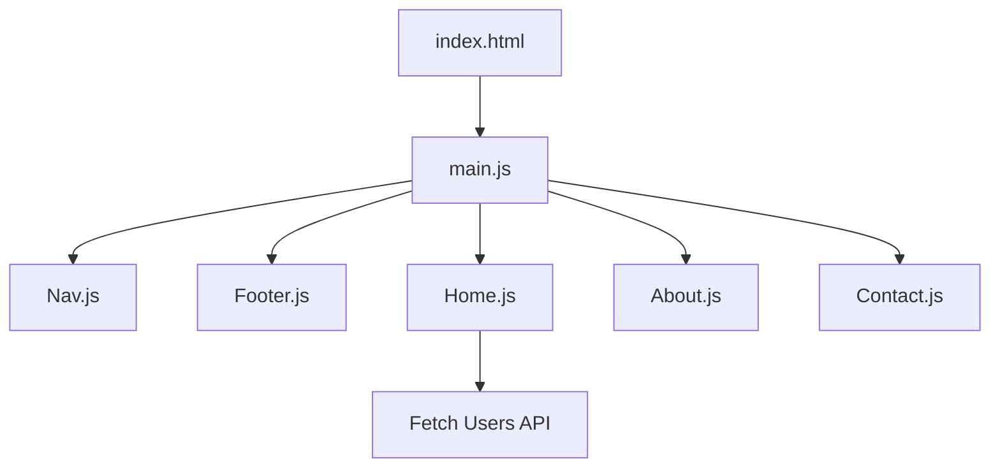

# WBS Software Engineering Lessons

This repository contains several lessons from the WBS Software Engineering course.

## 📚 Lesson Structure

Each lesson is organized in a separate Git branch.

## 🔀 How to Navigate

To switch to a specific lesson branch, use the following command:

```bash
git checkout branch-name
```

# JavaScript Modules – No Bundler SPA Example

This project demonstrates how to structure a simple Single Page Application (SPA) using **JavaScript modules** without any bundler. All modules are loaded directly in the browser using `<script>` tags and global function definitions.

---

## 🧠 Why Use Modules?

Modular JavaScript allows us to:

- Break code into manageable, reusable pieces.
- Avoid polluting the global scope.
- Make code easier to test and maintain.

---

## 🕰️ A Short History of JavaScript Modules

- **Before 2015**: JavaScript had no native module system. Developers used:

  - `require()` and `module.exports` (via Node.js and tools like Browserify).
  - IIFEs and the global `window` object for manual module emulation.

- **2015 (ES6)**: JavaScript introduced **ES Modules** with `import` and `export`. These are now supported by all modern browsers natively.

---

## 👴 CommonJS (Old Way – Node.js style)

```js
// Nav.js
module.exports = function () {
  return '<nav>...</nav>';
};

// main.js
const Navbar = require('./Nav.js');
```


