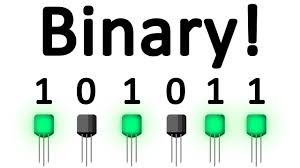
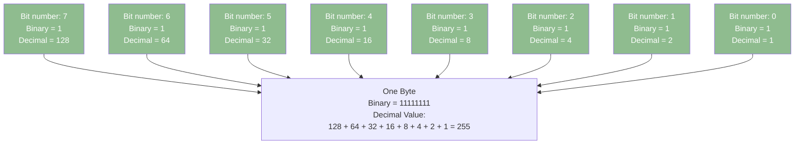
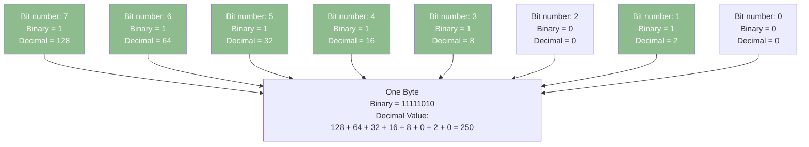
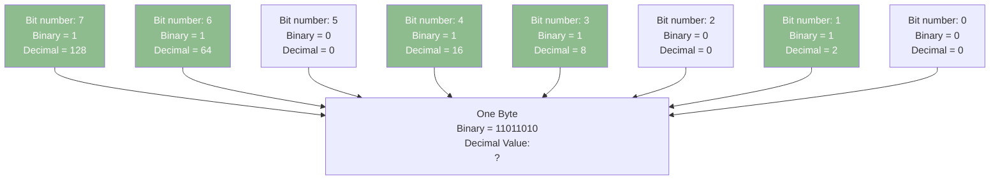
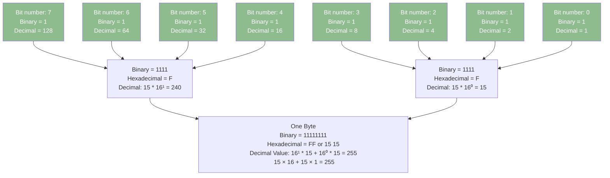

# 🧠 Understanding Number Systems in Computers

This file covers how data is stored in memory and how to interpret it using Binary, Decimal, and Hexadecimal formats.

---

## 🧩 How Computer Memory Works

All data inside a computer is stored using **transistors**. These transistors can only be in one of two states:

- `0` → OFF
- `1` → ON

This basic unit of information is called a **bit**.

  

### Scaling Up Memory Units

| Unit       | Size            |
| ---------- | --------------- |
| 1 Bit      | Single 0 or 1   |
| 8 Bits     | 1 Byte          |
| 1024 Bytes | 1 Kilobyte (KB) |
| 1024 KB    | 1 Megabyte (MB) |
| 1024 MB    | 1 Gigabyte (GB) |
| 1024 GB    | 1 Terabyte (TB) |

---

## 💡 Binary: The Language of Computers

Binary is a **base-2** number system, using only the digits `0` and `1`.

Each binary digit (bit) represents an increasing power of 2, starting from the right:

| Bit Position | 7   | 6   | 5   | 4   | 3   | 2   | 1   | 0   |
| ------------ | --- | --- | --- | --- | --- | --- | --- | --- |
| Power of 2   | 128 | 64  | 32  | 16  | 8   | 4   | 2   | 1   |

### Example:

Binary: `01001010`  
Calculation: `0×128 + 1×64 + 0×32 + 0×16 + 1×8 + 0×4 + 1×2 + 0×1`  
Result: **74 (Decimal)**

---

## 🗂️ Memory Representation Table

Memory is often visualized like a table, with each cell holding 1 byte (8 bits):

| Address | Binary   | Decimal |
| ------- | -------- | ------- |
| 0x00    | 00000000 | 0       |
| 0x01    | 00000001 | 1       |
| 0x02    | 00000010 | 2       |
| 0x03    | 00000011 | 3       |
| ...     | ...      | ...     |

---

## 📊 Binary System: How It Works

### this chart shows value of 255

### this chart shows value 0f 250

### this chart shows value 0f ?

## 🔢 Decimal System (Base-10)

Decimal is the standard number system we use in daily life.

It uses 10 digits: `0-9`. Each position represents a power of **10**.

### Example:

`543 = 5×100 + 4×10 + 3×1`

---

## 🔄 Converting Binary to Decimal

To convert binary to decimal:

1. Write the binary number.
2. Multiply each bit by 2 raised to its position index (starting from 0 at the right).
3. Add all values.

### Example:

Binary: `1011`  
Calculation: `1×8 + 0×4 + 1×2 + 1×1 = 11`  
Decimal: **11**

---

## 🧮 Hexadecimal System (Base-16)

Hexadecimal uses **16 digits**: `0-9` and `A-F`

| Hex | Decimal | Binary |
| --- | ------- | ------ |
| 0   | 0       | 0000   |
| 1   | 1       | 0001   |
| 2   | 2       | 0010   |
| 3   | 3       | 0011   |
| 4   | 4       | 0100   |
| 5   | 5       | 0101   |
| 6   | 6       | 0110   |
| 7   | 7       | 0111   |
| 8   | 8       | 1000   |
| 9   | 9       | 1001   |
| A   | 10      | 1010   |
| B   | 11      | 1011   |
| C   | 12      | 1100   |
| D   | 13      | 1101   |
| E   | 14      | 1110   |
| F   | 15      | 1111   |

### Chart in Hexadecimal

### Why Use Hex?

- Shorter: `11110000` → `F0`
- Easier to read and group binary

---

## 🧭 Converting Binary to Hex

Group the binary in 4-bit chunks from right to left, then convert each group:

### Example:

Binary: `11110000`  
Groups: `1111` `0000`  
Hex: `F0`

---

## 🧾 Summary Table

| Format      | Example  |
| ----------- | -------- |
| Binary      | 11001010 |
| Decimal     | 202      |
| Hexadecimal | CA       |

---

## 🎓 Practice Task

Convert the following:

1. Binary `10010110` → Decimal: `?` → Hex: `?`
2. Decimal `255` → Binary: `?` → Hex: `?`
3. Hex `7F` → Binary: `?` → Decimal: `?`

💡 Answers

1. Binary `10010110` → Decimal: 150 → Hex: `96`
2. Decimal `255` → Binary: `11111111` → Hex: `FF`
3. Hex `7F` → Binary: `01111111` → Decimal: `127`

---

## 📚 Further Reading

- [Binary Number System - Wikipedia](https://en.wikipedia.org/wiki/Binary_number)
- [Hexadecimal - Wikipedia](https://en.wikipedia.org/wiki/Hexadecimal)
- [How Computers Work (YouTube - CrashCourse)](https://www.youtube.com/watch?v=OAx_6-wdslM)

---
