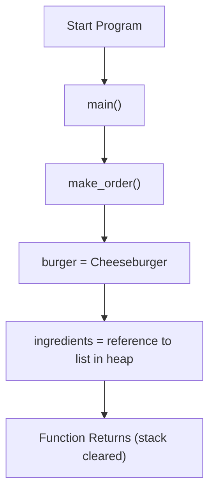
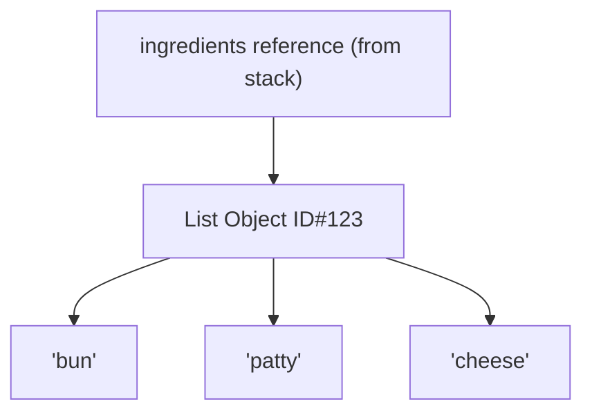
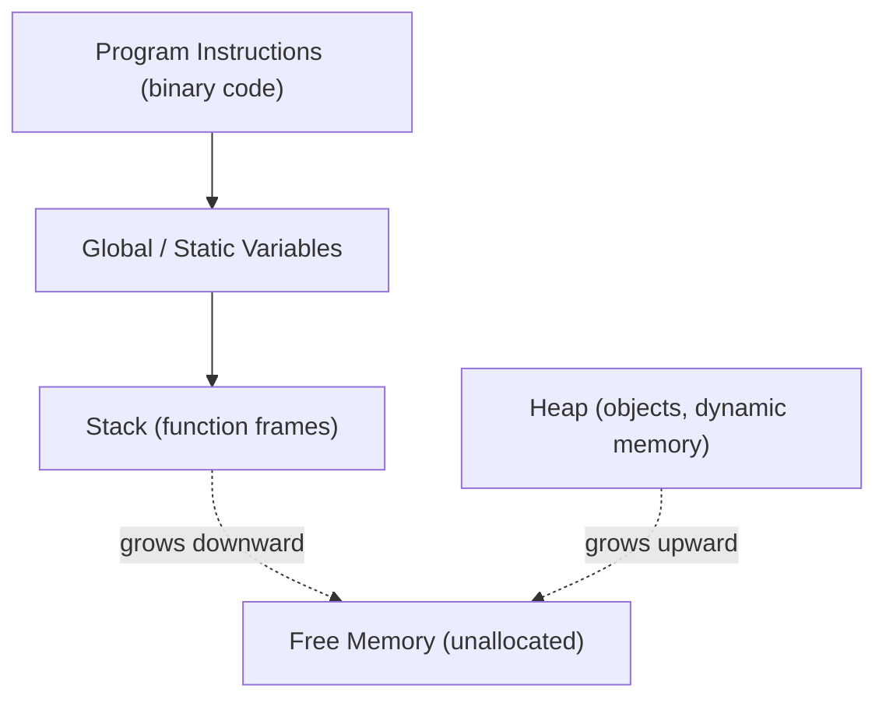

```pgsql
+-------------------------------+
|           STACK               |  ← Fast, small, automatic
+-------------------------------+
| make_order() call             |
| ├── burger: "Cheeseburger"    |  ← Stored directly in stack or points to string in heap
| └── ingredients: [Ref ID#123] |  ← Reference to a list in heap
+-------------------------------+

           ↓ (references)

+-------------------------------+
|           HEAP                |  ← Large, slower, dynamic
+-------------------------------+
| ID#123: ["bun", "patty",      |
|         "cheese"]             |  ← Actual list object in memory
+-------------------------------+

```

```pgsql
+------------------------------+
|   Program Instructions       | ← Code section (binary code)
+------------------------------+
|   Global / Static Variables  |
+------------------------------+
|   Stack                      | ← Grows **downward**
|   (Function calls, local vars)|
+------------------------------+
|                              |
|           FREE SPACE         |
|                              |
+------------------------------+
|   Heap                       | ← Grows **upward**
|   (Dynamic objects, lists)   |
+------------------------------+

```

## 📥 1. Diagram for Stack (Function Calls)



## 📦 2.Diagram for Heap (Objects Stored)



## 🧠 3. Diagram for RAM Memory Layout


